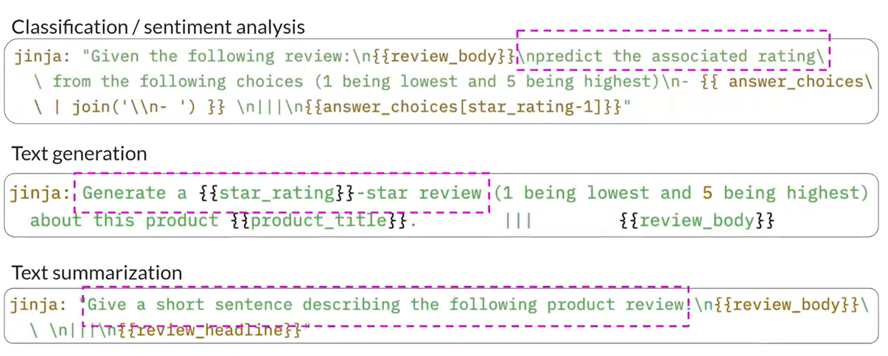
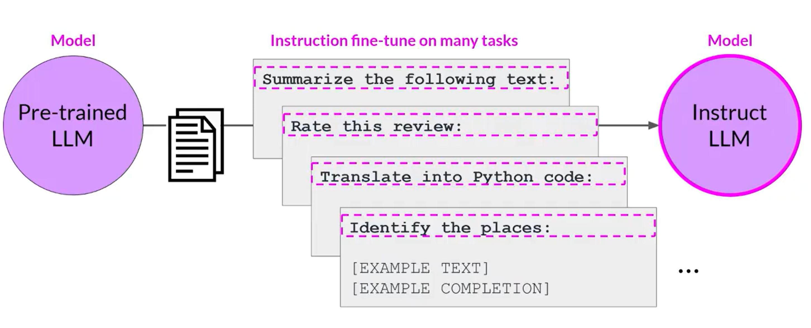
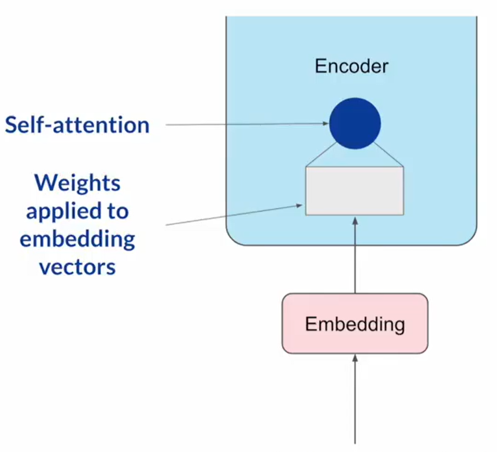
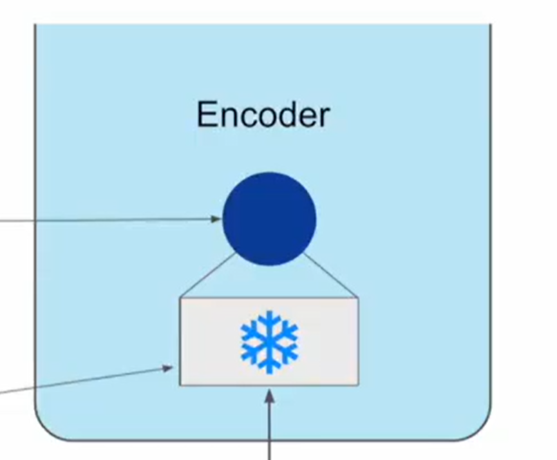
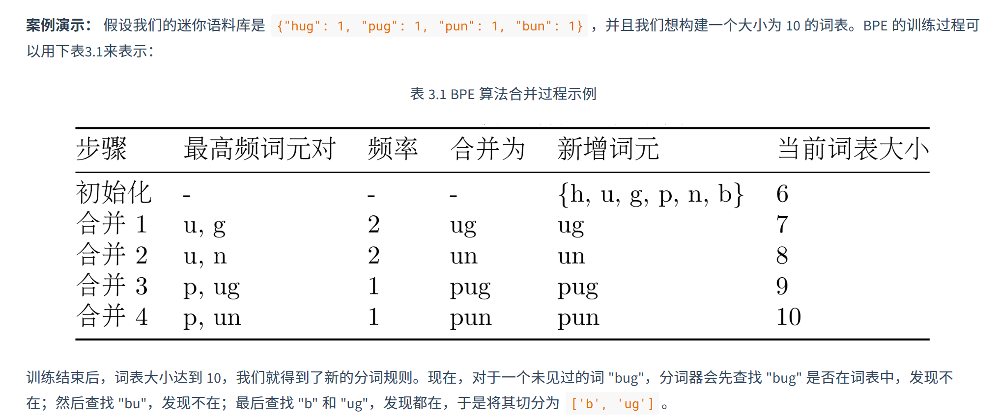

# 第三章第二节：语言模型基本应用

## 生成参数
> 不同于**训练参数**，生成参数在**模型生成**中被调用，影响模型的输出
>

### Max new tokens 最大生成 Token 数量
+ 即限制模型生成的最大 Token 数量

### Greedy & Random Sampling
+ **<u>Greedy Decoding（贪婪解码）</u>**指模型对于 **Softmax Layer** 产生的所有词汇的概率分数，直接选择最高概率的单词
+ **<u>Greedy</u>** 对于短期生成效果很好，但易于产生**重复词语或词语序列**，想要生成更自然、更具有创造性的输出，需要其他的解码控制手段
+ **<u>Random Sampling（随机采样）</u>**指模型对于 **Softmax Layer** 产生的所有词汇的概率分数，按照**概率分布的权重**随机选择一个输出词
+ **<u>Random Sampling</u>** 降低了**词汇重复**的可能性，但加大了 **completion 没有逻辑**的可能性

### Top-k & Top-p
+ Top-k 和 Top-p 是 Random Sampling 的两个技术参数
    - Top-k：限制模型只从概率最高的 k 个 Token 中进行选择
        - 原理是将所有 Token 按概率从高到低排序，取排名前 k 个的 Token 组成候选集，随后对筛选出的 k 个 Token 的概率进行归一化
    - k=1 时退化为 Greedy Decoding
    - Top-p：限制模型只从概率从高到低加起来不超过 p 的 Token 中选择
        - 原理是将所有 Token 按概率从高到低排序，逐步累加概率，直到累积和首次达到或超过阈值 p 停止，此时包含的全部 Token 组成“核集合”，再进行归一化

### Temperature
+ **作用**：影响模型计算下一个 Token 的概率分布，用于控制输出的随机性
+ **影响**：Temperature 越高，概率分布越宽越矮，随机性越高
+ **原理**：Temperature 值是 Softmax 输出层中的一个缩放因子，影响下一个 Token 的概率分布形状，默认为 1
+ **注**：Temperature 会改变模型的预测，但 Top-k & Top-p 不会

## 提示词工程
### 定义
按照一定的策略，对 Prompt 进行开发和改进的工作

### In-Context Learning（上下文学习，ICL）
#### 定义
+ 在上下文窗口中，提供模型执行任务的**期望输出**的例子

#### 分类
根据在上下文窗口中提供的样例数量进行分类：

+ Zero-shot Inference：零样例推断
+ One-shot Inference：单样例推断
+ Few-shot Inference：少样例推断

#### 作用
+ 通过样例来引导模型学习
+ 当使用 Few-shot Inference 仍不能获得期望结果时，应对模型进行**微调**

## 指令微调
> 进一步训练基础模型，以提高其对于特定任务输出结果的性能表现
>

### 预训练 & 微调
+ **预训练：**使用大量非结构化文本数据，通过自我监督学习训练 LLM
+ **微调（一般指的都是指令微调）：**使用带有标签的数据集（Prompt + Completion），通过有监督学习更新 LLM 的权重

### 指令微调 Instruction Fine-tuning
#### 定义
+ 通过**指令** + **示例（示例 = Prompt + Completion）**来训练模型，示例展示了其如何响应特定的指令
+ 想要提高 LLM 的什么能力，就用对应行为指令的示例微调
+ 指令微调得到的新模型叫做**指令模型（Instruct Model）**

+ **<u>全面微调（Full Fine-tuning）</u>**：模型的所有权重都被更新的指令微调

### Prompt Template Libraries 提示词模板库
#### 作用
+ 将已有的**公开数据集**转化为用于**微调**的**指令提示数据集**

#### 形式

### 微调步骤
1. 将指令数据集分为**训练集（Training Set）、验证集（Validation Set）、测试集（Test Set）**
2. 从**训练集**中选择 **Prompt** 提供给 LLM，生成 **Completion**
3. 将 **LLM 生成的 Completion** 与**训练集中指定的 Completion**进行比较，使用**标准交叉熵函数**计算 **LLM 生成的概率分布**与**数据标签中指定的概率分布**之间的**损失**
4. 使用计算的损失来更新模型权重
   【**<u>Backpropagation 反向传播</u>**】
5. 定义评估步骤：使用**验证集**来评估模型的性能，获得**验证的准确性（validation_accuracy）**
6. 完成微调，用**测试集**来进行最后的**性能评估**，获得**测试的准确性（test_accuracy）**

### 单任务指令微调——Catastrophic Forgetting（灾难性遗忘）
+ 灾难性遗忘是对模型进行单一任务微调时可能导致的结果

#### 表现
模型只在微调过的单一任务上表现优异，但极大降低了其他任务的性能，甚至表现出与微调过的单一任务相关的行为

#### 原因
全面微调过程会改变原始 LLM 的全部权重

#### 处理方式
+ 从需求出发：
    - 若希望 LLM 只专注于单一任务，则无所谓
    - 若希望 LLM 保持多任务泛化能力——>同时在多个任务上进行微调/执行**参数高效微调 PEFT**

### 多任务指令微调（Multi-task Instruction Fine-tuning）
+ 训练数据集由多个任务的示例输入和输出组成
+ 缺点：需要大量的数据支持

## 参数高效微调 Parameter Efficient Fine-tuning，PEFT
### 作用
+ 指令微调对内存和计算资源花销过大，全面微调会更新模型的全部权重
+ 但 PEFT 专注于微调现有模型参数的子集，通过技术手段冻结大部分模型权重，只更新一小部分模型参数，使得模型性能表现更优异
+ 且 PEFT 对于原模型的轻微修改，使得灾难性遗忘的问题不易发生

### PEFT Methods
#### Selective Method（选择性方法）
只选择模型的某个组件、某个层、甚至某个参数进行微调

#### Reparameterization Method（重参数化方法）
+ 在原模型参数网络的基础上进行低秩转换，减少要微调训练的参数数量
+ 常用技术：**LoRA**

#### Additive Method（加法方法）
+ 在保留所有原模型参数的基础上，引入新的组件进行微调
+ 主要方法：
    - **Adapters**：在模型的架构中添加新的可训练层，通常在 Encoder 或 Decoder 组件的注意力层或前馈层之后
    - **Soft Prompts**：保持模型架构固定，专注于优化 Prompt 输入

### LoRA（Low-rank Adaptation）低秩适应
+ 属于 PEFT 中的 Reparameterization Method
+ LoRA 方法在基本不改变参数数量和减小微调参数数量的基础上进行微调，开销小

#### 在自注意力层应用 LoRA 的原理过程
> 也可以在其他组件，如前馈层中应用 LoRA，但 LLM 大部分参数都集中在自注意力层中
>
> 具体案例见：[（超爽中英！）2025 公认最全的【吴恩达大模型 LLM】系列教程](https://www.bilibili.com/video/BV1zasyziEqF?p=19&vd_source=a8600fdb5ef0f26bcf200edddf5b9c0a)第 18 分集
>

1. 冻结整个原模型的所有参数

2. 在原始参数矩阵旁注入一对秩分解矩阵，进而减少所要微调的参数数量；这对矩阵维度相乘即为原矩阵相同维度

3. 微调秩分解矩阵中的参数
4. 两个低秩矩阵相乘，从而得到一个与冻结原矩阵维度相同的矩阵

5. 将新的矩阵加到原始参数矩阵上进行更新

## 分词器应用
> 计算机本质上只能理解数字。因此，在将自然语言文本喂给大语言模型之前，必须先将其转换成模型能够处理的数字格式。这个将文本序列转换为数字序列的过程，就叫做**分词（Tokenization）**。**分词器（Tokenizer）**的作用，就是定义一套规则，将原始文本切分成一个个最小的单元，我们称之为**词元（Token）**。
>
> 现代大语言模型普遍采用**子词分词（Subword Tokenization）**算法。它的核心思想是：将常见的词（如 "agent"）保留为完整的词元，同时将不常见的词（如 "Tokenization"）拆分成多个有意义的子词片段（如 "Token" 和 "ization"）。这样既控制了词表的大小，又能让模型通过组合子词来理解和生成新词。
>

### 常见分词算法
#### BPE（字节对编码，Byte-Pair Encoding）
BPE 是最主流的子词分词算法之一，核心思想：

1. 初始化：将 Token 表初始化为语料库中出现的全部基本字符
2. 统计所有语料库中相邻词对的出现频率，频率最高的合并为一个 Token，加入 Token 表中，作为考虑对象进行新一轮的统计加入
3. 重复直到词表达到预设阈值

#### WordPiece
由 Google 开发，BERT 模型使用；与 BPE 十分相似，但合并 Token 的标准从频率最高变成了选择能够让当前分词方案更好地解释训练语料的合并方式

#### SentencePiece
由 Google 开发的分词工具框架，Llama 模型使用；最大特点为将空格也视为一个基础字符，使得分词和解码过程完全可逆，且不依赖于特定的语言（中文不像英文需要空格）

### 分词器对于开发者的意义
+ 上下文窗口限制：上下文窗口以 Token 为单位计算
+ API 成本：大多数模型 API 都是按 Token 数量计费的，了解 Agent 应用的文本会被如何分词，是预估和控制 Agent 应用运行成本的关键一步
+ 模型表现：设计提示词和解析模型输出时，考虑到分词陷阱有助于提升智能体的鲁棒性

## LLM 的缩放法则（Scaling Laws）
> 阐明了增加资源投入能够系统性提升模型性能的底层逻辑：“大就是好，好就是大”
>

### 基本思想
在一定的模型架构、数据和训练条件下，**增加参数量、训练数据和计算量**，模型的预训练损失通常会按照相对规律的方式下降

这是一个基本的理念经验，并不是绝对准则

### Chinchilla 定律
研究提出，在增加计算预算时，参数量和训练 Token 数都应同步增加

Chinchilla 的核心贡献是说明模型参数量和训练数据量需要合理平衡；单纯扩大参数量并不一定最有效

### LLMs 的能力涌现
部分模型能力在特定评测中会随着规模增加表现出突然提升，这种现象被称为能力涌现

## LLM 的局限性：幻觉（Hallucination）
### 基本概念
模型幻觉是指模型生成看似合理，但与现实事实、输入材料、上下文信息或工具结果不一致的内容

### 幻觉类别
+ 事实性幻觉：模型生成与现实世界事实不符的信息
+ 忠实性幻觉：在具体任务中生成不忠实于用户提供的材料、上下文的信息

### 幻觉产生的原因
+ 训练数据有误，或存在偏见
+ 知识时效性不足，问题超出知识边界
+ Prompt 模糊，背景信息不足
+ 长上下文遗漏
+ 检索结果不准确
+ 推理思维链出错

### 幻觉的缓解方法
#### 数据层面
可以使用高质量数据标注、清洗、强化学习与**<u>RLHF 人类反馈</u>**（见笔记 [RLHF 人类反馈的强化学习](https://www.yuque.com/mubuzhuanjing-ow8jw/in23li/pe8egupg2pw9tfls)）等方式

#### 模型推理和生成层面
+ **<u>RAG 检索增强生成</u>**（见笔记 [RAG 检索增强生成](https://www.yuque.com/mubuzhuanjing-ow8jw/in23li/mh42fe91o20239mz)）
+ 推理内部验证或外部验证
+ 外部工具调用（搜索工具获取实时信息、计算器工具进行精确计算等）
+ 无法确认时引导模型拒绝回答或表达不确定性

<!-- learning-journey:update-history:start -->
## 更新记录

| 日期 | 类型 | 说明 |
| --- | --- | --- |
| 2026-08-04 | 首次发布 | 从语雀整理并发布到学习记录仓库 |
<!-- learning-journey:update-history:end -->
