# C++ 刷题技巧与高精度算法

## 2024.11.23

### 小写字母与大写字母的转换：
补充函数：	`toupper()             //将字符转换为大写`

          ` tolower()  	     //将字符转换为小写`

### 单条语句 for 循环 `{}` 的省略
在 C++ 中，`for` 循环的语法可以有或者没有大括号 `{}`。这是因为 C++ 允许省略大括号，当循环体只有 **一条语句** 时，循环语句就会作用于这一条语句。

### `reverse()` 反转字符串函数
+ 在头文件` #include<algorithm>`下
+ 无返回值， 它是一个改变容器内容的函数

```cpp
#include<iostream>
#include<algorithm> // 包含 reverse 函数

using namespace std;

int main()
{
    string a;
    cin >> a;
    reverse(a.begin(), a.end()); // 直接反转字符串
    cout << a; // 输出反转后的字符串
    return 0;
}
```

### `sqrt()` 求根函数
+ 在cmath头文件中

### 键盘输入两个值用空格/回车隔开：
+ `cin>>a>>b;`       用空格或回车隔开
+ `cin>>a;`

`cin>>b;`	     用回车隔开

### 向上取整与向下取整
+ 在cmath头文件中
+ 向上：	`ceil()`
+ 向下：	`floor()`
+ `ceil()` 和 `floor()` 返回的值是 `double` 类型。如果需要将其转换为整数类型（如 `int`），可以使用强制类型转换。

## 2024.11.27

### 当题目为判断且输出结果为 1 或 0 时：
可以不用if语句，而是直接定义bool变量进行判断输出

案例：

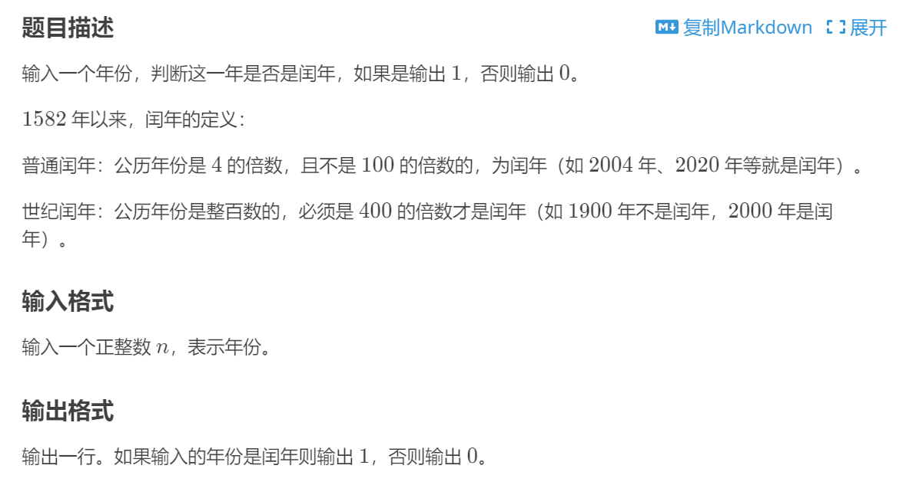

```cpp
#include<iostream>
using namespace std;
int main()
{
    int year;
    bool a;
    cin >> year;
    if (year % 100 == 0)
    {
        a = (year % 400 == 0);
    }
    else
    {
        a = (year % 4 == 0);

    }
    cout << a;
    return 0;
}
```

### `sort()` 数组排序函数
在`<algorithm>` 头文件中

默认按照从小到大的顺序排序

```plain
sort(begin, end);  //区间左闭右开（右要多一个）
```

+ `begin` 是待排序的范围的起始迭代器。
+ `end` 是待排序的范围的结束迭代器（即“右要多一个”）
+ 案例：键盘录入三个整数并排序输出：

```cpp
#include<iostream>
#include<algorithm>
using namespace std;
int main()
{
    int arr[3];
    cin >> arr[0] >> arr[1] >> arr[2];
    sort(arr, arr + 3);
    cout << arr[0] << " " << arr[1] << " " << arr[2];
    return 0;
}
```

如果要降序排序：

`sort(arr, arr + n, greater<int>());` 即可

## 2024.11.28

### 记录一个整数中某一个数字出现了几次：
```cpp
#include<iostream>
using namespace std;
int main()
{
    int a,n;
    int count = 0;
    cin >> a >> n;
    //a为整数，n为要记录的数字
    int temp = a; //为了不改变a的值，用一个变量去接收
    while(temp !=0)
        {
            if(temp%10 == n)
            {count++;}
            temp /= 10;
        }
    cout << count;
    return 0;
}
```

## 2024.11.29

### 穷举法解题：
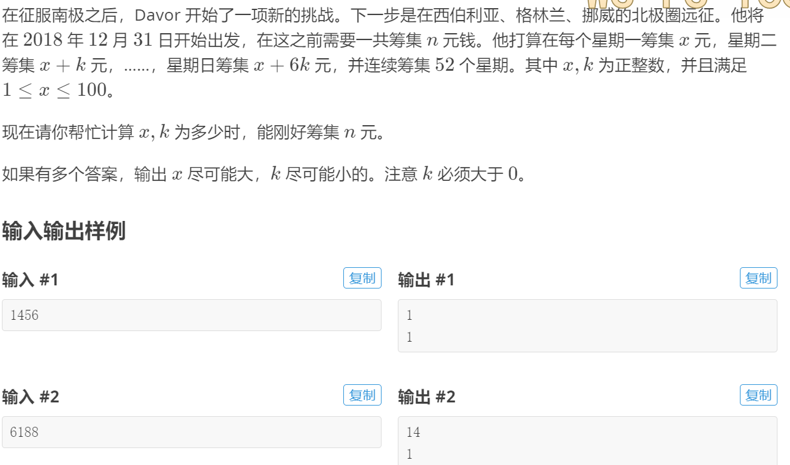

```cpp
#include<iostream>
using namespace std;
int main()
{
	int n;
	cin >> n;
	for (int k = 1; ; k++)  //把有范围的放在里面防止死循环
	{
		for (int x = 100; x >= 1; x--)
		{
			if (52 * (7 * x + 21 * k) == n)
			{
				cout << x << endl << k << endl;
				return 0;
			}
		}
	}
}
```

## 2024.11.30

### 给一个数组随意赋值，如何获得数组的真实长度？
定义一个`int len = 0`在每次循环赋值中`len++`即可

## 2024.12.1

### 数组的仅定义未初始化
在 C 或 C++ 中，当你定义一个大小为 `10000` 的整型数组，例如：

```cpp
int arr[10000];
```

而没有显式地初始化它时，数组中的每个元素的值是**未定义的**（即，包含垃圾值）。这意味着你不能保证数组中的每个索引的值是多少，因为它们的值是随机的，这取决于内存中当时的状态。

不过，如果数组是**全局变量**或**静态局部变量**，那么每个元素会被自动初始化为 `0`。例如：

```cpp
static int arr[10000]; // 或者在全局作用域中定义
```

这种情况下，`arr` 中的每个元素的值都会被初始化为 `0`。

### `abs()` 函数取绝对值
在头文件`cmath`下

### 取整数部分
`直接int(xxx)强转即可`

## 2025.2.22

### 保留小数位数输出
+ 在头文件`iomanip`下（Input/Output Manipulators）
+ 使用`setprecision`和`fixed`关键字来控制小数位数
+ 保留num的两位小数并输出：
    - `cout << fixed << setprecision(2) << num << endl;`

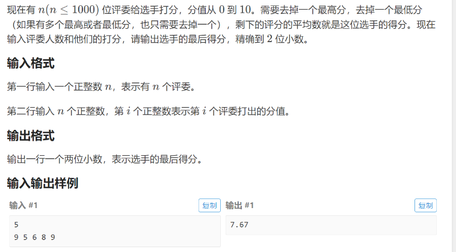

**<font style="color:#DF2A3F;background-color:#FBDE28;">也可以直接使用</font>** `printf("%.2f", num);` **<font style="color:#DF2A3F;background-color:#FBDE28;">输出——在头文件</font>** `cstdio` **<font style="color:#DF2A3F;background-color:#FBDE28;">下</font>**

### 比较数的大小不要用判断语句
+ 在`algorithm`下
+ `max(a,b) & min(a,b)`直接比较并返回

### 输出格式控制
+ 在`iomanip`下
+ 例子：hour = 0~12，但是输出必须是01，02，03……的格式
        * `cout << right << setw(2) << setfill('0') << hour;`
            + `left/right`:左右对齐
            + `setw()`:设置输出宽度
            + `setfill()`：宽度不足时输出什么字符

### 幂函数
+ `cmath`下
+ `pow(底数，幂数);`

### `gcd()` 最大公约数函数
+ 在`numeric`下
+ `int result = gcd(36,30);`
+ 实现原理：欧几里得算法（辗转相除法）：

```cpp
int gcd(int a, int b)
{
    while(b != 0)
        {
            int temp =a % b;
            a = b;
            b = temp;
        }
    return a;
}
```


## 2025.2.23

### 变量值只有 1 和 0 时，可以直接用逻辑值的结果而不额外赋值：
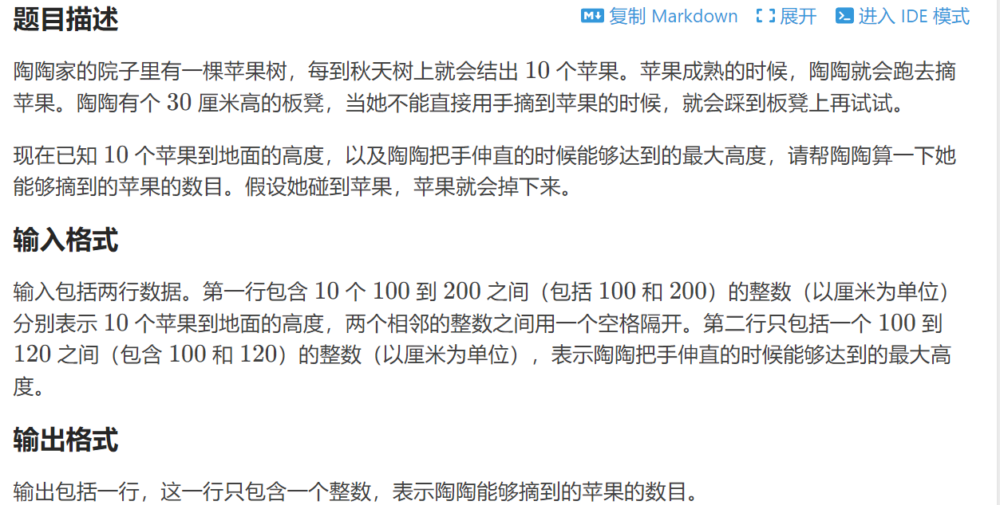

**够得到就是1，够不到就是0，所以：**

```cpp
#include <iostream>
using namespace std;
int AppleHeight[10],MaxHeight,count;
int main()
{
    for(int i=0;i<10;i++)
        cin >> AppleHeight[i];
    cin >> MaxHeight;
    MaxHeight += 30;
    for(int i=0;i<10;i++)
        count += (AppleHeight[i] <= MaxHeight);
    cout << count;
}
```

### 利用字符的 ASCII 码解题：
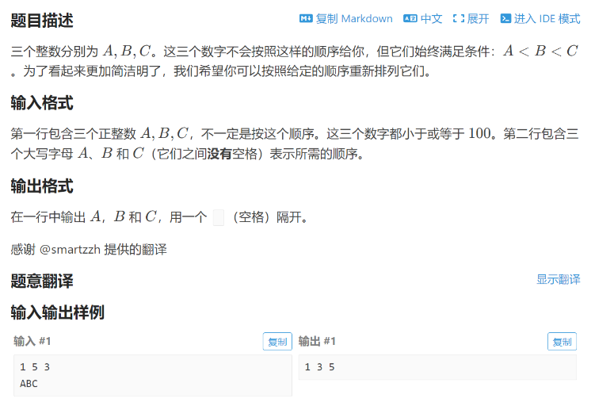

```cpp
#include<iostream>
#include<algorithm>
using namespace std;
int a[3];
char A,B,C;
int main()
{
    cin>>a[0]>>a[1]>>a[2];
    cin>>A>>B>>C;
    sort(a,a+3);
    cout<<a[A-'A']<<" "<<a[B-'A']<<" "<<a[C-'A'];
    //字母是大写，减去‘A’后得到0（A）,1（B）,2（C）。
    return 0;
}
```

## 2025.2.25

### 0—9 数字与相应字符的相互转换：

#### 数字 → 字符：
`char(num + '0');`

`to_string()`也可以（不限于0——9）

#### 字符 → 数字：
` int convert = '1' - '0' ;`

`stoi()`函数也可以：`int num = stoi(str);`(不限于0——9，但只能转化成int类型)


```cpp
#include <iostream>
using namespace std;

int calculate(string code)	//用来计算识别码
{
	int identify = 0;
	int count = 1;
	for (int i = 0; i < 11; i++)
	{
		if (i == 1 || i == 5)
			continue;
		identify += (code[i] - '0') * count;
		count++;
	}
	identify = identify % 11;
	return identify;
}
int Iscorrect(string code)	//正确输出1，不正确输出0
{
	if (code[12] == 'X')
		return (calculate(code) == 10);
	else
	{
		return (calculate(code) == (code[12] - '0'));
	}

}

string modify(string code)
{
	if (calculate(code) == 10)
		code[12] = 'X';
	else
	{
		code[12] = char(calculate(code) + '0');
	}
	return code;
}

int main()
{
	string code;
	cin >> code;
	if (Iscorrect(code))
		cout << "Right";
	else
		cout << modify(code);
	return 0;
}
```

### 高精度算法
+ 计算时操作数的数值可能会超过对应数据类型的可以表示的范围，此时应使用高精度算法
+ 算法核心：模拟竖式进行计算

#### 高精度加法计算
```cpp
#include <iostream>
#include <algorithm>
#include <string>
using namespace std;

//高精度加法器
int main()
{
	//将两个高位加数作为字符串输入
	string num1, num2;
	getline(cin, num1);
	getline(cin, num2);

	//将字符串中的数字转换成整数倒序存在两个数组之中,多余位用0补齐：
	//倒序目的：为了方便从小位数开始相加
	reverse(num1.begin(), num1.end());
	reverse(num2.begin(), num2.end());
	int add1[500], add2[500], sum[501] = { 0 };
	for (int i = 0; i < num1.size(); i++)
	{
		add1[i] = num1[i] - '0';
	}
	for (int i = 0; i < num2.size(); i++)
	{
		add2[i] = num2[i] - '0';
	}

	//将两个数组中每一位数相加存进第三个数组中，循环次数由最长的加数的位数决定
	int times = max(num1.size(), num2.size());
	for (int i = 0; i < times; i++)
	{
		sum[i] = add1[i] + add2[i];
	}

	//加和数组依次开始判断是否超过9，递归进位：
	for (int i = 0; i < times ; i++)
	{
		if (sum[i] > 9)
		{
			sum[i + 1] += sum[i] / 10;
			sum[i] %= 10;
		}
	}

	//将加和数组有效位逆序输出，得到加和结果
	//还应确定最终加和结果的位数
	if (sum[times] != 0)
		times ++;
	for (int i = times - 1; i >= 0; i--)
		cout << sum[i];
	return 0;
}
```

#### 高精度减法计算
```cpp
#include <iostream>
#include <algorithm>
#include <string>
using namespace std;


//高精度减法运算器
int main()
{
	//先用两个字符串存储减数和被减数：
	string num1, num2;
	getline(cin, num1);
	getline(cin, num2);

	if (num1 == num2)
	{
		cout << 0;
		return 0;
	}
	//判断最后结果是正是负
	//字符串可以比较大小：逐位比较字符的ASCII码,
	//故先比较谁长，如果一样长再进行字符串的比较
	//如果num2更大，直接两者交换即可

	char flag = '+';	//标志符号的标志位
	if ((num1.size() < num2.size()) || (num1.size() == num2.size() && num1 < num2))
	{
		swap(num1, num2);
		flag = '-';
	}

	//将两个字符串转换成整数形式逆序存入整数数组中,多余位用0补齐：
	int arr1[500] = { 0 };
	int arr2[500] = { 0 };
	int arr3[501] = { 0 };
	reverse(num1.begin(), num1.end());
	reverse(num2.begin(), num2.end());
	for (int i = 0; i < num1.size(); i++)
		arr1[i] = num1[i] - '0';
	for (int i = 0; i < num2.size(); i++)
		arr2[i] = num2[i] - '0';


	//将每一位相减的结果存入arr3中，判断是否是负数，是的话向下一位借1
	//已经比较过大小，循环次数用s1的长度即可
	int times = num1.size();
	for (int i = 0; i < times; i++)
		arr3[i] = arr1[i] - arr2[i];
	for (int i = 0; i < times; i++)
	{
		if (arr3[i] < 0)
		{
			arr3[i] += 10;
			arr3[i + 1]--;
		}
	}
	//先判断符号，如果是负号就先输出负号
	if (flag == '-')
		cout << '-';
	//判断一下处理后的位数并记录：
	int index = 0;
	for (int i = num1.size() - 1; i >= 0; i--)
	{
		if (arr3[i] != 0)
		{
			index = i;
			break;
		}
	}

	//开始从第一个不是0的位数开始逆序打印，输出结果：
	for (int i = index; i >= 0; i--)
		cout << arr3[i];
	return 0;
}
```

#### 高精度乘法计算
1. 高精度 * 单精度
    1. 用高精度上的每一位分别乘单精度数再进位即可

```cpp
#include <iostream>
#include <string>
#include <algorithm>
using namespace std;

//高精度 * 单精度 运算器：
int main()
{
	//先建立一个字符串存储高精度数字和整型变量存储单精度数字：
	string num1;
	int num2;
	getline(cin, num1);
	cin >> num2;

	//把高精度数字每一位转换成整数形式,与单精度数字相乘，倒序存进数组中
	int arr1[500] = { 0 };
	reverse(num1.begin(),num1.end());
	for (int i = 0; i < num1.size(); i++)
	{
		arr1[i] = (num1[i] - '0') * num2;
	}

	//开始进行进位,循环次数由单精度数字的范围决定：
	//（例：单精度数字不超过9999，则尝试后得到最终结果至多比高精度数原长度多四位）
	for (int i = 0; i < num1.size()+4; i++)
	{
		if (arr1[i] >= 10)
		{
			arr1[i + 1] += arr1[i] / 10;
			arr1[i] %= 10;
		}
	}

	//判断最终的位数并存储下来
	int index;
	for (int i = num1.size() + 4; i >= 0; i--)
	{
		if (arr1[i] != 0)
		{
			index = i;
			break;
		}
	}

	//最终进行逆序打印：
	for (int i = index; i >= 0; i--)
		cout << arr1[i];
	return 0;
}
```

2. 高精度 * 高精度
    1. 乘法竖式：逐位相乘，错位相加：
    2. 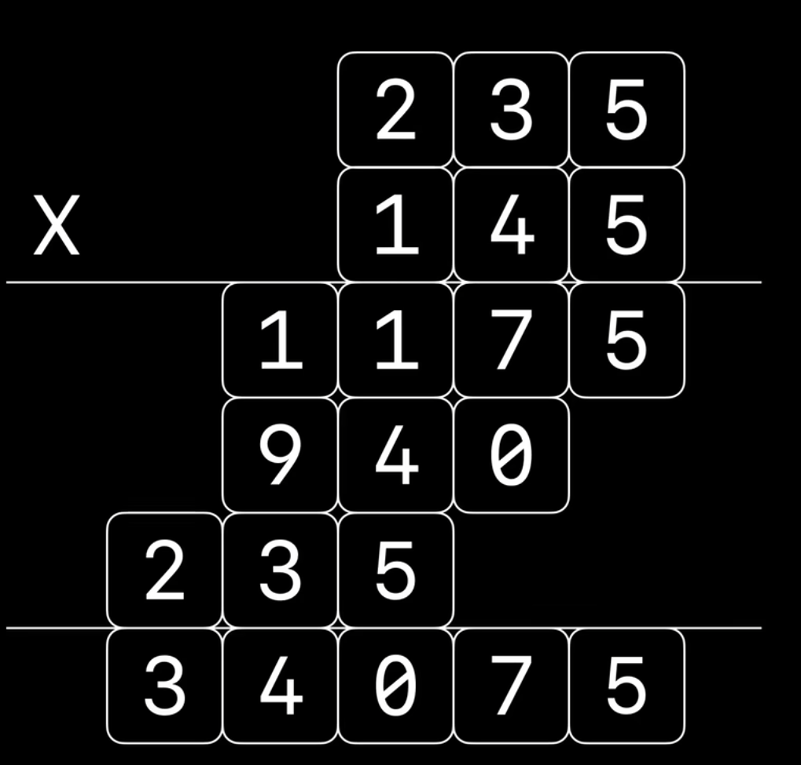
    3. 使用两层循环，位数依次相乘

```cpp
#include <iostream>
#include <algorithm>
#include <string>
using namespace std;

int main()
{
	//先创建两个字符串存储两个高精度数字：
	string num1;
	string num2;
	getline(cin, num1);
	getline(cin, num2);

	//创建三个整数数组逆序存储两个高精度数字和最终的结果：
	int arr1[250] = { 0 };
	int arr2[250] = { 0 };
	int arr3[500] = { 0 };

	//分别转换成整数形式逆序存储：
	reverse(num1.begin(), num1.end());
	reverse(num2.begin(), num2.end());

	for (int i = 0; i < num1.size(); i++)
		arr1[i] = num1[i] - '0';
	for (int i = 0; i < num2.size(); i++)
		arr2[i] = num2[i] - '0';

	//开始嵌套循环相乘，外层循环arr2，内层arr1；
	//逐位相乘并进位
	for (int i = 0; i < num1.size(); i++)
	{
		for (int j = 0; j < num2.size(); j++)
		{
			arr3[j + i] += arr1[i] * arr2[j];
				if (arr3[j + i] >= 10)
			{
				arr3[j + i + 1] += arr3[j + i] / 10;
				arr3[j + i] %= 10;
			}
		}
	}

	//判断最终的位数并存储：
	int index = 0;
	for (int i = num1.size() + num2.size() - 1; i >= 0; i--)
	{
		if (arr3[i] != 0)
		{
			index = i;
			break;
		}
	}

	//逆序打印即可得到结果：
	for (int i = index; i >= 0; i--)
		cout << arr3[i];
	return 0;
}
```

#### 高精度除法计算
1. 单精度数 / 单精度数，结果是多精度n位小数

```cpp
#include <iostream>
#include <string>
using namespace std;

//1.单精度数 / 单精度数，结果是多精度n位小数
int main()
{
	int num1, num2, n;
	cin >> num1 >> num2 >> n;

	//先算整数部分并存储：
	int integer = num1 / num2;

	//再模拟竖式计算小数点后n位：
	//先创建一个变量存储每次的余数
	int reminder = num1 % num2;
	int arr[500] = { 0 };
	for (int i = 0; i < n; i++) {
		arr[i] = reminder * 10 / num2;
		reminder = reminder * 10 % num2;
	}

	//直接进行输出：
	cout << integer << '.';
	for (int i = 0; i < n; i++)
		cout << arr[i];
	return 0;
}
```

2. 高精度数 / 单精度数，求商和余数

```cpp
#include <iostream>
#include <string>
using namespace std;

//2.高精度数 / 单精度数，求商和余数
int main() {
	string num1;
	int num2;
	cin >> num1 >> num2;

	//建立一个整数数组存储商：
	int arr[500];


	//建立两个变量，分别存储累计加和 & 余数
	int sum = num1[0] - '0';
	int reminder;

	//开始循环，逐位将商的结果存储：
	for (int i = 0; i < num1.size() - 1; i++)
	{
		if (sum / num2 == 0)
		{
			arr[i] = 0;
			sum = sum * 10 + (num1[i + 1] - '0');
		}
		else if (sum / num2 > 0)
		{
			arr[i] = sum / num2;
			sum = (sum % num2) * 10 + (num1[i + 1] - '0');
		}
	}

	//特殊情况：最后一位
	if (sum / num2 == 0)
	{
		arr[num1.size()-1] = 0;
		reminder = sum;
	}

	else if (sum / num2 > 0)
	{
		arr[num1.size()-1] = sum / num2;
		reminder = sum % num2;
	}

	//判断从商哪开始输出并记录索引（第一个不是0的位置）：
	int index = 0;
	while (arr[index] == 0)
		index++;

	//开始输出商和余数：
	for (int i = index; i < num1.size(); i++)
		cout << arr[i];

	cout << endl << reminder;
	return 0;
}
```

3. 高精度 / 高精度 ， 求商和余数

用减法模拟除法：

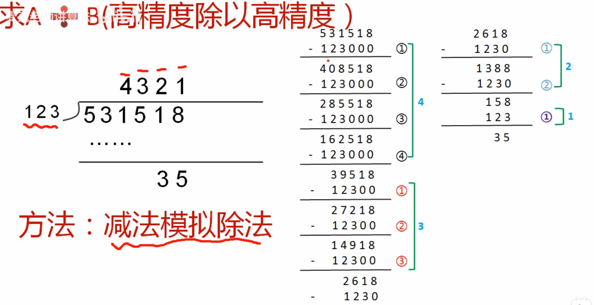

```cpp

```

#### 例题：
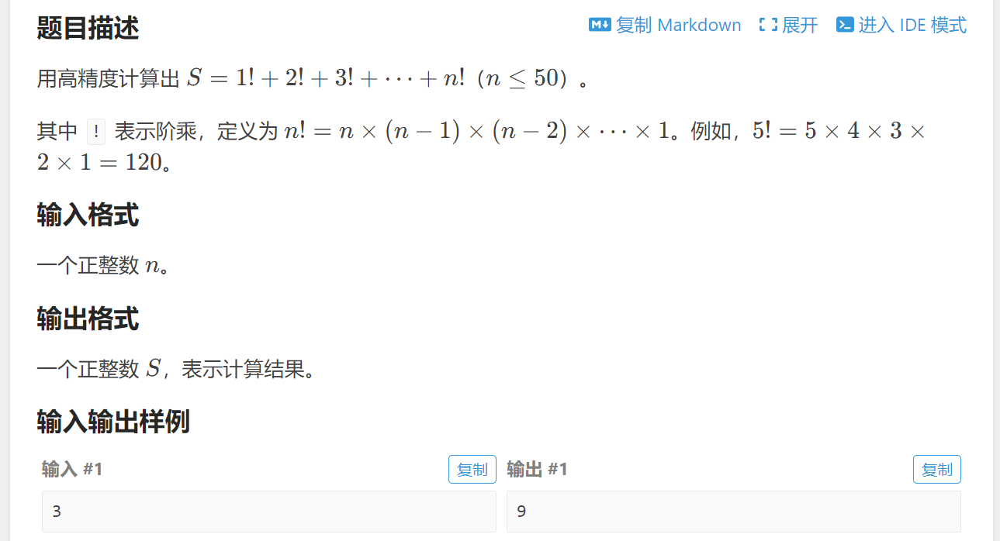

```cpp
#include<iostream>
#include<cstdio>
using namespace std;
int n,a[101]={0},s[101]={0};
void change(int x)
{
	int g=0;
	for(int i=100;i>=0;i--)
	{
		a[i]=a[i]*x+g;
		g=a[i]/10;
		a[i]=a[i]%10;
	}
}
void qh()
{
	int g=0;
	for(int i=100;i>=0;i--)
	{
		s[i]=s[i]+a[i]+g;
		g=s[i]/10;
		s[i]=s[i]%10;
	}
}
void sc()
{
	int w;
	for(int i=0;i<=100;i++)
	{
		if(s[i]!=0)
		{
			w=i;
			break;
		}
	}
	for(int i=w;i<=100;i++)
	   printf("%d",s[i]);
}
int main()
{
	scanf("%d",&n);
	s[100]=a[100]=1;
	for(int i=2;i<=n;i++)
	{
		change(i);
		qh();
	}
	sc();
	return 0;
}
```

## 2025.2.26

### 三元表达式
`result = 表达式 ? 真值 : 假值;`

+ 三元表达式提供一个返回值
+ 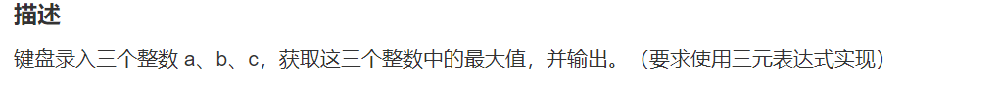

```cpp
#include <iostream>
using namespace std;

int main() {

    int a, b, c;
    cin >> a;
    cin >> b;
    cin >> c;
    cout << ((a > b && a > c)?a:(b > c ? b : c));
    return 0;
}
```

## 2025.2.27

### `to_string` 将一串整数转换成对应的字符串：
+ 在<string>头文件下
+ `string str = to_string (123);`即可对应转换

例：回文数

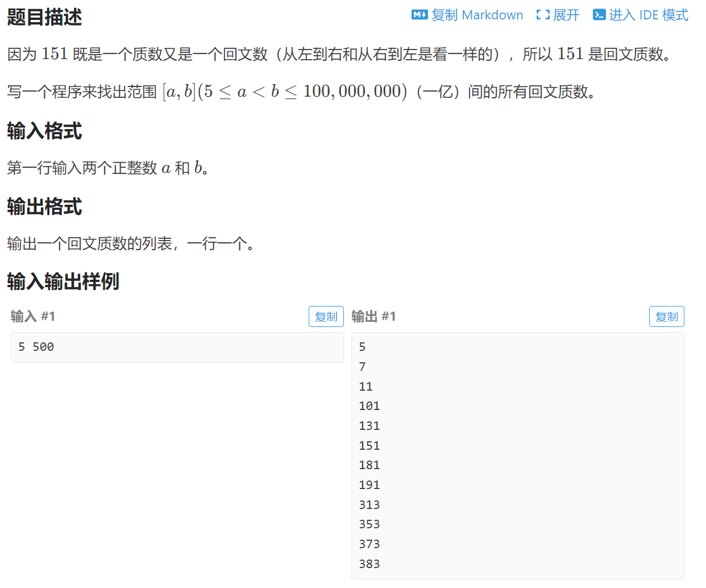

```cpp
#include <iostream>
#include <string>
#include <algorithm>
using namespace std;

int isHuiwen(int num){
	string str1 = to_string(num);
	string str2 = str1;
	reverse(str1.begin(), str1.end());
	return (str1 == str2);
}

int isPrime(int num) {
	for (int i = 2; i < num; i++) {
		if (num % i == 0) {
			return 0;
		}
	}
	return 1;
}

int main(){
	int begin, end;
	cin >> begin;
	cin >> end;
	for (int i = begin; i <= end; i++)
	{
		if (isHuiwen(i) && isPrime(i))
			cout << i << endl;
	}
	return 0;
}
```


### 判断是否是质数的函数的优化：
+  在判断一个数是否为质数时，**只需要检查到 **`**sqrt(num)**`**即可**
+ 解释：
    -  如果一个数 `n` 能够被 `a` 和 `b` 整除，那么 `n = a * b`。如果 `a` 和 `b` 都大于 `sqrt(n)`，那么 `a * b` 就会大于 `n`，因此不可能满足 `n = a * b`。换句话说，如果一个数是合数（非质数），它一定有一个因子小于或等于 `sqrt(n)`

```cpp
int isPrime(int num) {
    if (num <= 1)
        return 0;  // 1 and non-positive numbers are not prime

    // Only check up to sqrt(num)
    for (int i = 2; i <= sqrt(num); i++) {
        if (num % i == 0) {
            return 0;  // If divisible by i, it's not prime
        }
    }
    return 1;  // It's a prime number
}
```

## 2025.2.28

### 可以把数组的有效长度存储在数组的索引 0 处
优点：

+ 便于操作
+ 使数组从索引1开始存储有效数据，符合习惯

### `memset` 动态数组的清零操作
+ 在`cstring`头文件下

`memset(temp,0,temp.size());`

将temp数组中的所有元素清零

### 静态数组用 `sizeof()` 来确定数组长度；动态容器用 `.size()` 来确定长度

## 2025.3.3

### 用变量来记录二维指针的行、列：
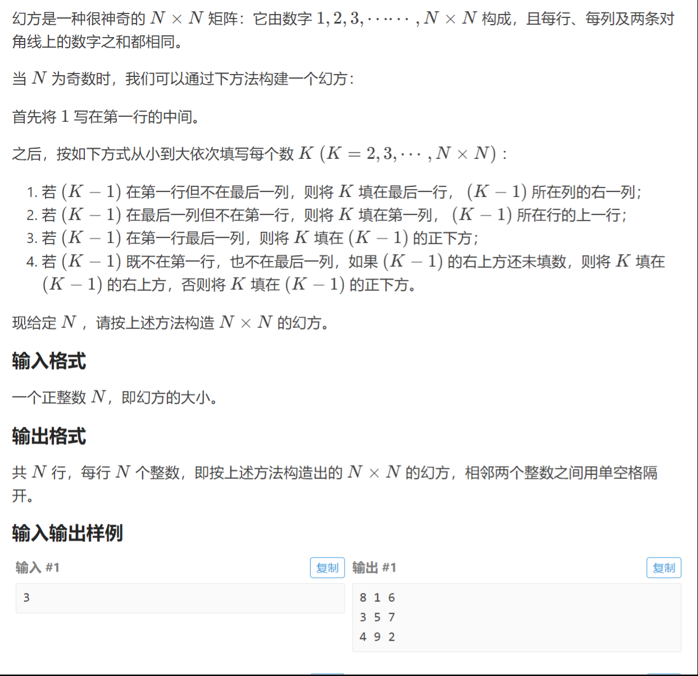

```cpp
#include <iostream>
using namespace std;

void fillNumber(int N,int n,int arr[40][40], int* X, int* Y) {
	if (*X == 0 && *Y != N - 1){
		arr[N - 1][*Y + 1] = n;
		*X = N - 1;
		(*Y) ++;
	}
	else if (*Y == N - 1 && *X != 0) {
		arr[*X - 1][0] = n;
		(*X) --;
		*Y = 0;
	}
	else if (*X == 0 && *Y == N - 1) {
		arr[*X + 1][*Y] = n;
		(*X)++;
	}
	else if (*X != 0 && *Y != N - 1) {
		if (arr[*X - 1][*Y + 1] == 0){
			arr[*X - 1][*Y + 1] = n;
			(*X)--;
			(*Y)++;
		}
		else {
			arr[*X + 1][*Y] = n;
			(*X)++;
		}
	}
}

int main() {
	int N;
	cin >> N;
	int arr[40][40] = {};
	arr[0][N / 2] = 1;
	int x = 0;
	int y = N / 2;
	int* X = &x;
	int* Y = &y;
	for (int i = 2; i <= N * N; i++) {
		fillNumber(N, i, arr, X, Y);
	}

	for (int i = 0; i < N; i++)
	{
		for (int j = 0; j < N; j++)
		{
			cout << arr[i][j] << ' ';
		}
		cout << endl;
	}
}
```


## 2025.3.4

### `string` 函数：
`string(int n,char c)`:创建一个包含n个字符c的字符串

### 蛇形矩阵——设立方向数组：
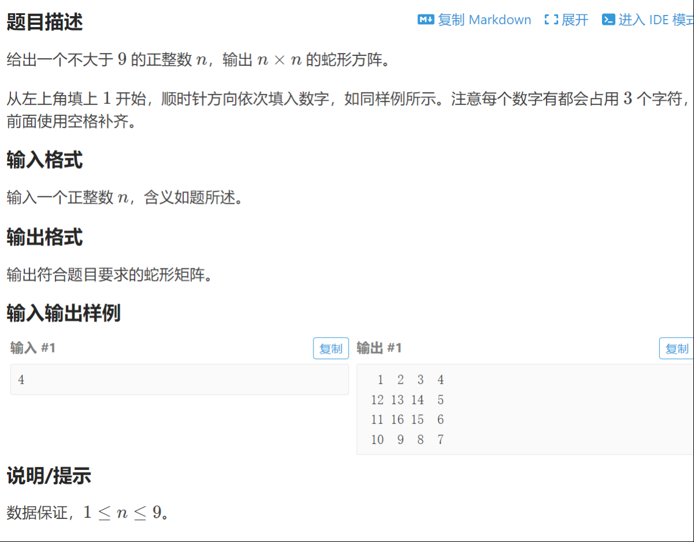

```cpp
#include <iostream>
#include <string>
using namespace std;

// 将整数转换为对应格式化过的字符串形式并返回：
string formattingNum(int num) {
    if (num < 10) {
        return "  " + string(1, char(num + '0'));  // 单个数字前加两个空格
    }
    else {
        return " " + to_string(num);  // 十位数前加一个空格
    }
}

// 蛇形矩阵填充函数（采用检查下一个位置是否填充过的逻辑）：
void snackPosition(int arr[10][10], int n, int x, int y) {
    int k = 1;
    int dx[] = { 0, 1, 0, -1 };  // 方向数组，分别表示：右、下、左、上
    int dy[] = { 1, 0, -1, 0 };  // 方向数组，分别表示：右、下、左、上
    int dir = 0;  // 初始方向为右（0：右，1：下，2：左，3：上）

    while (k <= n * n) {
        // 填充当前位置
        arr[x][y] = k++;

        // 尝试按照当前方向前进
        int nx = x + dx[dir];
        int ny = y + dy[dir];

        // 如果新的位置超出了边界或已经填充过，换方向
        if (nx < 0 || ny < 0 || nx >= n || ny >= n || arr[nx][ny] != 0) {
            // 方向更新（右 -> 下 -> 左 -> 上）
            dir = (dir + 1) % 4;
            nx = x + dx[dir];
            ny = y + dy[dir];
        }

        // 更新坐标
        x = nx;
        y = ny;
    }
}

// 将n*n整数数组转换成n*n格式化字符串数组：
void switchArr(int arr[10][10], string arr2[10][10], int n) {
    for (int i = 0; i < n; i++) {
        for (int j = 0; j < n; j++) {
            arr2[i][j] = formattingNum(arr[i][j]);  // 格式化数字
        }
    }
}

// 将n*n格式化字符串数组打印出来：
void printArr(string arr2[10][10], int n) {
    for (int i = 0; i < n; i++) {
        for (int j = 0; j < n; j++) {
            cout << arr2[i][j];  // 输出格式化后的数字
        }
        cout << endl;  // 每行输出后换行
    }
}

int main() {
    int n;
    cin >> n;  // 输入矩阵的大小
    int arr[10][10] = {};  // 初始化数组为0
    int x = 0, y = 0;  // 起始坐标
    snackPosition(arr, n, x, y);  // 填充矩阵
    string arr2[10][10];  // 存储格式化后的矩阵
    switchArr(arr, arr2, n);  // 将整数矩阵转换为格式化字符串矩阵
    printArr(arr2, n);  // 输出格式化矩阵
    return 0;
}
```

## 2025.3.5

### 创建数组 `arr` 时过大会导致栈溢出

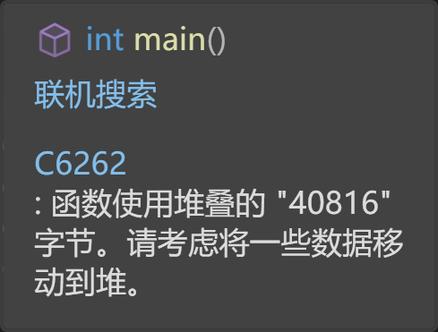

### **<font style="color:rgb(64, 64, 64);">不知道输入数据数量的情况下输入多个数据</font>**
使用while循环:

```cpp
int main() {
    int x;
    while (cin >> x) {
        //总有累计的结束条件吧
        if(达到了结束条件)
            break;
    }
}
```

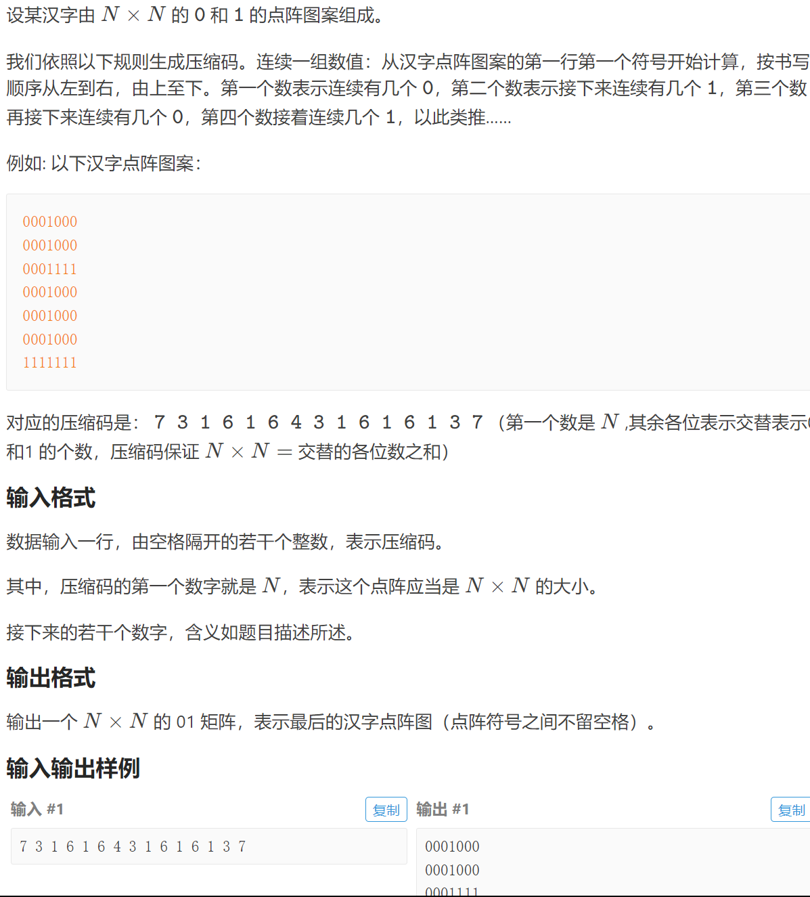

```cpp
#include <iostream>
using namespace std;

int inputCode(int arr[200]) {
	int code;
	int sum{ 0 };
	int i{ 0 };
	while (cin >> code) {
		arr[i++] = code;
		sum += code;
		if (sum - arr[0] == arr[0] * arr[0])
			break;
	}
	return i;
}


void printPattern(int arr[],int n) {
	int count{ 0 };
	for (int i = 1; i < n ; i++) {
		for (int j = 0; j < arr[i]; j++) {
			if (i % 2 == 1)
				cout << 0;
			else
				cout << 1;
			count++;
			if (count == arr[0]) {
				cout << endl;
				count = 0;
			}

		}
	}
}
int main() {
	int arr[200];
	int n = { inputCode(arr) };
	printPattern(arr, n);
}
```

## 2025.3.12

### 给 `sort` 函数指定排序规则：

#### 按降序排列：
`sort(arr, arr+5, greater<int>() )`

#### 结构体成员排序（自定义排序规则 `cmp`）
```cpp
struct px{
int x;
int y;
}arr[100]

bool cmp(px x)
```


## 2025.3.23

### 快速得到数组中的最大最小值
+ `max_element(arr,arr+10)`&`min_element`
+ 在`algorithm`头文件下
+ 返回值是得到的最大/最小值的地址

### 快速数组元素求和
+ `accumulate(arr,arr+10,0)`：第三个元素为初始值；
+ 在`numeric`头文件下
+ 返回值是范围和

<!-- learning-journey:update-history:start -->
## 更新记录

| 日期 | 类型 | 说明 |
| --- | --- | --- |
| 2026-07-23 | 首次发布 | 从语雀整理 C++ 刷题技巧、高精度算法与常用函数笔记并发布 |
<!-- learning-journey:update-history:end -->
