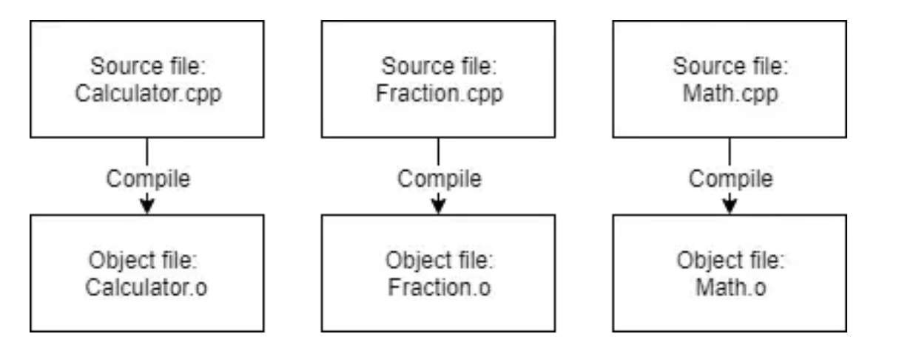
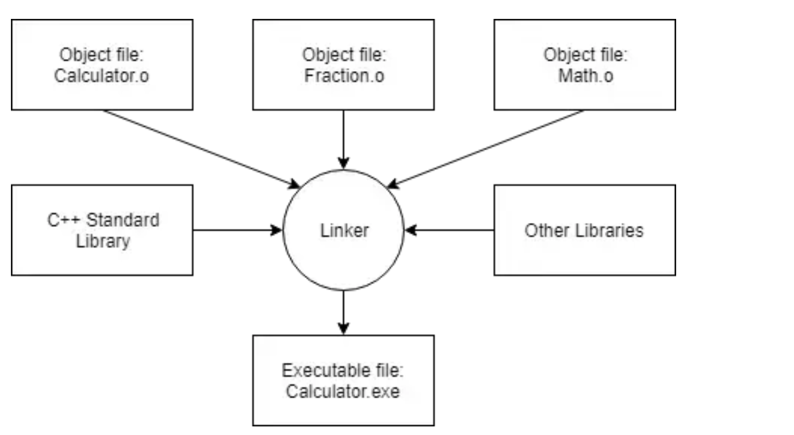

# C++ 开发流程与基础工程实践

## 一个优秀代码程序的特点：
### 具有良好的可读性
### 有完整的文档记录
### 模板化封装各个功能
## 代码运行的全过程:
### compiler（编译器）的工作：
按顺序遍历所有cpp源代码文件：

1. 检查语法规范，有问题会停止编译，返回error和错误行序号
2. 将所有 C++ 代码文件翻译成 CPU 能识别的低级语言，存放在中间文件 object file 中：`xxx.obj` 或 `xxx.o`



### linker（链接器）的工作：
1. 链接器将obj文件中有依赖关系的文件相连接（例如，如果在一个.cpp文件中定义了一些东西，然后在另一个.cpp文件中使用它，则链接器将这两个文件连接在一起）
2. 链接器将obj文件和代码中所用的库文件链接在一起
3. 将所有资源链接到一起后生成目标文件（通常是`exe`可执行文件）



### 运行（run）可执行文件：即代码成功运行
**运行前的全部过程称为：** `build`。如果已经 build 过的程序没有进行修改，再次 `build` 不会发生任何事（`build` 过的程序会被直接存入 cache 中，以便多次 `run` 而无需重复 `build`）。

## IDE包含：
+ Editor（编辑器）
+ Compiler（编译器）
+ Linker（链接器）
+ Debugger（调试器）
+ Plugin（一些第三方拓展插件）

IDE便是将以上工具打包集合起来，制造一个自动一体化的代码开发环境

## 一些开发上的概念：
### Precompiled headers（预编辑的头文件）
### Project（项目）
+ 一个独立的program（程序）对应一个Project（项目）
+ 一个Project包含所有要生成可执行文件所要用到的东西：如所有源代码文件、图片文件、数据文件、编译器链接器设置等等

#### Console Project（控制台项目）
+ 基于CLI（命令行界面）的程序
+ 没有GUI，所有的输入输出都通过控制台窗口执行
+ 适合轻量级的简单程序

### Workspace/Solution（工作区/解决方案）
+ 包含一个或多个相关程序项目的容器
+ 实现一个功能复杂的大项目时，需要在同一个 Workspace/Solution 下编写多个实现分程序的 Projects
+ 对于简单的小项目来说无必要使用
+ 对于工程量、文件数较大的大项目，可以通过预编辑头文件来减少冗杂重复编译来加快编译时间

### Solution Explorer(解决方案管理器)
+ 管理solution中的所有project和源文件的场所

### 其他控制键：
+ `clean`：清除缓存区的所有`build`过的文件，再次`build`所有文件会重新被编译链接
+ `rebuild`：相当于`clean` + `build`
+ `compile`：重新编译单个代码文件（不管之前此文件的 build 版本是否已存入 cache），而不会调用 linker
+ `run/start`：运行`build`成功所生成的exe可执行文件

### IDE提供的两种build configuration
#### debug configuration
+ 一般是默认build configuration，用于测试调试时使用
+ 包含debugging信息
+ 关闭编译器的Compile-time优化功能
+ build出的程序大而慢，但易于debug

#### release configuration
+ 用于要向大众发布程序时使用
+ 对程序进行了大小和性能的Compile-time优化
+ 不包含任何debugging信息
+ build完的程序极小且运行效率极高

### Compiler的“as-if”rule：
+ 针对编译器对于代码在编译时的自动优化（默认关闭）而言
+ 只要不改变代码的呈现效果，编译器为做到提高性能的目的想咋改咋改

### Compiler extensions（编译器拓展）
+ 在IDE中一般默认开启
+ 开启Compiler extension 的程序允许在编写代码时使用与C++ Standard不兼容的程序，会导致程序与C++ Standard不符合的情况下仍能正常运行
+ Compiler extension是特定于Compiler的，难以在其他Compiler上运行
+ 此功能百害无一利，建议每次建立新项目时关闭

### Implementation（实现器）
+ 特定的编译器和附带的库加起来被称为XXX语言的实现器
+ C++标准库允许实现器决定语言在某些方面上的行为，这种行为被称为：**<font style="color:rgb(45, 49, 64);">implementation-defined behavior（实现器定义行为）</font>**
        * <font style="color:rgb(45, 49, 64);">比如</font>`<font style="color:rgb(45, 49, 64);">sizeof(int)</font>`<font style="color:rgb(45, 49, 64);">就是一个典型的实现器定义行为，在某些平台上是4，而在另一些上可能是2</font>
        * <font style="color:rgb(45, 49, 64);">实现器定义行为需要实现器记录，而同样由实现器决定但不需要记录的行为被称为：</font>**<font style="color:rgb(45, 49, 64);">unspecified behavior</font>**
        * **<font style="color:#DF2A3F;background-color:#FBDE28;">两种行为都要尽可能地去避免</font>**

## 一些编程中的概念：
### Preprocessor（预处理器）
+ Preprocessor是一个在编译器编译文件之前工作的程序
+ 预处理器会按照预处理器指令，对源代码进行暂时的修改工作，包括剔除注释文本、处理`#include <XXXX>`指令等
+ Preprocessor处理过的代码文件叫做“Translation Unit”，之后会输出交给编译器进行编译
+ Preprocessing、Compiling、Linking全部过程称为——**Translation**

### preprocessor directive/directive（预处理指令）
+ 放在最前，每条指令以`#`开头，以换行结束
+ 预处理器指令会告诉Preprocessor进行什么文本操作任务
+ `#include <xxxxx>`：Preprocessor会用相应的头文件替换#include指令
+ `#define `：Macro Define Directive（宏定义指令），用于创建一个宏
        * 宏：将输入文本替换为另一种输出文本的规则定义
        * 宏名通常都是大写的，用下划线分割单词
        * Preprocessor会将代码中所有宏定义过的文本替换成对应的输出文本
        * `#define IDENTIFIER substitution_text`属于C的遗留产物，一般不再使用
        * `#define IDENTIFIER` 会将宏定义过的标识符全部删除，在开发中有应用
+ `#ifdef`、`#ifndef`、`#endif`：Conditional Compilation Directive（条件编译指令），用于规定一些内容在什么情况下才会编译或不编译
        * `#ifdef IDENTIFIER`指令告诉 Preprocessor 检查该标识符是否被`#define IDENTIFIER`指令定义过，如果没有，则`#ifdef`和`#endif`之间的全部内容都不会被编译
        * `#ifndef IDENTIFIER`指令与`#ifdef IDENTIFIER`则完全相反
        * 二者还可以写成：`#if defined(IDENTIFIER)` 和 `#if !defined(IDENTIFIER)`
        * `#if 0`指令会将该指令到`#endif`间的全部代码跳过不编译（也是一种多行注释的方式）
        * `#if 1`指令又是恰好相反（可用于快速临时启用被 `#if 0` 注释掉的代码块）


### Declaration VS. Definition（声明 vs 定义）
+ 声明：告诉编译器有该东西的存在，而不分配内存
+ 定义：正式地分配内存创建该东西

### 各类Initialization（初始化）：
**<font style="color:#DF2A3F;background-color:#FBDE28;">养成在创建数据时初始化的习惯</font>**

+ 一开始未初始化，但后期进行了赋值的变量就不叫未初始化的变量

#### Default-initialization（默认初始化）:
+ `int a;`
+ 也是“未初始化”
+ 变量会被赋予一个不能被确定的值：garbage value（脏数据）【未定义行为】
+ 数据和变量太太太多时，可以有选择地，有意识地不初始化（使用默认初始化）

#### Copy-initialization（拷贝初始化）:
+ `int a = 5;`
+ 继承自C语言
+ 该初始化在早先对于一些复杂数据结构的初始化来说并不高效，因此现代C++中应用不再广泛
+ C++17对其进行了修复优化

#### Direct-initialization（直接初始化）：
+ `int a ( 5 );`
+ 初始化复杂对象的效率比Copy-initialization高
+ 但逐渐被Direct-list-initialization所取代，但在特定情况下仍然使用

#### List-initialization（列表初始化）/Uniform-initialization/Brace-initialization：
+ 两种形式：
    - Direct-list-initialization：`int a { 5 }；`
    - Copy-list-initialization：`int a = { 5 }；`
    - Value-list-initialization：`int a = {};`
        * 会根据数据类型进行默认初始化，大部分情况下数据被初始化为0
    - Zero-list-initialization：值初始化的特殊形式（当变量被默认初始化为0时）
+ 几乎适用于所有情况，现代C++中使用最广泛，是首选的初始化格式
+ List-initialization的首要优势之一：禁止narrowing conversions（窄式转换）
        * 窄式转换：大范围类型自动转换为小范围自动转换
        * 窄式转换会导致数据丢失
        * 当使用列表初始化又错误赋值需要窄式转换时，编译器会返回错误信息来进行通知
        * 但在后期的重新赋值中，窄式转换将被允许
        * 其他初始化（如拷贝初始化）会默认窄式转换然后偷偷丢掉不匹配的数据

```cpp
int main()
{
    // An integer can only hold non-fractional values.
    // Initializing an int with fractional value 4.5 requires the compiler to convert 4.5 to a value an int can hold.
    // Such a conversion is a narrowing conversion, since the fractional part of the value will be lost.

    int w1 { 4.5 }; // compile error: list-init does not allow narrowing conversion

    int w2 = 4.5;   // compiles: w2 copy-initialized to value 4
    int w3 (4.5);   // compiles: w3 direct-initialized to value 4

    return 0;
}
```

### Instantiation（实例化）
+ 创建和初始化变量的过程：叫做变量实例化
+ 被实例化的对象可以被叫做：instance（实例）【大部分情况下应用于类类型的对象，但也可用于其他对象】

### Undefined behavior/UB（未定义行为）
+ 程序在某些错误操作的情况下，可能出现无法预料的不确定行为
+ 编译器对于未定义行为的处理是自由的，可能会出现程序直接崩溃、运行缓慢、每次输出的结果都不一致等情况
+ 有些Compiler extension（编译器拓展）就会允许未定义行为的发生

#### 常见的未定义行为：
+ 访问未初始化的变量
+ 非void函数没有任何返回值
+ overflow（数据超出数据类型规定的范围）
+ `string_view`所view的对象被删除，或生命周期结束，或对象内容被修改后再次使用`string_view`
+ `string_view`类型的函数内变量做函数返回值，打印该值时也会导致未定义行为

### Buffer（缓冲区）
+ 数据Output的一种典型形式
+ 缓冲区是一种**FIFO**（先进先出）的形式，以实现输出顺序正确

#### output buffer
    - 当使用 `cout` 进行输出时，输出的数据会被存储在输出缓冲区（stdout的缓冲区）中
    - 数据不会立即实现输出，缓冲区flush（刷新）之后，缓冲区存储的所有数据才会传输到目的地，缓冲区会定期刷新
+ unbuffered output：不通过缓冲区直接把输出数据输出到目的位置
+ buffered output可以通过将多个输出请求批处理来提高输出的效率和性能，相比之下，直接输出会很慢

#### input buffer
    - cin输入的数据也会依次存到输入缓冲区的末尾，回车键会作为"\n"存入
    - 提取操作符`>>`将input缓冲区的数据从前往后提取给相应的变量（通过复制赋值）
    - input buffer 的一些特殊情况：`int x; cin>>x;`
        * 键盘输入5a+回车：5a\n会被放到缓冲区，5会被提取赋值给x，a不是int类型无法成功提取赋值，故剩下的a\n会留在缓冲区中等待下一次提取
        * 键盘输入 b+回车：`b\n` 会被放到缓冲区，b 不是 int 类型，无法成功提取赋值。提取失败后，`cin` 会进入失败状态；需要调用 `cin.clear()` 清除状态，并移除无效输入，之后才能继续提取。不应依赖提取失败后变量被赋值为 0。
        * 如果之前提取失败，在清除 `cin` 的失败状态并处理无效输入前，后续提取会继续失败

### `endl` VS. `\n`
+ endl的实质操作：
        * 将光标移到下一行
        * 刷新缓冲区
+ \n的操作：只有移动光标到下一行
+ 每次调用endl都会刷新缓冲区，造成不必要的性能开销，一般情况下使用`\n`更合适

### ODR原则：
+ One Definition Rule

### Naming Collision
C++避免各种命名冲突的机制：

#### Scope Region（作用域区域）
+ 在不同的作用域区域内，相同命名的标识符是允许的
+ <font style="background-color:#FBDE28;">花括号</font>`<font style="background-color:#FBDE28;">{}</font>`<font style="background-color:#FBDE28;">和代码缩进 的实质</font>：代表不同的作用域区域（有些花括号外的标识符也在花括号代表的作用域区域内，比如函数参数）
+ **Local Scope**：不同函数具有不同作用域区域，所以不同函数里面的变量的命名可以相同
+ **Namespace Scope**：命名空间只能包含声明和定义，可执行语句只有是定义的一部分的时候才能被包含在内
        * `std` namespace 就是为了防止用户自己命名的标识符与 C++ 标准库中的功能语句标识符发生命名冲突，于是把所有的功能标识符移到了 `std` namespace 中
+ **Global Scope/Global Namespace**：不在类、函数、或命名空间中的标识符都属于在全局作用域中，不能重复命名（函数名、类名、命名空间名都在全局作用域中）

## Header File &一些常见的库：
+ 头文件把所有函数声明放在一起，在使用时可以直接引用头文件
+ 头文件常以`.h`、`.hpp`为文件拓展名后缀或没有后缀
+ 引用头文件：`#include "XXXX.h"`即可
+ 如果要引用其他目录下的头文件：设置一个include path即可
+ 头文件可以互相嵌套，但尽量不要使用
+ `iostream`：允许从控制台中读写数据，属于C++ Standard library
+ `cstdlib`:【c standard library】，包含了c标准库中的很多功能

## Header guard（头文件保护）
+ C++为了避免头文件被多次包含的机制
+ 利用了预处理指令：`#ifndef`&`#endif`
+ 官方的标准库文件等就使用了Header guard
+ 该机制不会影响头文件被引用到其他文件（只是防止在同一文件中被多次引用）

```cpp
#ifndef SQUARE_H
#define SQUARE_H

int getSquareSides()
{
    return 4;
}

#endif
```

另一种保护方式：使用`#pragma once`语句

## Debug
### 一些Debug策略：
+ <u>注释掉函数代码</u>，检验是否正常
+ <u>在函数的第一行加上打印该函数的名称</u>，看是否函数会正常运行
+ <u>打印函数中的某个变量</u>，看函数是否正常运行
+ <u>使用logger（日志记录器）</u>【了解】

### Debugger
#### Step into（逐语句）
+ 从main部分逐语句进行，遇到调用函数会进入到目标函数内部逐语句进行，函数完成后再返回原位置继续逐语句进行
+ 快捷键：F11

#### Step over（逐过程）
+ 从main部分逐过程进行，遇到调用函数会直接跳过函数中的执行过程，一直在main中持续执行
+ 快捷键：F10

#### Step out（跳出）
+ 要先Step into
+ Step out会直接完成当前函数的执行：在main中会直接完成全部执行，在其他函数中则完成所在函数的执行
+ 快捷键：Shift + F11

#### Run to cursor（运行到光标处）
+ Step into 后直接运行跳到光标处
+ 右击语句点击Run to cursor 或定位后使用快捷键：Ctrl + F10

#### Continue（继续）
+ 当前调试位置转运行
+ Step into 后快捷键：F5

#### Start（开始）
+ 从开始处直接开始运行，不做停顿
+ 直接按F5

#### Breakpoints（断点）
+ 在调试前设断点
+ 运行到断点处暂停运行，等待下一步调试
+ 右击语句点击Toggle Breakpoint  或   定位后使用快捷键F9或   单击语句最左侧

#### Set next statement（Jumping）（设置下一条语句）
+ 要先开始调试
+ 直接跳过一些代码，将光标定位处语句作为下一条执行的语句
+ 快捷键：Ctrl + Shift +F10
+ 该操作很容易导致一些未知的错误和程序崩溃

#### Watch（监视）
+ 可将光标悬浮在变量上监视其值
+ 也可以在调试-窗口-监视中调出监视窗口并添加变量
        * 可以在监视的变量上面设置断点，调试中当变量的值改变，调试就会暂停运行
        * 监视窗口也可以监视表达式，如x+2的值
+ 调试-窗口-局部变量：可以监视当前函数中全部局部变量的值

#### Call stack（调用栈）
+ 跟踪函数的调用过程，可视化函数的压栈、弹栈动态
+ 要先进入调试模式
+ 调试-窗口-调用栈即可监视

## Defensive Programming（防御性编程）
+ 核心思想：”防患于未然“
+ 考虑到程序使用时潜在的所有可能异常错误和异常情况（而不是代码本身的错误）而进行修正，以保证程序在意外输入，错误操作等多种特殊情况下仍能有效运行

<!-- learning-journey:update-history:start -->
## 更新记录

| 日期 | 类型 | 说明 |
| --- | --- | --- |
| 2026-07-23 | 首次发布 | 从语雀整理并发布到学习记录仓库 |
<!-- learning-journey:update-history:end -->
