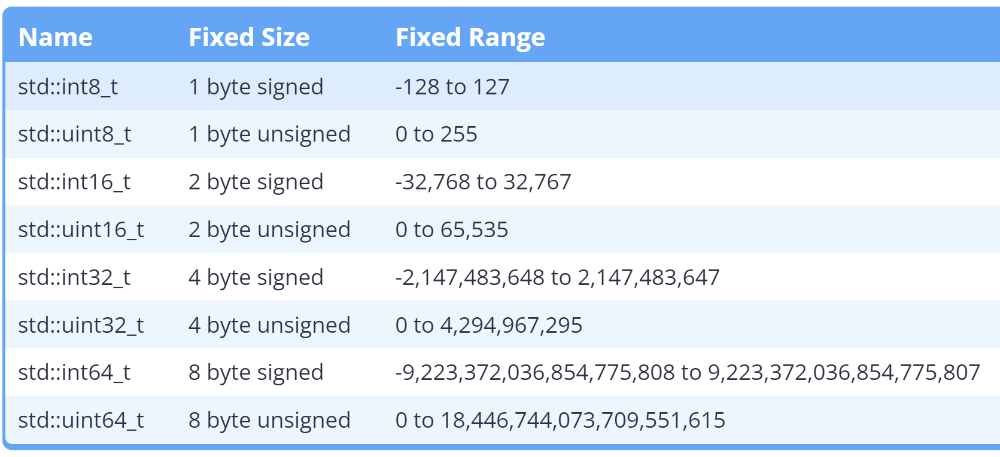
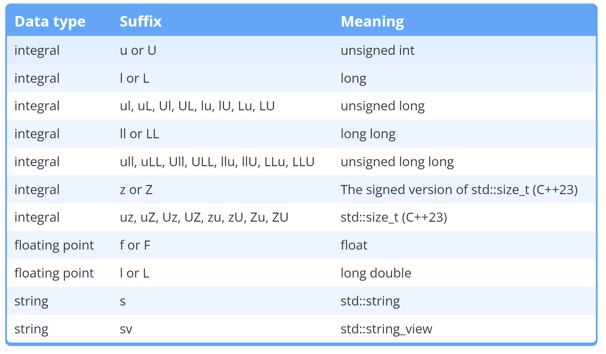
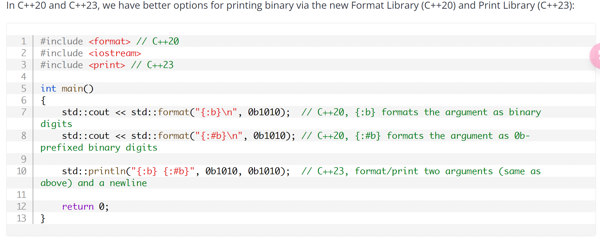

# C++ 数据类型

## 固定宽度整数（fixed-width integer）
+ 普通的Integer的大小在不同架构的设备上是不固定的（旧C为了性能考虑做出的让步）
+ C++为此提供了不同类型的固定长度整型数据：
+ 【在头文件`<cstdint>`中】
+ 
+ 由于C++的疏忽，`int8_t`和`uint8_t`会被编译器当作`signed char`和`unsigned char`对待
+ 实质：现存数据结构的别名（如`long` `long long`等）（编译器会进行判断并把别名翻译成对应所需固定大小的数据结构）

## 存储数据类型所占大小的专用数据结构
+ `std::size_t`
+ 在头文件`<cstddef>`中

```cpp
int x { 5 };
std::size_t s { sizeof(x) };
```

## 科学计数法的表示
+ <font style="color:rgb(45, 49, 64);"></font>`<font style="color:rgb(45, 49, 64);background-color:rgb(230, 230, 230);">1.2 x 10⁴</font>`<font style="color:rgb(45, 49, 64);">——></font>`<font style="color:rgb(45, 49, 64);background-color:rgb(230, 230, 230);">1.2e4</font>`
+ `<font style="color:rgb(45, 49, 64);background-color:rgb(230, 230, 230);">0.05</font>`<font style="color:rgb(45, 49, 64);">——> </font>`<font style="color:rgb(45, 49, 64);background-color:rgb(230, 230, 230);">5e-2</font>`<font style="color:rgb(45, 49, 64);"> </font>

## 浮点类型（Floating Point Type）
+ C++中把具有小数点的数字的数据类型默认定位`double`类型
+ 如需`float`类型的浮点数，则需要做出以下声明：
`float sample = 3.14f;`（后缀 `f` 代表该数字是 `float` 类型）
+ 浮点数只能精确表示一定位数的数据，规定了几位就精确到几位，超出该位数就会发生精度损失
+ 浮点类型数据的输出：默认只输出六位，超出位数会被截断，有时会用科学计数法表示

### 保证指定位数的输出
+ 【ouput manipulator】（输出控制器）

⬇

+ `iomanip`头文件下的`std::setprecision()`函数
+ 例：

```cpp
 cout << setprecision(15);
 cout << 3.33333333333333333f;
     输出结果是：3.33333325386047
```

**<font style="color:#DF2A3F;background-color:#FBDE28;">注：</font>**

+ **<font style="color:#DF2A3F;background-color:#FBDE28;">单独使用 `setprecision(n)` 表示保留 n 位有效数字；配合 `fixed` 使用时才表示保留 n 位小数。数据本身的精度仍由数据类型决定。</font>**
+ `**<font style="color:#DF2A3F;background-color:#FBDE28;">iomanip</font>**`**<font style="color:#DF2A3F;background-color:#FBDE28;">下的函数都是粘性的，一旦设置将持续保存</font>**

### rounding errors（舍入误差）
+ 由于小数的二进制存储机制，所有小数都具有一定的很小的舍入误差（在很高位，通常被截断所以不会注意）
+ 数学运算会急剧增加舍入误差的程度

## Boolean type（布尔类型）

### value
+ 只有两个值：`true` & `false`【必须为小写】
+ 但可以且仅可以用`0`和`1`给`bool`类型的变量列表初始化（用其他整数会报错），如果使用其他初始化或赋值，则`0`为`false`，非`0`全为`true`
+ 默认初始化为 `false`

### storage
+ 布尔值的实际存储是整数`1` & `0`，代表着布尔类型的数据可以进行数学运算

### input
`cin >> a(bool类型)`：`cin`只会接收`0` or`1`的输入

        * 如果输入其他数值：会被强行转换成`true`，`cin`进入故障模式
        * 如果输入任何非数值：会被强行转换成`false`，`cin`进入故障模式
        * 可以用`cin >> std::boolalpha`来使得`cin`允许接受输入的`true`&`false`，然而如此之后数字值将不会再被接受，会被强行转换为`false`，`cin`同样进入故障模式

### output
+ 输出时`true`会被打印为`1` ，`false`为`0`
+ 使用`std::boolalpha`可以打印出`true` & `false`

```cpp

cout << true << false << std::boolalpha << true << false;
//打印结果 ： 10truefalse
```

+ 使用`cout << std::noboolalpha`来返回输出`0`&`1`

## C++ 中的显式转换语句
`static_cast<数据结构>(语句)`；

```cpp
#include <iostream>
using namespace std;
int main(){
	double x{5.5};
	cout << "显式转换后的结果是：" << static_cast<int>(x) << endl;
//输出：显式转换后的结果是:5

	char ch{'a'};
	cout << ch << " has value :" << static_cast<int>(ch) << endl;
//输出： a has value ：97
}
```

## Constant（常量）
+ 常量声明保证了不会对其进行修改
+ 常量变量必须在定义时就进行初始化
+ 若常量声明的变量的值在编译时已知，可以在编译时求值，保证了Compile-time优化

### named constant（命名常量）
+ 与标识符相关联的常量
+ 分类：
        * 常变量：`const int a{10}；`
        * 宏定义常量：`#define A 10；`
        * 枚举常量：

### literal constant（字面常量）
+ 直接能插入代码的字面量，都具有默认的数据类型
+ 例如：
        * 1
        * 3.4
        * true
        * "hello"
        * "world"
    - 运算式也可以：
        * 3+4
        * 7.2+1.1
        * 2*`sizeof(int)`
+ 如果字面量的默认数据类型不符合需要，可以通过加字面后缀来手动更改
	
    - 例：C++中小数字面量的默认类型是`double`，如果需要`float`类型的，则需要加字面后缀：`float f{ 3.14f };`

## `constexpr`
+ 编译时常量（`const`是运行时常量），用于声明其修饰的对象的值在编译时就可知，是能够在编译时就被计算出来的常量表达式，从而优化性能
+ 必须在定义时就必须使用**常量表达式**进行初始化，不能用只有在运行时才知道的表达式进行初始化，比如`rand()`随机数函数
+ 不能用其声明动态内存分配的对象
+ 适用于更为复杂的程序
+ 示例：`constexpr int maxSize = 100;`


## 进制
+ 使用前缀来表示进制
        * **Octal**（八进制）：`0`
        * **Hexadecimal**（十六进制）：`0x`
        * **binary**（二进制）：`0b`
+ 数字分隔符：`'`
        * 用于提高数据的可读性：`int bin { 0b1011'0010 };`
        * 不能放在数字最开头
+ 不同进制的输出：
        * 通过直接在输出流中设置：
            + `std::cout << std::hex;		//十六进制`
            + `std::cout << std::oct;		//八进制`
            + `std::cout << std::dec;		//十进制`
            + 先引入`<bitset>`头文件，再设置
`std::cout << std::bitset<8>{32};	//8位二进制`
            + 或建立二进制类型的变量再输出：
`std::bitset<8> bit1{0b1100'0101};`
`std::cout << bit1;`
            + 新型二进制的输出方式：

        * 一旦设置将保留当前的输出进制，直到再次手动设置

## `std::string`
+ 是C++对于弱智的`C-string`做出的改进
+ 在头文件`<string>`下

### 常用操作
```cpp
#include <iostream>
#include <string>

int main(){
    std::string str{"开大啊开大"};				//初始化操作
    str = "你怎么这么自私";						//重新赋值操作
    std::cout << str;

    return 0;
}
```

+ `string`会自动进行动态内存分配，实现存储大大小小的字符串

### 读取一行输入 `getline()`
+ `getline()`遇到空格不终止，会加上空格一起继续读取输入缓存区的内容，遇到换行符终止
+ `getline()` 会接收两个变量：`cin` 与 `string` 类型的变量

:::info
+ **<font style="color:#DF2A3F;background-color:#FBDE28;">重点注意：</font>**`**<font style="color:#DF2A3F;background-color:#FBDE28;">cin</font>**`**<font style="color:#DF2A3F;background-color:#FBDE28;">和</font>**`**<font style="color:#DF2A3F;background-color:#FBDE28;">getline</font>**`**<font style="color:#DF2A3F;background-color:#FBDE28;">混用会出现大问题</font>**
        * `cin`的机制：遇到空白符（空格、回车）会终止，但空白符仍然会留在输入缓冲区中
        * `>>`如果提取到的第一个符号是空白符，会选择自动跳过
        * 但是`getline()`不会自动跳过，如果缓冲区第一个字符是回车，`getline()`会读取缓冲区中的回车，而后直接终止
        * 解决方式：使用`>> std::ws`给`getline()`也加上自动跳过的机制
        * `getline(std::cin >> std::ws, str);`

:::

### 获取 `string` 类型变量的长度 `.length()`
+ `string`类型变量实际上有空白终止符`\0`
+ 但使用`.length()`输出长度时，会自动把`\0`去掉
+ `.length()`是`string`类的成员函数
+ `.length()`返回的是`size_t`类型数据，如果要赋值给`int`，最好进行显式转换：`int length { static_cast<int>(str.length()) };`

### 字符串常量
+ 默认的双引号括起来的是 `C-style`字符串常量
+ 用默认的字符串初始化或赋值给`string`类型变量是允许的
+ 如果想使用`string`类型的字符串常量，需要：
        * `using namespace std::string_literals`先引入专门的命名空间
        * `cout << "我了个豆"s;`		在字符串后面加`s`后缀即可
+ `<font style="color:rgb(45, 49, 64);background-color:rgb(230, 230, 230);">"Hello"s</font>`会被解析为`<font style="color:rgb(45, 49, 64);background-color:rgb(230, 230, 230);">std::string { "Hello", 5 }</font>`

### `string_view`
+ 来自`C++17`标准
+ 在`<string_view>`头文件中

#### 诞生原因
+ `string`类型的数据复制非常昂贵（资源上的），初始化、传参、返回等复制过程非常低效，浪费资源

#### 特性
+ `string_view`类型的数据是只读的，所以不用进行复制，直接读取即可，因此更加高效
+ 系统能够自动地将`string`和`C-string`隐式转换到`string_view`类型，故前两者可以初始化、赋值给后者，`string_view`类型的形参也会接收前两者类型的变量和数据
+ 将一个新的字符串赋值给`string_view`变量只会使得该变量只读向新的字符串，而不是原来的字符串被修改了
+ `string_view`支持常量表达式`constexpr`关键字
+ `**<font style="color:#DF2A3F;">string_view</font>**`**<font style="color:#DF2A3F;">所view的内容取决于其view的对象，被view的对象改变，</font>**`**<font style="color:#DF2A3F;">string_view</font>**`**<font style="color:#DF2A3F;">所view的内容也会改变，若被view的对象被删除、生命周期终止或内容被修改，</font>**`**<font style="color:#DF2A3F;">string_view</font>**`**<font style="color:#DF2A3F;">会view随机数据，出现未定义行为</font>**
        * **<font style="color:#DF2A3F;">使</font>**`**<font style="color:#DF2A3F;">string_view</font>**`**<font style="color:#DF2A3F;">重新view一个别的对象（重新赋值）会使无效的</font>**`**<font style="color:#DF2A3F;">string_view</font>**`**<font style="color:#DF2A3F;">再次生效</font>**
+ `**<font style="color:#DF2A3F;">string_view</font>**`**<font style="color:#DF2A3F;">类型的函数内变量做函数返回值，打印该值时也会导致未定义行为</font>**
+ `string_view`view到的字符串可有可无`\0`终止符

#### `string_view` 类型的字符串常量
+ 与上面如出一辙
+ `using namespace std::string_view_literals;`
+ `cout << "我喜欢你"sv;`

#### 改变 `string_view` 自身视图大小的函数
`str.remove_prefix(1)`:把view到的第一个字符删去（左侧窗帘拉了一点点）

`str.remove_suffix(1)`:同上，最后一个，右窗帘

+ 再次赋值会重置视图（把窗帘拉到正常继续view）

<!-- learning-journey:update-history:start -->
## 更新记录

| 日期 | 类型 | 说明 |
| --- | --- | --- |
| 2026-07-23 | 首次发布 | 从语雀整理 C++ 数据类型、常量、进制、字符串与 string_view 笔记并发布 |
<!-- learning-journey:update-history:end -->
