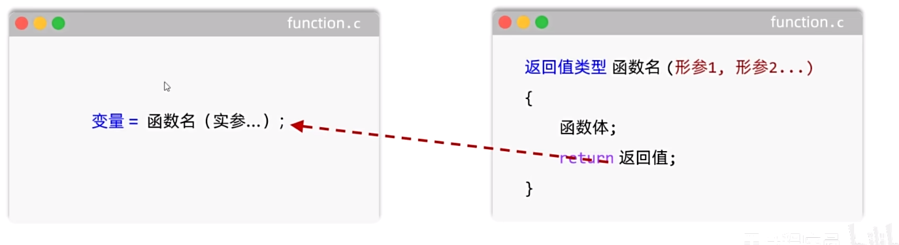

# C语言函数

## 函数是什么

函数是程序中预先定义、用于完成独立功能的代码单元，类似于 Scheme 中的过程。

## 函数的定义与调用

没有参数和返回值的函数可以写成：

```c
void function_name(void)
{
    /* 函数体 */
}
```

在 `main` 函数中调用：

```c
int main(void)
{
    function_name();
    return 0;
}
```

### 带参数的函数

```c
void function_name(int parameter1, int parameter2)
{
    /* 函数体 */
}

int main(void)
{
    function_name(1, 2);
    return 0;
}
```

形参和实参必须按照数量、顺序和类型一一对应。`void` 表示函数没有返回值。

### 带返回值的函数



```c
#include <stdio.h>

double final_score(int base_score, int add_score)
{
    double result = base_score * 0.6 + add_score * 0.4;
    return result;
}

int main(void)
{
    double p1 = final_score(75, 64);
    double p2 = final_score(46, 108);

    printf("第一个人的最终成绩为：%.2f\n第二个人的最终成绩为：%.2f\n", p1, p2);

    if (p1 > p2) {
        printf("第一个人的成绩更高\n");
    } else {
        printf("第二个人的成绩更高\n");
    }

    return 0;
}
```

## 设计函数时的三个问题

1. 定义函数的目的是什么？据此设计函数体。
2. 完成功能需要哪些数据？据此确定形参。
3. 调用后会得到什么数据，是否需要继续使用？据此确定返回值类型。

## 函数的注意事项

1. 同一作用域内的函数名不可重复定义。
2. 标准 C 不允许嵌套定义函数，函数之间是平级关系。
3. 自定义函数写在调用位置之后时，需要先声明函数原型。

```c
#include <stdio.h>

double final_score(int base_score, int add_score);

int main(void)
{
    double p1 = final_score(75, 64);
    double p2 = final_score(46, 108);
    printf("%.2f %.2f\n", p1, p2);
    return 0;
}

double final_score(int base_score, int add_score)
{
    return base_score * 0.6 + add_score * 0.4;
}
```

4. `return` 会结束当前函数，其后的代码不会执行。
5. 返回类型为 `void` 时表示没有返回值。此时可以省略 `return`；若书写，只能写成 `return;`。

## C语言标准库函数

使用标准库函数前，需要通过 `#include` 引入对应头文件。

### `<math.h>` 中的常用函数

- `pow(x, y)`：计算幂。
- `sqrt(x)`：计算平方根。
- `ceil(x)`：向上取整。
- `floor(x)`：向下取整。
- `fabs(x)`：计算浮点数的绝对值。

整数绝对值函数 `abs(x)` 定义在 `<stdlib.h>` 中。

### `<time.h>` 中的 `time()`

`time()` 用于获取当前日历时间，返回类型为 `time_t`。不需要额外保存结果时，可以传入 `NULL`。

```c
#include <stdio.h>
#include <time.h>

int main(void)
{
    time_t now = time(NULL);
    printf("%lld\n", (long long)now);
    return 0;
}
```

### `<stdlib.h>` 中的 `rand()`

```c
#include <stdlib.h>

int main(void)
{
    srand(1);
    int random_number = rand();
    return 0;
}
```

使用时需要注意：

1. 种子相同时，产生的伪随机数序列也相同。
2. `rand()` 的结果范围是 `0` 到 `RAND_MAX`。

可以用不断变化的时间作为种子，再通过取模将结果限制在指定范围内。下面的示例生成 `8` 到 `46` 之间的随机数：

```c
#include <stdio.h>
#include <stdlib.h>
#include <time.h>

int main(void)
{
    srand((unsigned int)time(NULL));

    int random_number = rand() % 39 + 8;
    printf("生成的随机数是 %d\n", random_number);
    return 0;
}
```

### 猜数字案例

```c
#include <stdio.h>
#include <stdlib.h>
#include <time.h>

int main(void)
{
    srand((unsigned int)time(NULL));

    int result = rand() % 100 + 1;
    int guess;

    while (1) {
        printf("请输入你猜的数字：\n");
        scanf("%d", &guess);

        if (guess < result) {
            printf("猜小了，再大一点。\n");
        } else if (guess == result) {
            printf("猜对了！\n");
            break;
        } else {
            printf("猜大了，再小一点。\n");
        }
    }

    return 0;
}
```

<!-- learning-journey:update-history:start -->
## 更新记录

| 日期 | 类型 | 说明 |
| --- | --- | --- |
| 2026-07-20 | 首次发布 | 整理函数定义、参数、返回值、声明及常用标准库函数，并修正代码格式 |
<!-- learning-journey:update-history:end -->

