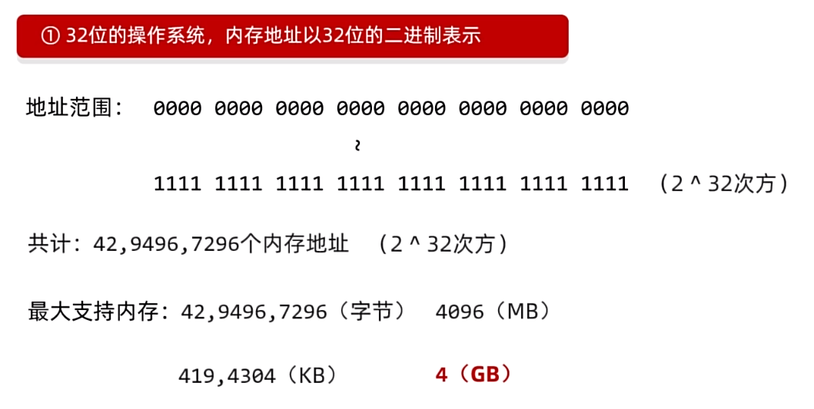
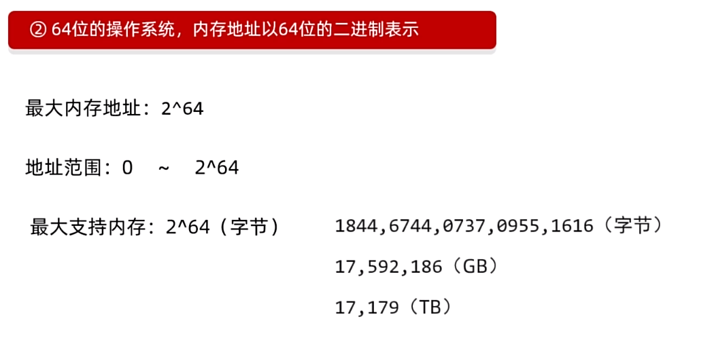
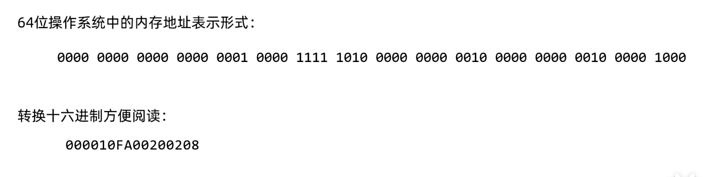
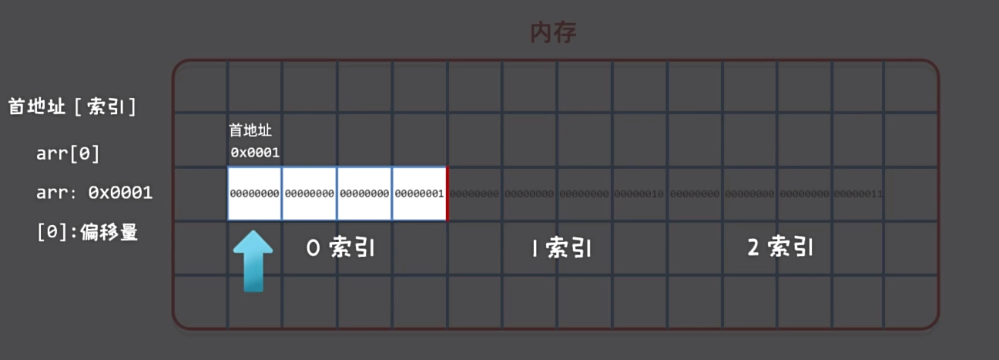
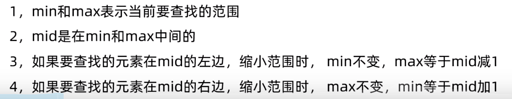
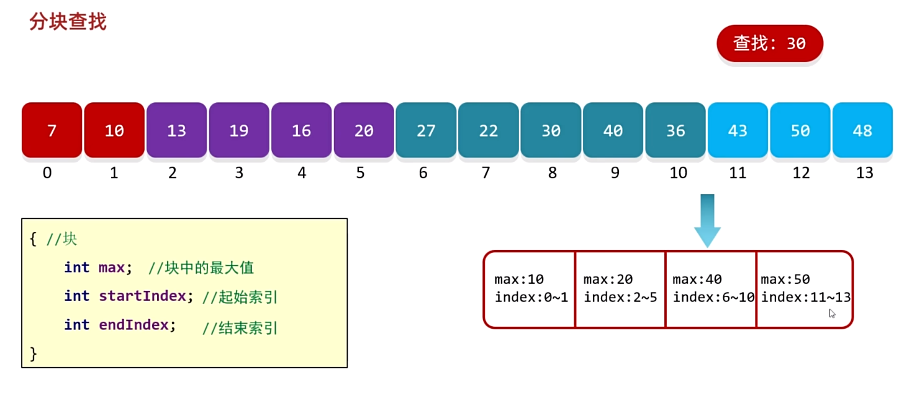

# C语言数组

## 数组的基本概念

数组是一段连续的内存空间，用于存储多个相同类型的元素。数组一旦定义，其长度就不能在运行过程中直接改变。

```c
int arr[3];
```

其中，`int` 是元素类型，`arr` 是数组名，`3` 是数组长度。

## 数组的初始化

定义数组时第一次为元素赋值，称为初始化。

```c
int arr[3] = {1, 2, 3};
```

- 省略数组长度时，编译器会根据初始值数量确定长度：`int arr[] = {1, 2, 3};`。
- 已写明长度时，初始值数量不能超过数组长度。
- 进行部分初始化时，未显式赋值的元素会被初始化为零值。例如整数为 `0`、浮点数为 `0.0`、字符为 `'\0'`、指针为空指针。

## 访问数组元素

数组通过索引访问元素。索引从 `0` 开始，长度为 `len` 的数组，其合法索引范围为 `0` 到 `len - 1`。

```c
#include <stdio.h>

int main(void)
{
    int arr[5] = {1, 2, 3, 4, 5};

    int value = arr[2];  /* 获取第三个元素 */
    arr[4] = 10;         /* 修改第五个元素 */

    printf("%d %d\n", value, arr[4]);
    return 0;
}
```

访问越界元素属于未定义行为，可能读到无效数据、破坏其他内存，甚至导致程序崩溃，因此不能依赖越界后的具体结果。

## 遍历数组

遍历就是按顺序访问数组中的每个元素，通常使用循环完成。

```c
#include <stdio.h>

int main(void)
{
    int arr[5] = {1, 2, 3, 4, 5};
    int len = (int)(sizeof(arr) / sizeof(arr[0]));

    for (int i = 0; i < len; i++) {
        printf("%d\n", arr[i]);
    }

    return 0;
}
```

## 内存与地址

程序运行时，数据会暂存在内存中。内存可以按字节划分，每个字节都有对应的地址。为了方便阅读，地址通常以十六进制表示。





一个 `n` 位地址最多可以表示 `2^n` 个不同地址，地址范围是 `0` 到 `2^n - 1`。实际可用内存还会受到硬件、操作系统和地址空间布局等因素限制。



使用 `%p` 可以输出地址，传入的地址应转换为 `void *`：

```c
#include <stdio.h>

int main(void)
{
    int value = 10;
    printf("%p\n", (void *)&value);
    return 0;
}
```

数组元素在内存中连续存放。数组名在大多数表达式中会转换为指向首元素的指针，索引可以理解为相对于首元素的偏移量，因此首元素的索引为 `0`。



在数组定义所在的作用域中，可以用总字节数除以单个元素的字节数计算数组长度：

```c
int len = (int)(sizeof(arr) / sizeof(arr[0]));
```

## 数组作为函数参数

数组传给函数时，形参中的数组写法会调整为指针，函数无法仅通过该形参得知原数组长度。因此，需要把长度一并传入。

```c
#include <stdio.h>

void print_array(const int arr[], int len)
{
    for (int i = 0; i < len; i++) {
        printf("%d\n", arr[i]);
    }
}

int main(void)
{
    int arr[] = {1, 2, 3, 4, 5};
    int len = (int)(sizeof(arr) / sizeof(arr[0]));

    print_array(arr, len);
    return 0;
}
```

## 基础练习

### 求最大值

```c
#include <stdio.h>

int main(void)
{
    int arr[] = {33, 5, 22, 44, 55};
    int len = (int)(sizeof(arr) / sizeof(arr[0]));
    int max = arr[0];

    for (int i = 1; i < len; i++) {
        if (arr[i] > max) {
            max = arr[i];
        }
    }

    printf("数组中的最大值为：%d\n", max);
    return 0;
}
```

### 生成十个随机数并求和

```c
#include <stdio.h>
#include <stdlib.h>
#include <time.h>

int main(void)
{
    int arr[10] = {0};
    int sum = 0;

    srand((unsigned int)time(NULL));

    for (int i = 0; i < 10; i++) {
        arr[i] = rand() % 100 + 1;
        sum += arr[i];
        printf("数组中的第%d个数是：%d\n", i + 1, arr[i]);
    }

    printf("数组中所有数的和是：%d\n", sum);
    return 0;
}
```

### 反转数组

```c
#include <stdio.h>

int main(void)
{
    int arr[5];
    int len = (int)(sizeof(arr) / sizeof(arr[0]));

    for (int i = 0; i < len; i++) {
        printf("请输入第%d个数字：", i + 1);
        scanf("%d", &arr[i]);
    }

    for (int left = 0, right = len - 1; left < right; left++, right--) {
        int temp = arr[left];
        arr[left] = arr[right];
        arr[right] = temp;
    }

    for (int i = 0; i < len; i++) {
        printf("%d%c", arr[i], i == len - 1 ? '\n' : ' ');
    }

    return 0;
}
```

### 打乱数组

下面使用 Fisher–Yates 算法，使每个排列具有相同概率。

```c
#include <stdio.h>
#include <stdlib.h>
#include <time.h>

int main(void)
{
    int arr[] = {1, 2, 3, 4, 5};
    int len = (int)(sizeof(arr) / sizeof(arr[0]));

    srand((unsigned int)time(NULL));

    for (int i = len - 1; i > 0; i--) {
        int j = rand() % (i + 1);
        int temp = arr[i];
        arr[i] = arr[j];
        arr[j] = temp;
    }

    for (int i = 0; i < len; i++) {
        printf("%d%c", arr[i], i == len - 1 ? '\n' : ' ');
    }

    return 0;
}
```

## 查找算法

### 顺序查找

顺序查找从数组开头逐个比较，找到时返回索引，未找到时返回 `-1`。

```c
int linear_search(const int arr[], int len, int target)
{
    for (int i = 0; i < len; i++) {
        if (arr[i] == target) {
            return i;
        }
    }
    return -1;
}
```

### 二分查找

二分查找要求数组已经有序。每次比较中间元素，并排除一半查找范围。



```c
int binary_search(const int arr[], int len, int target)
{
    int left = 0;
    int right = len - 1;

    while (left <= right) {
        int middle = left + (right - left) / 2;

        if (arr[middle] == target) {
            return middle;
        }
        if (arr[middle] > target) {
            right = middle - 1;
        } else {
            left = middle + 1;
        }
    }

    return -1;
}
```

二分查找效率较高，但前提是数据有序。分块查找会先定位数据所在的块，再在块内查找。



哈希查找则通过哈希函数计算数据可能所在的位置，适合需要快速查询的场景。

## 排序算法

### 冒泡排序

冒泡排序反复比较相邻元素，将较大的元素逐步移动到数组后部。

```c
void bubble_sort(int arr[], int len)
{
    for (int i = 0; i < len - 1; i++) {
        for (int j = 0; j < len - 1 - i; j++) {
            if (arr[j] > arr[j + 1]) {
                int temp = arr[j];
                arr[j] = arr[j + 1];
                arr[j + 1] = temp;
            }
        }
    }
}
```

### 选择排序

选择排序在每轮中找到未排序部分的最小元素，并将它放到当前起始位置。

```c
void selection_sort(int arr[], int len)
{
    for (int i = 0; i < len - 1; i++) {
        int min_index = i;

        for (int j = i + 1; j < len; j++) {
            if (arr[j] < arr[min_index]) {
                min_index = j;
            }
        }

        if (min_index != i) {
            int temp = arr[i];
            arr[i] = arr[min_index];
            arr[min_index] = temp;
        }
    }
}
```

<!-- learning-journey:update-history:start -->
## 更新记录

| 日期 | 类型 | 说明 |
| --- | --- | --- |
| 2026-07-20 | 首次发布 | 整理数组定义、内存模型、参数传递、基础练习、查找与排序算法，并修正示例代码 |
<!-- learning-journey:update-history:end -->
