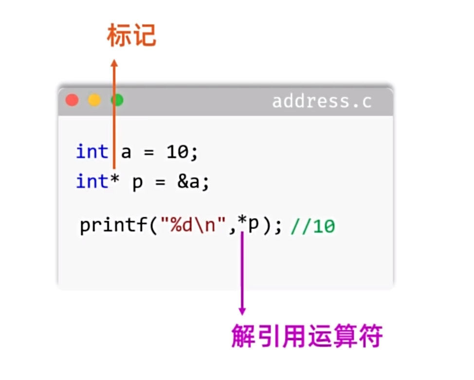

# C语言指针

## 指针与指针变量

内存地址用于标识内存中的位置。指针是一种保存地址的值，指针变量则是用于存储指针的变量。

```c
int value = 123;
int *pointer = &value;
```

- `&value`：取出变量 `value` 的地址。
- `int *pointer`：定义一个指向 `int` 的指针变量。
- `*pointer`：解引用指针，访问该地址所指向的 `int` 对象。



声明中的 `*` 表示变量是指针；表达式中的一元 `*` 是解引用运算符。

```c
#include <stdio.h>

int main(void)
{
    int value = 123;
    int *pointer = &value;

    printf("%d\n", *pointer);
    *pointer = 100;
    printf("%d\n", value);

    return 0;
}
```

## 使用指针时的基本规则

1. 指针变量名是 `pointer`，`*pointer` 表示它所指向的对象。
2. 指针类型应当与目标对象类型兼容。
3. 指针变量本身也占用内存，其大小由目标平台的数据模型决定，可用 `sizeof(pointer)` 获取，不能假设在所有环境中都固定为 4 或 8 字节。
4. 不应把普通整数直接当作有效地址赋给指针。
5. 不指向任何对象时，应显式初始化为空指针，例如 `int *pointer = NULL;`。
6. 解引用空指针、野指针或悬空指针都属于未定义行为。

## 通过指针修改函数外部的变量

C语言的函数参数按值传递。直接传入变量时，函数获得的是值的副本；传入变量的地址后，函数可以通过指针修改原对象。

```c
#include <stdio.h>

void swap(int *left, int *right)
{
    int temp = *left;
    *left = *right;
    *right = temp;
}

int main(void)
{
    int a = 100;
    int b = 200;

    swap(&a, &b);
    printf("a = %d, b = %d\n", a, b);
    return 0;
}
```

## 通过输出参数返回多个结果

函数本身只能直接返回一个值，但可以通过指针形参把多个结果写入调用方提供的变量。

```c
#include <stdio.h>

void get_max_and_min(const int arr[], int len, int *max, int *min)
{
    *max = arr[0];
    *min = arr[0];

    for (int i = 1; i < len; i++) {
        if (arr[i] > *max) {
            *max = arr[i];
        }
        if (arr[i] < *min) {
            *min = arr[i];
        }
    }
}

int main(void)
{
    int arr[] = {12, 66, 8, 46, 34, 56, 88, 26};
    int len = (int)(sizeof(arr) / sizeof(arr[0]));
    int max;
    int min;

    get_max_and_min(arr, len, &max, &min);
    printf("最大值：%d\n最小值：%d\n", max, min);
    return 0;
}
```

## 将运行状态与计算结果分开

函数返回值可以表示执行状态，实际结果则通过输出参数写回。

```c
#include <stdio.h>

int get_remainder(int dividend, int divisor, int *remainder)
{
    if (divisor == 0 || remainder == NULL) {
        return 1;
    }

    *remainder = dividend % divisor;
    return 0;
}

int main(void)
{
    int result;

    if (get_remainder(88, 3, &result) == 0) {
        printf("余数是：%d\n", result);
    } else {
        printf("计算失败\n");
    }

    return 0;
}
```

## 对象生命周期与悬空指针

普通局部变量具有自动存储期，函数返回后，其生命周期结束。此时继续通过原地址访问它会形成悬空指针。

```c
int *wrong(void)
{
    int local = 100;
    return &local;  /* 错误：函数返回后 local 已不存在 */
}
```

使用 `static` 定义的局部变量具有静态存储期，在整个程序运行期间存在，但其作用域仍局限在函数内。返回它的地址在生命周期上有效，不过多次调用会共享同一个对象，还需要考虑可重入性和并发访问。

## 指针运算

指针加减以目标类型为步长。对 `int *pointer` 执行 `pointer + 1`，得到的是下一个 `int` 元素的地址，而不是简单增加一个字节。

```c
#include <stdio.h>

int main(void)
{
    int arr[] = {1, 2, 3, 4, 5, 6};
    int *first = &arr[0];
    int *sixth = &arr[5];

    printf("%d\n", *(first + 1));
    printf("%td\n", sixth - first);
    return 0;
}
```

有意义且受标准支持的操作包括：

- 指针与整数相加或相减，用于同一数组对象内部以及末尾后一个位置的导航。
- 指向同一数组对象的两个指针相减，结果表示相隔的元素数量。

指针相加、指针乘除没有定义。指针运算越过所属数组的有效范围也属于未定义行为。

元素类型的大小应使用 `sizeof` 获取。C标准只保证 `sizeof(char) == 1`，其他类型的具体字节数与实现有关。

## 野指针、悬空指针与空指针

- **野指针**：未初始化、指向不确定位置的指针。
- **悬空指针**：原先指向有效对象，但对象生命周期已经结束或内存已经释放。
- **空指针**：不指向任何对象的特殊指针值，通常用 `NULL` 表示。

```c
int *pointer = NULL;
```

使用指针前应确保它指向仍然存在的有效对象，并在释放动态内存后及时将不再使用的指针置为 `NULL`。

## `void *` 通用指针

`void *` 可以保存任意对象指针。标准 C 不允许直接解引用 `void *`，也不允许对其进行指针算术，因为 `void` 没有对象大小。使用前需要转换为合适的对象指针类型。

```c
int value = 10;
int *integer_pointer = &value;
void *generic_pointer = integer_pointer;

printf("%d\n", *(int *)generic_pointer);
```

### 通用交换函数

下面把对象按字节交换。`unsigned char` 可以安全地查看和复制任意对象的字节表示。

```c
#include <stddef.h>

void generic_swap(void *left, void *right, size_t size)
{
    unsigned char *a = left;
    unsigned char *b = right;

    for (size_t i = 0; i < size; i++) {
        unsigned char temp = a[i];
        a[i] = b[i];
        b[i] = temp;
    }
}
```

调用时使用 `sizeof` 传入对象大小：

```c
int a = 100;
int b = 200;
generic_swap(&a, &b, sizeof(a));
```

## 指针与一维数组

数组名在大多数表达式中会转换为指向首元素的指针，因此可以通过指针遍历数组。

```c
#include <stdio.h>

int main(void)
{
    int arr[] = {1, 8, 49, 66, 82, 153};
    int len = (int)(sizeof(arr) / sizeof(arr[0]));
    int *pointer = arr;

    for (int i = 0; i < len; i++) {
        printf("%d\n", *(pointer + i));
    }

    return 0;
}
```

有两个常见例外：

1. `sizeof(arr)` 获取整个数组所占的字节数，数组不会转换为首元素指针。
2. `&arr` 获取整个数组的地址，类型是“指向该数组的指针”。

因此，若 `arr` 是 `int[5]`：

- `arr + 1` 跳过一个 `int` 元素。
- `&arr + 1` 跳过整个 `int[5]` 数组。

两者通常具有相同的起始地址表示，但类型和运算步长不同。

## 二维数组与数组指针

### 连续的二维数组

```c
int arr[3][4] = {
    {1, 2, 3, 4},
    {5, 6, 7, 8},
    {9, 10, 11, 12}
};
```

这里 `arr` 是由 3 个 `int[4]` 子数组组成的数组。在大多数表达式中，它会转换为指向首个子数组的指针，因此对应的数组指针类型是：

```c
int (*row_pointer)[4] = arr;
```

用指针遍历：

```c
#include <stdio.h>

int main(void)
{
    int arr[3][4] = {
        {1, 2, 3, 4},
        {5, 6, 7, 8},
        {9, 10, 11, 12}
    };
    int (*row_pointer)[4] = arr;

    for (int i = 0; i < 3; i++) {
        for (int j = 0; j < 4; j++) {
            printf("%d%c", row_pointer[i][j], j == 3 ? '\n' : ' ');
        }
    }

    return 0;
}
```

### 指针数组表示不等长的行

下面的 `rows` 是“元素为 `int *` 的数组”，并不是连续存储的二维数组。每个指针可以指向长度不同的一维数组。

```c
#include <stdio.h>

int main(void)
{
    int row1[] = {12, 55, 98};
    int row2[] = {6, 8, 14, 25, 36};
    int row3[] = {12, 33, 45, 58, 62, 78, 88};

    int *rows[] = {row1, row2, row3};
    int lengths[] = {3, 5, 7};

    for (int i = 0; i < 3; i++) {
        for (int j = 0; j < lengths[i]; j++) {
            printf("%d%c", rows[i][j], j == lengths[i] - 1 ? '\n' : ' ');
        }
    }

    return 0;
}
```

`int **` 是指向 `int *` 的指针。它可以用于遍历上面的指针数组，但不能替代指向连续二维数组的 `int (*)[列数]`，二者的内存结构和类型不同。

## 函数指针

函数指针保存函数的地址，其类型必须与目标函数的返回值和参数列表兼容。

```c
int add(int left, int right)
{
    return left + right;
}

int (*operation)(int, int) = add;
int result = operation(20, 30);
```

### 使用函数指针表选择运算

```c
#include <stdio.h>

int add(int a, int b)      { return a + b; }
int subtract(int a, int b) { return a - b; }
int multiply(int a, int b) { return a * b; }
int divide(int a, int b)   { return a / b; }

int main(void)
{
    int left;
    int right;
    int choice;
    int (*operations[])(int, int) = {
        add, subtract, multiply, divide
    };

    printf("请输入两个整数：");
    if (scanf("%d %d", &left, &right) != 2) {
        return 1;
    }

    printf("请选择运算：1.加 2.减 3.乘 4.除\n");
    if (scanf("%d", &choice) != 1 || choice < 1 || choice > 4) {
        printf("无效选择\n");
        return 1;
    }
    if (choice == 4 && right == 0) {
        printf("除数不能为零\n");
        return 1;
    }

    printf("结果是：%d\n", operations[choice - 1](left, right));
    return 0;
}
```

<!-- learning-journey:update-history:start -->
## 更新记录

| 日期 | 类型 | 说明 |
| --- | --- | --- |
| 2026-07-20 | 首次发布 | 整理指针基础、函数输出参数、指针运算、数组指针、二维数组与函数指针，并修正类型和示例代码 |
<!-- learning-journey:update-history:end -->
