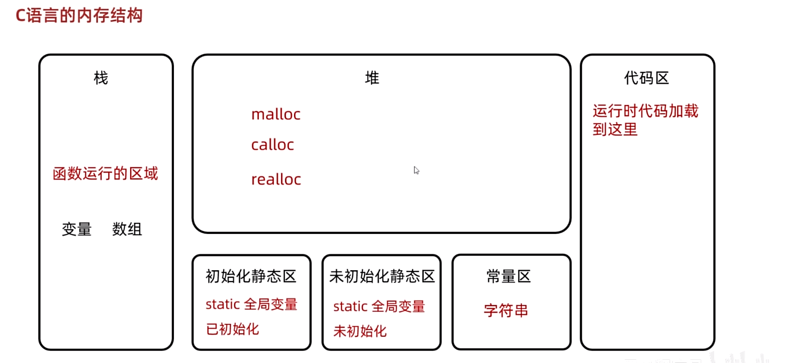

# C语言动态内存分配

## 什么是动态内存分配

动态内存分配允许程序在运行时根据实际需要申请存储空间。申请成功后，程序通过指针访问这段空间；使用完毕后，需要主动释放。

相关函数定义在 `<stdlib.h>` 中：

```c
#include <stdlib.h>
```

## 常用函数

### `malloc`

`malloc(size)` 申请至少 `size` 字节的连续存储空间。成功时返回指向该空间的 `void *`，失败时返回 `NULL`。新空间中的内容未初始化，读取前必须先写入有效值。

### `calloc`

`calloc(count, size)` 为 `count` 个、每个 `size` 字节的元素申请连续空间，并将申请到的所有字节初始化为零。

### `realloc`

`realloc(pointer, new_size)` 调整已有动态内存块的大小。它可能在原位置扩缩，也可能把数据复制到新位置。

### `free`

`free(pointer)` 释放此前由动态内存分配函数返回的空间。`free(NULL)` 是安全的，但重复释放同一内存块属于未定义行为。

## 使用 `malloc` 申请整数数组

下面申请可容纳 10 个 `int` 的空间，完成赋值和遍历后释放。

```c
#include <stdio.h>
#include <stdlib.h>

int main(void)
{
    size_t count = 10;
    int *numbers = malloc(count * sizeof(*numbers));

    if (numbers == NULL) {
        fprintf(stderr, "内存申请失败\n");
        return 1;
    }

    for (size_t i = 0; i < count; i++) {
        numbers[i] = (int)(i + 1) * 10;
    }

    for (size_t i = 0; i < count; i++) {
        printf("%d%c", numbers[i], i + 1 == count ? '\n' : ' ');
    }

    free(numbers);
    numbers = NULL;
    return 0;
}
```

在 C语言中，`void *` 可以自动转换为其他对象指针类型，因此不需要强制转换 `malloc` 的返回值。使用 `sizeof(*numbers)` 而不是手写 `sizeof(int)`，可以让分配大小自动跟随指针所指向的类型。

## 使用 `calloc` 进行零初始化

```c
#include <stdio.h>
#include <stdlib.h>

int main(void)
{
    size_t count = 10;
    int *numbers = calloc(count, sizeof(*numbers));

    if (numbers == NULL) {
        return 1;
    }

    for (size_t i = 0; i < count; i++) {
        printf("%d%c", numbers[i], i + 1 == count ? '\n' : ' ');
    }

    free(numbers);
    return 0;
}
```

`calloc` 会把分配空间的字节全部置零。对于常见平台上的整数数组，这会得到值为 `0` 的元素。

## 使用 `realloc` 扩容

调整空间大小时，应先把结果保存到临时指针。如果 `realloc` 失败，它会返回 `NULL`，原内存块仍然有效；若直接覆盖原指针，就会丢失释放原空间所需的地址。

```c
#include <stdio.h>
#include <stdlib.h>

int main(void)
{
    size_t old_count = 10;
    size_t new_count = 20;
    int *numbers = malloc(old_count * sizeof(*numbers));

    if (numbers == NULL) {
        return 1;
    }

    for (size_t i = 0; i < old_count; i++) {
        numbers[i] = (int)(i + 1) * 10;
    }

    int *resized = realloc(numbers, new_count * sizeof(*numbers));
    if (resized == NULL) {
        free(numbers);
        return 1;
    }

    numbers = resized;

    for (size_t i = old_count; i < new_count; i++) {
        numbers[i] = 0;
    }

    free(numbers);
    return 0;
}
```

扩容成功后：

- 原有数据在新旧大小的较小范围内得到保留。
- 新增空间中的内容未初始化，需要先赋值再读取。
- 返回地址可能与原地址相同，也可能不同。
- 调用成功后，原指针值不应再用于访问原内存块。

## 分配大小与溢出检查

分配函数的参数以字节为单位。当元素数量来自外部输入时，`count * sizeof(*pointer)` 可能发生整数溢出，应先检查乘法是否安全。

```c
#include <stdint.h>
#include <stdlib.h>

if (count > SIZE_MAX / sizeof(*numbers)) {
    /* 请求大小无法表示 */
}
```

还需要检查分配函数是否返回 `NULL`。申请过大的空间不一定成功，具体行为受到可用内存、操作系统虚拟内存策略和进程限制等因素影响。

## 常见错误

### 内存泄漏

丢失动态内存块的最后一个有效指针，却没有调用 `free`，会造成内存泄漏。

```c
int *numbers = malloc(10 * sizeof(*numbers));
numbers = NULL;  /* 错误：原内存块无法再释放 */
```

### 释放后继续访问

`free` 之后，原指针成为悬空指针。继续读取或写入所指向的空间属于未定义行为。

```c
free(numbers);
numbers = NULL;
```

把指针置为 `NULL` 有助于避免误用，但如果还有其他指针指向同一内存块，它们仍然会悬空。

### 重复释放

同一内存块只能释放一次。重复调用 `free` 属于未定义行为。

### 未初始化读取

`malloc` 和扩容后的新增区域不会自动初始化。在向其中写入有效值前，不应读取这些字节所表示的对象。

## 程序内存布局示意



常见实现会把自动存储期的局部对象放在栈区域，把动态分配的对象放在堆区域，并为代码、静态对象和字符串字面量安排其他区域。不过，C标准并不强制规定图中的具体分区名称和布局；它更适合作为理解常见系统实现的概念示意。

<!-- learning-journey:update-history:start -->
## 更新记录

| 日期 | 类型 | 说明 |
| --- | --- | --- |
| 2026-07-20 | 首次发布 | 整理 malloc、calloc、realloc 和 free 的用法，补充分配失败、溢出、泄漏与悬空指针检查 |
<!-- learning-journey:update-history:end -->
