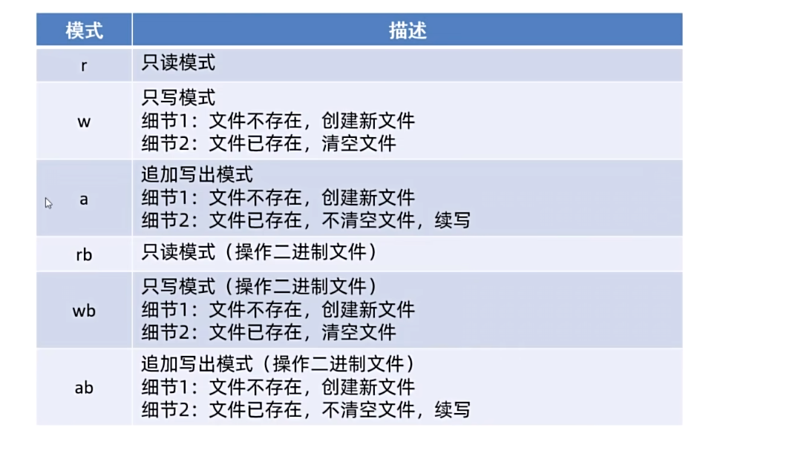
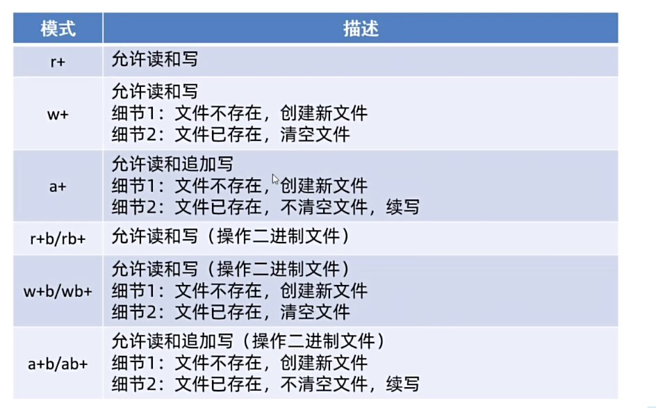

# C语言文件读写

## 文件路径

路径用于描述文件在文件系统中的位置。

### 绝对路径

绝对路径从文件系统的根位置开始。在 Windows 中通常以盘符开头：

```text
D:\projects\c-language\data\input.txt
```

反斜杠在 C字符串中是转义符，因此代码中的 Windows 路径需要写成双反斜杠：

```c
const char *path = "D:\\projects\\c-language\\data\\input.txt";
```

### 相对路径

相对路径以程序运行时的当前工作目录为起点：

```text
data/input.txt
```

当前工作目录不一定等于源代码或可执行文件所在目录。程序依赖相对路径时，需要明确它从哪个目录启动。

## 字符串中的转义字符

反斜杠 `\` 会与后面的字符组成转义序列。例如：

- `\"`：双引号字符。
- `\\`：反斜杠字符。
- `\n`：换行符。
- `\t`：制表符。

```c
printf("双引号：\"，反斜杠：\\\n");
```

## 文件操作的基本流程

1. 使用 `fopen` 打开文件。
2. 检查返回值是否为 `NULL`。
3. 使用相应函数读取或写入数据。
4. 检查读写错误。
5. 使用 `fclose` 关闭文件。

文件操作相关类型和函数定义在 `<stdio.h>` 中。`fopen` 成功时返回 `FILE *`，失败时返回 `NULL`。

## 读取文件

### 使用 `fgetc` 逐字符读取

`fgetc` 返回读取到的无符号字符值，并转换为 `int`；到达文件末尾或发生错误时返回 `EOF`。因此必须使用 `int` 保存返回值。

```c
#include <stdio.h>

int main(void)
{
    FILE *file = fopen("data/input.txt", "r");
    if (file == NULL) {
        perror("无法打开文件");
        return 1;
    }

    int current;
    while ((current = fgetc(file)) != EOF) {
        putchar(current);
    }

    if (ferror(file)) {
        perror("读取文件失败");
    }

    fclose(file);
    return 0;
}
```

`fgetc` 每次读取一个字符，不是以空格为分隔符。返回 `EOF` 后，可以通过 `feof` 和 `ferror` 区分正常到达文件末尾与读取错误。

### 使用 `fgets` 逐行读取

`fgets(buffer, size, file)` 最多读取 `size - 1` 个字符，并在末尾补 `\0`。如果在限制范围内读到换行符，换行符也会保存到缓冲区中。成功时返回 `buffer`，未读取到数据时返回 `NULL`。

```c
#include <stdio.h>

int main(void)
{
    FILE *file = fopen("data/input.txt", "r");
    if (file == NULL) {
        perror("无法打开文件");
        return 1;
    }

    char buffer[1024];
    while (fgets(buffer, sizeof(buffer), file) != NULL) {
        fputs(buffer, stdout);
    }

    if (ferror(file)) {
        perror("读取文件失败");
    }

    fclose(file);
    return 0;
}
```

### 使用 `fread` 按块读取

```c
size_t fread(void *buffer, size_t size, size_t count, FILE *stream);
```

- `buffer`：保存读取结果的内存区域。
- `size`：每个元素的字节数。
- `count`：最多读取的元素数量。
- `stream`：目标文件流。
- 返回值：成功读取的完整元素数量，不一定是字节数；当 `size` 为 `1` 时，两者相同。

```c
#include <stdio.h>

int main(void)
{
    FILE *file = fopen("data/input.bin", "rb");
    if (file == NULL) {
        perror("无法打开文件");
        return 1;
    }

    unsigned char buffer[1024];
    size_t bytes_read;

    while ((bytes_read = fread(buffer, 1, sizeof(buffer), file)) > 0) {
        if (fwrite(buffer, 1, bytes_read, stdout) != bytes_read) {
            perror("输出失败");
            break;
        }
    }

    if (ferror(file)) {
        perror("读取文件失败");
    }

    fclose(file);
    return 0;
}
```

## 写入文件

### `fputc`

向文件写入一个字符。成功时返回写入的字符值，失败时返回 `EOF`。

### `fputs`

写入一个以 `\0` 结尾的字符串，但不会自动写入结尾的 `\0`。成功时返回非负值，失败时返回 `EOF`。

### `fwrite`

写入多个定长元素，返回成功写入的完整元素数量。

```c
#include <stdio.h>

int main(void)
{
    FILE *file = fopen("data/output.txt", "w");
    if (file == NULL) {
        perror("无法打开文件");
        return 1;
    }

    if (fputc('A', file) == EOF) {
        perror("写入字符失败");
    }

    if (fputs(" hello\n", file) == EOF) {
        perror("写入字符串失败");
    }

    const char data[] = {'a', 'b', 'c', 'd', 'e'};
    size_t count = sizeof(data) / sizeof(data[0]);
    if (fwrite(data, sizeof(data[0]), count, file) != count) {
        perror("批量写入失败");
    }

    if (fclose(file) == EOF) {
        perror("关闭文件失败");
        return 1;
    }

    return 0;
}
```

使用 `w` 模式会在文件存在时清空原内容。若需要保留原内容并追加，应使用 `a` 模式。

## 文件打开模式



常用基本模式：

| 模式 | 含义 | 文件不存在时 | 文件存在时 |
| --- | --- | --- | --- |
| `r` | 只读 | 打开失败 | 从开头读取 |
| `w` | 只写 | 创建文件 | 清空原内容 |
| `a` | 追加写 | 创建文件 | 从末尾追加 |



在模式中加入 `+` 表示同时允许读写：

- `r+`：读写已有文件，文件不存在时失败。
- `w+`：读写文件，文件不存在时创建，存在时清空。
- `a+`：读取并追加写入，文件不存在时创建；写操作始终发生在文件末尾。

加入 `b` 表示二进制模式，例如 `rb`、`wb` 和 `ab`。在 Windows 上，文本模式可能对换行符等内容进行转换；处理图片、压缩包和自定义二进制数据时应使用二进制模式。

文件能否被记事本打开并不是严格的格式判断标准。文本文件按照字符编码解释内容；二进制文件则按既定的数据格式解释字节。

<!-- learning-journey:update-history:start -->
## 更新记录

| 日期 | 类型 | 说明 |
| --- | --- | --- |
| 2026-07-20 | 首次发布 | 整理路径、转义字符、文件读写函数与打开模式，补充错误检查并替换本地绝对路径 |
<!-- learning-journey:update-history:end -->
