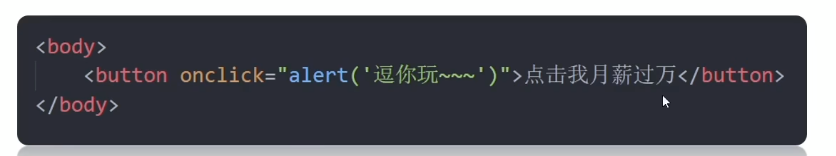
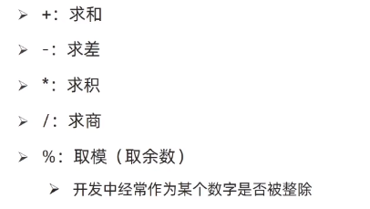

# JavaScript 基础

## JavaScript 简介

JavaScript 是运行在浏览器中的编程语言，用于实现人机交互。

主要作用：

- 实现网页特效：监听用户行为并做出相应反馈。
- 表单验证：判断表单数据是否合法。
- 数据交互：获取后台数据并渲染到前端。
- 服务器编程：例如 Node.js。

JavaScript 的组成：

- ECMAScript：JavaScript 的语言基础，规定基础语法。
- Web APIs：
  - DOM（文档对象模型）：操作文档，例如移动、调整、添加或删除页面元素。
  - BOM（浏览器对象模型）：操作浏览器，例如弹窗、检测窗口宽度、在浏览器中存储数据等。

[JavaScript 权威文档：MDN](https://developer.mozilla.org/zh-CN/docs/Web/JavaScript)

## JavaScript 的书写位置

### 行内 JavaScript

- 直接写在标签内部。
- Vue 框架会用到。



### 内部 JavaScript

- 直接写在 HTML 文件中，使用 `<script>` 双标签包裹。
- 规范：写在 `</body>` 上面。

### 外部 JavaScript

把代码写在以 `.js` 结尾的文件中，再使用 `<script>` 标签引入：

```html
<script src="xxx.js"></script>
```

带有 `src` 属性的 `<script>` 标签中不可再写代码，写入的代码不会执行。

## 注释与语句结束符

### 注释

- 单行注释：`// xxxxxxxxx`，快捷键为 `Ctrl + /`。
- 多行注释：`/* xxxxx */`，快捷键为 `Shift + Alt + A`。

### 结束符

- 使用英文分号 `;` 表示语句结束。
- 实际开发中可写可不写，浏览器会自动推断，多数人主张不加。
- 根据团队要求，要么统一书写，要么统一不写。

## 输入和输出

### 输出语法

`document.write()`：向网页 `body` 中输出内容，其中的标签会被解析为网页元素。

```javascript
document.write('要输出的内容')
```

`alert()`：在页面中弹出警告对话框。

```javascript
alert('弹出的内容')
```

`console.log()`：在控制台输出内容，主要用于程序调试。

```javascript
console.log('控制台打印出的内容')
```

在编辑器中输入 `log`，选择相应代码提示后按 `Tab` 可以快速生成。

### 输入语法

`prompt()` 显示带提示文字的输入对话框：

```javascript
prompt('请输入您的姓名')
```


`alert()` 和 `prompt()` 会跳过页面渲染，优先执行。

## 字面量

字面量是在代码中直接写出的值，可以是数字、字符串、布尔值、对象或数组等。

## 变量

### 变量的基本使用

- 定义变量：`let 变量名`。
- 定义并初始化：`let 变量名 = 数值`。
- 同时定义多个变量：`let a = 1, b = 2`，但提倡拆开书写。
- 更新变量：直接使用已经定义的变量名赋新值。
- `let` 不允许在同一作用域中重复定义同名变量。

变量的本质是程序在内存中申请的、用于存储数据的空间。

### 变量命名规则和规范

规则：

- 不能使用关键字作为变量名，例如 `let`、`var`、`if`、`for`。
- 不能以数字开头。
- 只能由下划线、字母、数字和 `$` 组成。
- 字母严格区分大小写。

规范：

- 变量名要有意义。
- 遵循小驼峰命名：第一个单词首字母小写，后续单词首字母大写。

```javascript
let userName = '小明'
```

### `let` 与 `var`

旧版 JavaScript 使用 `var` 定义变量，`var` 声明存在以下不合理之处：

- 可以先使用再声明。
- 可以重复声明。

现在一律不用 `var`。

## 数组

数组用于把一组数据存储在单个变量名下。

```javascript
let 数组名 = [数据1, 数据2]
```

通过从 `0` 开始的索引访问数据：

```javascript
数组名[索引]
```

数组可以存储任意类型的数据。

## 常量

`const` 声明的变量不能重新赋值；如果保存的是对象或数组，其内部内容仍然可以修改。

```javascript
const Max = 100
```

`const` 声明时必须进行赋值。

## 数据类型

JS 是一种弱数据类型的语言：只有给变量之后才系统才知道是什么数据类型。

### Number（数字）类型

整数、负数和小数等数字都属于 Number 类型。

### String（字符串）类型

- 使用单引号、双引号或反引号包裹的内容都是字符串。
- 单引号和双引号没有本质区别，推荐使用单引号。
- 单引号和双引号可以相互嵌套，但不能直接嵌套自身。
- 必要时可以使用转义符 `\` 输出引号等特殊字符。

字符串可以使用 `+` 进行拼接，也可以与数字拼接。

模板字符串使用反引号包裹，并通过 `${}` 插入变量：

```javascript
let age = 18
document.write('我今年' + age + '岁了')
document.write(`我今年${age}岁了`)
```

### Boolean（布尔）类型

包含两个固定字面量：`true` 和 `false`。

### Undefined（未定义）类型

- 只有一个值：`undefined`。
- 变量只定义但未赋值时，默认值为 `undefined`。
- 可以通过检测变量是否为 `undefined`，判断是否有数据传入。

### Null（空）类型

- `undefined` 表示未赋值。
- `null` 表示已经赋值，但内容为空。
- 如果变量将来需要存放对象，但对象尚未创建，可以先赋值为 `null`。

### 引用数据类型

### 检测数据类型

- 在控制台中，数字和布尔值显示为蓝色，字符串和未定义值显示为灰色。
- 使用 `typeof` 关键字检测数据类型：

```javascript
console.log(typeof num)
```

## 数据类型转换

在前端中，通过 `prompt` 输入或从表单中取得的数据默认都是字符串类型。

### 隐式转换

- `+` 两侧只要有一项是字符串，另一项就会自动转换为字符串。
- 除 `+` 以外的算术运算符会自动把数据转换为数字类型。
- 一元 `+` 会把后面的数据转换为数字类型。
- `null` 转换为数字后是 `0`。
- `undefined` 转换为数字后是 `NaN`。

```javascript
let string = +'123'
```

### 显式转换

`Number()` 将数据转换为数字。如果内容中有非数字，转换失败时结果为 `NaN`。`NaN` 也是数字类型的数据，表示“非数字”。

```javascript
Number(要转换成数字类型的数据)
```

一元 `+` 也可以完成数字转换。

`parseInt()` 会从字符串开头解析整数，遇到无法继续解析的字符时停止；如果开头不能解析为数字，则返回 `NaN`。

```javascript
parseInt('12.36px', 10)       // 结果为12
parseInt('abc12.36px', 10)    // 结果为NaN
```

`parseFloat()` 可以保留小数部分。

`Boolean()` 将数据转换为布尔值。空字符串、`0`、`undefined`、`null`、`false` 和 `NaN` 转换后都是 `false`，其余为 `true`。

## 算术运算符



## 本节语法

1. `//`
2. `/* */`
3. `document.write()`
4. `alert()`
5. `console.log()`
6. `prompt()`
7. `let`
8. `const`
9. `` `${}` ``
10. `typeof`
11. `+''`
12. `Number()`
13. `parseInt()`
14. `parseFloat()`

<!-- learning-journey:update-history:start -->
## 更新记录

| 日期 | 类型 | 说明 |
| --- | --- | --- |
| 2026-07-20 | 首次发布 | 整理 JavaScript 基础语法，并按确认替换个人姓名、修正控制台函数、转义符、parseInt、const 和标题错字 |
<!-- learning-journey:update-history:end -->
