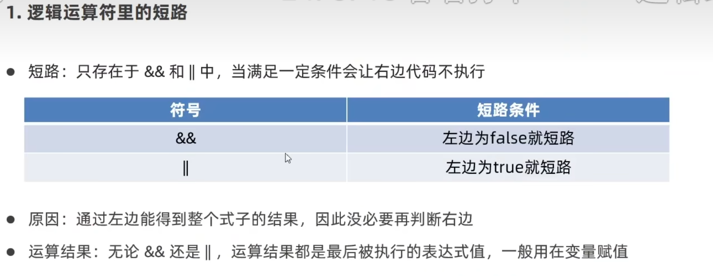
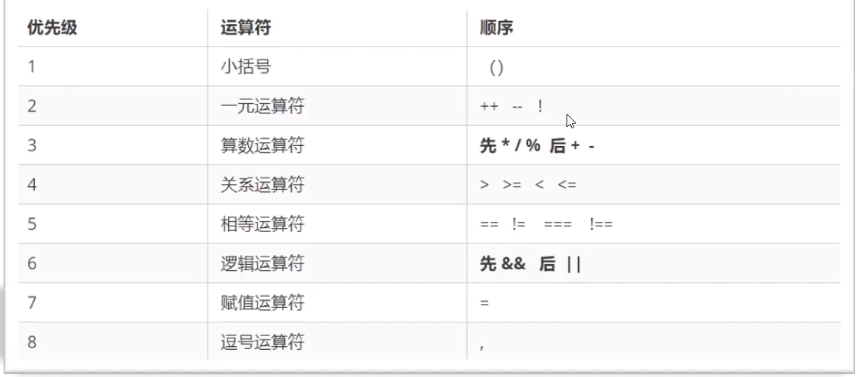
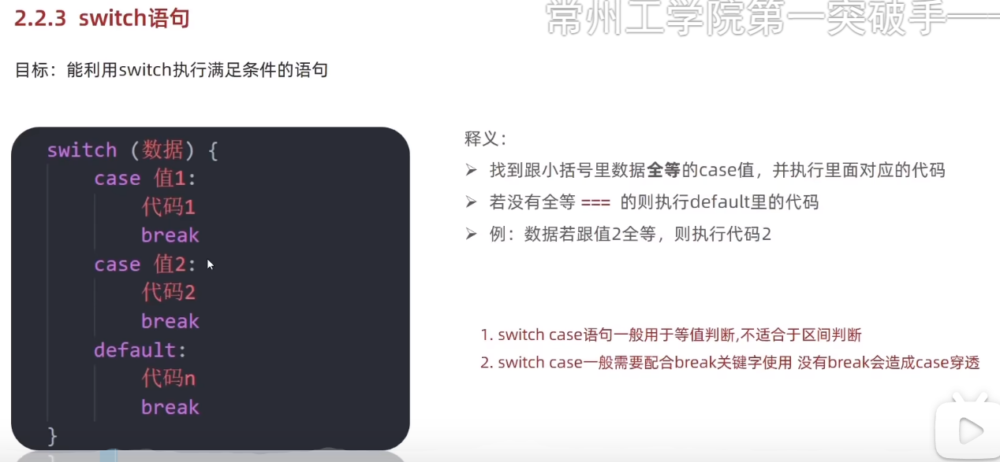
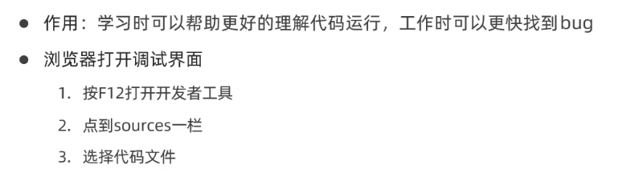

# JavaScript 运算符、控制语句与数组

## 运算符

JavaScript 的运算符与 C语言几乎相同，以下是主要不同点。

### 比较运算符

- `==` 和 `!=` 检查左右两侧的值是否相同。
- `===` 和 `!==` 检查左右两侧的值和类型是否都相同。

注意事项：

- 使用 `==` 比较时，不同类型的数据会先进行隐式转换。
- `NaN` 不等于任何值，包括它自己。
- 实际使用中，判断是否相等通常使用 `===`。
- 字符串按 UTF-16 编码单元逐项比较，从左到右确定大小关系。
- 尽量不要直接比较小数，可能存在精度问题。

### 逻辑运算符

未赋值的 `undefined` 按 `false` 看待。



逻辑运算符返回一个值：

- `&&`：如果左侧为假，返回左侧的值；如果左侧为真，返回右侧的值。
- `||`：如果左侧为假，返回右侧的值；如果左侧为真，返回左侧的值。
- Python 与 JavaScript 相同。
- C 的逻辑运算结果是整数 `0` 或 `1`；C++ 返回 `bool`，Java 返回 `boolean`。

### 运算符优先级



## 控制语句



## 断点调试



## 数组

### 声明数组

使用数组字面量：

```javascript
let 数组名 = [各种数据类型的数据]
```

使用 `new Array()`：

```javascript
let values1 = new Array(1, 2, 3) // 创建包含三个元素的数组
let values2 = new Array(3)       // 创建长度为3的稀疏数组
```

### 获取数组长度

```javascript
数组名.length
```

### 在数组末尾添加数据

```javascript
数组名.push(数据)
```

- 将一个或多个元素添加到数组末尾。
- 返回数组的新长度。

### 在数组开头添加数据

```javascript
数组名.unshift(数据)
```

- 将一个或多个元素添加到数组开头。
- 返回数组的新长度。

### 删除数组末尾的数据

```javascript
数组名.pop()
```

- 删除数组中的最后一个元素。
- 一次只能删除一个元素。
- 返回被删除的末尾元素；空数组调用时返回 `undefined`。

### 删除数组开头的数据

```javascript
数组名.shift()
```

删除数组中的第一个元素。

### 删除指定位置的数据

```javascript
数组名.splice(要删除的起始索引, 删除的个数)
```

- 从指定索引开始删除元素。
- 如果没有设置删除个数，默认删除到末尾。
- 返回一个包含被删除元素的新数组。

<!-- learning-journey:update-history:start -->
## 更新记录

| 日期 | 类型 | 说明 |
| --- | --- | --- |
| 2026-07-20 | 首次发布 | 整理运算符、控制语句和数组操作，并按确认修正字符串比较、逻辑返回值、Array 构造和 pop 返回值说明 |
<!-- learning-journey:update-history:end -->
