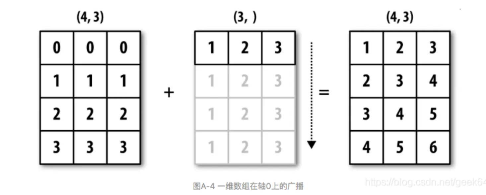
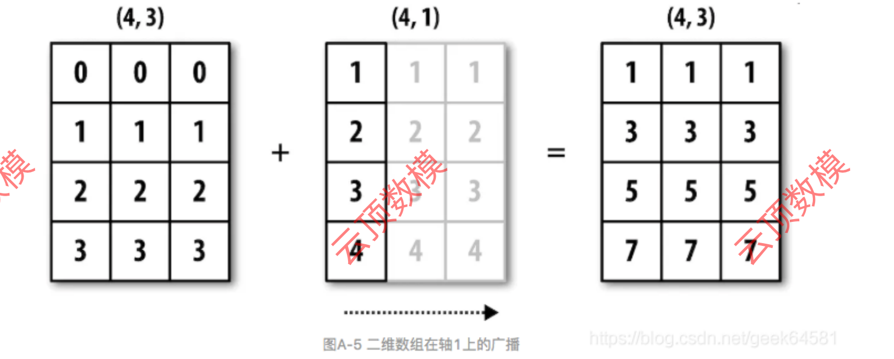
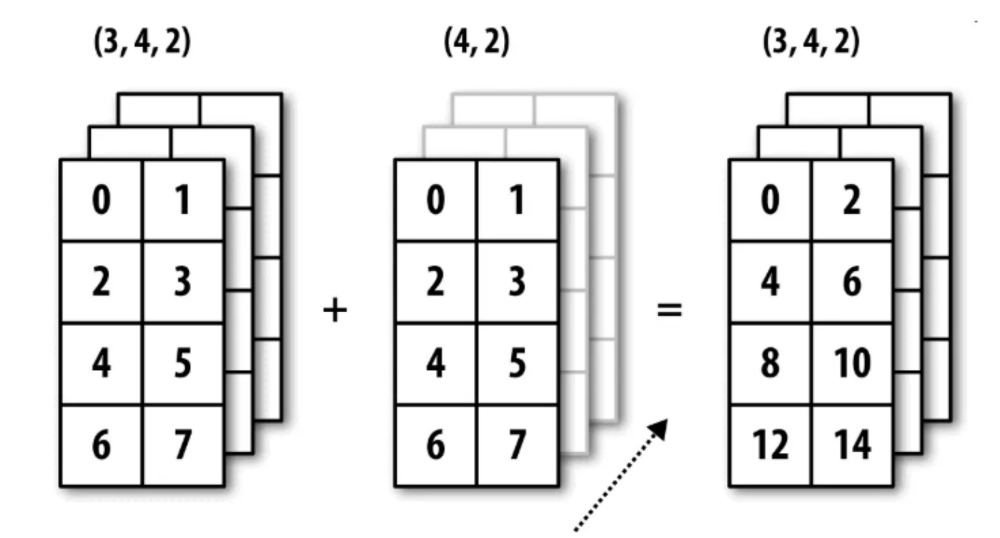

# NumPy 数组运算与广播

## 数组与标量的运算

NumPy 数组支持直接与标量进行加、减、乘、除等运算，操作会作用在数组的每个元素上。

```python
import numpy as np

arr = np.array([[1, 2, 3], [4, 5, 6]])

print(arr + 2)
# [[3 4 5]
#  [6 7 8]]

print(arr * 3)
# [[ 3  6  9]
#  [12 15 18]]

print(arr / 2)
# [[0.5 1.  1.5]
#  [2.  2.5 3. ]]
```

## 数组之间的运算

两个数组形状相同时，NumPy 支持逐元素的加、减、乘、除。

```python
arr1 = np.array([[1, 2], [3, 4]])
arr2 = np.array([[5, 6], [7, 8]])

print(arr1 + arr2)
# [[ 6  8]
#  [10 12]]

print(arr1 * arr2)
# [[ 5 12]
#  [21 32]]
```

## 广播机制

当两个数组的形状不同，NumPy 可以通过广播机制扩展它们，再执行逐元素运算。







广播可以让形状不完全相同的两个或多个数组参与运算，需要满足以下条件之一：

- 数组的某一维度等长。
- 其中一个数组的某一维度为 `1`。

<!-- learning-journey:update-history:start -->
## 更新记录

| 日期 | 类型 | 说明 |
| --- | --- | --- |
| 2026-07-23 | 首次发布 | 整理 NumPy 数组逐元素运算与广播机制 |
<!-- learning-journey:update-history:end -->
