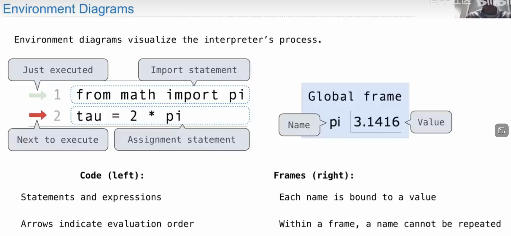
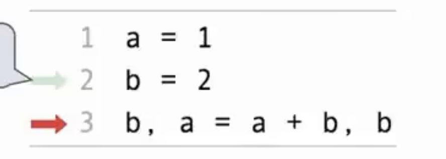
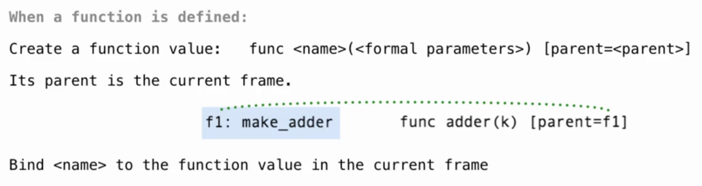
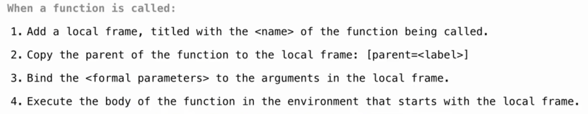
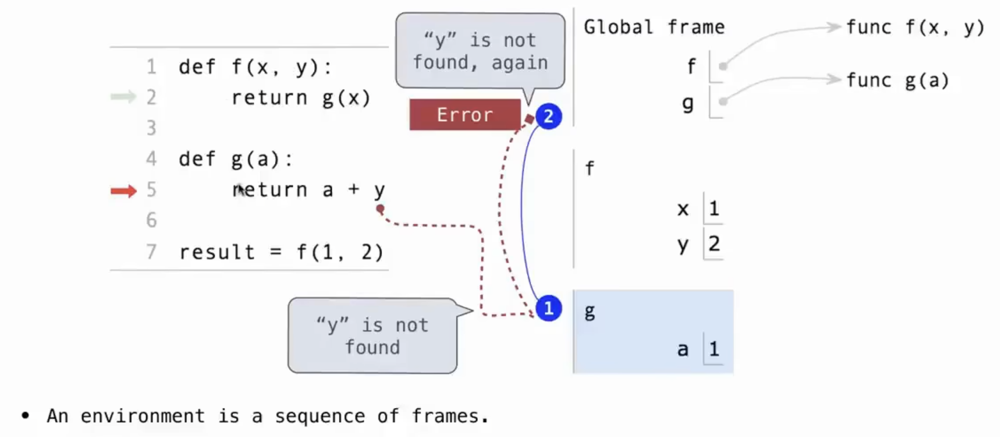
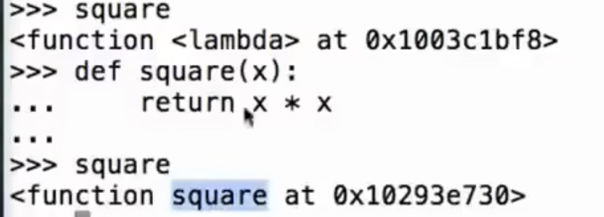
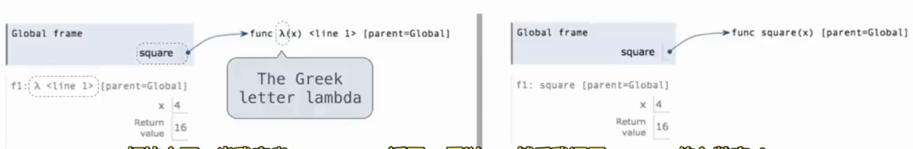

# Python 函数、控制语句与高阶函数

## Lecture 2：Functions 函数

### Types of expressions 表达式种类
1. primitive expressions 原始表达式：
        * Number：	`2`
        * Name：		`cnt`
        * String:		`'hello'`
2. Call expressions 调用表达式：
+ 即函数调用：`operator(operand1, operand2);`——>`max(1, 2);`

### Environment & Frame 环境与帧
+ **Global Frame 全局帧**：程序运行时自动创建的第一个帧，存放所有的全局变量绑定和函数定义绑定
+ **Local Frame 局部帧**：当调用函数时会临时新建一个局部帧，存放该函数的参数和局部变量，调用完毕该局部帧就会被销毁
+ 环境是一系列帧的集合
+ 【求值变量名称时，该变量名称的值来源于当前环境中向上逐个查找被发现的最早的帧中绑定的值（先局部帧，再全局帧）】

### Defining functions 定义函数
```python
from operator import mul
#从operator包中引用内置函数（built-in function）mul

def square(x):
    return mul(x, x)
```


#### def 语句的具体执行过程：
1. 创建函数对象
2. 将函数体记录到函数对象中
3. 在当前帧中将函数名和函数对象绑定
+ 注：`def`语句只是记录而不运行函数体，只有在调用时才会运行


### Calling functions 调用函数

#### 函数调用的具体执行过程：
1. 添加一个Local frame（局部帧），形成一个新的环境
2. 在本局部帧中将传递的实参 与函数对象的形参 相绑定
3. 在当前新环境中执行函数体


### Environment Diagrams 环境图
#### 作用：
可视化解释器的运行，重现程序是如何执行的

#### 样式：


### Assignment Statements 赋值语句
#### 原理：
在frame帧中改变名称和值之间的绑定关系

#### 执行规则：


1. 从等号右边开始，从左往右依次计算所有表达式
2. 所有表达式计算完之后将等号左边的名称与右边计算出的值依次绑定

### `None`关键字
+ Python中的`None`表示某个函数未返回任何内容
+ 当一个函数没有任何返回值时，返回的是`None`
+ 当`None`作为表达式存在时，解释器不会显示`None`的值

### Pure Functions & Non-Pure Functions 纯函数和非纯函数
+ Pure Functions ：纯函数只返回值，没有任何side effects（副作用）
+ Non-Pure Functions：非纯函数有side effects（副作用），即除了返回值外，还会产生一些额外行为，比如打印一些内容、改变一些变量、写入了一些内容等等

### `print` 函数的实质
1. 打印出参数
2. 没有返回值，实际返回`None`
+ 故`print(print(1, 2))`的结果是`1 2 None`
3. `print()` 会将内容输出到终端；`return` 用于把值返回给调用者，本身不会打印内容。交互式解释器显示返回的字符串时通常会带引号

## Lecture 3：Control 控制

### Miscellaneous Python Features（杂项 Python 特性）

#### 真除 `truediv()` 与地板除 `floordiv()`

- `/`：真除法，保留小数部分，即使操作数是整数，结果也是浮点数。
- `//`：地板除（向下取整除法），结果是向下取整的商。
  - 如果操作数是整数，结果也是取整后的整数。
  - 如果操作数是浮点数，结果就是取整后的浮点数。

#### 函数可以返回多个值

### Control Statements（控制语句）

#### Python 中的假值和真值

- **常见假值**：0、False、空字符串、None，以及空列表、空元组、空字典、空集合等空容器。
- **真值**：其他对象通常作为真值。

#### Conditional statements（条件语句）

```python
def absolute_value(x):
    """Return the absolute value of x."""
    if x < 0:
        return -x
    elif x == 0:
        return 0
    else:
        return x
```

#### Loop statements（循环语句）

```python
def pow(x, y):
    cnt = 1
    ans = x
    while cnt < y:
        ans = ans * x
        cnt = cnt + 1
    return ans
```

## Lecture 4：Higher-Order Functions 高阶函数

### Assertion 断言

#### 语法

`assert 表达式, '抛出的错误提示'`

```python
def area_circle(r):
    assert r > 0, 'A length must be positive'
    return r * r * pi
```

### Higher-Order Functions 高阶函数

#### 什么是高阶函数？

- 以函数作为参数的函数（能接受函数的函数）。
- 或返回一个函数的函数（能生成函数的函数）。

#### 高阶函数示例

```python
# 接受函数的函数
def apply_twice(f, x):
    return f(f(x))

# 生成函数的函数
def make_adder(n):
    def adder(x):
        return x + n
    return adder

add5 = make_adder(5)
print(add5(10))  # 输出为 15
# make_adder 返回了函数 adder，而且这个函数记住了 n=5 的环境（闭包特性）。
```

#### 本质

- 在 Python 中，函数名只是变量，绑定到相应的函数对象，函数体包含在函数对象中。
- `f` 是函数变量，`f()` 是调用函数变量绑定的函数对象。

## Lecture 5：Environment Diagram 环境图

### 创建函数时



1. 创建一个函数对象，函数体实际包含在函数对象中，其父级帧是当前帧。
2. 在当前帧中，将函数名与函数对象绑定。

### 调用函数时



1. 添加一个以被调用函数命名的 Local Frame（局部帧）。
2. 将新建局部帧的父级指向函数对象记录的父级帧。
3. 在当前局部帧中，将函数的实参绑定到形参。
4. 在以当前局部帧为开头的环境中执行函数体。查找变量名称绑定的值时，从当前局部帧开始沿父级追溯到全局帧，使用首先找到的绑定。

**从当前局部帧开始，自底向上找到的第一个值。**

### Local Name 局部名称



- 环境 1：`全局帧` + `局部帧 f`
- 环境 2：`全局帧` + `局部帧 g`
- 变量名称 `y` 只存在于环境 1 中，在环境 2 中并未绑定，因此对于局部帧 `g` 来说，`y` 是局部帧 `f` 的局部名称。

### Lambda Expression

- Lambda 表达式用于创建匿名函数，可以再通过赋值语句将函数对象绑定到名称。
- Lambda 表达式不能包含语句，只能将一个表达式作为主体，适合创建简单函数。

```python
square = lambda x: x * x
```

Lambda 表达式和 `def` 语句在环境中创建函数的规则相同。`def` 语句会给创建的函数一个 intrinsic name（内在名称）：



Lambda 表达式创建的函数对象以内在名称 `λ` 表示，赋值语句完成后，函数对象还会与相应名称绑定：



### Function Currying 函数柯里化

函数柯里化是将多参数函数转换为一系列单参数函数的过程，即把 `f(a, b, c)` 转换为 `f(a)(b)(c)` 的链式调用。

```python
# 正常函数
def multiply(a, b):
    return a * b

print(multiply(2, 3))  # 输出 6

# 柯里化后的函数
def multiply(a):
    def inner(b):
        return a * b
    return inner

times2 = multiply(2)
print(times2(5))       # 输出 10
print(multiply(2)(3))  # 输出 6
```

<!-- learning-journey:update-history:start -->
## 更新记录

| 日期 | 类型 | 说明 |
| --- | --- | --- |
| 2026-07-28 | 首次发布 | 合并整理 Lecture 2 至 Lecture 4 并发布到学习记录仓库 |
| 2026-07-28 | 内容更新 | 补充 Lecture 5 的环境图、局部名称、Lambda 表达式与函数柯里化 |
<!-- learning-journey:update-history:end -->
