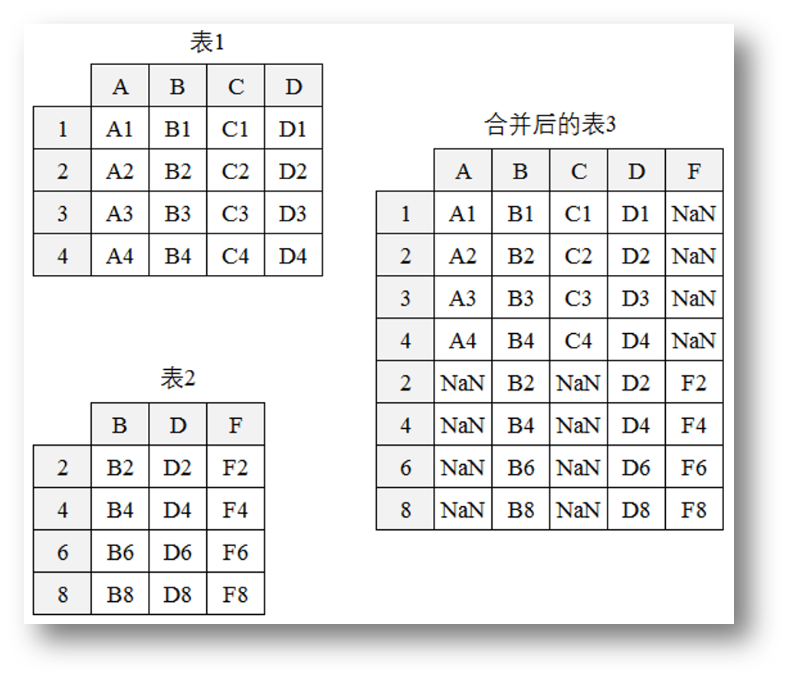
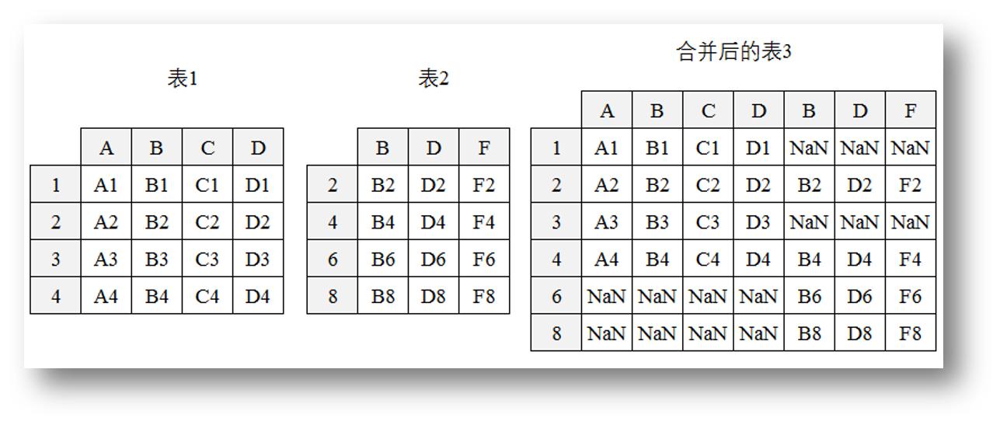
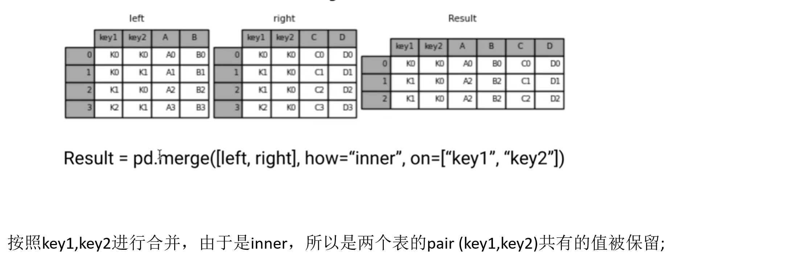
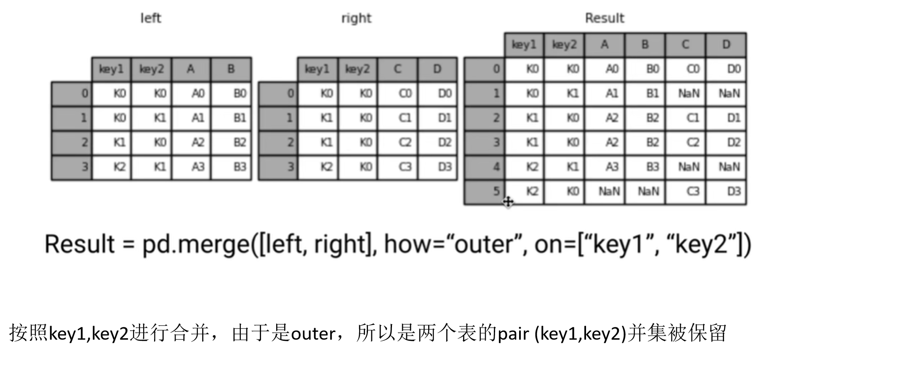
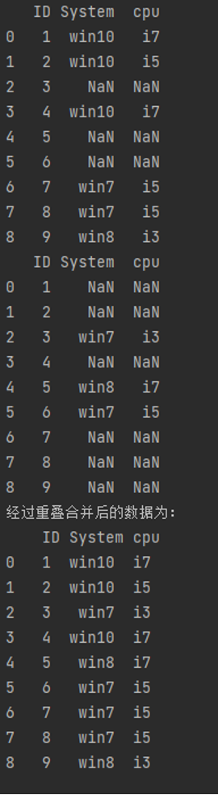
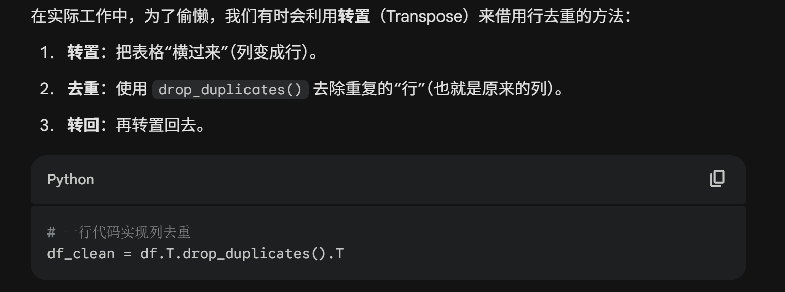
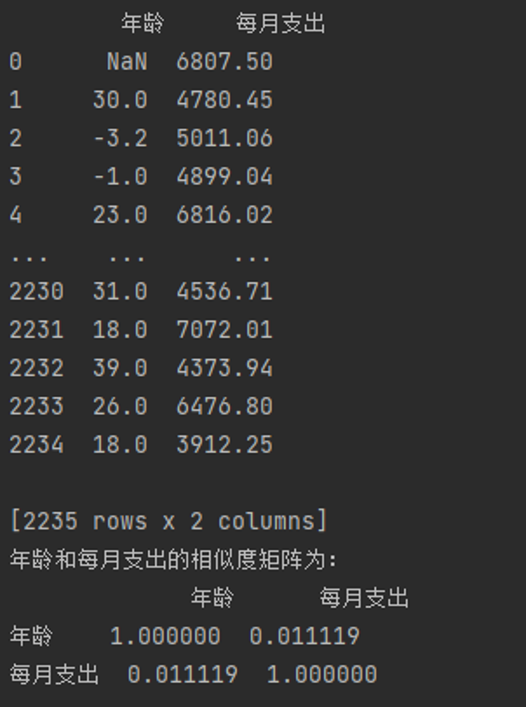
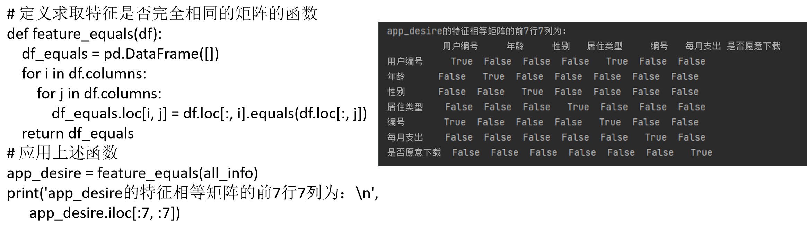
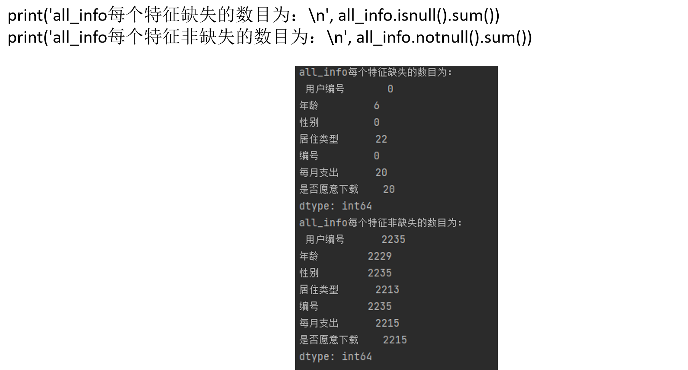
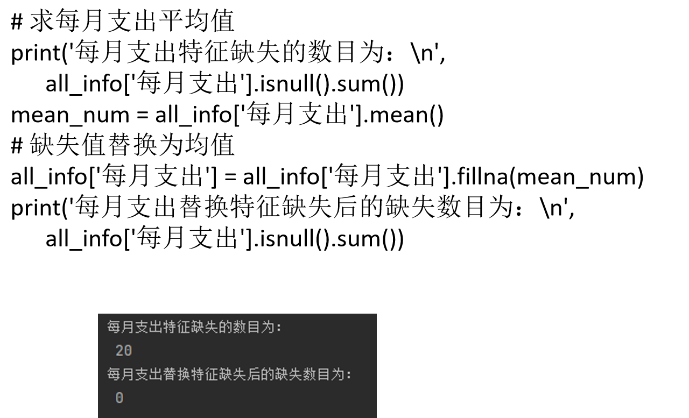

# 数据预处理

## 数据合并

### 堆叠合并（Stacking）

```python
pd.concat(objs, axis=0, join="outer")
```

- 纵向堆叠（`axis=0`）：按列对齐，将不同行索引的表纵向合并。
- 横向堆叠（`axis=1`）：按行对齐，将不同列名称的表横向合并。
- `join="inner"`：只返回索引的重叠部分。
- `join="outer"`：返回索引并集，缺失部分填充空值。





```python
# 取出 user_all_info 前 500 行
df3 = user_all_info.iloc[:500, :]

# 取出第 500 行后的数据
df4 = user_all_info.iloc[500:, :]

print(df3)
print(df4)
print("df3 的大小为 %s，df4 的大小为 %s" % (df3.shape, df4.shape))

print(
    "外连接纵向合并后的数据框大小为：",
    pd.concat([df3, df4], axis=0, join="outer").shape,
)
print(
    "内连接纵向合并后的数据框大小为：",
    pd.concat([df3, df4], axis=0, join="inner").shape,
)
```

### 主键合并（Merging）

主键合并类似 SQL 中的 JOIN，通过一个或多个主键连接相符的行。

```python
pd.merge(left, right, how="inner", on=None)
```

`how` 支持 `left`、`right`、`inner` 和 `outer`。





### 重叠合并（Combining）

当两份数据的内容几乎一致，但某些特征分别在不同表中缺失时，可以使用重叠合并：

```python
df1.combine_first(df2)
```

```python
import numpy as np
import pandas as pd

dict1 = {
    "ID": [1, 2, 3, 4, 5, 6, 7, 8, 9],
    "System": [
        "win10", "win10", np.nan, "win10", np.nan,
        np.nan, "win7", "win7", "win8",
    ],
    "cpu": [
        "i7", "i5", np.nan, "i7", np.nan,
        np.nan, "i5", "i5", "i3",
    ],
}
dict2 = {
    "ID": [1, 2, 3, 4, 5, 6, 7, 8, 9],
    "System": [
        np.nan, np.nan, "win7", np.nan, "win8",
        "win7", np.nan, np.nan, np.nan,
    ],
    "cpu": [
        np.nan, np.nan, "i3", np.nan, "i7",
        "i5", np.nan, np.nan, np.nan,
    ],
}

df1 = pd.DataFrame(dict1)
df2 = pd.DataFrame(dict2)
print("经过重叠合并后的数据为：\n", df1.combine_first(df2))
```



## 数据清洗

### 重复值处理

#### 记录重复（行重复）

```python
pandas.DataFrame.drop_duplicates(
    subset=None,
    keep="first",
    inplace=False,
    ignore_index=False,
)
```

- `subset`：用于判断是否重复的列。
- `keep`：去重时保留哪一个重复数据，默认为 `"first"`。
- `inplace`：是否直接在原表上操作，默认为 `False`。
- `ignore_index`：是否忽略索引，默认为 `False`。

```python
import pandas as pd

all_info = pd.read_csv("./data/user_all_info.csv")
print("去重前的形状：", all_info.shape)

shape_det = all_info.drop_duplicates(
    subset=["用户编号", "编号"]
).shape

print("去重后的形状：", shape_det)
```

#### 特征重复（列重复）

1. 计算两两特征之间的相似度矩阵。
2. 如果两个特征的相似度为 `1`，进一步判断是否重复，并删除其中一个。

可以使用 `corr()` 计算 Pearson、Kendall 等相关系数：



```python
print(all_info[["年龄", "每月支出"]])
corr_det = all_info[["年龄", "每月支出"]].corr("kendall")
print("相似度矩阵为：\n", corr_det)
```



也可以使用 `equals()` 判断两个 Series 是否完全相同：



### 缺失值处理

#### 识别缺失值

- `isnull()`：判断是否为缺失值。
- `notnull()`：判断是否为非缺失值。
- 结合 `sum()` 可以统计缺失值的分布和数量。



#### 删除法

使用 `dropna()`：

- `axis=0` 删除行，`axis=1` 删除列。
- `how="any"` 表示存在缺失值就删除，`how="all"` 表示全部缺失才删除。
- 方法简单，但会减少样本量。


#### 替换法

使用 `fillna()`：

- 数值型特征通常用均值、中位数或众数等统计量替换。
- 类别型特征通常使用众数替换。



#### 插值法

- **线性插值**：根据已知值建立线性方程并求得缺失值。
- **多项式插值**：用已知值拟合多项式，再用多项式求解缺失值；常见方法包括拉格朗日插值和牛顿插值。
- **样条插值**：使用分段多项式构造光滑曲线，使相邻多项式及其导数在连接处连续。

### 异常值检测

#### 3σ 原则（拉依达准则）

适用于正态分布数据，将超出 $(\mu - 3\sigma, \mu + 3\sigma)$ 范围的数据视为异常值，其出现概率小于约 `0.3%`。


#### 箱线图分析

把小于 $Q_L - 1.5IQR$ 或大于 $Q_U + 1.5IQR$ 的值视为异常值。

- $Q_L$、$Q_U$ 分别为下四分位数和上四分位数。
- $IQR = Q_U - Q_L$。

## 数据标准化

| 方法 | 公式 | 特点 |
| --- | --- | --- |
| 离差标准化（Min-Max） | $x' = \frac{x-min}{max-min}$ | 映射到 $[0,1]$，简单，但受离群值影响较大 |
| 标准差标准化（Z-Score） | $x' = \frac{x-\mu}{\sigma}$ | 均值为 0、标准差为 1，广泛使用 |
| 小数定标标准化 | $x' = \frac{x}{10^k}$ | 通过移动小数点位置映射到 $[-1,1]$ |

## 数据转换

### 类别型数据处理

- 背景：许多算法要求输入数值型数据，不能直接处理类别字符串。
- 方法：使用 `pd.get_dummies()` 进行 One-Hot 编码。
- 效果：把含有 $m$ 个类别值的特征转换为 $m$ 个二元特征（稀疏矩阵），起到扩充特征的作用。

### 连续型数据离散化

1. **等宽法**
   - 使用 `pd.cut()`，把值域划分为宽度相同的区间。
   - 对分布不均匀的数据效果较差。
2. **等频法**
   - 把数量相同的记录放入每个区间，缓解类别分布不均匀问题。
3. **聚类分析法**
   - 使用 K-Means 等算法聚类，能够反映数据分布，但需要指定簇数。

<!-- learning-journey:update-history:start -->
## 更新记录

| 日期 | 类型 | 说明 |
| --- | --- | --- |
| 2026-07-28 | 首次发布 | 从语雀整理并发布到学习记录仓库 |
<!-- learning-journey:update-history:end -->
