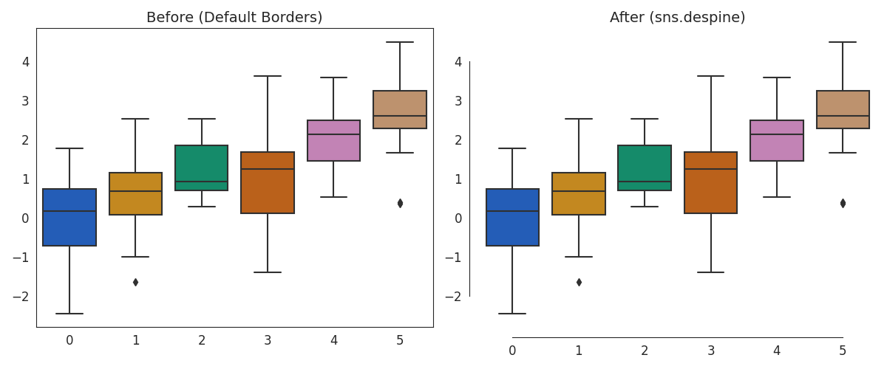
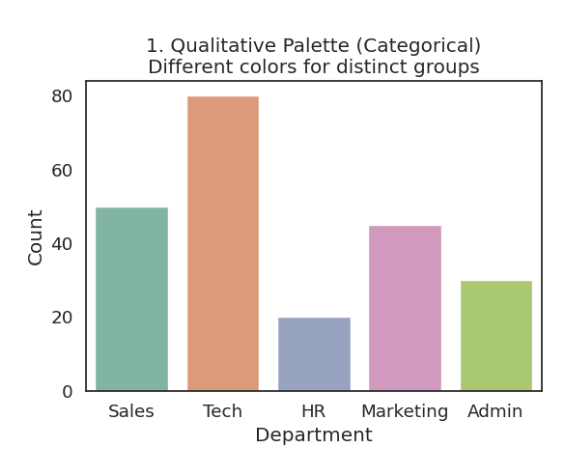
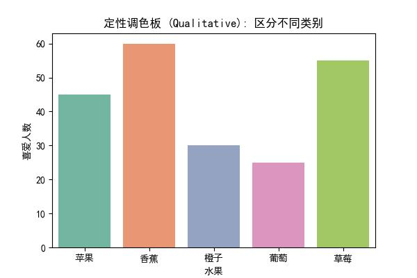
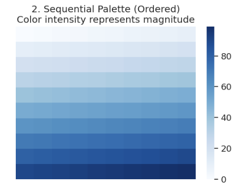
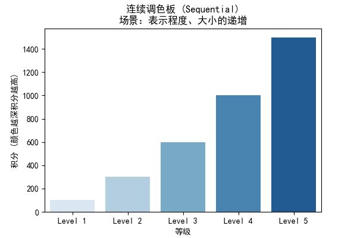
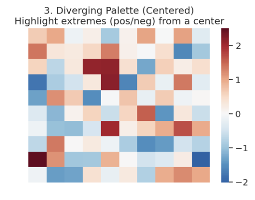
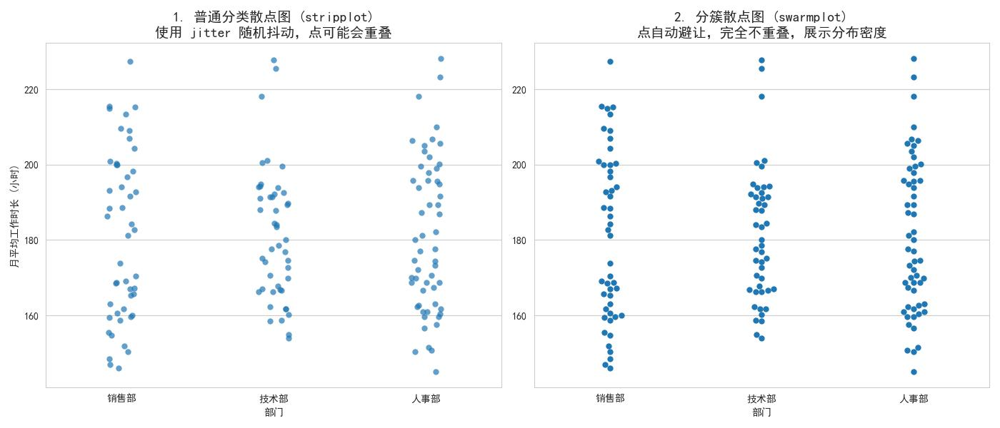

# Seaborn 高级数据可视化

+ Seaborn 是在 Matplotlib 基础上开发的高级可视化库
+ Seaborn 高级封装，代码简洁，图像美观，但定制化能力较弱
+ 引入：`import seaborn as sns`

# 设置绘图风格
## 预设背景主题：
+ `darkgrid`：灰色背景 + 白网格（适合查阅数值）
+ `whitegrid`：白色背景 + 黑网格（适合查阅数值）
+ `dark`：仅灰色背景（线条清晰）
+ `white`：仅白色背景（线条清晰）
+ `ticks`：坐标轴带刻度（突显坐标轴结构）

### 语法：
```python
sns.set_style("darkgrid")
# 或者使用上下文管理器临时修改
with sns.axes_style("white"):
    sns.lineplot(...)
```

## 预设图形元素主题：
+ `paper`：论文报告
+ `notebook`：默认，适合电脑屏幕
+ `talk`：演讲幻灯片
+ `poster`：海报打印

### 语法：
`sns.set_context("talk", font_scale=1.1)`

## 边框控制：
**边框控制 (**`**despine**`**)** 用于移除图形的边框或调节边框的位置、长短，让图形更简洁

### 语法：
`sns.despine(fig=, ax=, top=, right=, left=, bottom=, offset=, trim=)`

### 参数：
+ `fig`,`ax`：指定画布和图像
+ `top`, `right`, `left`, `bottom` (默认为 `True` 移除上方和右方边框)
+ `offset`：表示边框与轴的距离
+ `trim`： 如果为 True，则限制轴线范围，使其不超过数据刻度的范围



# seaborn 调色板
## 定性调色板
### **适用场景**：
 没有顺序之分的数据，只强调不同 （如国家、性别），默认颜色周期将更改为一组10种颜色



### 方法：
+ `sns.color_palette()`：默认 10 色循环
+ `hls` / `husl`：圆形颜色系统，亮度/饱和度均匀
+ `xkcd`：使用颜色名称自定义调色盘（如` 'windows blue'`）

### 案例：
```python
import numpy as np
import pandas as pd
import matplotlib.pyplot as plt
import seaborn as sns

plt.rcParams['font.sans-serif'] = 'SimHei'
plt.rcParams['axes.unicode_minus'] = False  # 设置正常显示符号

# 1. 准备数据：典型的分类数据
df = pd.DataFrame({
    '水果': ['苹果', '香蕉', '橙子', '葡萄', '草莓'],
    '喜爱人数': [45, 60, 30, 25, 55]
})

# 2. 绘图
plt.figure(figsize=(6, 4))

# 关键点：palette='Set2'
# 'Set2', 'Set1', 'Paired', 'Pastel1' 都是经典的定性调色板
sns.barplot(x='水果', y='喜爱人数', data=df, palette='Set2')

plt.title('定性调色板 (Qualitative): 区分不同类别')
plt.savefig("test1.jpg")
plt.show()
```



## 连续调色板
### 适用场景：
数据有顺序（从低到高，从大到小），颜色渐变



### 案例：
```python
import numpy as np
import pandas as pd
import matplotlib.pyplot as plt
import seaborn as sns

plt.rcParams['font.sans-serif'] = 'SimHei'
plt.rcParams['axes.unicode_minus'] = False  # 设置正常显示符号

# 1. 准备数据：
data_seq = pd.DataFrame({
    '等级': ['Level 1', 'Level 2', 'Level 3', 'Level 4', 'Level 5'],
    '积分': [100, 300, 600, 1000, 1500]
})


# 2. 绘图
plt.figure(figsize=(6, 4))

# 因为数据本身是有序的，Seaborn 会自动按顺序赋予从浅到深的蓝色
sns.barplot(x='等级', y='积分', data=data_seq, palette="Blues")

plt.title('连续调色板 (Sequential)\n场景：表示程度、大小的递增')
plt.ylabel("积分 (颜色越深积分越高)")
plt.savefig("test2.jpg")
plt.show()
```



## 发散调色板
### 适用场景：
数据有中间值（如 0 或 平均值），两端极值重要（如相关系数 -1 到 1）



# Seaborn 高级图像绘制：
## 热力图的绘制
通过颜色深浅展示矩阵数据（常用于相关系数矩阵）

### 语法：
`sns.heatmap(data, ……)`

### 案例：
```python
#
boston = pd.read_csv('./data/boston_house_prices.csv', encoding='gbk')
plt.rcParams['axes.unicode_minus'] = False
corr = boston.corr()  # 特征的相关系数矩阵
sns.heatmap(corr)
plt.title('特征矩阵热力图')
plt.show()

#
plt.figure(figsize=(10, 10))
sns.heatmap(corr, annot=True, fmt='.2f')
plt.title('特征矩阵热力图')
plt.show()
```

## 分类散点图的绘制
当 X 轴或 Y 轴是分类变量时使用



### 语法：
+ 普通分类散点图：`sns.stripplot()`
+ 分簇散点图（保证每一个点都不会重叠）：`sns.swarmplot()`

### 案例：
```python
#
# 提取离职为1的数据
hr1 = hr.iloc[hr['离职'].values==1, :]
plt.figure(figsize=(10, 5))
plt.subplot(121)
plt.xticks(rotation=70)
sns.stripplot(x='部门', y='每月平均工作小时数（小时）', data=hr1)  # 默认添加随机噪声
plt.title('默认随机噪声抖动')
plt.subplot(122)
plt.xticks(rotation=70)
sns.stripplot(x='部门', y='每月平均工作小时数（小时）',
                 data=hr1, jitter=False)  # 不添加随机噪声
plt.title('无随机噪声抖动')
plt.show()


#
sns.swarmplot(x='部门', y='每月平均工作小时数（小时）',
                 hue='5年内升职', data=hr2)
plt.xticks(rotation=30)
plt.title('不同部门的平均每月工作时长')
plt.show()
```

## 线性回归拟合图的绘制
展示两个变量的散点图并拟合一条回归直线，观察线性关系

### 语法：
`sns.regplot(x="", y="", data=...)`

+ `x`：横轴变量的数据列名
+ `y`：纵轴变量的数据列名

### 案例：
```python
#
fig, axes = plt.subplots(1, 2, figsize=(8, 4))
axes[0].set_title('修改前的线性回归拟合图')
axes[1].set_title('修改后的线性回归拟合图')
sns.regplot(x='房间数（间）', y='房屋价格（美元）', data=boston, ax=axes[0])
sns.regplot(x='房间数（间）', y='房屋价格（美元）', data=boston, ci=50, ax=axes[1])
plt.show()

```

<!-- learning-journey:update-history:start -->
## 更新记录

| 日期 | 类型 | 说明 |
| --- | --- | --- |
| 2026-07-28 | 首次发布 | 从语雀整理并发布到学习记录仓库 |
<!-- learning-journey:update-history:end -->
