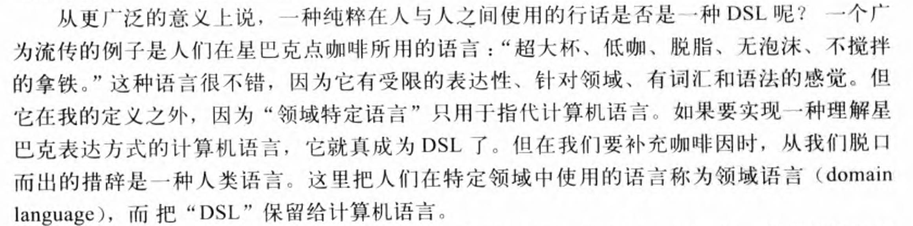
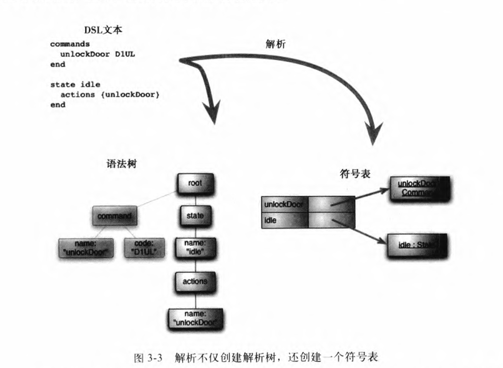
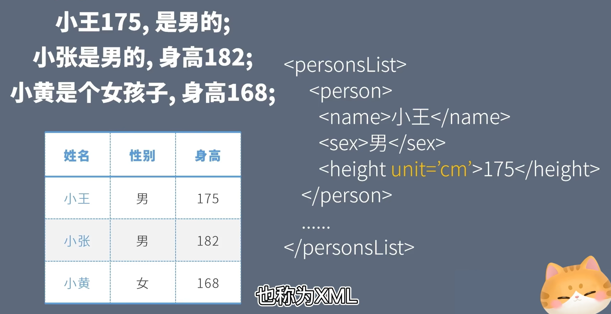
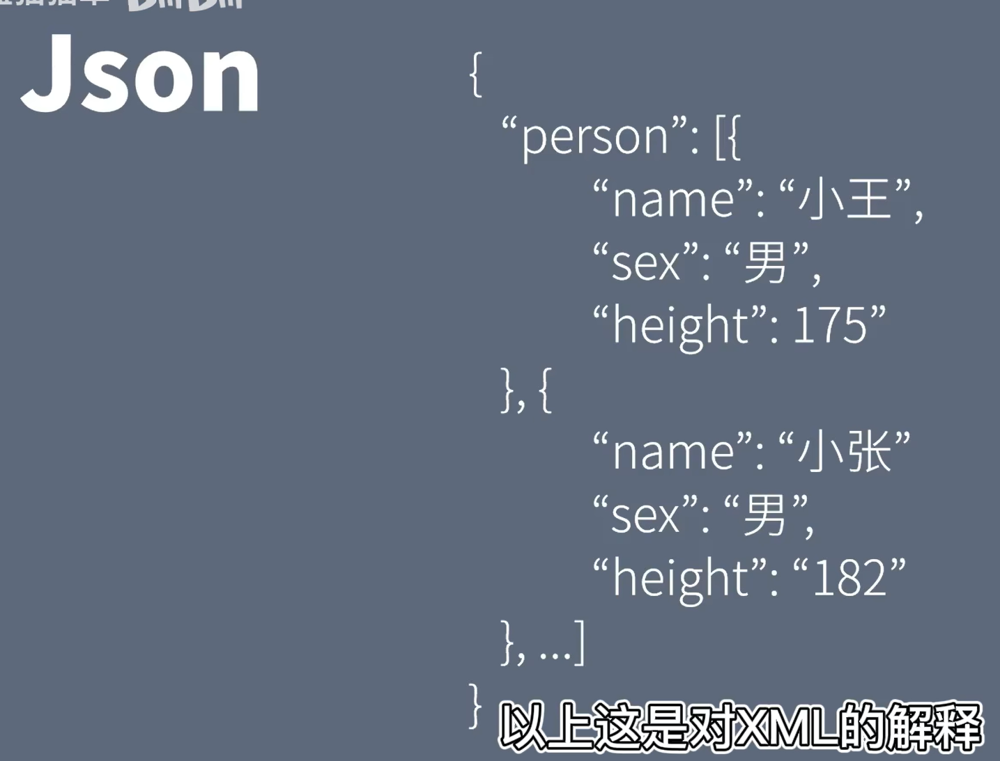

# 领域特定语言 DSL

## DSL 概述
### 定义：
+ Domain-Specific Language ：为特定领域而设计的编程语言
+ 举例：Word、Excel——办公领域的DSL
        * 文字处理编程语言——>自然语言——>可视化——>word
+ DSL允许解决方案以问题域的惯用语和抽象层次来表达，从而使得领域专家能够理解、验证、修改甚至开发DSL程序

### DSL 特点
+ 属于计算机程序设计语言
+ 语言性：具备连贯的表达能力
+ 表达受限性：DSL无法构建一个完整的系统，只对于系统某一方面的功能发挥作用
+ 针对领域性：是表达受限性的结果，只针对某一特定的领域

### DSL 作用
+ 不同功能代码封装，提高代码复用，**提高开发效率**
+ 代码更接近业务逻辑，降低错误率，贴近领域专家的思维方式，**降低沟通成本**

### DSL 分类
#### 外部 DSL（External DSL）
+ 在主程序语言之外，定制一种独立的领域专用的语言
+ 需要专门的解释器和工具
+ 如SQL、XML等

#### 内部 DSL（Internal DSL）
+ 利用现有的编程语言的语法特性，在该语言内部，通过闭包、链式调用等特性，以某种特定领域风格进行组织的编写程序的方法
+ Lisp 写程序就是创建和使用 DSL 的过程
+ 又被称为：**嵌入式 DSL（Embedded DSL）**

### 连贯接口（Fluent Interface）
+ 说明内部 DSL 实质上是一种特殊形式的 API（方法调用）

#### 语言工作台
+ 专用于定义和构建DSL的IDE

### DSL设计方法
> DSL设计是一个迭代的过程，需要不断优化和调整
>

1. 识别问题域：明确DSL的应用范围
2. 收集领域知识：深入了解领域内的概念、规则、流程等
3. 抽象核心概念：将领域知识转化为DSL的基本元素：名词、动词
4. 设计DSL语法：根据基本元素定义DSL语法规则、表达方式
5. 构建语义库：实现DSL的核心功能，封装函数，把核心功能用代码实现
6. 设计编译器/解释器：将DSL代码转换为可执行编程代码
7. 编写DSL程序测试

### 语义模型
#### 语义模型的定义：
+ 是符合对应DSL模式的特定实例的一种表现形式，是由DSL组装的框架
+ 语义模型是领域模型（Domain Model）的子集

#### 语义模型的优点：
+ 使得**DSL语义测试**和**DSL解析测试**分离：可以通过直接**组装语义模型**来测试DSL语义，通过测试**解析器生成的语义模型是否正确**来测试解析器
+ 提高了**解析**和**执行**的灵活性：语义模型可以直接执行，也可以基于语义模型进行代码生成后，以生成代码的形式执行
+ 将**代码生成**与**解析器**分离：代码生成只需要基于语义模型做即可，无需考虑不同解析器；同样，解析器也支持多个代码生成
+

### 文法、语法、语义
> 文法是规则，语法是结构，语义是意义
>

#### 文法（Grammar）：
+ 描述如何将文本流转化成语法树的一组规则
+ ANTLR的`.g4`文件即是文法规则的定义文件
+ 解析器会根据文法的规定，将文本识别为语法树结构

##### 正则文法、上下文无关文法、上下文相关文法：
+ <u>所有的正则文法都是上下文无关的，所有的上下文无关文法都是上下文相关的</u>
+ **正则文法**无法处理**嵌套元素**，用**有限状态器**去实现
+ **上下文无关文法**可由**下推自动机**描述，常用于表达编程语言的语法结构；“变量是否必须先声明后使用”属于语言的语义规则，不是上下文无关文法本身的限制

##### 解析表达式文法（Parsing Expression Grammar，PEG）：
+ 一种新兴的文法，其表现优异于上下文无关文法
+ 解析表达式文法（PEG）

#### 语法（Syntax）：
+ 按照文法规则生成的具体结构形式

#### 语义（Semantics）：
+ 语法结构的实际意义

#### 三者关系：

### DSL解析器（Parser）
+ 作用：根据 DSL 定义，将 DSL 文本转化为计算机可理解的语义模型

#### 类型1：自顶向下的解析器（LL解析器）
#### 类型2：自底向上的解析器（LR解析器）
### DSL生成器（Generator）
+ 作用：根据 DSL 解析器产出的结果，生成可执行的目标代码，如 C/C++

### 语法树
### 符号表
+ 本质上是一个键值对字典
+ 键是标识符，值是命令的对象

## 外部DSL设计
### 语法分析策略
#### 定义：
**语法分析**是指解析外部DSL文本时，将文本分解为某种规则规定的结构的过程

#### 处理策略：语法指导翻译
1. **词法分析（扫描或标记解释）：**

将输入的文本与规则中的词法（并非规则）相匹配，创建其对应词法类型的标记，最后将文本转化为一串具有两个属性：类型和内容的token

2. **语法分析（解析）：**

根据文法规则将这串token组织成一棵语法树

#### 常用实现方式和工具：
+ **解析器生成器方式**：将BNF当作DSL来操作，用这种DSL来编写文法，解析器生成器则负责生成解析器
+ **ANTLR 解析器生成器：**一个开源的强大的递归下降法语法解析器

### 输出生成策略：
#### 定义：
**输出生成**是指解析某些生成后，应当输出的内容

#### 输出生成内容：语义模型
#### 处理策略：“树的构建”
1. 解析输入文本，构造出一颗包含<u>文本结构</u>的**语法树**，同时用**符号表**来处理语法树中各个部分的<u>交叉引用</u>
2. <u>遍历语法树，输出生成语义模型</u>

### 代码生成
#### 必要性：
1. 语义模型生成后，一般来说执行语义模型即可实现DSL指定的行为，但在执行环境差异的情况下，代码生成可以使得在任何环境下都可以运行DSL指定的行为

+ DSL的实现包括两个环境：DSL处理器和目标环境
        * DSL处理器：解析器、语义模型、代码生成器之所在
        * 目标环境：执行DSL指定行为的环境
+ 在目标环境下可能无法构建DSL处理器，故代码生成的意义在于将目标环境同DSL处理器分离开

2. 利用编译器的检查和IDE的支持

## 其他相关概念
### 形式化：
+ 把某个领域的专业知识（金融规则等等）转化成计算机能理解的精确模型

### XML & JSON
+ 作用：将自然语言组织成计算机能理解的结构化数据

#### XML：
+  **<u>Extensible Markup Language</u>**  ：可拓展标记语言
+ **作用：**通过标签组织数据为机器可理解的形式，进而实现数据的存储与传输
+ XML的标签并没有被预定义，可以定义为任何内容（甚至是中文）：
`<身高 单位 = 'cm'> 183 </身高>`
+ **应用：**
        * 配置文件
        * 程序间数据传输
        * 小型数据库
+ **语法：**

#### JSON：
+ 作用和应用与XML相同，但更加常用，更加精简
+ 语法：

<!-- learning-journey:update-history:start -->
## 更新记录

| 日期 | 类型 | 说明 |
| --- | --- | --- |
| 2026-07-24 | 首次发布 | 从语雀整理并发布到学习记录仓库 |
<!-- learning-journey:update-history:end -->
