# Linux 终端与命令

> 学习网站：
>
> [https://labex.io/zh/labs/linux-basic-files-operations-270248?course=quick-start-with-linux](https://labex.io/zh/labs/linux-basic-files-operations-270248?course=quick-start-with-linux)
>
> [https://labex.io/zh/labs/linux-linux-ls-command-content-listing-219205?course=linux-basic-commands-practice-online](https://labex.io/zh/labs/linux-linux-ls-command-content-listing-219205?course=linux-basic-commands-practice-online)
>

# 基础内容
- Linux 区分大小写
- `~`：用户的家目录
- `sudo`：临时以 root 管理员权限运行命令，命令需要提权时使用
- `sudo`组为管理员组，可以进行系统管理、安装更新、配置修改、用户管理
- `#!`的作用：位于**脚本文件**第一行，用于告诉系统使用`#!` 后面指定的程序来解释和执行这个文件

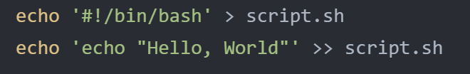

# 常见命令
## 基础系统命令
### `echo`：打印后续内容
- `echo "打印的文本字符串"`
- `echo ~`：打印用户的主目录
- `echo "文本内容" > 文件名`：`>` 符号将 `echo` 的输出重定向到一个文件中。如果文件不存在，则会创建它；如果文件已存在，其内容会被替换
- `echo "文本内容" >> 文件名`：`>>`符号表示将输出追加到文件末尾，而不覆盖

### `whoami`：获取当前用户名
### `id`：获取用户的详情信息
- `id`：获取当前用户的详情信息
- `id <其他用户名>`：获取其他用户的详情信息 / `id root`：系统管理员的详情信息
- 
  - uid：用户 ID
  - gid：主 组 ID
  - groups：所属所有组与 ID
- `id -un`：请求用户的特定信息；`-u`为只显示 uid，`-un`为显示 uid 的名称

### `man <命令名称>`（manual）：显示命令的官方手册
## 文件系统操作
### `pwd`（print working directory）：打印当前的工作目录，即显示在文件系统中的当前位置
- `pwd -L`：打印当前逻辑路径
- `pwd -P`：打印当前物理路径，显示实际的磁盘目录

---

### `ls`：查看当前目录的内容
- `ls ~`：查看主目录内容
- `ls <目录名>`：查看当前目录下的某个目录的内容
- `ls -l`：查看当前目录内容的长格式列表（详细信息——文件权限、所有者、大小、修改日期、文件名）
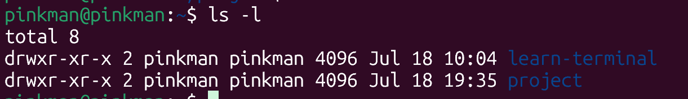
- `ls -a`：查看当前目录的全部内容（隐藏文件也会显示）
- `ls -al <目录名>`：查看某个目录的全部长格式列表
- `ls -R`：递归地列出当前目录全部内容（全部子目录内容都会被列出）
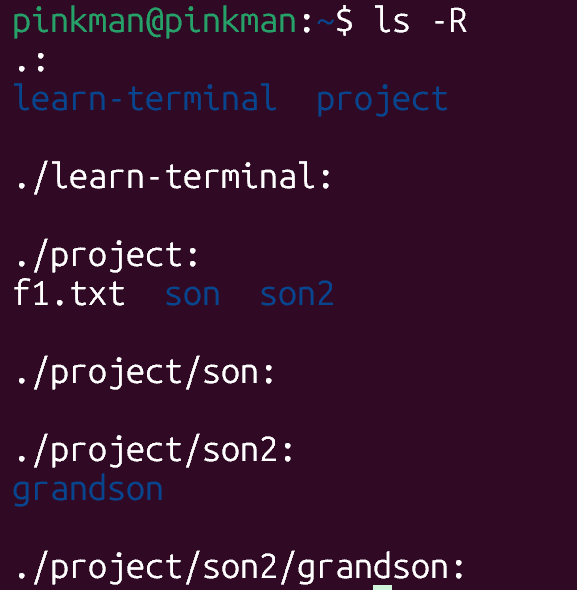
- `ls -d`：列出目录本身信息，而不是目录内容信息
- `ls -lh`（human-readable）：以长格式显示目录内容，并将文件大小显示为更易读的 KB、MB 等形式
- 排序方式：`ls -lt`；
  - `t`：按修改时间排序
  - `S`：按文件大小排序
  - `X`：按文件扩展名字典序排序
  - `v`：按文件版本排序
  - `r`：排序反转
- `ls | cowsay`：让一头牛说出目录内容（需要安装，娱乐向）

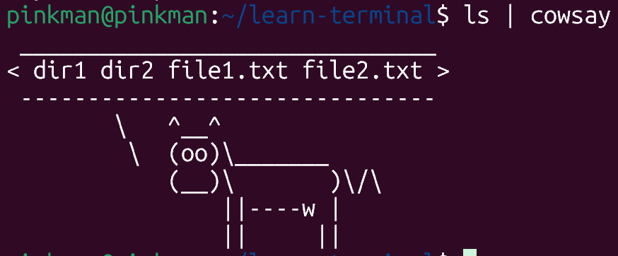

### `tree <目录名>`：以树状格式显示目录结构
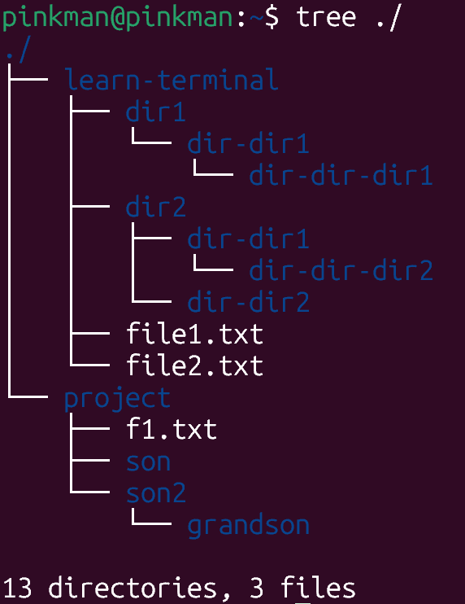

- `tree -p <目录名>`：显示更多细节

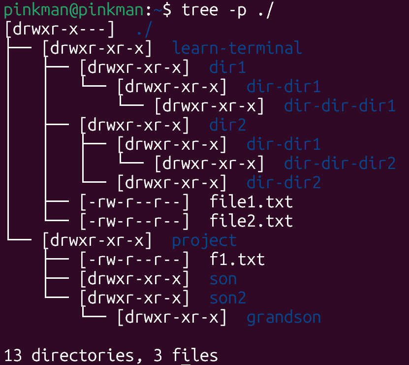

---

### `cd`：进入某个目录
- 可跟相对路径或绝对路径：`cd project`/`cd /home/pinkman/project`
- `cd ..`：向上移动一级到父目录
- `cd ~`：回到家目录
- `cd -`：快捷方式——回到上一个刚才处于的目录

### `touch`：创建文件
- `touch <文件名.扩展名>`：创建空文件，若文件已存在，会更新时间戳而不更新内容
- `touch .<文件名.扩展名>`：创建隐藏文件，在 linux 中，以`.`开头的文件或文件夹被视为隐藏


### `mkdir <目录名>`：创建目录
- `mkdir -p <父目录/子目录>`：创建父目录及其子目录；没有`-p`时，若指定的父目录不存在会失败
- `mkdir -m 700 <目录路径>`：创建并设置目录权限
- `mkdir -v <目录路径>`：创建目录并详细地打印创建消息


### `cp`：复制操作
- 当前目录下复制粘贴文件：`cp <文件名> <新文件名>`
- 复制文件到某个目录：`cp <文件名> <目录名>/`
- 当前目录下复制粘贴目录：`cp -r <目录名> <新目录名>`；`-r`表示递归地，复制目录时必须带此选项


### `mv`：移动和重命名操作
- `mv <文件名/目录名> <新文件名/目录名>`：重命名文件/目录
- `mv <文件名> <目录名>/`：将文件移动到某个目录下
- `mv 目录名/文件名 ./新文件名`：将文件从目录中移出并完成重命名；
`mv testdir/newname.txt ./original_file1.txt`


### `rm`：删除操作
- `rm <文件名>`：删除文件
- `rm -i <文件名>`：交互式删除文件（更安全），系统会询问是否确定删除，输入`y`确认，其他均不删除
- `rmdir <空目录名>`：删除空目录，非空无法删除
- `rm -r <目录名>`：删除非空目录（使用递归的方式）
- `rm -f <文件名>`：强制删除
- `rm -rf <目录名>`：递归强制删除某个目录，极其危险！！`rm -rf /`：删除整个系统

## 文件内容查看
### `cat <文件名>`：打印文件内容或拼接文章
- `cat -n <文件名>`：带编号地打印文件内容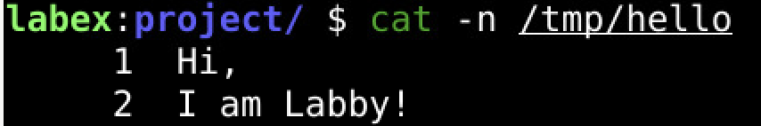
- `cat -E <文件名>`：在每个行尾都显示`$`符号，更清晰地看到每行在哪里结束
- `cat 文件1 文件2 > 文件3`：拼接两个文件内容到第三个文件中
- 使用 heredoc 将多行内容写入文件：

  ```bash
  cat > 文件名 <<'EOF'
  多行文本内容
  EOF
  ```

### `nl <文件名>`：对文件有内容的行进行编号
- `nl -b a <文件名>`：对包括空白行在内的全部文件内容进行编号（`-b`：控制正文部分的行号标记，`a`为所有行标号）
- `nl -b p'<正则表达式>' <文件名>`：特定形式标号
- `nl -n rz <文件名>`：将标号右对齐并加入前导零（`-n`：控制标号格式，`r`：右对齐，默认操作；`z`：加入前导零）
- `nl -s ': ' <文件名>`：在行号和内容之间加入分隔符`: `
- `nl -w 3 <文件名>`：设置行号的字符长度为 3
- `nl -v 5 <文件名>`：从 5 开始编号
- `nl -i 2 <文件名>`：行号增量为 2

### `more <文件名>`：滚动方式查看文件内容——适用于查看大型文件
- 操作命令：`空格键`：下一页；`回车键`：下一行；`b`：上一页；`=`：显示当前所处行号；`/`：文本搜索；`q`：退出 more 模式
- `more +100 <文件名>`：从第 100 行开始滚动查看文件
- `more -5 <文件名>`：一次只显示 5 行
- `more +/'xxxx' <文件名>`：从文件中 xxxx 位置的附近打开

### `less <文件名>`：更现代的分页文件查看工具
- 操作命令：`空格键`：下一页；`b`：上一页；`上/下方向`：上/下一行；
`shift + g`：跳转到末尾；`g`：跳转到开头；`q`：退出
- 文本查找：`/`——`n`：移动到下一个出现该文本的位置；`shift + n`：移动到上一个；
- `less -N <文件名>`：显示行号
- `less +/ERROR:.Database <文件名>`：打开文件并立即跳转到包含「ERROR:」后跟任意字符再接「Database」的第一行

### `head`：查看文件头几行
- `head -n1 <文件名>`：打印文件的前 1 行，`-n`后面是几就打印前几行，没有`-n`默认打印前十行
- `head -c1 <文件名>`：打印文件的前 1 个字节

### `tail`：查看文件末尾几行
- `tail -n1 <文件名>`&`tail -c1 <文件名>`：打印文件最后几行或几个字节，同上；但文件最后一个字节通常是换行符
- `tail -n +2 <文件名>`：从文件第二行开始输出

### `diff`：比较文件内容差异
- `diff <文件 1> <文件 2>`：比较并查看两个文件内容的差异
- 

  - `1,2 c 1,3`： 第一个文件的第 1～2 行，需要修改（change）成第二个文件的第 1～3 行
- `diff <目录 1> <目录 2>`：比较两个目录的第一层的区别
- `diff -r <目录 1> <目录 2>`：比较两个目录第一层的区别，且递归地比较两个目录名称相同的子目录中的区别
- 

## 文件权限管理
### `chown`（change owner）：管理文件归属权
- `sudo chown <所有者:所属组> <文件名>`：更改文件的所有权
- `sudo chown -R <所有者:所属组> <目录名>`：递归地更改整个目录的所有权，若没有`-R`只会更改目录本身的所有权，而不包括文件

---

### `chmod`（change mode）：管理文件操作权限
- 在 linux 中，文件权限由一系列字母或数字表示

```bash
ls -l example.txt

-rw-rw-r-- 1 root root 0 Jul 29 15:11 example.txt


# 一般权限一共有 10 个字符：----------
# 第一个字符表示类型：- 是普通文件，d 是目录，l 是符号链接
# 接下来三个字符：rw- 代表所有者的权限
# 再接下来三个字符：rw- 代表所属组成员的权限
# 最后三个字符：r-- 代表其他用户的权限
# r 为读权限，w 为写权限，x 为执行权限；- 表示没有对应权限
```

- 数字表示法：`sudo chmod 700 <文件名/目录名>`；`sudo chmod -R 755 <目录名>`

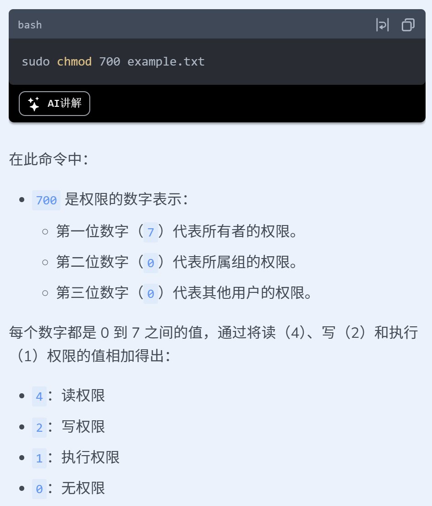

- 符号表示法：`sudo chmod u+x <文件名>`；在`u+x`中：
  - 第一位是操作对象，`u`是所有者、`g`是所属组、`o`是其他用户、`a`是所有人
  - 第二位是具体操作，`+`是添加权限、`-`是删除权限
  - 第三位是具体权限，`rwx`可选

## 用户管理操作
### `useradd`：添加用户
- `sudo useradd -m orangeman`：添加一个用户并为其建立家目录

### `/etc/passwd`：系统中的用户簿，每一行代表一个用户账户
- `sudo grep -w 'joker' /etc/passwd`：查找用户簿中是否有 joker 用户

### `passwd`：设置用户密码
- `sudo passwd <用户名>`：为用户设置密码；Linux 会将加密后的密码存储在一个名为 `/etc/shadow` 的安全文件中
- `sudo passwd -l <用户名>`：禁用该用户的密码认证
- `sudo passwd -u <用户名>`：解锁用户

### `usermod`：修改用户属性
- `sudo usermod -d <目录路径> <用户名>`：为用户修改家目录（`-d`）
- `sudo usermod -s <路径> <用户名>`：为用户修改使用的 shell 程序 (`-s`)
- `sudo usermod -aG <组名> <用户名>`：将用户加入特定组中 (`-aG`)

### `userdel`：删除用户
- `sudo userdel -r bob`：删除用户以及其家目录、邮件池（`-r`）

### `groups <用户名>`：查看用户所属组
### `sudo su - <用户名> `：将当前账户切换到某个用户
### `exit`：登出，返回原用户
## 文件搜索：
### `which`：搜索并定位 Path 环境变量中的命令对应的可执行文件
- `which gcc`：最简单方式，返回的是找到的第一个位置，如`/usr/bin/gcc`
- `which -a python`：查找全局，多个版本全部返回

### `whereis`：定位指定命令的二进制可执行文件、源代码文件、帮助手册文件
- `whereis ls`：基础方式，定位`ls`命令的信息，返回信息演示如下

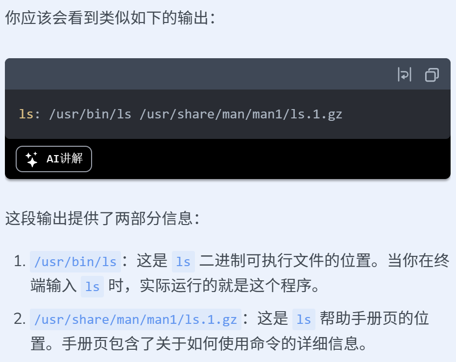

- `whereis -b ls`：`-b` 代表只定位二进制文件，可以用于查询是否安装了某个命令
- `whereis -s ls`：`-s`代表只定位源代码文件
- `whereis -m ls`：`-m`代表只定位手册文件

### `find`：定位文件和目录的工具
- `find . -name "文件名"`：在当前目录中搜索特定文件名的文件路径
（`find .`代表查找的位置，`.`为当前目录）
- `find . -name "*.txt" -o -name "*.log"`：在当前目录中搜索扩展名为 .txt 或 .log 的全部文件（`-o`为 find 命令语法中的 或者）
- `find . -type f -size +1M`：在当前目录中查找所有大于 1 MB 的文件
（`-type f`为只查找普通文件类型，不找目录类型和特殊类型；`+/-/ `可选(不加任何符号即为正好等于)；`M/K/G`可选）
- `find . -type f -mtime -1`：在当前目录中查找在过去 24 小时内被修改过的文件（`-mtime`：以 24h 为单位衡量时间；`-1`：小于 1 个单位的时间）
- `find . -name "*.txt" -exec cat {} \;`：对找到的文件执行命令，如下

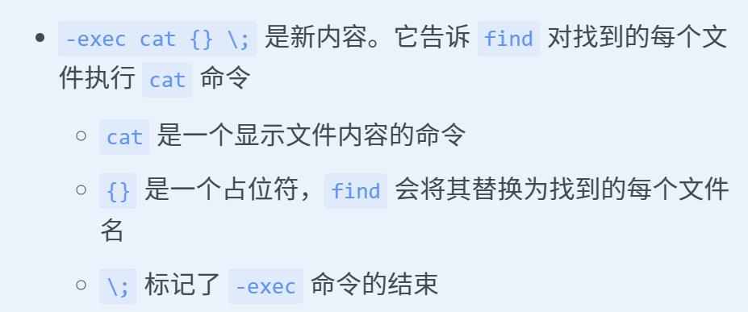

- 其他命令`-user`、`-group`、`-perm`（特定权限）

## 文本处理：
### `grep`：文本搜索工具，用于在文件中搜索指定字符串
- `grep 'abc' <文件名>`：搜索文件名中是否有 abc，如果有则打印该行
- `grep -v "ERROR" logs/server.log`：查看所有不包含 ERROR 的行，
`-v`为反向匹配
- `grep -w 'xxx' <文件名>`：`-w`为精确搜索，仅匹配整个单词，确保搜索到的是精确的`xxx`，而不是`xxxx`
- `grep -c 'ERROR' <文件名>`：`-c`为统计行数
- `grep -i "error" logs/server.log`：`-i`为不区分大小写的搜索
- `grep "database connection failed" logs/*`：使用通配符`*`搜索多个文件
- `grep "2023-[0-9][0-9]-[0-9][0-9]" logs/server.log`：使用正则表达式搜索
- 显示上下文：`grep -B 2 -A 2 "CRITICAL" logs/server.log`：`-B 2`表示显示匹配行之前的两行，`-A 2`显示之后两行
- 其他参数：`-n`：显示匹配行与行号；`-E`：启用扩展正则表达式；`-r/-R`：递归搜索整个目录；`-l`：仅显示包含匹配行的文件名

### `wc`（word count）：文本统计工具
- `wc <文件名>`：不加参数的默认行为为依次输出 行数、单词数、字节数
- `wc -l <文件名>`：统计文件行数
- `wc -w <文件名>`：统计文件单词数
- `wc -m <文件名>`：统计文件字符数
- `wc -c <文件名>`：统计文件字节数
- `wc -L <文件名>`：统计文件最长一行的长度

### `cut`：文本提取工具
> 示例数据

```text
假设文件数据如下：

customers.txt:

ID,	Name,		Age,	Email
1,	John Doe,	25,	john.doe@email.com
2,	Jane Smith,	35,	jane.smith@email.com
3,	Lily Chen,		30,	lily.chen@email.com
4,	Andy Brown,	22,	andy.brown@email.com


books.txt:

ISBN,			Title,				Author,			Price

978-1234567890,	The Great Adventure,	Alice Writer,		19.99

978-2345678901,	Mystery in the Woods,	Bob Author,		24.99

978-3456789012,	Cooking Basics,		Carol Chef,		15.99

978-4567890123,	Science Explained,		David Scientist,	29.99
```

- `cut -d ',' -f 2 customers.txt`：`-d ','`表示使用`,`作为字段分隔符；`-f 2`表示提取每行分隔后的第二个字段

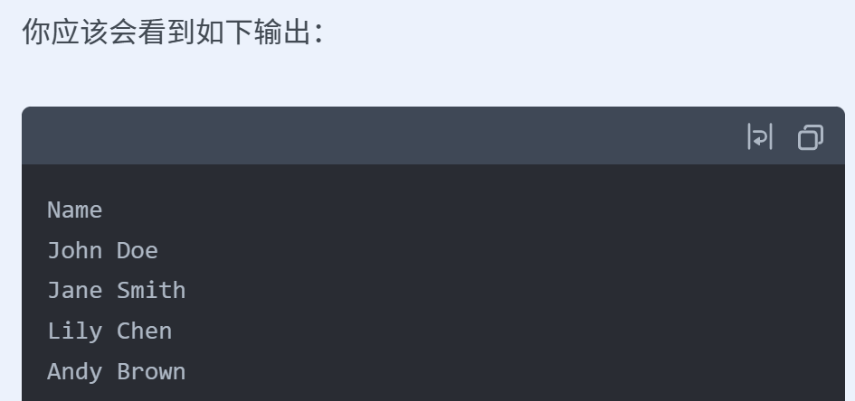

- `cut -d ',' -f 2 customers.txt | tail -n +2`：管道命令，从第二行开始输出以去掉标题字段名
- `cut -d ',' -f 2,3 customers.txt`：提取多个字段
- `cut -d ',' -f 1-3 customers.txt`：提取字段范围（包含边界）
- `cut -c 1-7 books.txt`：`-c`表示按字符提取，该命令意为提取每行的第一个到第七个字符

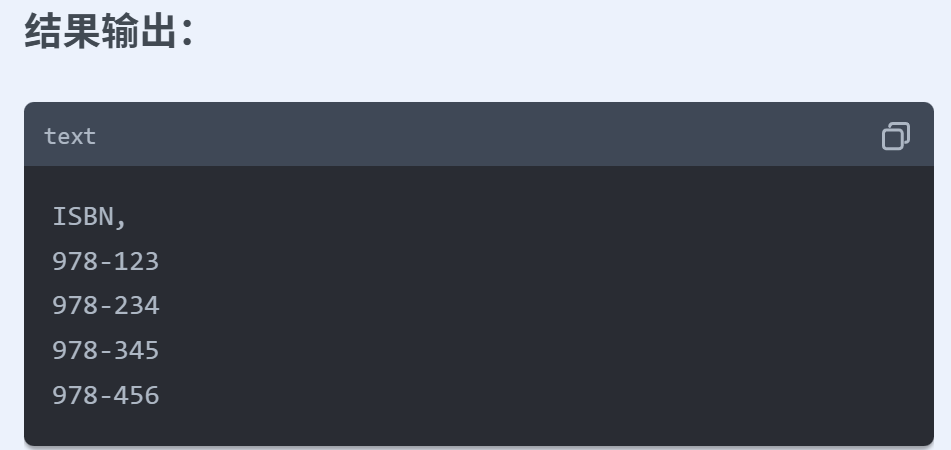

### `sort`：文本排序工具
- `sort <文件名>`：默认按字典序对文件的行进行重新排列
- `sort -u <文件名>`：`-u`表示排序后去重
- `sort -n -t: -k2 <文件名>`：`-n`表示按数值进行排序；`-t:`表示自定义分隔符——字段之间用`:`作为分隔符；`-k2`表示对分隔后的第二个字段作为排序对象进行排序
- `sort -nr -t: -k2 <文件名>`：`-r`表示反向排序
- `sort -t: -k2n -k3nr <文件名>`：多个字段排序；`-k2n`表示对第二个字段按数值排序；`-k3nr`表示对第三个字段按数值反向排序
- 其他选项：`-f`排序时忽略大小写；

### `uniq`：文件去重工具
- `uniq <旧文件> <新文件>`：去重复行后重新保存为新文件
- `uniq -i <旧文件> <新文件>`：去重时忽略大小写
- `uniq -d <旧文件> <新文件>`：仅保留重复行，保存结果到新文件
- `uniq -c <旧文件> <新文件>`：去重并记录重复行数，常用于数据统计


- `uniq -f N`/`uniq -s N`：去重时跳过前 N 个字段 （`f`）/ 字符（`s`）

### `tr`（translate）：字符替换工具
> `tr`不支持直接接受或输出文件，只支持从标准输入中获取数据，向标准输出中输出数据，故常使用管道命令
>

- `cat <文件名> | tr 'a-z' 'A-Z'`：小写转换为大写
- `cat <文件名> | tr -d '[:punct:]'`：删除全部标点符号；`-d`表示删除指定的字符；`[:punct:]`是一个字符集，表示全部标点符号
- `cat <文件名> | tr -cd '[:digit:]'`：删除全部非数字字符；`-c`表示对字符集取补集；`[:digit:]`字符集表示所有数字（0-9）
- `cat <文件名> | tr 'b-zaB-ZA' 'a-zA-Z'`：文件加密，该加密规则为向前推移一位
- `cat <文件名> | tr -s ' '`：压缩重复的空格为一个空格；`-s`表示将后续指定字符的重复项压缩为单个字符

### `join`：文件合并工具
- `join <文件1> <文件2>`：基础操作，每一行拼接（默认去重复列），然后打印
- `join -o 1.2,1.3,2.2,1.1 <文件1> <文件2>`：`-o`为控制输出格式；后续为具体输出内容，顺序为：第一个文件的第二个字段、第一个文件的第三个字段、第二个文件的第二个字段、第一个文件的第一个字段
- `join -a 1 <文件1> <文件2>`：`-a 1`表示第一个文件中不匹配的行也合并进去


- `join -1 3 -2 1 <文件1> <文件2>`：表示将第一个文件的第三个字段与第二个文件的第一个字段作为匹配字段进行合并输出；这允许我们基于任何共同字段合并文件，而不仅仅是第一列。当文件结构各异但共享某些共同信息时，这尤其有用
- 其他选项：`-t`：设置分隔符；`-i`忽略大小写差异；`-e NULL`用 NULL 替代缺失字段

### `xargs`：命令参数传递工具
- `cat fruits.txt | xargs echo`：`xargs`接受`cat`输出的每一行，将每一行都作为一个参数传递给`echo`命令，打印出来
- `cat books.txt | xargs -I {} touch {}.txt`：`-I {}`相等于占位符变量，表示将后续命令中出现的`{}`替换为每个输入的参数
- `cat more_books.txt | xargs -n 2 echo "Processing books:"`：
`-n 2`表示每次命令最多使用 2 个参数，会将输入行分为两个一组，为每组执行`echo`操作
- `cat more_books.txt | xargs -P 3 -I {} process_book.sh {}`：
`-P 3`表示同时并行处理 3 个进程

### `awk`：结构化文本数据处理工具
- `awk '{print $3}' server_logs.txt`：打印每一行的第三个字段
- `awk '{print $3, $5}' server_logs.txt`：打印每一行的第三个字段和第五个字段
- `awk '$4 == "POST" {print $0}' server_logs.txt`：如果某行的第四个字段是`POST`就打印整行内容


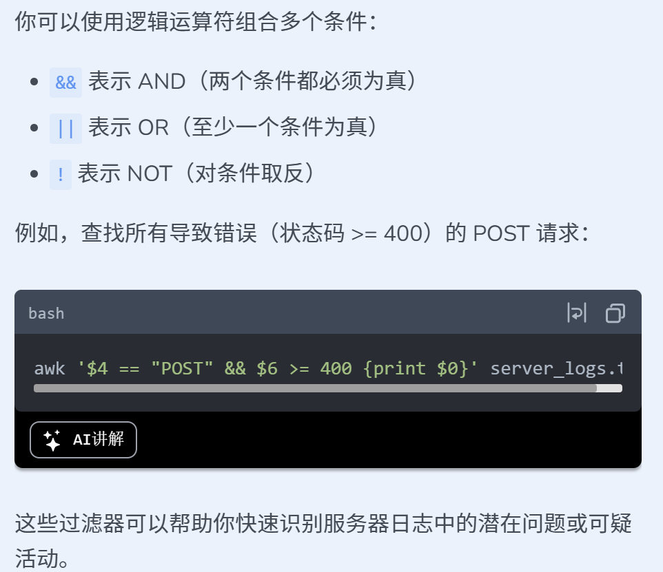

- `awk '{count[$6]++} END {for (code in count) print code, count[code]}' server_logs.txt`：先逐行处理文件，对每行的第六个字段存入数组中，且每次都+1；`END`表示整个文件读取完后进行的操作，这里表示完成统计后执行后续的代码；`for (code in count)`遍历数组；`print code, count[code]`打印数组项和值

## 系统信息命令
### `top`：实时系统监控
- `top`：基础命令，显示系统信息界面，每三秒更新一次

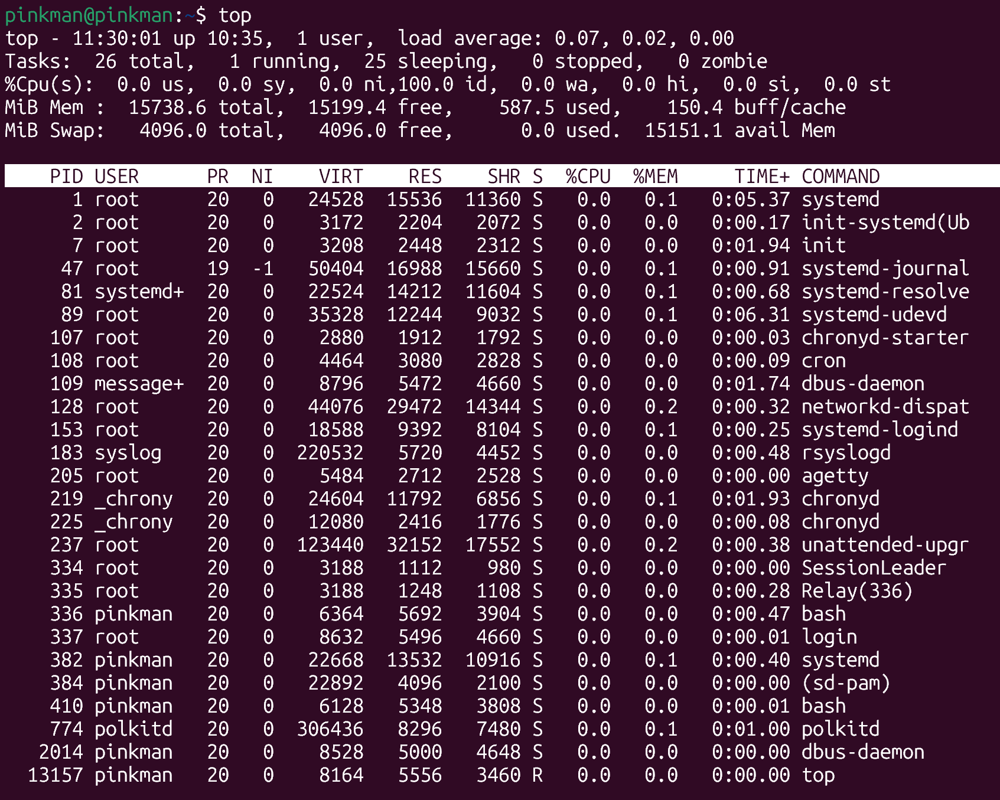

  - 第一行：当前时间、系统运行时间、登录用户数、平均负载
  - 第二行：进程任务数及其状态
  - 第三行：CPU 使用率百分比
  - 第四行：内存使用情况
  - 第五行：交换空间使用情况
  - 表格内容：进程具体信息
- 退出系统信息界面：`q`
- 查看命令帮助页面：`?`
- 进程排序：
  - `shift + m`：使进程按内存使用率排序
  - `shift + p`：按 CPU 使用率
  - `shift + n`：按 PID
  - `shift + r`：反转当前排序
- `top -d 1`：改为每一秒更新一次；也可以在运行中按`d 1`
- `top -u pinkman`：只监控 pinkman 用户的进程信息
- `top -i`：只监控运行中的进程


### `free`：系统内存监控
- `free`：基础命令，提供了系统内存使用情况的快照

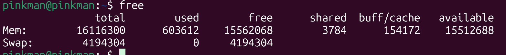

- `free -h`：易读形式


- `free -m`：指定以 MB 为单位显示
- `free -h -s 3 -c 5`：每隔 3 秒监控一次内存使用情况，共更新 5 次
- `free -h -t`：显示总内存使用量

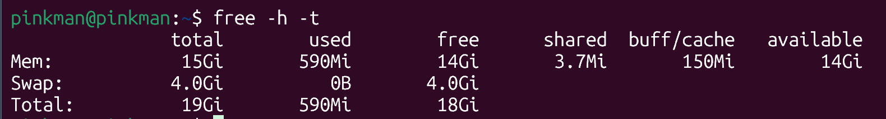

### `df`：磁盘空间监控
- `df`：基本命令，查看磁盘使用情况

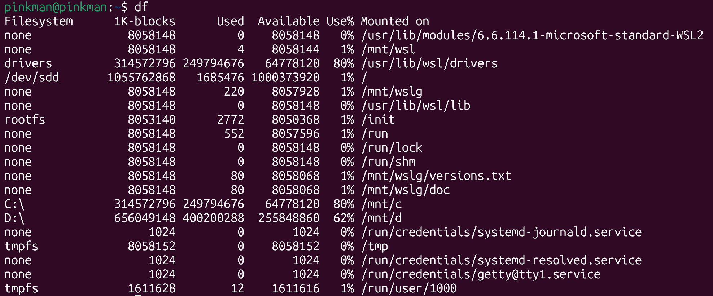

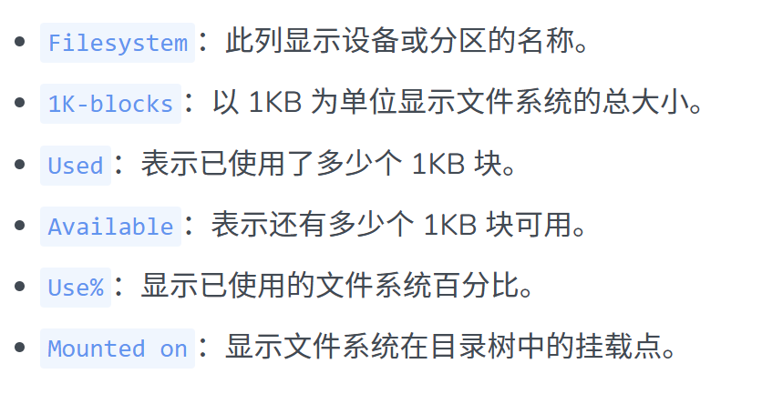

- `df -h`：更可读

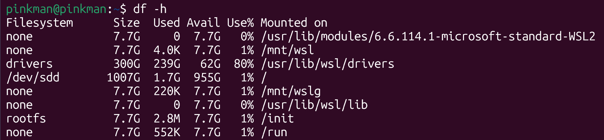

- `df -T`：显示文件系统类型
- `df -i`：显示 inode 使用情况

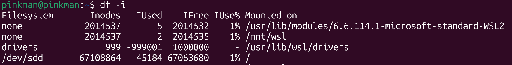

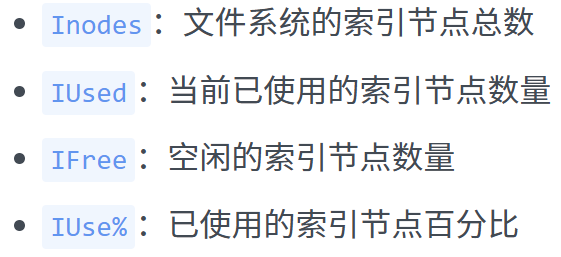

- `df /mnt/wsl`：指定挂载点为`/mnt/wsl`

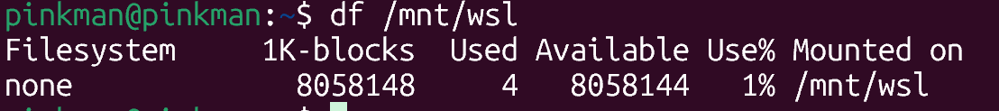

- `df -h -x tmpfs`：排除 tmpfs 类型的文件系统
- `df -h --total`：显示总计摘要

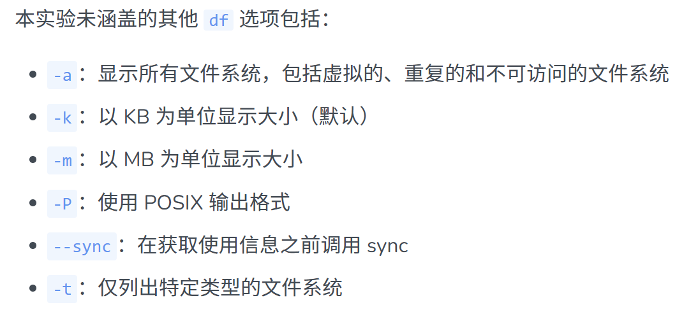

### `du`：目录与文件大小查看
- `du`：基础命令，查看当前目录与当前目录下文件和文件夹的大小

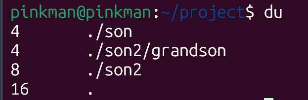

- `du -h`：更可读

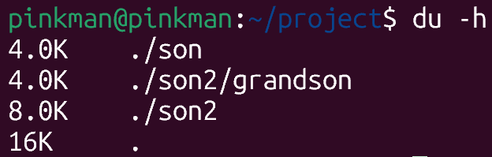

- `du -h --max-depth=0`：限制查找的目录结构的深度，0 即为只显示当前目录；若为 1 则为只显示当前目录和第一层子目录


- `find . -type f -exec du -h {} + | sort -hr | head -n 5`

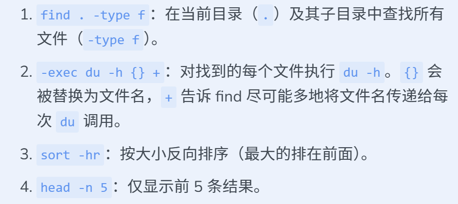

---

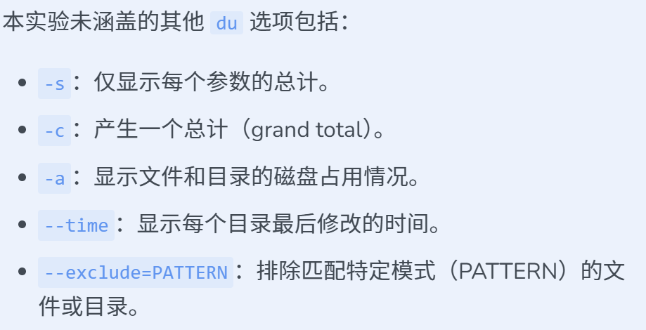

### `time`：命令和程序执行时间测量工具
- `time <具体指令/脚本文件.sh>`：测量指令操作时间

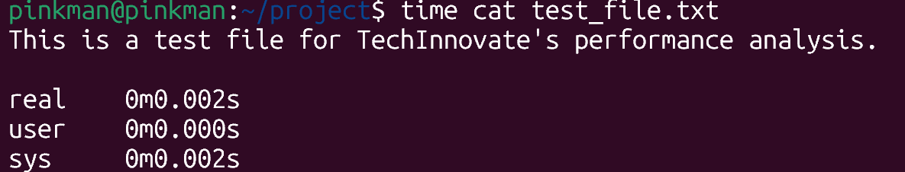

  - real 为实际时间，user 为内核之外的用户花费时间，sys 为在内核中花费的时间

# 其他内容
## PATH 环境变量
PATH 是一个变量，存储了一系列文件夹的路径；每当输入`ls`等命令时，系统就会进入 PATH 中的文件夹内逐个查找命令对应的可执行文件

- 把某个文件夹路径加入 Path：`export PATH="$PATH:<绝对路径>"`
- 生效范围：当前终端进程与子进程；若全局则需要把这行代码添加到系统 Shell 配置文件中

## bash
是一种在终端中处理并执行用户输入指令的程序，是 Linux 系统中最常用的一种解释器

shell 脚本开头通常要写：`#!/bin/bash`；用于明确告诉系统使用 bash 执行这个脚本文件

## shell 脚本文件
Shell 脚本本质是一个文本文件，后缀为`.sh`，用于按顺序存储和运行命令

Shell 脚本在开头使用`#!<绝对路径>`来指明运行脚本的解释器

<!-- learning-journey:update-history:start -->
## 更新记录

| 日期 | 类型 | 说明 |
| --- | --- | --- |
| 2026-07-19 | 首次发布 | 从语雀整理并发布到学习记录仓库 |
| 2026-07-21 | 内容更新 | 补充 Linux 权限与用户管理、文件搜索、文本处理、系统监控、PATH 和 Shell 脚本等内容，并完善命令示例与截图 |
<!-- learning-journey:update-history:end -->
