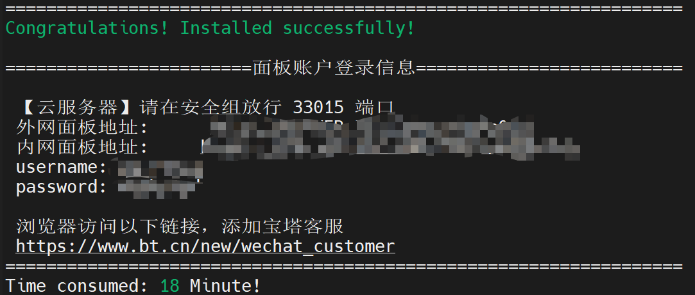
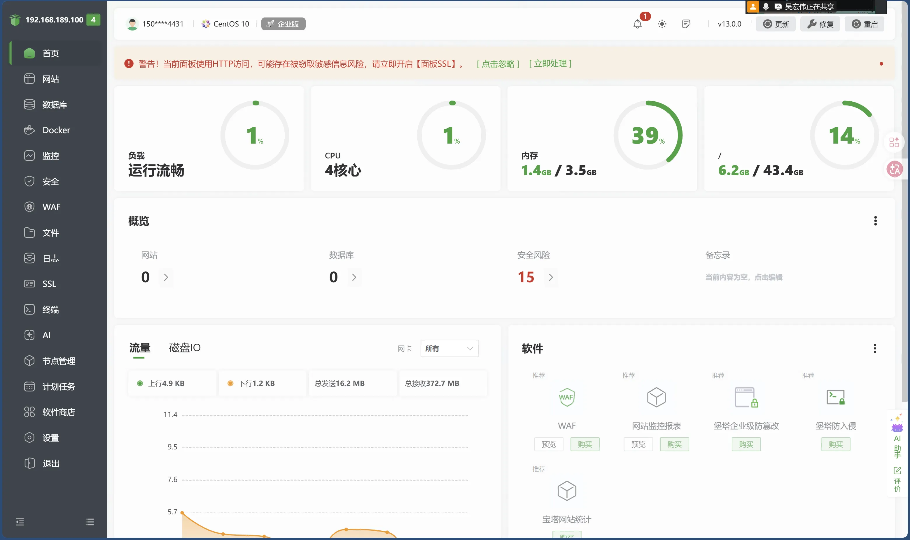
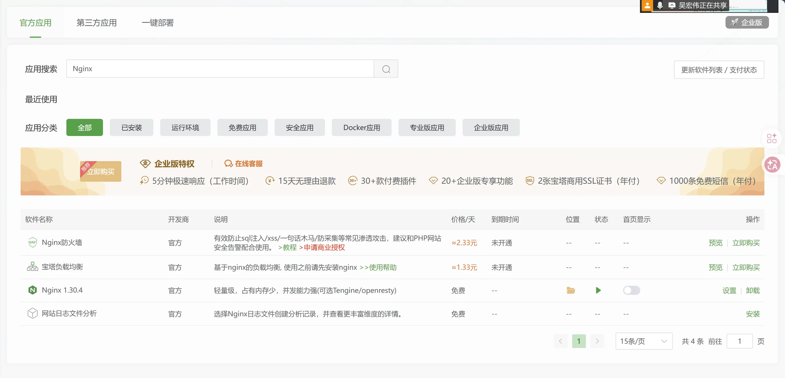
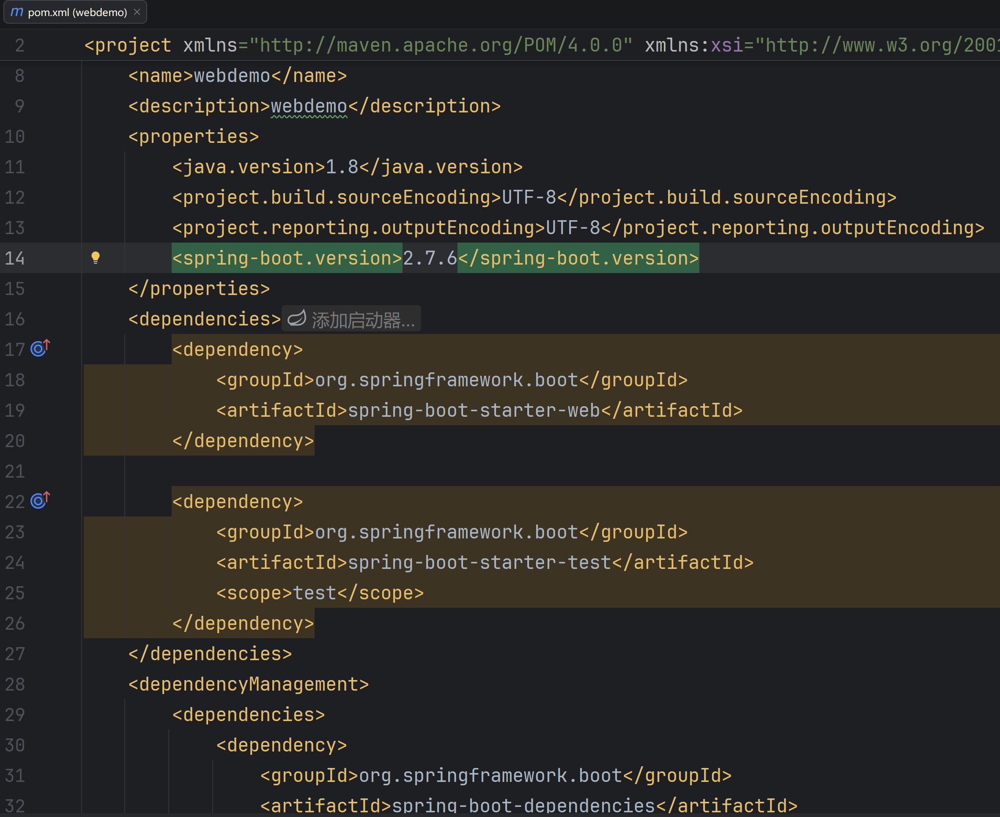
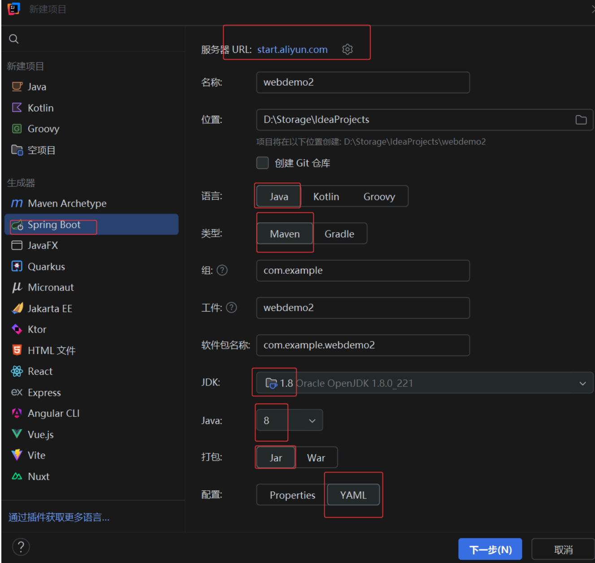
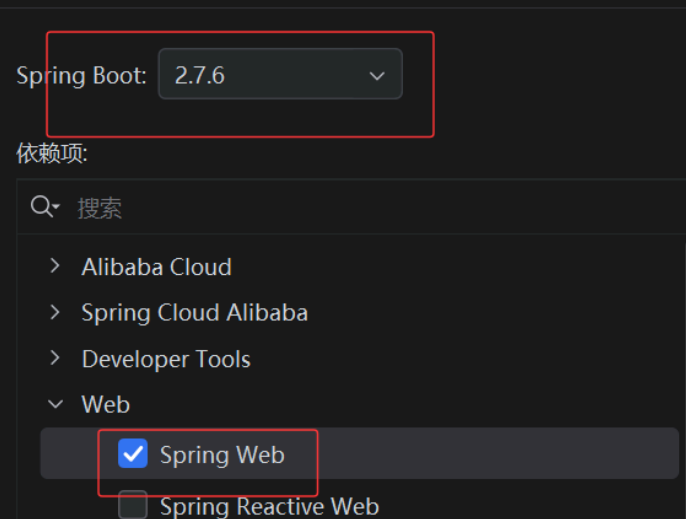
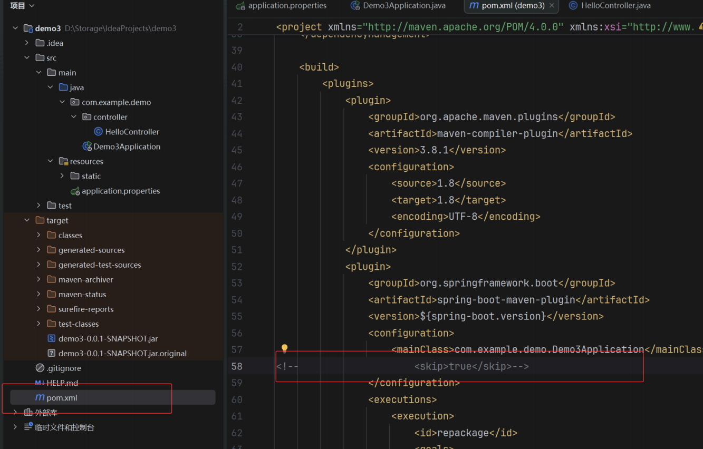
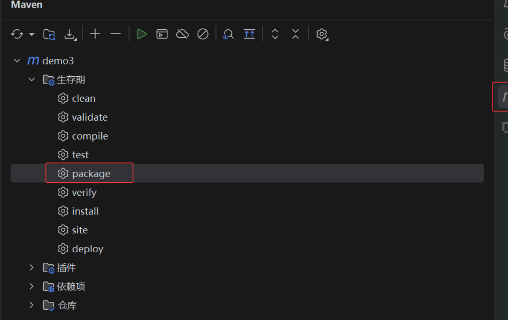
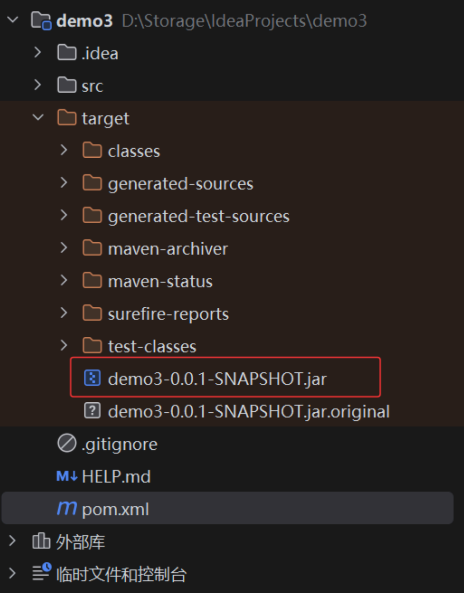
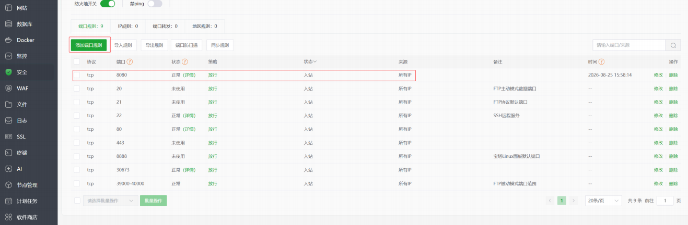

# Day2：宝塔配置与云服务项目部署

> 课程记录附件：[20260825_6-11.pdf](attachments/282608837/20260825_6-11.pdf)

## 什么是宝塔

宝塔 BT Panel 是一个 Linux 服务器的可视化运维管理工具。

可以给 Linux 服务器安装一个可视化的网页管理后台，直接在浏览器里访问管理，以代替传统复杂的纯终端操作。

## 宝塔的部署安装



- **内网面板地址**：只能在和服务器处于同一个内部网络里的设备访问。
- **外网面板地址**：可以从互联网访问服务器时使用的地址。

宝塔界面：



## 实践 1：宝塔安装 Nginx

进入宝塔页面侧边栏“软件商店”，直接搜索安装即可。



## 实践 2：云服务项目开发部署

### 相关概念

#### Maven

Maven 是 **Java 项目依赖文件管理器**和**自动构建工具**，用于自动化管理 Java 项目的依赖、编译和打包。

- 如果没有 Maven，需要自己寻找 `.jar` 依赖包、下载并放进项目、配置变量路径、编译打包。
- 使用 Maven，只需要编写一个 `pom.xml`，告诉 Maven 项目名称、使用版本、所需依赖以及打包方式。



#### Spring Boot

Spring Boot 是快速搭建 Java 服务程序的常用框架。

#### Spring Web

Spring Web 是 Spring Boot 中专门负责 **Web / HTTP 开发**的功能模块。

勾选 Spring Web 即为告知这个 Spring Boot 项目要用于 Web / API 服务，并使用其提供的相关能力。

### 安装链接

- JDK：[Eclipse Temurin](https://adoptium.net/zh-CN/temurin/releases)
- Maven：[Apache Maven](https://maven.apache.org/download.cgi)
- IDEA：[IntelliJ IDEA](https://www.jetbrains.com/zh-cn/idea/download/?section=windows)
- 宝塔：[宝塔面板](https://www.bt.cn/new/download.html)

### 安装部署过程

1. 在 Windows 主机上安装 JDK、IDEA、Maven。
2. 进入 IDEA，选择 Spring Boot 项目。
   1. 服务器 URL 设置为 `https://start.aliyun.com`。服务器 URL 是 Spring Boot 项目初始化服务的地址，阿里云提供面向国内环境的 Spring Initializr 服务，使用较为方便。
   2. 语言选择 Java、类型选择 Maven、打包选择 JAR、配置选择 YAML，并选择本机的 JDK。



3. 选择 Spring Web 项目。



4. 初始化完成后，修改 `pom.xml` 文件，注释掉 `<skip>true</skip>`。这样可以避免跳过 Spring Boot Maven Plugin 的重新打包过程，使 Maven 最后生成可通过 `java -jar` 直接启动的可执行 JAR 文件。



5. 进行项目开发。
6. 开发完成后，使用 Maven 打包；完成后会在项目的 `target` 目录生成 JAR 文件。





7. 通过 MobaXterm 的 SFTP 将 JAR 文件上传到服务器上。
8. 在 JAR 文件所在目录执行：

```bash
java -jar xxxx.jar
```

9. 最后，在宝塔面板的“安全”中添加放行端口，让外部机器可以通过该端口访问服务。



<!-- learning-journey:update-history:start -->
## 更新记录

| 日期 | 类型 | 说明 |
| --- | --- | --- |
| 2026-08-25 | 首次发布 | 从语雀整理并发布到学习记录仓库 |
<!-- learning-journey:update-history:end -->
