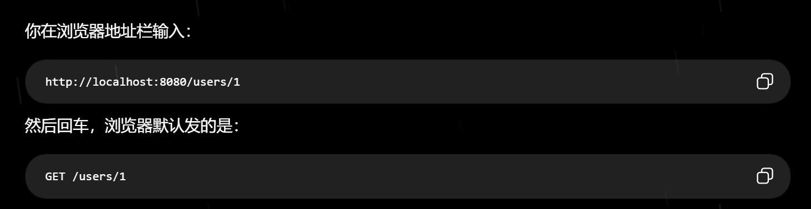
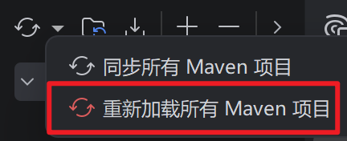
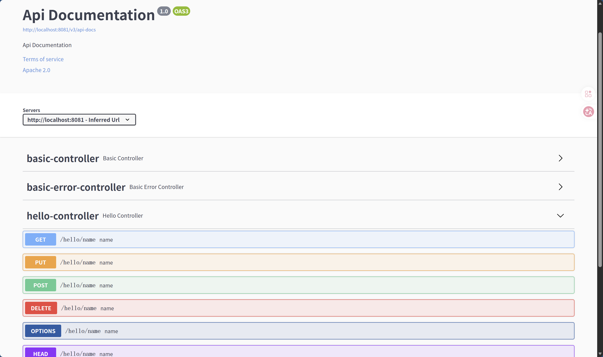
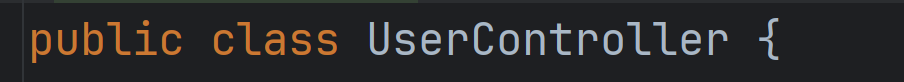
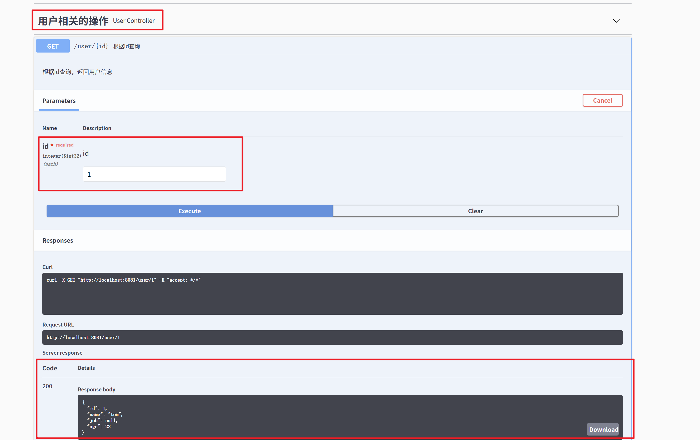

# Day4：JSON 数据交互与 RESTful API——Spring Boot 接口开发与 Swagger 调试

> 老师课程讲述记录笔记：[20260827_13-18.pdf（需登录语雀）](https://www.yuque.com/attachments/yuque/0/2026/pdf/50155819/1787820873143-02a718e2-e33e-4447-8146-a78ac112909e.pdf)

## JSON：数据交互的标准格式

### JSON 是什么

JSON（JavaScript Object Notation）是一种轻量级的、跨平台的结构化数据交换格式，适合在 API 之间进行数据交换。

### JSON 的作用

一个真实的项目中，Web 前端、Java Spring Boot、Python 服务、微服务等各个组件内部使用的数据结构可能完全不同，但又需要频繁地进行数据交换，因此 JSON 提供了一种统一的数据交换格式。

其优点在于：格式简单、可读性强、结构清晰、跨语言可解析，因而被广泛应用。

### JSON 基本数据结构

- 字符串：`"xxx"`（必须使用双引号）
- 数字：`20`
- 布尔值：`false` | `true`

### JSON 的两种基本结构

#### Object 对象

JSON 中的对象由一对 `{}` 表示，其中由多个键值对组成。

```json
{
  "name": "Tom",
  "age": 20,
  "isMarried": false
}
```

#### Array 数组

JSON 中的数组由一对 `[]` 表示，其中可以包含多个值（语法上允许数据结构不同，但规范上最好保持一致）。

```json
{
  "name": "Tom",
  "age": 20,
  "hobbies": [
    "running",
    "swimming"
  ]
}
```

> 数组和对象可以相互嵌套。

## RESTful API

### RESTful API 是什么

RESTful API 实质上是一种常见的 Web API 设计风格，使两台计算机系统通过互联网安全地交换信息数据。

**核心思想：** 使用 URL 定位资源，使用 HTTP Method 表示对资源执行什么操作。

### URL 定位资源

#### URL 是什么

URL（Uniform Resource Locator，统一资源定位符）用于根据位置定位网络中的资源。

URL 的路径用来表达访问哪个资源。

#### URL 的组成

`协议://域名或IP:端口/路径?查询参数#片段`

例：<http://localhost:8080/path1/path2?name=Tom&id=1>

#### URL 参数

- Path 路径参数：直接放在路径中。
  - `/users/1`：表示用户资源中的用户 1。
- Query 查询参数：使用 `?` 标识。
  - `/users?name=Tom&age=20`：表示在用户资源中查询 `name=Tom` 且 `age=20` 的对象。
  - Path 和 Query 可以同时存在于 URL 路径中。
- Body 请求体：当发送数据较多时不适合全部放进 URL，因此可以传 JSON 格式的 **Request Body 请求体**。
  - 如新增用户时需要传具体的用户对象信息，请求体为：

```json
{
  "name": "Tom",
  "age": 20,
  "major": "Software Engineering"
}
```

### HTTP Method 执行具体操作

#### HTTP Method 操作类型

- `GET`：查询资源。

  

- `POST`：新增资源。
- `PUT`：完整修改资源（需要在请求体中包含完整信息）。
- `PATCH`：部分修改资源（只修改资源的部分属性）。
- `DELETE`：删除资源。
- `OPTIONS`：用于了解该 API 接口支持哪些 HTTP Method 及其相关信息，通常不执行具体业务操作。

#### 一些 API 调试工具

- Swagger UI
- Postman

### Content-Type

`Content-Type` 用于指定请求体 Body 的数据类型。

完整的请求类似：

```http
POST /user HTTP/1.1
Content-Type: application/json

{
  "name": "Tom",
  "age": 20
}
```

- `Content-Type: application/json`：Body 是 JSON。
- `Content-Type: application/x-www-form-urlencoded`：请求体使用与查询字符串相似的键值对编码，例如 `name=Tom&age=20`。
- `Content-Type: multipart/form-data`：用于上传文件，常用于头像上传、附件上传等。
- `Content-Type: text/html`：Body 是 HTML 文档，例如：

```html
<html>
  <body>Hello</body>
</html>
```

## 实践环节

### Swagger

#### 项目引入 Swagger

Swagger/Springfox 并非 Spring Boot 默认组件，需要在 `pom.xml` 中通过 Maven Dependency 引入：

```xml
<dependency>
    <groupId>io.springfox</groupId>
    <artifactId>springfox-boot-starter</artifactId>
    <version>3.0.0</version>
</dependency>
```

添加依赖后重新加载 Maven，使依赖下载并加入项目。



#### 兼容配置

在 `src/main/resources/application.yml` 中进行配置：

```yaml
server:
  port: 8081

spring:
  mvc:
    pathmatch:
      matching-strategy: ant_path_matcher
```

- `server.port`：设置 Spring Boot Web 服务监听端口。
- `matching-strategy: ant_path_matcher`：解决当前 Spring Boot 与 Springfox 之间的路径匹配兼容问题。

#### 启用 Swagger

在 `WebdemoApplication.java` 的 Spring Boot 入口类上添加：

```java
@EnableOpenApi
```

用于启用 Springfox 提供的 Swagger/OpenAPI 功能。

#### Swagger 启动验证

启动 Spring Boot 项目，访问 <http://localhost:8081/swagger-ui/>。

Swagger 会扫描项目中的 Controller 和 Mapping，并自动生成可视化 API 文档。



#### 创建 Entity 实体类

在 `src/main/java/com.example.webdemo` 下新建 Package `entity`，然后在里面创建 User 对象 `User.java`。

实体类用于在 Java 程序中表示具体业务数据。

例如，用户对象：

```java
public class User {
    private int id;
    private String name;
    private String job;
    private int age;
}
```

在 Web API 中，Java 对象可以由 Spring 自动转换为 JSON 数据进行传输。

#### 创建 UserController

在 `com.example.webdemo.controller` 中创建 `UserController.java`。

搭建框架：

```java
package com.example.webdemo.controller;

import com.example.webdemo.entity.User;
import io.swagger.annotations.Api;
import io.swagger.annotations.ApiOperation;
import org.springframework.web.bind.annotation.*;

import java.util.ArrayList;
import java.util.HashMap;
import java.util.List;
import java.util.Map;

@Api(
        tags = "用户相关的操作"
)
@RequestMapping("/user")
@RestController
public class UserController {

}
```

- `@RestController`：表示这个类是一个 Web API Controller。
- `@RequestMapping("/user")`：给整个 Controller 添加统一路径前缀，以后写 `@GetMapping("/{id}")`，最终路径就是 `/user/{id}`。
- `@Api`：Swagger 的注解，用于给 Swagger 文档中的 API 手动分类。

#### 编写 API：根据 ID 查询用户

在 `UserController` 中加入：



```java
@ApiOperation(
        value = "根据id查询",                    // 接口的简单说明
        notes = "根据id查询，返回用户信息",       // 接口的详细说明
        response = User.class,                  // 告诉 Swagger 响应的数据类型是 User
        produces = "application/json"          // 返回的数据格式是 JSON
)
@GetMapping("/{id}")
// 表示这个方法只处理 GET 请求，而且 Path 中存在一个动态参数 id
// 最终路径：/user/{id}
public User findById(@PathVariable("id") int id) {
    // 把 URL 路径中的 id 取出来，传给 Java 方法参数
    User u = new User();

    u.setId(id);
    u.setName("tom");
    u.setAge(22);

    return u;
}
```

#### 运行测试该 API

重新启动 `WebdemoApplication`，打开 <http://localhost:8081/swagger-ui/index.html>，找到“用户相关的操作”——>展开——>`GET /user/{id}`——>Try it out——>输入 `id = 1`——>Execute，观察返回结果。



获得了返回体，状态码 200 表示请求成功。

#### 其他 API

```java
@ApiOperation(
        value = "查询所有用户",
        notes = "查询所有用户",
        response = User.class,
        responseContainer = "List",
        produces = "application/json",
        httpMethod = "GET"
)
@RequestMapping("/list")
public List<User> list() {

    List<User> list = new ArrayList<>();

    User u = new User();
    u.setId(1);
    u.setName("tom");
    u.setAge(22);

    list.add(u);

    return list;
}
```

```java
@ApiOperation(
        value = "新增用户",
        notes = "新增用户",
        response = Map.class,
        produces = "application/json",
        consumes = "application/json",
        httpMethod = "POST"
)
@PostMapping("/add")
public Map<String, Object> add(@RequestBody User user) {

    Map<String, Object> map = new HashMap<>();

    map.put("success", true);
    map.put("msg", "ok");
    map.put("data", user);

    return map;
}
```

```java
@ApiOperation(
        value = "修改用户",
        notes = "修改用户",
        response = Map.class,
        produces = "application/json",
        consumes = "application/json",
        httpMethod = "PUT"
)
@PutMapping("/update")
public Map<String, Object> update(@RequestBody User user) {

    Map<String, Object> map = new HashMap<>();

    map.put("success", true);
    map.put("msg", "ok");
    map.put("data", user);

    return map;
}
```

```java
@ApiOperation(
        value = "根据id删除用户",
        notes = "根据用户id删除用户",
        response = Map.class,
        produces = "application/json",
        httpMethod = "DELETE"
)
@DeleteMapping("/{id}")
public Map<String, Object> delete(@PathVariable("id") int id) {

    Map<String, Object> map = new HashMap<>();

    map.put("success", true);
    map.put("msg", "ok");
    map.put("id", id);

    return map;
}
```

<!-- learning-journey:update-history:start -->
## 更新记录

| 日期 | 类型 | 说明 |
| --- | --- | --- |
| 2026-08-27 | 首次发布 | 从语雀整理并发布到学习记录仓库 |
<!-- learning-journey:update-history:end -->
