# Day5：Docker 容器部署——镜像构建、容器运行与 Docker Compose

> 老师课程记录笔记以及 CentOS Docker 安装指南：
>
> [20260828_17-21.pdf](https://www.yuque.com/attachments/yuque/0/2026/pdf/50155819/1787905504343-f7e74ec7-b5bb-4c0d-8918-6295072d4abd.pdf)
>
> [CentOS Stream10安装Docker.pdf](https://www.yuque.com/attachments/yuque/0/2026/pdf/50155819/1787905508545-46918561-8858-4008-ad7b-0c0e39584da7.pdf)

## Docker 基础理解

### 传统应用迁移

像本节课主线一样，传统应用在进行服务器部署时，需要在服务器中进行安装配置环境、上传文件、修改配置等一系列步骤；且需要不同版本环境的应用在同一台服务器上运行时，容易发生冲突。

### 什么是 Docker

Docker 是一种容器化技术；能够为每个应用创建一个轻量、隔离、可复用的运行环境。

每个 Docker 容器从逻辑上来讲都类似于一个小型虚拟机，但共享宿主机内核，只隔离应用和运行环境。

### Docker 的优势

- **占用空间小**：Docker 镜像只需要保存应用与其运行所需的环境，而无需整个 OS。
- **启动速度快、资源利用率高**：Docker 直接创建容器并启动应用即可，共享宿主机资源。
- **不同机器都可以迁移**。

## Docker 三大核心概念

### Image 镜像

镜像是用于创建容器的静态模板，可以包含应用程序、运行环境等。

相当于一个安装包，用于创建容器，开始运行。

镜像完整名称组成通常是：`镜像名称:Tag`；Tag 用于表示版本、变体等，若省略 Tag 通常按 Latest 最新版本处理。

### Container 容器

容器是镜像创建出来的运行实例：

$$
\text{Image} \xrightarrow{\text{docker run}} \text{Container}
$$

一个镜像可以创建多个隔离容器。

### Registry 镜像仓库

镜像仓库用于存储和分发镜像，类似 GitHub 仓库，具有公共 / 私有之分。

标准流程：

$$
\text{仓库} \xrightarrow{\text{docker pull}} \text{本地 Image} \xrightarrow{\text{docker run}} \text{Container}
$$

## Docker 常见命令

- 拉取镜像：`docker pull 镜像名:Tag`（会去远程镜像仓库拉取并下载到本地）
- 查看本机镜像：`docker images`
- 删除镜像 / 容器：`docker rmi 镜像名/镜像 ID`；`docker rm 容器名/容器 ID`
- 创建容器并运行：`docker run [参数] 镜像`（会用镜像创建容器实例并启动）
  - 参数：
    - `-i`：允许给容器输入内容
    - `-t`：给容器分配一个伪终端
    - `-it`：创建容器并进入可交互的终端
    - `-d`：在后台运行
    - `--rm`：停止后自动删除，适合临时测试或一次性任务
    - `-p 宿主机端口:要映射到的容器端口`：端口映射（容器与宿主机端口隔离，外部用户访问 `服务器:宿主机端口` 可以由 Docker 映射到 `容器:容器端口`）
- **已有**容器重新启动：`docker start 容器`
- 重启容器：`docker restart 容器`
- 停止容器：`docker stop 容器`
- 查看当前运行的容器：`docker ps`
  - `docker ps -a`：查看全部容器（包括已经停止的）
- 在已经运行的容器中执行命令：`docker exec -it 容器 命令`

---

- 镜像文件保存：`docker save -o /root/test01.tar my_app:1.0`

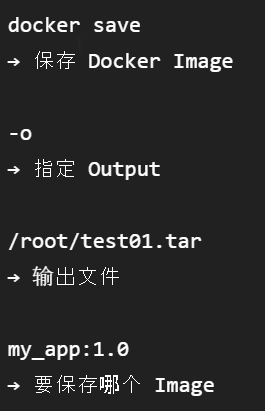

- 镜像导入：`docker load -i /root/test01.tar`

## 制作镜像：Dockerfile

### Dockerfile 是什么

Dockerfile 是用于描述“如何构建 Docker Image”的文本文件。

$$
\text{Dockerfile} \xrightarrow{\text{docker build}} \text{Image}
$$

### Dockerfile 内容

```dockerfile
FROM <Java 8 基础镜像>

# 配置时区
ENV TZ=Asia/Shanghai

# 把 Jar 复制进镜像
COPY webdemo.jar /tmp/webdemo.jar

# 镜像构建时执行以下命令
RUN ln -snf /usr/share/zoneinfo/$TZ /etc/localtime \
    && echo $TZ > /etc/timezone

# 容器启动时运行 Jar；第一个字符串是要执行的程序，后面的字符串依次作为该程序的参数
ENTRYPOINT ["java", "-jar", "/tmp/webdemo.jar"]
```

#### `FROM` 基础镜像

Dockerfile 的第一条通常是：`FROM xxx`；代表新镜像基于哪个已有镜像构建。

#### `TZ` 时区设置

时区设置可以同步日志时间、数据库时间，便于后期排错。

中国大陆常用：`TZ=Asia/Shanghai`

#### `COPY` 复制文件配置

`COPY` 指示了构建 Image 时复制哪些文件进去。

`COPY webdemo.jar /tmp/webdemo.jar`：将宿主机上的 `webdemo.jar` 复制进镜像的 `/tmp/webdemo.jar`。

#### `RUN` 构建镜像时执行命令

`RUN` 用于指示在镜像构建过程中执行的命令，并将执行结果保存到镜像中。

#### `ENTRYPOINT` 容器启动默认执行程序

`ENTRYPOINT` 用于指示该镜像创建出的容器启动后，默认执行什么程序。

`ENTRYPOINT ["java", "-jar", "/tmp/webdemo.jar"]`

### 镜像的制作

假设项目目录为：

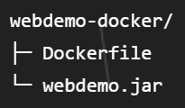

进入该目录：`cd webdemo-docker`

输入命令：`docker build -t webdemo:1.0 .`

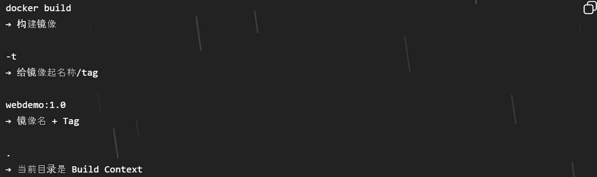

最终根据 Dockerfile 执行镜像制作流程：

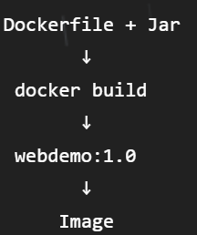

### Docker 镜像制作的核心思路

需要什么已有基础环境？——>需要往环境里加入或修改什么？——>容器启动后执行什么操作？

注 1：Dockerfile 和要 COPY 的文件放在同一目录下。

注 2：尽量直接在 Linux 环境下编写 Dockerfile，避免 Windows 和 Linux 的文本格式差异。

## 实际创建并运行自己的容器

```bash
docker run -d \
  --name webdemo \
  -p 8082:8081 \
  webdemo:1.0
```

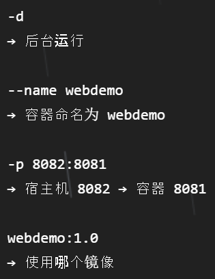

同一 Image 也可以同时运行多个容器：

```bash
docker run -d \
  --name instance_01 \
  -p 8082:8081 \
  my_app:1.0
```

```bash
docker run -d \
  --name instance_02 \
  -p 8083:8081 \
  my_app:1.0
```

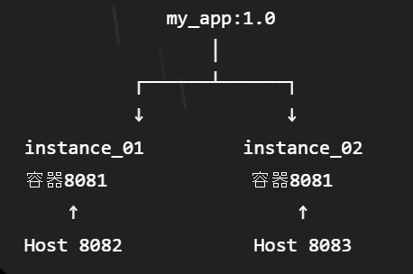

## 镜像的分享方法

1. 直接保存并传输 `.tar` 文件，对方直接 `load` 加载。
2. `push` 上传到 Registry 镜像仓库，对方直接 `pull` 拉取。

## Docker Compose

### 概念与意义

Docker 部署经常是一个服务对应一个 Image，而不是一个镜像中包含了完整的项目服务。

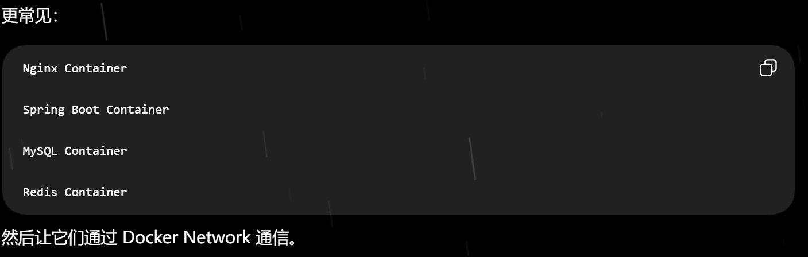

Docker Compose 就是用一个配置文件，把“多个容器要怎么一起运行”描述出来，然后统一启动和管理。

### `compose.yaml` 与构建命令

`compose.yaml` 就是 Docker Compose 的配置文件，格式如下：

```yaml
services:

  web:
    image: webdemo:1.0
    ports:
      - "8082:8081"

  mysql:
    image: mysql:8
    environment:
      MYSQL_ROOT_PASSWORD: "123456"

//Compose可以使用现有Image，也可以自己build

docker compose up -d

1. 用已经构建好的Image：

services:
  web:
    image: webdemo:1.0

2.根据当前目录里的Dockerfile构建image并运行：

 services:
  web:
    build: .
```

启动命令：`docker compose up -d`

停止并删除命令：`docker compose down`

## 实践部分

### 实践一：Docker 的安装与测试

1. 根据指南在服务器上安装好 Docker。
2. 运行 hello-world：`sudo docker run hello-world`

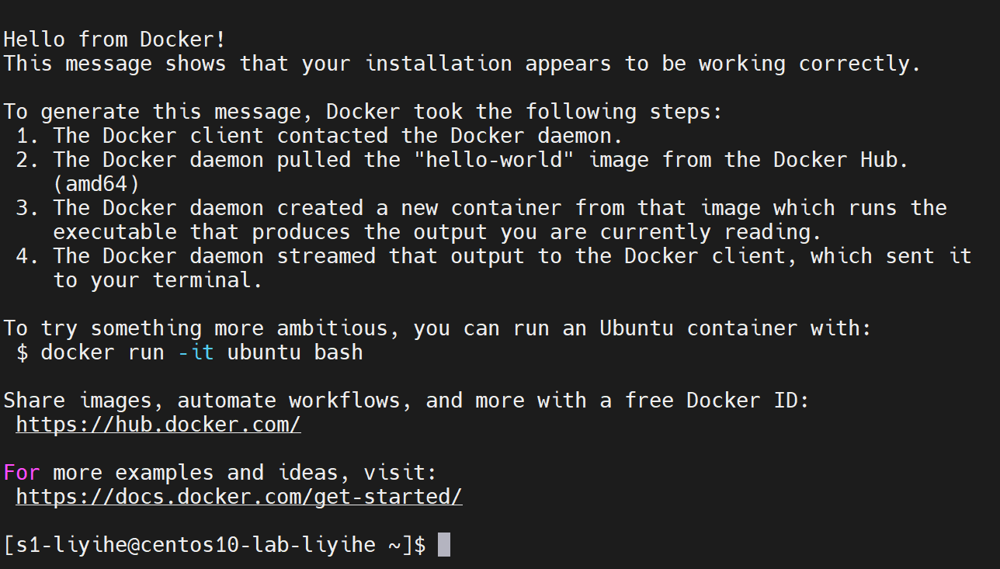

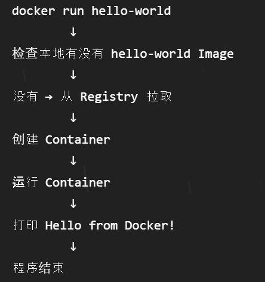

3. 查看镜像 Image 与运行过的容器 Container：`sudo docker images`、`sudo docker ps -a`

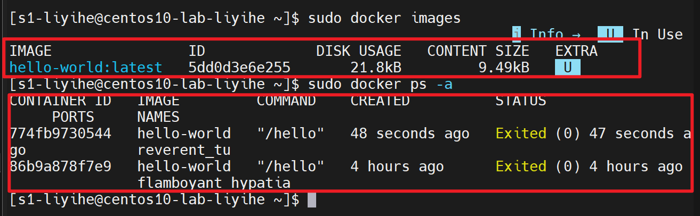

### 实践二：Spring Boot Docker 化

1. 拉取指定的 Java 8 Image：`sudo docker pull openjdk:8u312-jre-buster`，为我们提供准备好的 Java 8 环境。

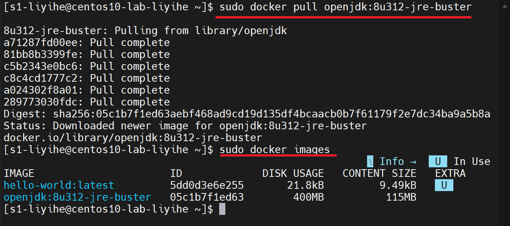

2. 在服务器建立 Docker 构建目录：`mkdir -p ~/webdemo-docker` 并 `cd` 进去。
3. 用 MobaXterm 左侧 SFTP，上传 Jar 到服务器上。
4. 编写 Dockerfile：`vim Dockerfile`、`i` 进入编辑模式。

```dockerfile
FROM openjdk:8u312-jre-buster

ENV TZ=Asia/Shanghai

RUN ln -snf /usr/share/zoneinfo/$TZ /etc/localtime && echo $TZ > /etc/timezone

COPY webdemo-0.0.1-SNAPSHOT.jar /tmp/web.jar

ENTRYPOINT ["java","-jar","/tmp/web.jar"]
```

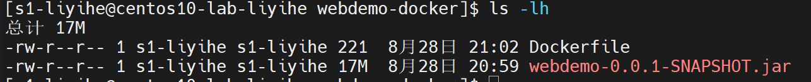

Dockerfile 和 Jar 文件在同一目录的同一层级下。

5. 开始构建 Image：`sudo docker build -t myapp ./`

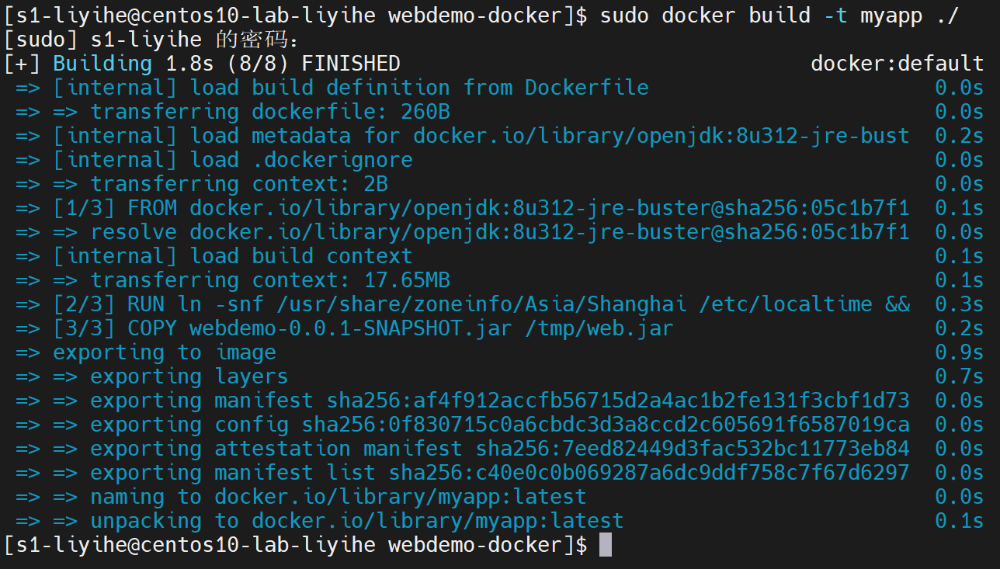

6. 创建并运行 Container：`sudo docker run -d -p 8082:8081 --name myapp-inst myapp:latest`

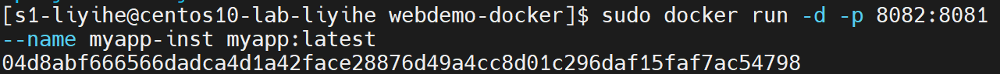

得到一串 Container ID。

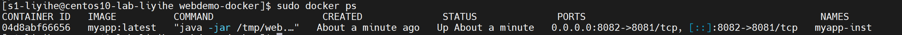

检查发现已在运行。

7. 浏览器访问：`http://服务器 IP:宿主机映射端口/hello/name`

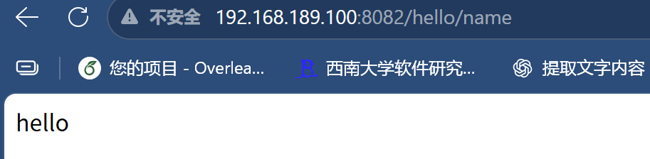

## 最终感悟：Docker 到底怎么方便了

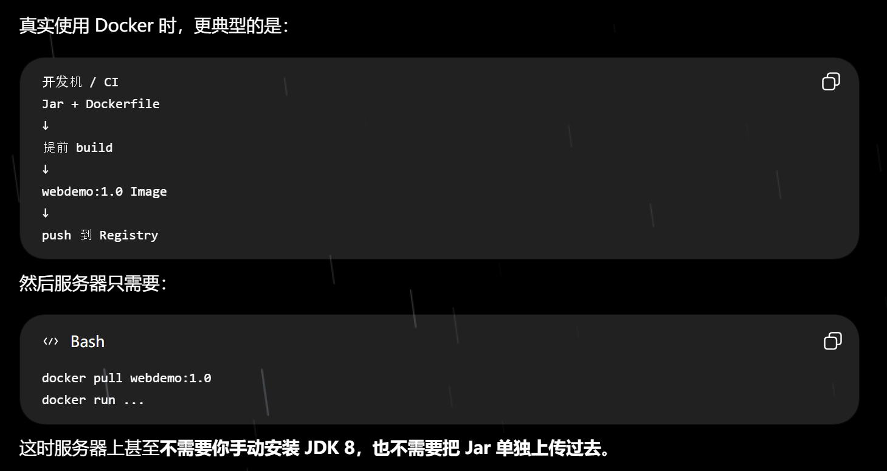

此时服务器上甚至**不需要你手动安装 JDK 8，也不需要把 Jar 单独上传过去**。

<!-- learning-journey:update-history:start -->
## 更新记录

| 日期 | 类型 | 说明 |
| --- | --- | --- |
| 2026-08-28 | 首次发布 | 从语雀整理并发布到学习记录仓库 |
<!-- learning-journey:update-history:end -->
