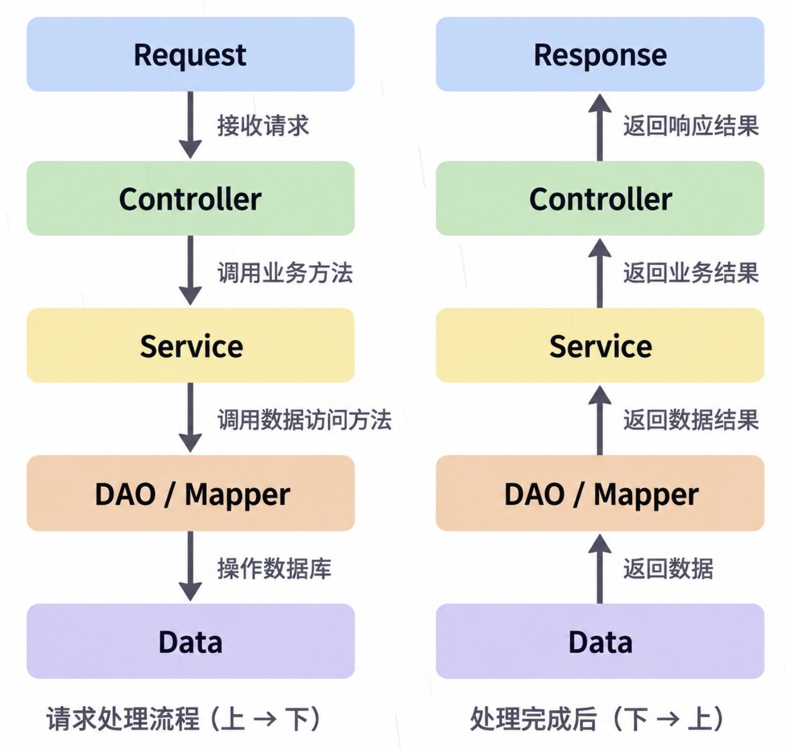
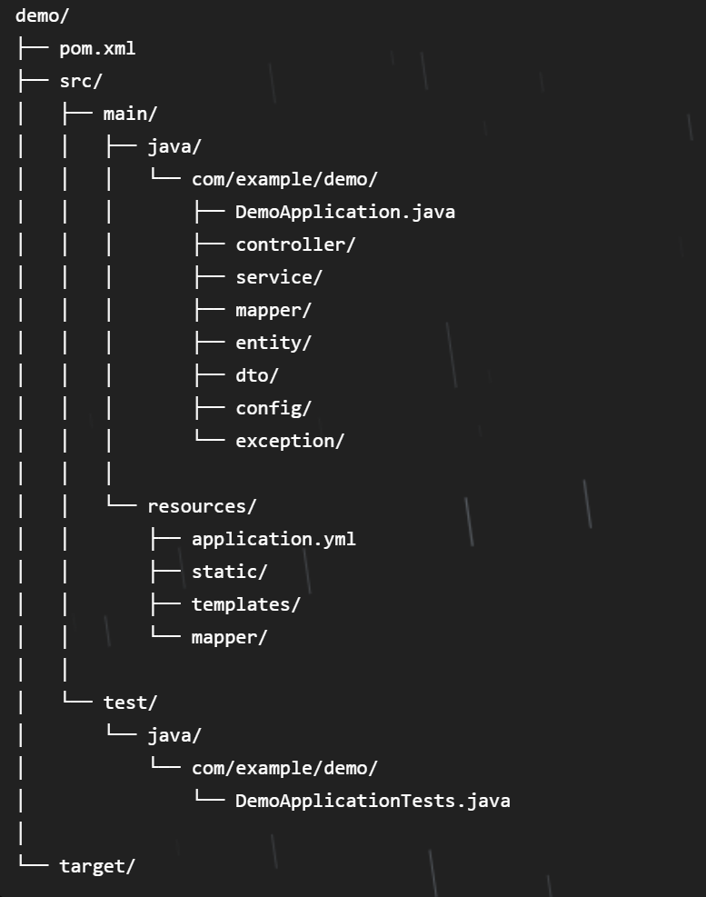

# Week2：单体后端实现与微服务思想

## 本周相关技术栈 / 概念

### REST / RESTful

#### 是什么

一种 Web API 的接口设计风格和约定。

利用 HTTP 方法和地址，形成一种较规范的 API 设计方式。

#### 为什么出现

Web 程序需要使用相对统一、容易理解的方式描述请求地址和操作。

#### 解决什么

让不同 API 在地址和请求方式上更加规范，便于理解和调用。

#### 课程目前怎么理解

使用请求方式 + 请求地址，来表达要调用的后端功能。

例如：`PUT /users/1`、`POST /users`。

REST 是一种约定和规范，不是强制规定。

## 业务功能与实现

### 一个项目系统的整体思路

系统 → 模块 → 功能 → 业务规则 → 业务步骤 → API → 具体实现

### 业务功能是什么

业务是围绕实际场景形成的一组规则与步骤，而并非只是一次 CRUD 增删改查的操作。

### 实现业务功能的考虑

- 输入是什么
- 需要按照什么规则处理
- 执行哪些步骤
- 最终返回什么

## 单体后端的三层结构

> 后端功能会同时涉及接收请求、业务处理、数据操作、返回结果等；如果全部写在一个文件中，会导致职责混乱、协作困难、耦合度高。因此应将不同职责拆分到不同的层中。



### 请求入口 Controller

Controller 是请求入口和分流层。

Controller 负责：接收请求 → 匹配对应功能 → 得到入口数据 → 调用业务处理 → 返回结果。

### 业务处理 Service

Service 是业务逻辑层，主要负责业务规则与业务步骤处理。

### 数据操作 DAO / Mapper

DAO / Mapper 是数据操作层，主要负责增删改查等数据操作。

### API 在后端中的基本处理过程

1. Mapping：请求地址匹配到对应的 Controller 方法入口。
2. 得到参数：请求中的参数进入后端对应方法的参数。
3. 处理业务：数据进入 Service 层，按照具体的业务规则执行业务步骤，在 DAO / Mapper 中处理数据。
4. 返回结果：业务处理完成后将结果返回给调用方。

## 前后端分离与 API 请求链路

> 前后端分离实现的也是职责划分的思想。

### 前端的本质：数据的收集、产生与展示

前端有各种各样的表现形式：Web 页面、手机应用、小程序等等。

但其核心功能可以概括为：

1. 收集并产生用户填写的数据，发送给后端。
2. 将后端返回的数据结果在前端展示。

### 后端的本质：根据业务规则处理数据

后端真正解决的问题在于：如何把一个功能真正按照正确的业务步骤实现出来。

因此后端的 Controller 入口接收数据，Service 按照业务规则和业务步骤执行，DAO / Mapper 中处理数据，并逐层返回给前端。

### 前后端分离的数据通信问题：HTTP

#### IP + Port + Path：前端定位后端

HTTP 是前端和后端进行 Web 通信时共同遵守的一套规则。

前端通过 IP（目标机器）+ Port（目标程序）定位后端程序，通过 Path 进一步找到具体 API（具体功能）。因此一个后端功能地址可以概括为 `IP + Port + Path`。

#### HTTP Request：前端向后端发送请求

一个 Request 通常携带：请求方式 + 请求地址 + 请求携带的数据。

例如：`GET /person?name=Tom`。

#### Mapping：让前端请求的地址对应到后端方法

例如：`/person` → `PersonController` 中对应的方法。

```java
@GetMapping("/person")
public String getPerson(...) {
    ...
}
```

#### API：后端用于响应并处理请求的程序入口

前端发送请求，后端 API 接收。一个 API 完成的行为便是一次完整的后端响应行为：后端的 Controller 入口接收数据，Service 按照业务规则和业务步骤执行，DAO / Mapper 中处理数据，并将结果逐层返回给前端。

#### HTTP Response：后端给请求返回结果

### 完整的前后端请求链路

```text
用户操作
↓
Frontend
↓
产生数据
↓
HTTP Request
↓
IP + Port + Path
↓
Mapping
↓
Controller
↓
得到入口数据
↓
Service
↓
执行业务规则与步骤
↓
DAO / Mapper
↓
数据处理
↓
Service
↓
Controller
↓
HTTP Response
↓
Frontend
↓
展示结果
```

## Spring Boot / Maven 项目的基本结构

### Spring Boot：按需要组合组件

Spring Boot 项目需要什么才会选择加入什么组件。

例如，需要让 Spring Boot 项目具备 Web 请求处理能力，就选择加入 Spring Web 组件。

后续如果需要加入数据库，再加入相应的数据库组件。

> **Spring Web**
>
> Spring Web 就是让 Spring Boot 项目具备 Web 请求处理能力的组件。
>
> 帮助项目完成：接收 HTTP Request，匹配 API，处理请求，返回 Response。

### Spring Boot 项目基本目录

> 要分清哪些文件是我们写的、手动维护的，哪些文件是工具自动生成的。



- `java` 主要存放源代码。
- `resources` 主要存放配置和其他资源。
- `application.properties` / `application.yaml`：用于保存项目运行相关配置，例如程序端口、数据库连接、组件参数等。
- `pom.xml`：记录项目的描述信息，包括基础项目信息、properties 项目公共配置、dependency 依赖声明等等。
- 目录中 `.idea` 等其他文件主要保存本地开发配置，不属于项目业务代码本身。
- `target`：Maven 构建项目后产生的产物，保存的是编译结果、打包文件、构建产物等等。可以通过项目源码 + `pom.xml` 重新构建再次生成，因此无需手动维护。

### Maven 的基本作用

Maven 主要用于项目结构管理、依赖管理、项目构建与打包，将项目从源码到构建成品的过程进行了标准化。

Maven 的生命周期包括：

- clean
- validate
- compile
- test
- package
- install
- deploy

## 从单体应用到微服务

### 单体应用与微服务的组织方式

从单体变成微服务，业务最基础的处理过程并没有消失：都是接收数据，执行业务，操作数据，返回结果；发生变化的主要是业务能力之间的组织关系。

- 单体应用：自上而下的设计方式，系统 → 模块 → 功能 → 具体实现，逐级包含。
- 微服务：多个独立的业务能力相互组合，作为服务支撑完整系统。
  - 服务：即相对独立的业务能力单元，是从原有系统中独立出来、能够完成一定业务能力并被其他部分调用的单元。

### 微服务的优势

> 单体应用的缺陷可参见 [Week1：单体应用的局限](2026-09-08-Week1：Java-Web技术演进与单体应用基础.md#单体应用的局限)。

1. 不同能力之间职责清晰，一个出问题对其他能力的影响大幅减少。
2. 降低耦合，即不同模块或能力之间的依赖程度。
3. 提高复用，独立服务可以像积木一样，根据不同系统的需要进行组合。
4. 缩小修改以及构建、维护、部署的单位。

<!-- learning-journey:update-history:start -->
## 更新记录

| 日期 | 类型 | 说明 |
| --- | --- | --- |
| 2026-09-17 | 首次发布 | 从语雀整理并发布到学习记录仓库 |
<!-- learning-journey:update-history:end -->
