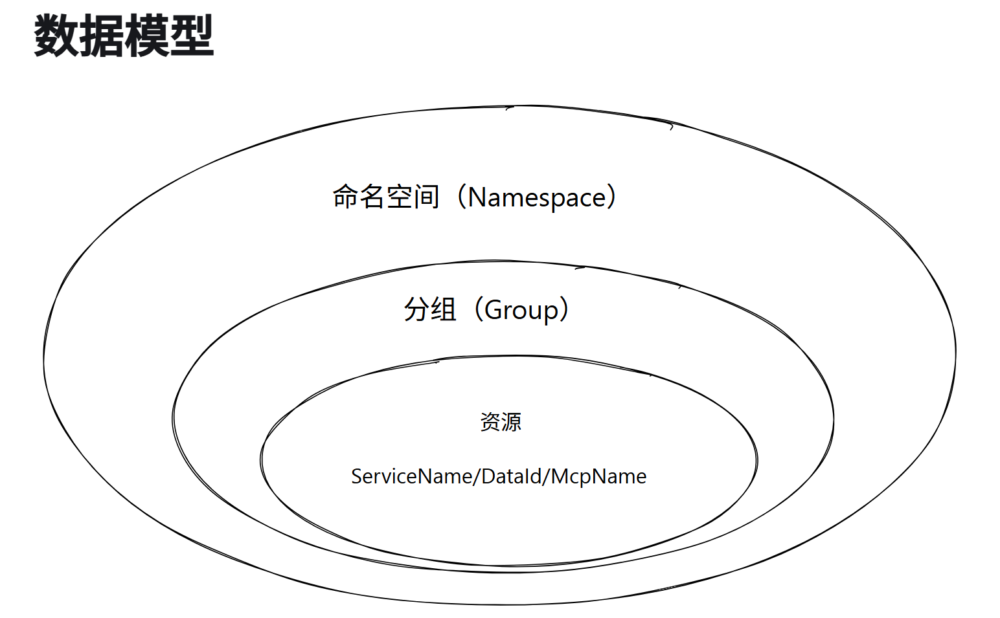
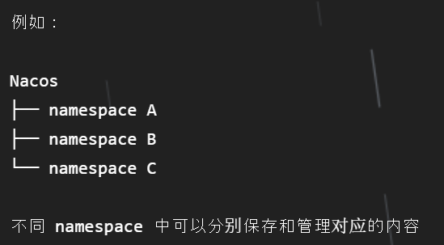
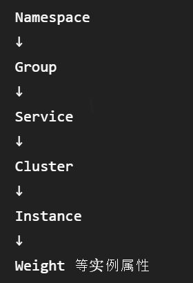
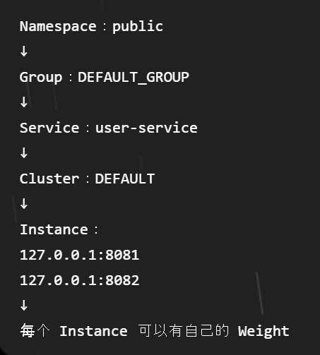
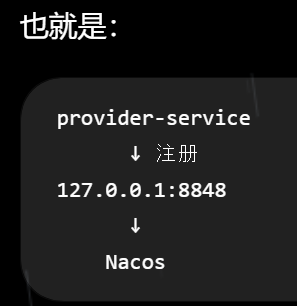
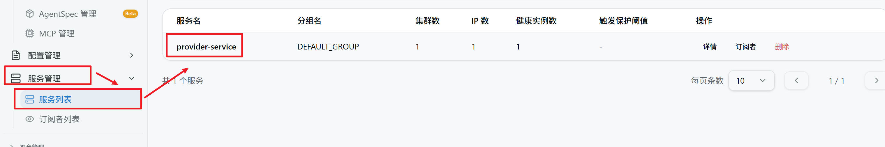

# Week3：服务注册与发现实践——Nacos 使用

## 服务的注册与发现（统一管理）

当系统拆分成多个微服务后，服务数量增加且彼此之间需要相互调用，服务的寻找和管理便成了需要解决的问题。因此需要对服务进行统一管理，实现服务的注册与发现。

如果没有统一管理，每个服务都需要自己记录其他服务的信息，服务多起来后维护会十分复杂。

服务注册与发现的核心目的，就是让多个微服务能够被统一管理，并能够在需要时找到彼此。

### 服务注册

服务启动后，需要把自己的相关信息登记并保存到统一的服务管理中心，告诉中心“我是谁、我在哪里”，这个过程称为服务注册。

### 服务发现

当一个服务需要调用另一个服务时，需要先知道目标服务在哪里；其他服务通过注册中心找到目标服务的过程称为服务发现。

### 服务注册与发现的完整过程

服务 B 启动 → 注册自己的服务信息 → 注册中心统一保存 → 服务 A 查询 → 发现服务 B → 得到服务 B 的信息 → 调用服务 B

## Nacos 基本介绍

> Nacos 官方文档：[Nacos 概览](https://nacos.io/docs/latest/overview/)

Nacos 是一个用于动态服务发现、配置管理等场景的服务管理组件。

### Nacos 的两个特性（作用）

1. 实现配置的动态更改。
2. 实现服务的注册与发现。

### Nacos 相关概念

#### Namespace 命名空间



Namespace 可以理解为不同的空间，用于将不同内容进行区分和隔离。

Nacos 中的内容可以存放在不同的 Namespace 中。



#### Group 分组

在同一个 Namespace 内，还可以继续将不同服务进行分组管理。

#### Service 服务

服务提供方（Service Provider）提供可供复用和调用的服务。

服务消费者通常根据 Service Name 找到对应服务并调用该服务。

Nacos 中的 `Service` 是一个逻辑服务，不一定只有一个正在运行的程序实例。

#### Instance 服务实例

一个 Service 实际运行起来以后，对应一个具体的服务实例。

一个服务可以同时存在多个实例，每个实例都有自己的 IP + Port。

#### Cluster 集群

同一个 Service 下的多个实例还可以继续按照部署位置等因素进一步分组。

#### Weight 权重

权重是服务实例的一个属性。当同一个服务存在多个实例时，可以为不同实例设置不同的权重，以实现负载均衡等。

#### 概念之间的关系





## Nacos 的使用与启动

### 启动 Nacos

进入 Nacos 的 `bin` 目录，启动 Nacos 服务器：

```bat
startup.cmd -m standalone
```

`standalone` 代表以单机模式运行，而非集群模式。

> Nacos 3.x 首次启动时需要填写鉴权配置；首次进入控制台时还需要初始化 `nacos` 管理员密码。

启动完成后，在浏览器网址内输入 [http://127.0.0.1:8080](http://127.0.0.1:8080)，即可进入 Nacos 控制台页面。

（8848 是 Nacos 服务器 HTTP API 服务端口）

### 编写 Nacos 服务提供者

本质：将小单体应用注册到 Nacos 上，并进行参数配置。

1. 完成小单体应用，设计好 API，监听某个端口并运行。以 8081 为例，实际操作为把 `server.port=8081` 加入 `application.properties` 中。
2. 在 `pom.xml` 中加入 Nacos Discovery 依赖，使当前 Spring Boot 应用具备服务注册与发现的能力。

在 `pom.xml` 的 `<properties>` 中补上：

```xml
<spring-cloud-alibaba.version>2025.0.0.0</spring-cloud-alibaba.version>
```

再在 `<dependencies>` 中加入：

```xml
<dependency>
  <groupId>com.alibaba.cloud</groupId>
  <artifactId>spring-cloud-starter-alibaba-nacos-discovery</artifactId>
</dependency>
```

然后在 `</dependencies>` 后、`<build>` 前加入：

```xml
<dependencyManagement>
  <dependencies>
    <dependency>
      <groupId>com.alibaba.cloud</groupId>
      <artifactId>spring-cloud-alibaba-dependencies</artifactId>
      <version>${spring-cloud-alibaba.version}</version>
      <type>pom</type>
      <scope>import</scope>
    </dependency>
  </dependencies>
</dependencyManagement>
```

3. 在 `application.properties` 中加入以下配置，把该单体注册到 Nacos 上：

```properties
# Nacos 服务地址
spring.cloud.nacos.discovery.server-addr=127.0.0.1:8848

# Nacos 登录凭据
spring.cloud.nacos.discovery.username=nacos
spring.cloud.nacos.discovery.password=你的密码
```

随后重新加载 Maven。



另外，还可以配置如下参数：

- `spring.cloud.nacos.discovery.group=...`
- `spring.cloud.nacos.discovery.weight=...`
- `spring.cloud.nacos.discovery.ip=...`
- `spring.cloud.nacos.discovery.cluster-name=...`

### 启动服务并验证注册结果

完成服务提供者配置后启动 Spring Boot 项目，随后在 Nacos 控制台的“服务管理 → 服务列表”中可以发现，该服务已经成功注册。



<!-- learning-journey:update-history:start -->
## 更新记录

| 日期 | 类型 | 说明 |
| --- | --- | --- |
| 2026-09-20 | 首次发布 | 从语雀整理并发布到学习记录仓库 |
<!-- learning-journey:update-history:end -->
