# 数据库系统概论
## 数据库的四个基本概念：
### Data（数据）
+ **存储在某一媒体上能够识别的物理信号**，包括：
        * 数据内容：对事物特性的描述
        * 数据形式：数据某种存储形式
+ 数据所代表的含义——数据的语义
+ 数据在数据库中的最小存取单位是**数据项**

### Database/DB（数据库）
+ **长期储存****在计算机内、****有组织****的、****可共享****的****大量****数据的集合**

:::info
+ 基本特征：
        * 数据按一定数据模型组织、描述、存储（数据结构化）
        * 可为各种用户访问共享（数据共享程度）
        * 冗余度较小
        * 数据独立性较高（物理独立性&逻辑独立性）

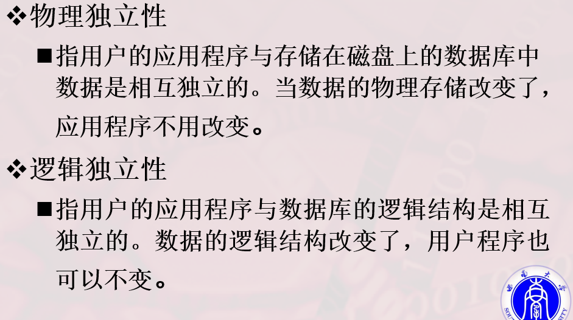

        * 易拓展（expandable）

:::

+ 数据库由DBMS控制管理

### DBMS（数据库管理系统）
+ <u>Database Management System</u>
+ 位于用户和应用系统之间数据管理**软件**
+ 用途：科学地**组织**和**存储**数据、高效地**获取**和**维护**数据
+ 数据库管理系统在数据库建立、运用和维护时对数据库进行统一控制，以保证数据的**完整性**、**安全性**，并在多用户同时使用数据库时进行**并发控制**，在发生故障后进行**数据库修复**

### DBS（数据库系统）
+ 由DB、DBMS、其他相关应用程序和DBA（数据库管理员）共同组成的整体
+ 数据库系统的特点：
        * 数据结构化
        * 数据高共享性和低冗杂性
        * 数据独立性
        * 数据统一控制和管理
                - 数据安全性（Security）
                - 数据完整性（Integrity）
                - 并发控制（Concurrency）
                - 数据恢复（Recovery）

## 数据库管理系统的主要功能
### 数据定义功能——DDL（数据定义语言）
+ Data Definition Language
+ 定义数据库的结构和各种模式

### 数据组织、存储和管理功能
### 数据操纵功能——DML（数据操纵语言）
+ Data Manipulation Language
+ DML类型：
        * 宿主型：
        * 自含型

### 数据库的事务管理和运行管理功能
### 数据库的建立和维护功能
### 其他功能：
+ 网络通信功能
+ 两个DBMS之间的数据转换功能
+ 异构数据库之间的互访和互操作功能

## 数据管理技术的产生和发展
+ 人工管理——>文件系统管理——>数据库系统管理
+ 需求推动技术发展、硬件软件发展推动技术发展

## 数据库系统的特点
+ 数据的管理者：DBMS
+ 数据面向的对象：现实世界
+ 数据共享程度高
+ 数据具有高度独立性和一定的逻辑独立性
+ 数据整体结构化
+ 数据控制能力：由DBMS统一控制和管理

## 数据管理处于文件系统阶段的缺点：
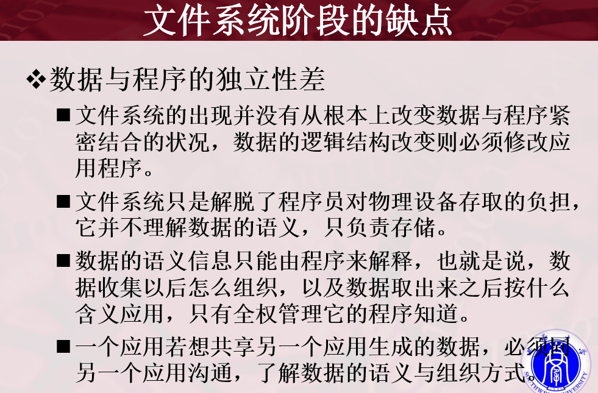

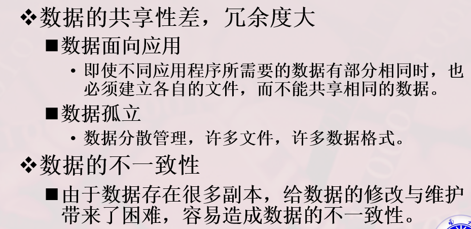

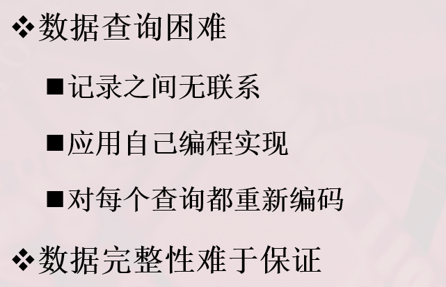

# 数据模型
+ 数据模型是对现实世界数据特征的抽象
+ 数据模型是数据库系统的核心和基础

## 两种数据模型（两个不同层次）
### 概念模型（信息模型）
+ 按照用户的观点抽象现实世界，对数据和信息建模，用于**数据库设计**

### 逻辑模型和物理模型
+ 逻辑模型是按计算机系统的观点对数据建模，用于**DBMS实现**
+ 物理模型描述数据在存储介质上的底层细节，专注于性能优化和存储管理
+ 逻辑模型包括：
        * 网状模型
        * 层次模型
        * 关系模型
        * 面向对象数据模型
        * 对象关系数据模型
        * 半结构化数据模型

### “三个世界，两步抽象”
+ 将现实世界中的客观对象抽象为**概念模型**：**<u>现实世界——>信息世界</u>**
+ 把**概念模型**转换为某一数据库管理系统支持的数据模式（**逻辑模型**）：**<u>信息世界——>机器世界</u>**
+ （逻辑模型到物理模型由DBMS完成）

## 概念模型
### 信息世界中的基本概念：
+ **实体（Entity）**
        * 客观存在并可相互区别的事物
        * 实体可以是具体的人、事、物或抽象的概念
+ **属性（Attribute）**
        * 实体所具有的某一特性
        * 一个实体可由若干个属性刻画
+ **码（Key）**
        * 唯一标识实体的属性集
+ **实体型（Entity Type）**
        * 对一类实体进行的抽象描述
        * 实体型由实体名及其属性名集合组成
+ **实体集（Entity Set）**
        * 具体实体的集合，是多个实体的汇总
+ **联系（Relationship）**
        * 现实世界中事物内部与事物之间的联系——>信息世界中实体内部的联系和实体之间的联系
            + 实体内部的联系：实体各属性之间的联系
            + 实体之间的联系：一对一（1：1）、一对多（1：n）、多对多（m：n）多种类型

### 实体-联系方法（E-R 方法/E-R 模型）

E-R 方法使用 E-R 图描述现实世界的概念模型。实体、属性、联系及不同联系类型的详细画法，参见 [E-R 图元素与语义](2025-09-23-E-R图元素与语义.md)。

# 数据模型的组成要素
+ 三要素：
        * 数据结构
        * 数据操作
        * 数据的完整性约束条件

## 数据结构
+ 定义了数据库系统中数据的组织形式以及对象之间的联系
+ 是对系统**静态特性**的描述

## 数据操作
+ 对数据库中的对象允许进行的操作以及操作规则的集合
+ 是对系统**动态特性**的描述

:::success
+ 数据操作的类型：
        * 查询
        * 更新
            + 插入
            + 删除
            + 更改

:::

## 数据的完整性约束条件
+ 从**实体、参照、用户自定义**三个层面进行数据保障

### 实体完整性：
### 参照完整性
### 用户自定义完整性
# 层次模型（了解）
> 用树形结构表示数据及其联系的数据模型
>
>     - 每个父节点可以有多个子节点
>     - 每个子节点只能有一个父节点
>

+ 属于非关系模型
+ 数据结构由节点和连线组成
        * 节点——>实体型或实体型的实例
        * 连线——>一对多的父子联系
        * （下图 ~~“实体型”~~ ”实体集“）
+ 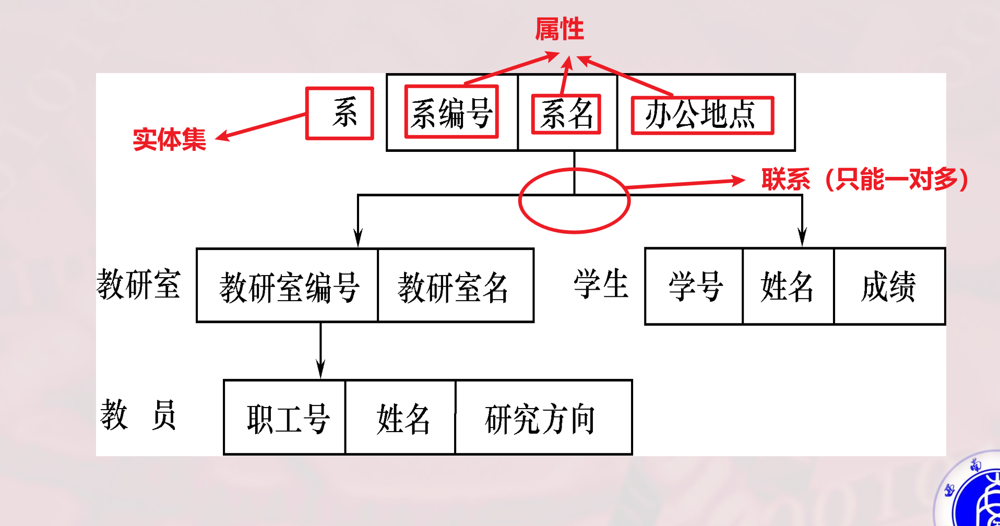

## 模型术语：
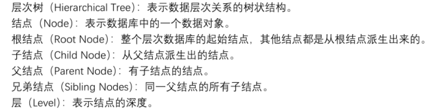

+ 叶节点：没有子节点的节点

## 特点：
+ 节点的双亲是唯一的（只能表达一对多的实体联系【当节点的意义是实体型的某个实例的情况下】）
+ 可以定义排序字段（码字段)
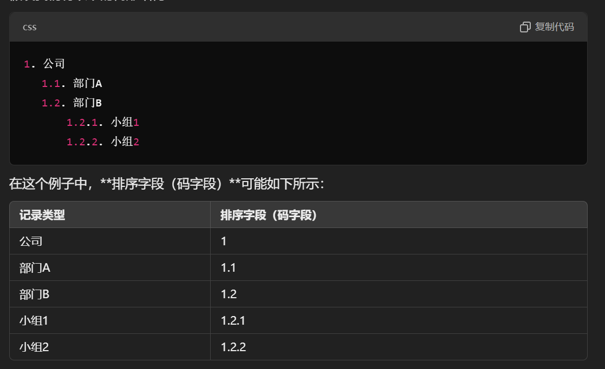
+  记录值只有按其路径查看，才能显示出全部意义（每个子节点的记录值都依赖于它的父节点的记录值，无法单独存在）
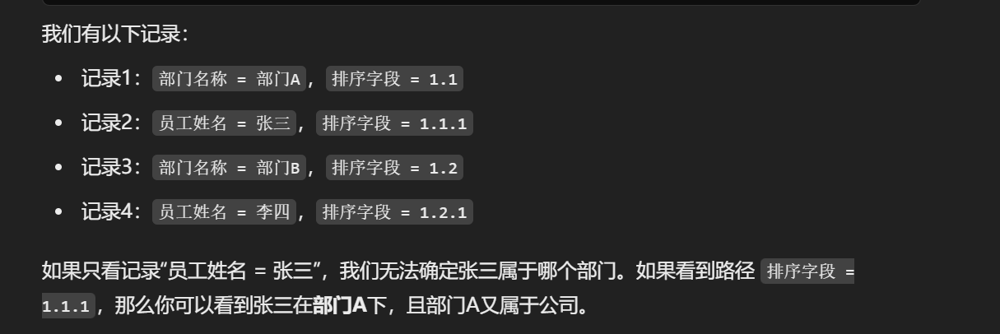

## 层次模型的完整性约束条件：
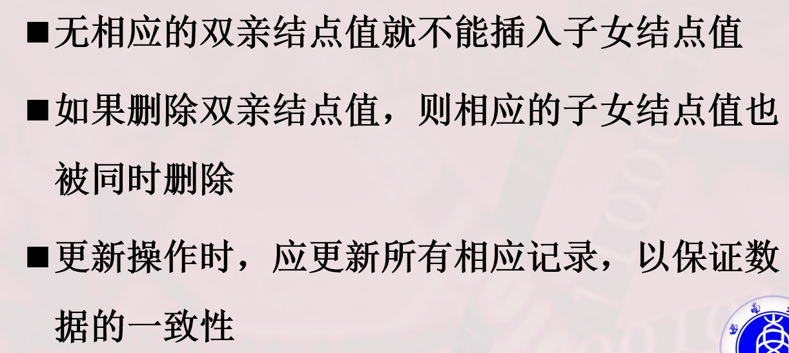

## 层次结构的缺陷：
+ 数据操作复杂
+ 结构僵化
+ 无法表达多对多结构：
        * 处理对策：将多对多联系分解为一对多
            + 冗余结点法
            + 虚拟结点法

# 网状模型（了解）
> 通过图结构来组织数据及其联系的数据模型
>
> + 允许一个以上的结点无双亲
> + 一个结点可以有多于一个的双亲
>

+ 属于非关系模型
+ 数据结构同样由节点和连线组成
+ 允许多对多联系
+ 采用指针方式查询导航、维护数据完整性
+ **层次模型其实是网状模型的一个特例**

## 模型术语：
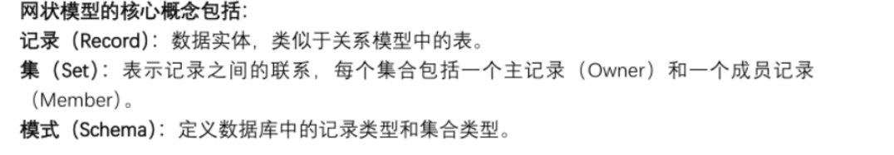

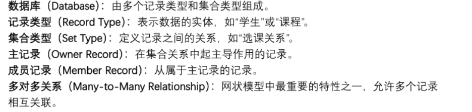

## 网状结构的缺陷：
+ 数据库结构复杂
+ 数据库语言复杂
+ 使用时必须了解结构细节（存储路径）

# 关系模型
> 通过二维表（即关系）的形式组织数据及其联系的数据模型
>

## 模型术语：
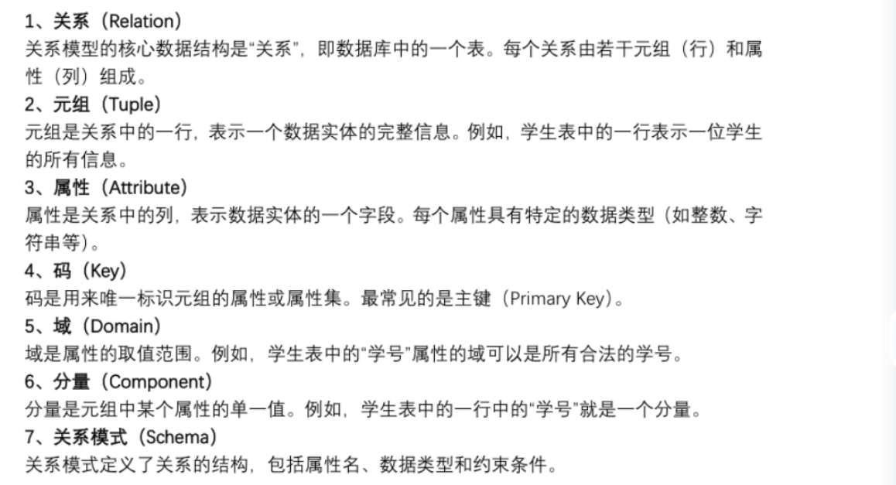

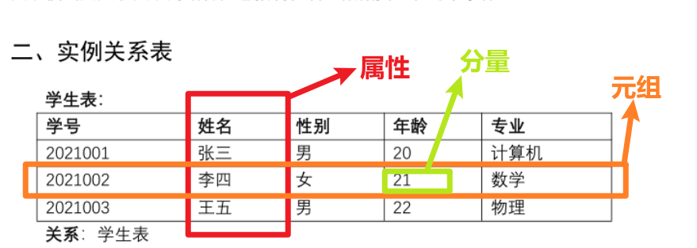

## 关系模型的规范化
+ 关系必须是规范化的，满足规范化条件：
        * 关系中的每一各分量不可分，不允许表内含表

## 关系模型的完整性约束：
### 实体完整性
+ 每个元组必须有唯一的主键，不能重复
+ 主键不能取空值

### 参照完整性
+ 确保外键的值必须存在于被引用的表中（如成绩表中的学号就是外键（外码），成绩表中的任一学号都应存在于学生表中）
+ 被引用的表是被参照关系，外键存在的表是参照关系
+ 外键的值可以为空

### 值域完整性（用户定义的完整性）
+ 确保属性的取值符合预定义的范围
+ 是人为给数据定的硬性规矩

# 数据库系统结构
## 数据库系统模式
+ 数据库的总体设计蓝图

### 数据库系统模式中的概念解析：
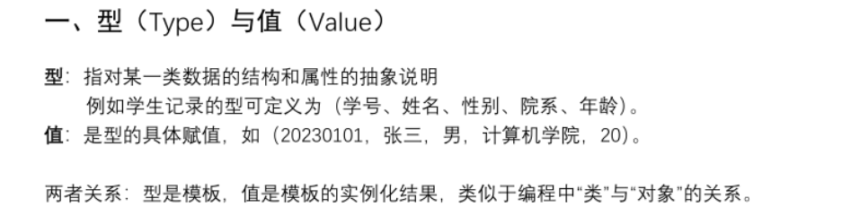

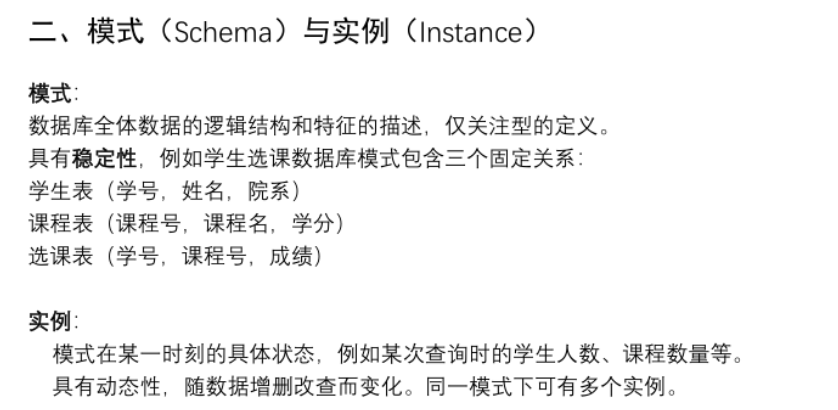

## 三级模式结构（从开发者的角度上看）
### 模式（逻辑模式）：
+ 对**全体**数据的逻辑结构和特征的描述
+ 一个数据库只有一个模式
+ 模式是三级模式结构的中间层次

### 外模式（子模式/用户模式）
+ 用户所使用的**局部**数据的描述与视图
+ 一个数据库可以有多个外模式，反映了不同用户的需求

### 内模式（存储模式）
+ 对数据物理结构和存储方式的描述
+ 一个数据库只有一个内模式

## 二级映像功能
+ 数据库的二级映像是在数据库系统内部实现三级模式结构的转换过程
+ 二级映像通过**<u>分离数据的逻辑层和物理层</u>**，降低数据库与应用程序之间的耦合度，使得系统更易维护和拓展
+ 内模式——>模式——>外模式

### 外模式/模式映像
+ 模式如果发生改变，DBA调整外模式/模式映像，使得外模式保持不变而不用修改应用程序

### 模式/内模式映像
+ 内模式如果发生改变，DBA修改模式/内模式映像，使得模式保持不变，应用程序不受任何影响

# 数据库系统的组成
## 硬件平台&数据库
## 软件架构
## 人员

<!-- learning-journey:update-history:start -->
## 更新记录

| 日期 | 类型 | 说明 |
| --- | --- | --- |
| 2026-07-23 | 首次发布 | 从语雀整理数据库基本概念、数据模型与数据库系统结构并发布 |
<!-- learning-journey:update-history:end -->
