# 关系数据库与关系代数

## 关系数据结构
关系数据结构——关系（二维表）

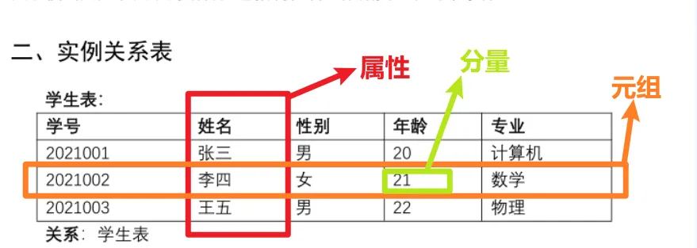

# 形式化定义
+ 用数学规则保证表格信息正常不乱套的规定，包括：
        * 每列（属性）内只能填写什么样、什么格式、什么范围的数据：——>**【域】**
        * 生成所有可能的组合：——>**【笛卡尔积】 **
        * 从笛卡尔积中筛选出所有的有效数据：——>**关系**

---

## 域（Domain）：
        * 属性所有可能性取值的的集合
        * 数据完整性的第一道防线
        * 一个属性对应一个域
        * 用$ D_n $表示

## 笛卡尔积：
        * 将每个域中的元素各取一进行组合，构成一组数据
        * 笛卡尔积的结果是一个集合
            + 集合中的每个元素都代表一个元组（相当于表格中的一行），表示一种可能的数据组合；
            + 每个元组中的一个元素即是一个分量
        * 基数计算：
            + 例：3个域，每个域中有2个值；则基数计算为：$ 2*2*2 $

## 关系：
        * 关系是笛卡尔积的有效子集

### 关系的目&度
+ $ D_1 \times D_2 \times \cdots \times D_n $（某个笛卡尔积）的有效子集叫做在域$ D_1,D_2,\cdots ,D_n $上的关系，表示为$ R（D_1,D_2,\cdots,D_n) $,n即为关系的目/度
+ $  n= \begin{cases}
1,\quad 该单元为单元关系（一元关系） \\
2,\quad 二元关系 \\
\cdots

\end{cases}  $
+ n目关系必有n个属性

### 关系的候选码
+ 其值能唯一地标识一个元组的一组属性（该属性组的子集不能）
        * **全码:	**关系模式中的全部属性都是候选码的情况
        * **主码：	**当一个关系中有多个候选码时，选定其中一个候选码为主码
        * **主属性：	**候选码的各属性
        * **非主属性/非码属性：**不包含在<u>任何候选码</u>内的属性

### 关系的三种类型：
+ 基本关系/基本表
+ 查询表
+ 视图表

### 关系的性质：
+ 有限性：表中的关系必须是有限集合
+ 无序性
        * 列的无序性
        * 行的无序性

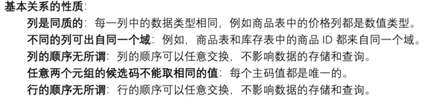

### 关系规范化（范式\NF）
+ 关系模型要求关系必须是规范化的
+ 例：表中不许有表

# 关系模式
> 对于关系的描述
>

表示为：$ R(U,D,DOM,F) $

+ R：关系名
+ U：该关系的属性名集合
+ D：U中属性所来自的域
+ DOM：属性向域的映像集合
        * 属性向域的映像：说明属性分别来自哪个域
        * 如学生属性和老师属性都来自于同一个域：人；则$ DOM(student) = DOM(teacher) = Person $
+ F：属性间数据依赖关系集合

例：

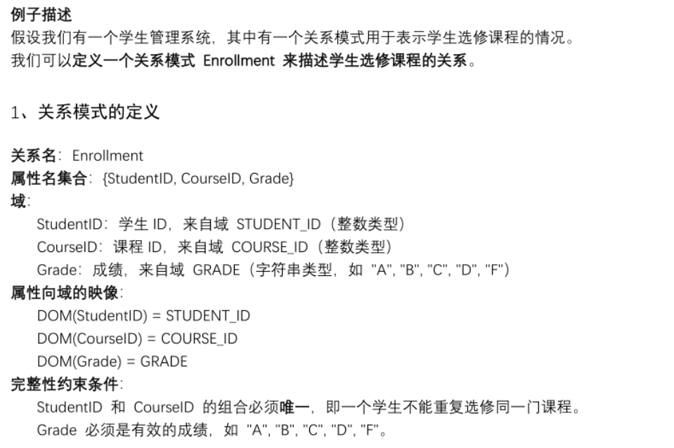

**关系模式由人来定义，描述了关系的结构等，刻画了完整性约束条件，确保数据库中的数据符合规则**

# 关系数据库
> 多个相互关联的关系构成的数据库
>

+ 关系三要素：关系、关系模式、关系数据库
        * 关系模式（设计蓝图）——>关系（一张表）——>关系数据库（整套表）

## 关系数据库的型
+ 即关系数据库模式，由于描述关系数据库
+ $ 关系数据库的模式 = 各个关系的模式 + 所有域定义 $

## 关系数据库的值
+ 关系数据库中的各种关系

# 关系的完整性
## 关系模型的三层完整性约束（见第一章）
1. 实体完整性
2. 参照完整性
3. 用户定义的完整性：具体领域的约束条件

【前两者被称为：**关系的两个不变性**】

# 关系操作
+ 关系操作由关系模型定义，由数据库管理系统的语言去实现
        * 关系模型定义了**关系代数（操作步骤）**和**关系演算（条件描述）**两种框架，提供了一种**操作对象和操作结果**组成的集合（关系操作的方式：**“一次一集合”**）
        * 关系代数——>步骤说明书；关系演算——>条件描述书，都能实现相应的结果

## 五种基本的关系操作：
        * **选择**：筛选出符合条件的行
        * **投影**：筛选出符合条件的列
        * **并**：合并两个结构相同的表（例如合并3班学生表和4班学生表）
        * **差**：找差异（如找出选了物理中没有选政治的学生）
        * **笛卡尔积**：得到所有可能的组合
+ 通过组合基本操作，可以实现复杂操作

## 关系代数
+ 关系代数的运算对象是关系
+ 运算符：

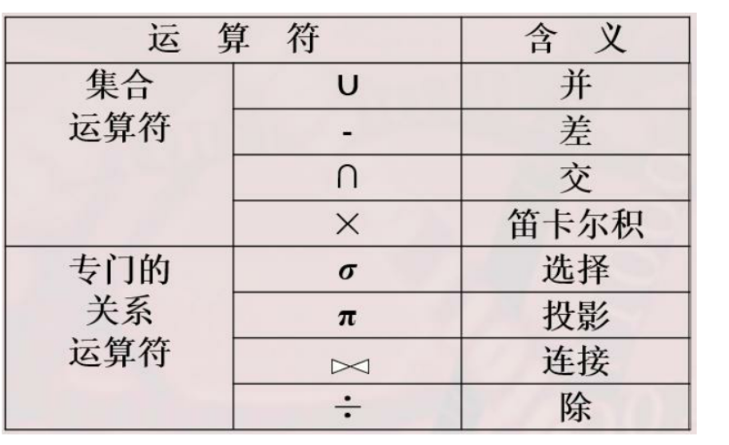

        * 集合运算是从关系的“行”的角度上进行运算
        * 关系运算还会涉及关系的“列”

### 并运算：
+ 性质：
        * **两个关系必须并相容：列数相同，且对应属性来自相同或可比较的域**
        * 运算结果会将重复元组进行合并，保留全部的不重复元组

### 差运算：
+ 性质：
        * **两个关系必须并相容：列数相同，且对应属性来自相同或可比较的域**
        * $R-S$ 保留属于 $R$、但不属于 $S$ 的元组

### 交运算：
+ 性质：
        * **两个关系必须并相容：列数相同，且对应属性来自相同或可比较的域**
        * 运算结果仅保留两个关系共有的元组
        * $ R \cap S = R - (R - S) $

### 笛卡尔积运算：
+ 性质：
        * 不要求两个关系具有相同的目
        * 运算结果的元组数目为两个关系元组数目的积
        * 运算结果的  列 数目为两个关系  列  数目的和

---

【以下是关系运算】：

**所有关系运算都是用五种基本关系操作组合形成的一层新的抽象**

+ **具体值：**元组在属性上的分量；
表示为：$ t[age] = 20 $(t为关系中的一个特定元组)
+ **元组的连接：**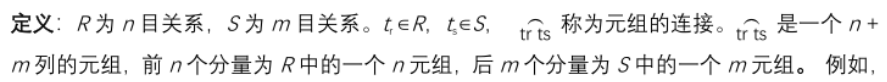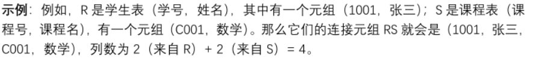
+ 象集定义：（拥有相同的属性的一组实体的集合）
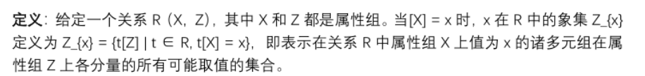
即：当X的值为x时 该元组对应的所有Z属性的值的集合
例：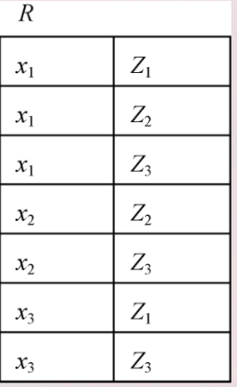

$ x_1 $在$ R $上的象集为：$ Z_{x_1} = \{{Z_1,Z_2,Z_3}\} $

### 选择（Selection）
+ 运算规则：$ \sigma_{Sage>18}(Student) $
表示：<u>从Student关系表中选择出Sage属性大于18的元组</u>

### 投影（Projection）
+ 运算规则：$ \pi_{
Sname,Sage}(Student) $
表示：<u>从Student关系表中投影出Sname和Sage属性所在列</u>
+ **投影操作默认是去重的**

### 连接（Join）
+ **等值连接：**
        * $ SC\underset{SC.Cno = Course.Cno}{\bowtie}Course $
        * 表示：将$ SC $关系表与$ Course $关系表的笛卡尔积 中选择出
$ SC $表中$ Cno $属性值与$ Course $属性表中$ Cno $属性值相同的元组
+ **自然连接：**
        * $ SC\bowtie Course $
        * 表示：将$ SC $关系表与$ Course $关系表共有属性的值相同的元组进行连接，并把重复的属性列从中剔除
+ 悬浮元组：自然连接时连接不上（共有属性某个值在另一个表中没有）的元组
+ 左外连接：保留左边关系$ SC $中的悬浮元组，在没有值的属性上填写空值$ NULL $
+ 右外连接：保留右边关系$ Course $中的悬浮元组，在没有值的属性上填写空值$ NULL $
+ 全外连接：$ \underline{左外连接 + 右外连接} $

### 除运算（Division）
+ **实际意义：挑选出符合被除数全部条件的除数的对象**

       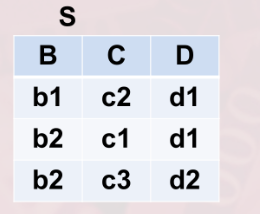                                         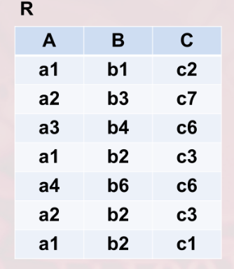

除法运算：$ R \div S $：

1. 在被除数$ S $中投影出$ R $与$ S $相同的属性列：
$ \pi_{B,C}(R) = $
$ \Downarrow $
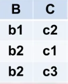
2. 在除数$ R $中投影出$ R $与$ S $不同的属性列（取消重复值）：
$ \pi_A(R - S)= $
$ \Downarrow $
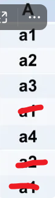
3. 在$ R
 $中求$ R'
 $中属性对应的象集：
$ R_{a1} = \{(b1,c2),(b2,c3),(b2,c1)\} $
$ R_{a2} = \{(b3,c7),(b2,c3)\} $
$ R_{a3} = \{(b4,c6)\} $
$ R_{a4} = \{(b6,c6)\} $
4. 找到步骤一中是否包含以上象集：
$ \because $只有$ a1 $的象集包含在步骤一中
$ \therefore R \div S = \{a1\} $
+ **必须先投影再进行除法运算**

## 其他逻辑运算符：
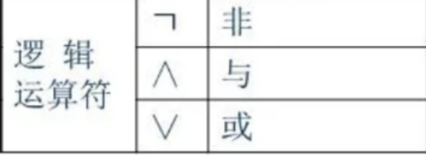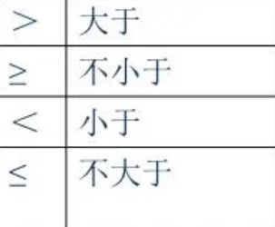

+ 

<!-- learning-journey:update-history:start -->
## 更新记录

| 日期 | 类型 | 说明 |
| --- | --- | --- |
| 2026-07-23 | 首次发布 | 从语雀整理关系模型、关系代数及连接与除运算笔记并发布 |
<!-- learning-journey:update-history:end -->
