# SQL 基础与数据操作

## SQL 概述
+ <u>Structured Query Language</u>（结构化查询语言）

## SQL特性：
:::tips
+ **综合统一：**
        * 综合数据定义、数据操纵、数据控制功能于一体
+ **高度非过程化：**
        * 只需定义需要进行的操作，无需了解操作的过程
+ **面向集合的操作方式：**
        * 操作的对象不再是单个数据，可以是元组的集合
+ **同种语法结构提供不同使用方式：**
        * 独立语言 + 嵌入式语言（嵌入高级语言中进行操作）
+ **语言高度自然化**

:::

## SQL的数据库三级模式结构：
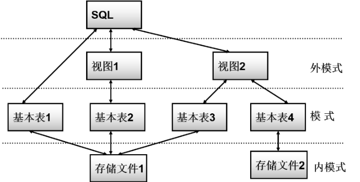

### 外模式——视图
+ 从基本表中导出的虚表（数据不存储在数据库中，而是动态生成的）
        * 即视图提供给用户的是动态的查询结果，而不是真实存储的新表
        * <font style="color:rgb(24, 30, 51);">用户可以在视图上再定义视图</font>

### 模式——基本表
+ 本身存储在数据库中的实表，存储了实际的数据
+ 基本表存储实际数据；针对视图的操作会由 DBMS 转换为对基本表的操作，但并非所有视图都可以更新
+ <font style="color:rgb(24, 30, 51);">一个（或多个）基本表对应一个存储文件</font>

### <font style="color:rgb(24, 30, 51);">内模式——存储文件</font>
+  数据库物理层的一部分
+ 实际存储多个基本表

# 数据定义
## 模式的定义和删除：
### 定义模式：
```plsql
CREATE SCHEMA 模式名 AUTHORIZATION 用户名 (其他定义语句)
```

+ 实现效果：<u>为 XXX 用户定义一个 XXX 模式</u>
+ 模式定义语句中可以接受$ \text{CREATE TABLE} $(表定义语句)、$ \text{CREATE VIEW} $(视图定义语句)、$ \text{GRANT} $(授权定义语句)

### 删除模式：
```plsql
DROP SCHEMA 模式名 CASCADE
DROP SCHEMA 模式名 RESTRICT
```

+ $ \text{CASCADE} $(级联操作)：删除模式的同时会把模式下的所有数据库对象一并删除
+ $ \text{RESTRICT} $(限制操作)：如果该模式下已经定义了任何数据库对象，则拒绝该删除语句的执行

## 基本表的定义、删除和修改：
### 数据类型：
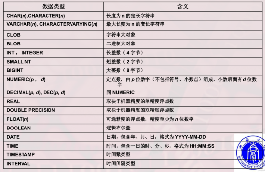

### 定义基本表：
```sql
CREATE TABLE 基本表名
  (列名 数据类型(长度) 该列的完整性约束条件,
   列名 数据类型(长度) 该列的完整性约束条件,
   列名 数据类型(长度) 该列的完整性约束条件，
   该表的完整性约束条件);
```

:::color2
+ **完整性约束语句：**
        * <u>主码约束</u>：`PRIMARY KEY`——将该列设置为该表的主码
        * <u>唯一性约束</u>：`UNIQUE`——确保该列每个属性值不重复
        * <u>非空值约束</u>：`NOT NULL`——确保该列每个属性值不为空
        * <u>参照完整性约束</u>【属于表级完整性约束】：
`FOREIGN KEY (外码名)`
	`REFERENCES 被引用的表名(被引用的列名)`
			`ON 违约处理1`
			`ON 违约处理2`
—— 确保表中的外码列引用的数据在另一个被引用表的对应列中确实存在
+ 主码约束&唯一性约束的区别：

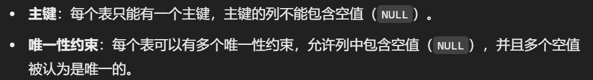

:::

### 定义基本表所属的模式
+ **在定义表时显式给出所属模式：**

```sql
CREATE TABLE 模式名.表名(

)
```

+ **创建模式时同时创建表：**

```plsql
CREATE SCHEMA TEST AUTHORIZATION Pinkman
  CREATE TABLE tab1(
    COL1 SMALLINT,
    COL2 INT,
    COL3 CHAR(20)
  );
```

+ **设置搜索路径：**
        * 设置搜索路径后定义表时可以省略所属模式名，系统会根据搜索路径中的第一个存在的模式名作为该表所属的模式

```plsql
SHOW search_path;
SET search_path TO 表名,public;
--再创建表即可按此路径自动绑定所属模式
```

:::info
<u>搜索路径：</u>

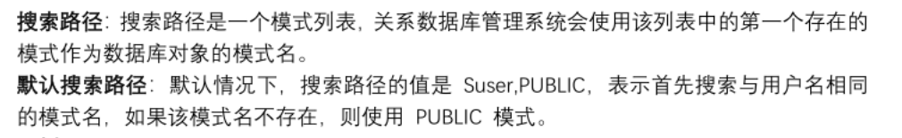

:::

### 修改基本表中的数据（增删改）：
```plsql
--在A表中增加列a,数据类型为日期类型：
ALTER TABLE A ADD COLUMN a DATE;

--给A表中a列增加列级约束条件：
ALTER TABLE A ADD UNIQUE(a);
ALTER TABLE A ADD CONSTRAINT a_check CHECK(a BETWEEN 0 AND 100);

--将A表中a列的数据类型改为整数类型：
ALTER TABLE A ALTER COLUMN a INT;

--把A表中的a列删除，且删除引用了该列的全部对象：
ALTER TABLE A DROP COLUMN a CASCADE;

--把A表中的完整性约束i删除，且删除使用了该约束的全部对象：
ALTER TABLE A DROP CONSTRAINT i CASCADE;
```

### 删除基本表：
```plsql
--删除表A：
DROP TABLE A CASCADE;
DROP TABLE A RESTRICT;
```

+ `CASCADE`：删除该表，且依赖于该表所建立起来的所有视图、索引、触发器等全部对象会被一并删除
+ `RESTRICT`：若存在依赖于该表建立起来的视图、索引、触发器等对象，则该表不能被删除

## 索引
### 作用：
        * 快速定位，提高查找速度；
        * 实现路径多样化，自主选择最合适的查找路径；

### 索引的建立：
+ **<font style="color:#DF2A3F;background-color:#FBDE28;">索引支持设置索引自身的完整性约束</font>**

```plsql
CREATE 完整性约束 索引种类(可无) INDEX 索引名
  ON 表名(
    列名 ASC/DESC,			 --（升序/降序）
    列名 ASC/DESC,			 --默认是升序
  );


  --例：为A表中的a属性按降序建立唯一索引 Tno：
  CREATE UNIQUE INDEX Tno
    ON A(a DESC);
```

### 索引的修改：
```plsql
--将索引Tno重命名为Cno：
ALTER INDEX Tno RENAME TO Cno;
```

### 索引的删除:
```plsql
--删除Cno索引：
DROP INDEX Cno;
```

## 数据字典
+ 数据字典是关系数据库管理系统的一组系统表，记录了该数据库中的所有定义信息
+ 一个数据库对应着一个数据字典
+ 执行SQL定义语句的过程，就是在更新数据字典中对应信息的过程

# 数据查询
## 单表查询
> 只涉及一个表的数据查询
>

### 查询指定列：
> 相当于$ \pi $投影操作
>

```sql
SELECT 列名1, 列名2 FROM 表名;
```

### 查询全部列：
```sql
-- 按表中原有列顺序查询全部列
SELECT * FROM 表名;

-- 按指定顺序查询列
SELECT 列1, 列2, 列3 FROM 表名;
```

### 查询列的特性
+ 查询对象可以是表达式、常量、函数：
+ 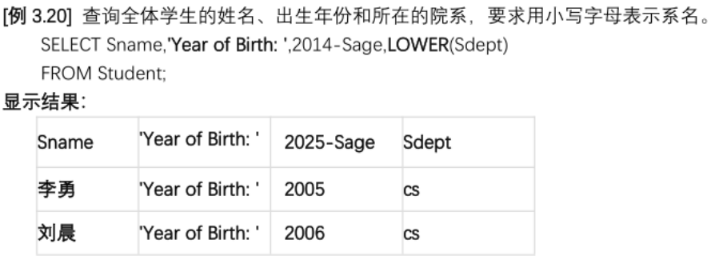
+ 通过设置别名来改变查询结果的列标题：
+ 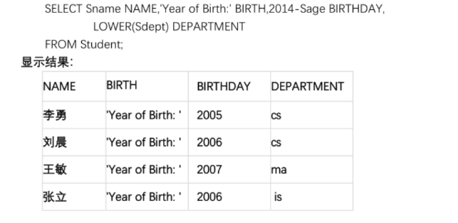
+ 可以设置查询是否取消重复的行（投影去重）：
        * `DISTINCT`&`ALL`关键字【默认为ALL】

```sql
-- 查询不重复的学号
SELECT DISTINCT Sno FROM SC;
```

### 查询元组中的某属性符合规定条件的列：
> 相当于$ \sigma $+$ \pi $ 操作
>

+ `WHERE`子句：

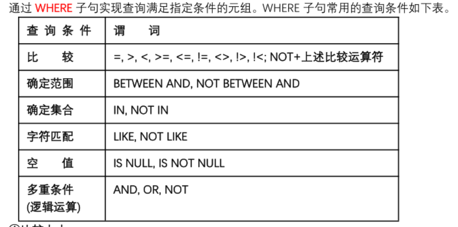

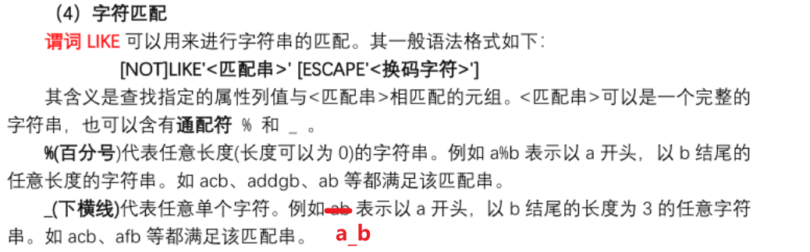

+ **<font style="color:#DF2A3F;background-color:#FBDE28;">不包含通配符</font>**`**<font style="color:#DF2A3F;">%</font>**`**<font style="color:#DF2A3F;background-color:#FBDE28;"> & </font>**`**<font style="color:#DF2A3F;">_</font>**`**<font style="color:#DF2A3F;background-color:#FBDE28;">的</font>**`**<font style="color:#DF2A3F;">LIKE</font>**`**<font style="color:#DF2A3F;background-color:#FBDE28;">&</font>**`**<font style="color:#DF2A3F;">NOT LIKE</font>**`**<font style="color:#DF2A3F;background-color:#FBDE28;">字符匹配 相当于</font>**`**<font style="color:#DF2A3F;">=</font>**`**<font style="color:#DF2A3F;background-color:#FBDE28;">&</font>**`**<font style="color:#DF2A3F;">!=</font>**`
+ **<font style="color:#DF2A3F;background-color:#FBDE28;">若要匹配的字符本身就存在通配符</font>**`**<font style="color:#DF2A3F;">%</font>**`**<font style="color:#DF2A3F;">、</font>**`**<font style="color:#DF2A3F;">_</font>**`**<font style="color:#DF2A3F;">，</font>****<font style="color:#DF2A3F;background-color:#FBDE28;">则使用</font>**`**<font style="color:#DF2A3F;">ESCAPE</font>**`**<font style="color:#DF2A3F;background-color:#FBDE28;">换码语句（示例见下）</font>**

```sql
-- 基本查询：从 Student 表中查询性别为男的学生姓名
SELECT Sname FROM Student
WHERE Ssex = '男';

-- DISTINCT 去重查询与 WHERE 条件查询：
-- 从 SC 表中查询至少一科成绩不及格的学生学号
SELECT DISTINCT Sno FROM SC
WHERE grade < 60;

-- 从 Student 表中查询年龄不在 20～23 岁的学生姓名与年龄
SELECT Sname,Sage FROM Student
WHERE Sage NOT BETWEEN 20 AND 23;

-- IN 语句确定集合查询：
-- 查询系别不在计算机科学系和数学系的学生姓名
SELECT Sname FROM Student
WHERE Sdept NOT IN('MA','CS');

-- LIKE 语句匹配查询：查询所有姓刘的学生姓名
SELECT Sname FROM Student
WHERE Sname LIKE '刘%';

-- 查询姓名第二个字不是“一”的学生姓名
SELECT Sname FROM Student
WHERE Sname NOT LIKE '_一%' ;

-- ESCAPE 语句换码查询：
-- 查询 Cname 以 DB_ 开头且倒数第三个字母为 i 的课程名
SELECT Cname FROM Course
WHERE Cname LIKE 'DB\_%i__' ESCAPE '\';
```

```sql
-- IS NULL 语句空值查询：查询 Grade 不为空的学生学号
SELECT Sno FROM SC
WHERE Grade IS NOT NULL;

-- AND、OR 语句多重条件查询：
-- 查询年龄小于 18 岁的女性学生姓名
SELECT Sname FROM Student
WHERE Sage < 18 AND Ssex = '女';
```

### 将查询结果按照特定规则的顺序排列：
+ `ORDER BY`语句：
        * `ASC`升序，`DESC`降序（默认为`ASC`）

```plsql
-- 查询结果按照系别升序排列，同一系别按照年龄降序排列
SELECT * FROM Student
ORDER BY Sdept, Sage DESC;
```

### 聚集函数
+ 一步抽象，集合并增强查询的功能和效率
+ 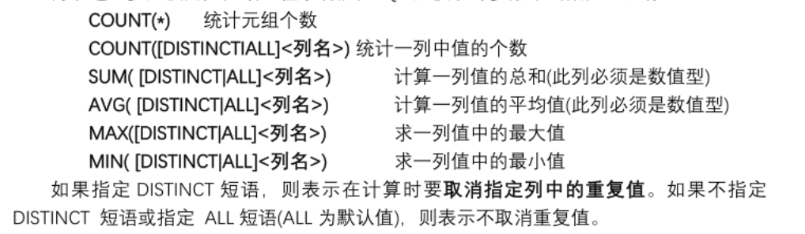
+ 聚集函数对于空值的处理：除了`COUNT(*)`外都会直接跳过空值而不进行计算
+ `<font style="color:#DF2A3F;">WHERE</font>`<font style="color:#DF2A3F;">语句中不能包含聚集函数，聚集函数只能用于:</font>
        * `SELECT`语句
        * `GROUP BY` 中的 `HAVING` 语句

```plsql
**在Student表中查询学生总人数**
SELECT COUNT(*) FROM Student;

**查询学号为 S0001 的学生所选修课程的总学分**
SELECT SUM(Ccredit) FROM SC,Course
WHERE Sno = 'S0001' AND SC.Cno = Course.Cno;

**在SC表中查询出成绩的最大值（去掉重复最大值）**
SELECT MAX(DISTINCT Grade) FROM SC
```

### 把数据按特定条件分组，按组使用聚集函数分别计算：
+ `GROUP BY` 语句
        * 作用：规定聚集函数的操作对象
        * 分组：按照列值规定进行分组，值相等的为一组
        * 分组后聚集函数将作用于每一组，每一组都有一个函数值
+ `HAVING`语句
        * 作用：对分组按特定条件再次进行筛选
        * 只有满足条件的组才会留下
        * `WHERE`语句作用于元组，目的是把符合条件的元组选出
        * `HAVING`语句作用于分组，目的是把符合条件的组选出

```plsql

**查询学生中男生女生各有多少人**
SELECT Ssex,COUNT(*)
FROM Student
GROUP BY Ssex;

**查询每个学生选了几门课程**
SELECT Sno,COUNT(*)
FROM SC
GROUP BY Sno;

**查询出选了三门课程以上的学生学号**
SELECT Sno FROM SC
GROUP BY Sno
HAVING COUNT(*) > 3;

**查询选课人数大于50人的课程号**
SELECT Cno FROM SC
GROUP BY Cno
HAVING COUNT(*) > 50;

**查询所有平均成绩大于等于90分的学生学号和平均成绩**
SELECT Sno,AVG(Grade)
FROM SC
GROUP BY Sno
HAVING AVG(Grade) >= 90;
```

## 连接查询
**<u><font style="color:#DF2A3F;background-color:#FBDE28;">没有连接条件的查询多表的结果——是笛卡尔积</font></u>**

```plsql
SELECT *
FROM Student,SC
```

### 等值连接查询

```plsql

**从Student与SC两个表中查询每个学生选修课程等全部情况[等值连接]**
SELECT *
FROM Student,SC
WHERE Student.Sno = SC.Sno
```

### 自然连接
+ <u>自然连接就是等值连接去重（去掉重复列）</u>

```plsql
**从Student与SC两个表中查询每个学生选修课程等全部情况[自然连接]**
SELECT *
FROM Student NATURAL JOIN SC;
```

+ 一条SQL语句可以同时完成连接和选择操作：

```plsql
**查询选修2号课程且成绩在90分以上的所有学生的学号和姓名**
SELECT Student.Sno,Sname
FROM Student,SC
WHERE Student.Sno = SC.sno AND SC.Cno = '2' AND SC.grade > 90
```

### 自身连接
+ 本表取两个别名，自己与自己连接

```plsql
**Course表中只有每门课程的先修课，现在要求找到所有课程先修课的先修课**
SELECT First.Cno,Second.Cpno
FROM Course First,Course Second
WHERE First.Cpno = Second.Cno;
```

### 左外连接&右外连接
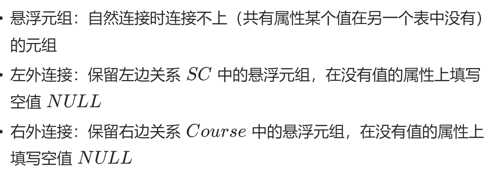

```plsql
**从Student与SC两个表中查询每个学生选修课程等全部情况[左外/右外/全外连接]**
SELECT *
FROM Student LEFT/RIGHT/FULL OUTER JOIN SC ON (Student.Sno = SC.Sno);

**去掉重复值版本**
SELECT *
FROM Student LEFT OUTER JOIN SC USING(Sno);
```

### 多表查询
```plsql
SELECT *
FROM Student,SC,Course
WHERE Student.Sno = SC.Sno AND SC.Cno = Course.Cno;
```

## 嵌套查询：
+ 子查询的`SELECT`语句中不能包含`ORDER BY`语句，`ORDER BY`只能对最终结果进行查询

### `IN`语句嵌套查询：
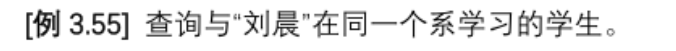

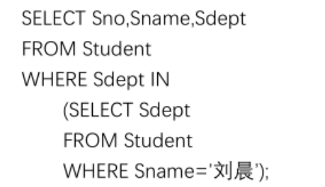

```plsql

```

【IN语句可以确保子查询返回多个值的情况下可以继续查询（=语句只能接受一个返回的值）】

### 有比较运算符的嵌套查询：
```plsql
**查询每个学生超过自己课程平均成绩的课程号**
SELECT Sno,Cno
FROM SC x
WHERE Grade >=(
  SELECT AVG(Grade)
  FROM SC y
  WHERE y.Sno = x.Sno
)

**查询每个学生超过课程总平均成绩的课程号**
SELECT Sno,Cno
FROM SC x
WHERE Grade >=(
  SELECT AVG(Grade)
  FROM SC y
  WHERE x.Cno = y.Cno
)
```

### 比较运算符+`ANY(SOME)`、`ALL`的嵌套查询
```plsql
**查询非计算机科学系中比计算机科学系任意一个学生年龄小的学生姓名和年龄**
SELECT Sname,Sage
FROM Student
WHERE Sage < ANY(
  SELECT Sage
  FROM Student
  WHERE Sdept = 'CS'
)
AND Sdept <> 'CS';

**或使用聚集函数：**
SELECT Sname,Sage
FROM Student
WHERE Sage < (
  SELECT MAX(Sage)
  FROM Student
  WHERE Sdept = 'CS'
)
AND Sdept <> 'CS';
```

### `EXISTS`语句嵌套查询
+ `EXISTS`一旦找到了符合条件的信息，立刻停止，返回`true`；找到最后还没找到就返回`false`
+ `NOT EXISTS`在子查询没有返回任何元组时为`true`，否则为`false`
+ `**<font style="color:#DF2A3F;background-color:#FBDE28;">EXISTS</font>**`**<font style="color:#DF2A3F;background-color:#FBDE28;">下面的</font>**`**<font style="color:#DF2A3F;background-color:#FBDE28;">SELECT</font>**`**<font style="color:#DF2A3F;background-color:#FBDE28;">都跟</font>**`**<font style="color:#DF2A3F;background-color:#FBDE28;">*</font>**`

```plsql
**查询选修了1号课程的学生姓名**
SELECT Sname
FROM Student
WHERE EXISTS
(
  SELECT *
  FROM SC
  WHERE Sno = Student.Sno AND Cno = '1'
);

**查询没有选修了1号课程的学生姓名**
SELECT Sname
FROM Student
WHERE NOT EXISTS
(
  SELECT *
  FROM SC
  WHERE Sno = Student.Sno AND Cno = '1'
);


**查询与刘德华在一个系学习的学生**
SELECT *
FROM Student x
WHERE x.Sname != '刘德华' AND EXISTS(
  SELECT *
  FROM Student y
  WHERE y.Sdept = x.Sdept AND y.Sname = '刘德华'
  );

**查询选择了信息系统课程的学生的姓名和学号**
SELECT Sno,Sname
FROM Student
WHERE EXISTS(
  SELECT *
  FROM SC
  WHERE Student.sno = sc.sno AND EXISTS(
    SELECT Cno
    FROM Course
    WHERE SC.cno = course.cno AND Cname = '信息系统'
  ));

```

:::warning
+ 用`EXISTS`实现全称量词：
        * 例：查询选了所有课程的学生$ \implies $查询不存在课程没有选修的学生
        * 两次`NOT EXISTS` 相当于 一次 全称“全部”
+ 用`EXISTS`实现逻辑蕴含：
        * 例：查询选修了x学生选修全部课程的学生$ \implies $查询：不存在学生x选了的，而目标学生没选的课程，返回学生

:::

## 集合查询：
### 集合操作类型：（`MYSQL不支持交操作、差操作`）
+ `UNION`：并操作
        * `UNION ALL`：合并并保留重复元组
        * `UNION`：去重
+ `INTERSECT`：交操作
+ `EXCEPT`：差操作

### 参加集合操作的对象：列
## 基于派生表的查询
+ 子查询在`FROM`中出现，即为派生表（临时表）
+ 派生表必须指定别名

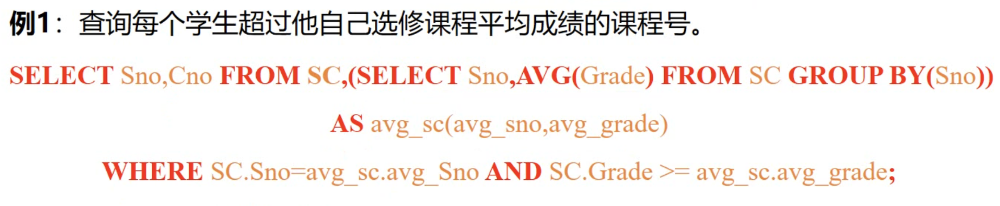

# 数据更新
## 数据插入
### 插入元组
```plsql
**
将一个新学生元组（学号：201215128，姓名：陈冬，性别：男，所在系：IS，年龄：18岁）
插入到 Student表中
**

INSERT
INTO Student(Sno,Sname,Ssex,Sdept,Sage)
VALUES('201215128','陈冬','男','IS',18);

*如果插入的数据列的顺序与原表相同，INTO 表名后的列名可以省略*
INSERT
INTO Student
VALUES('201215128','陈冬','男','IS',18);
```

### 插入子查询结果
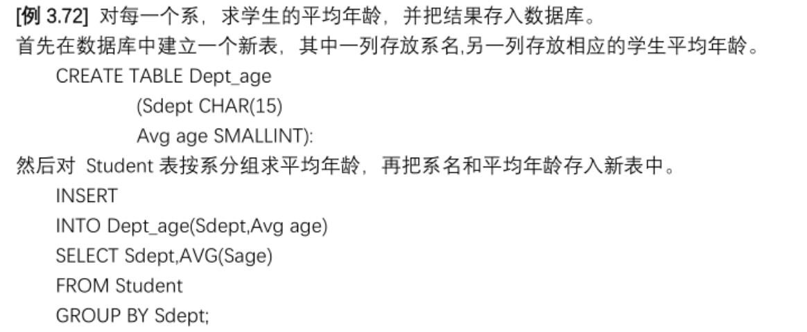

## 数据修改
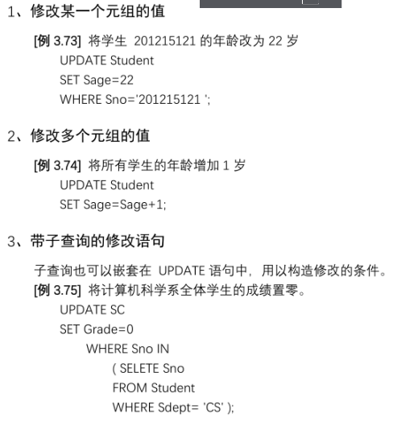

## 数据删除
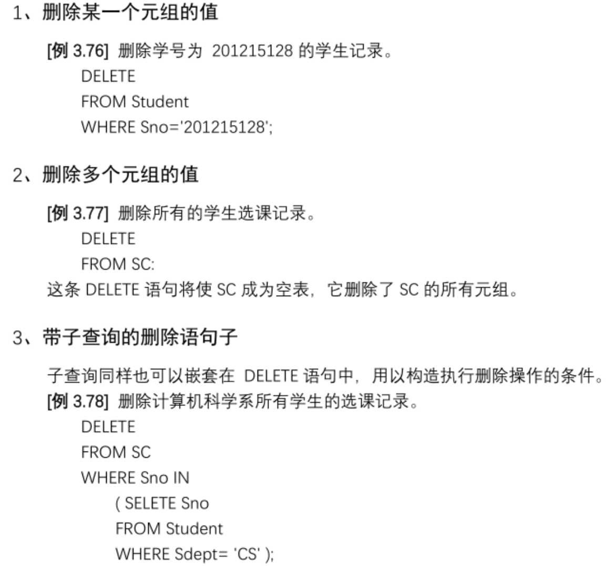

# 空值`NULL`
## 判断空值`IS NULL`
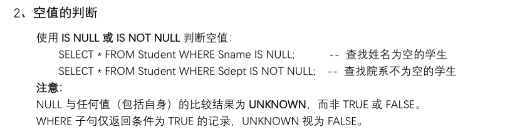

## 空值约束
+ `NOT NULL`约束：值不能为空
+ `UNIQUE`约束：允许唯一空值
+ 主键不能为空，外键可以为空

## 空值运算：
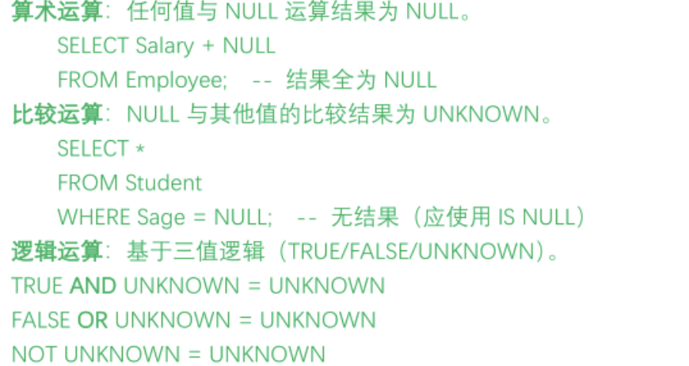

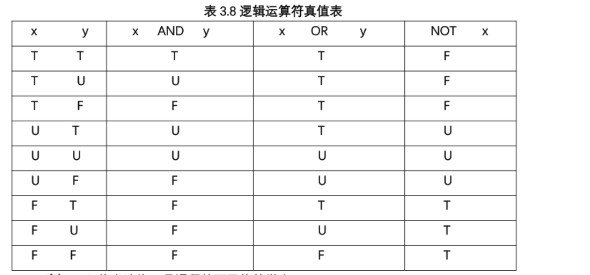

# 视图操作：
## 建立视图
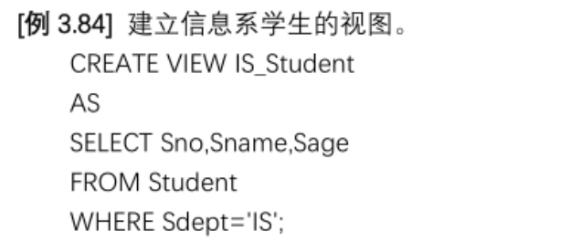

+ `WITH CHECK OPTION`表示对视图进行`UPDATE`、`INSERT`和`DELETE`操作时要保证更新、插入或删除的行满足视图定义中的谓词条件

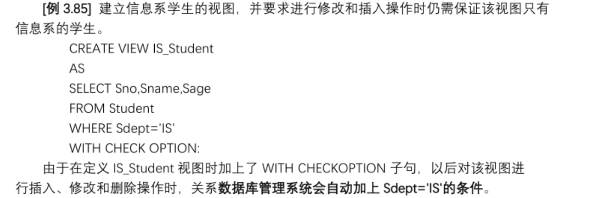

### 行列子集视图
+ 从单个基本表中导出，保留了主码，去掉了某些行列的视图

### 带虚拟列的视图（带表达式的视图）
+ 将基本表中的某列数据经过计算（得到的是不存在的虚拟列）作为视图的属性列
+ 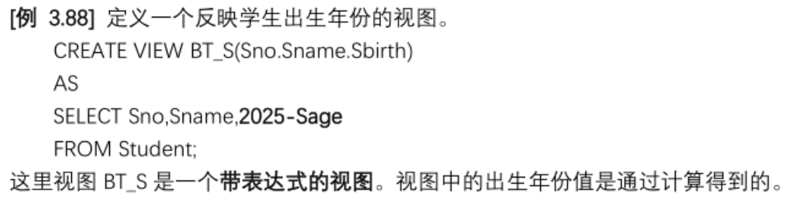

### 分组视图
+ 把数据分组＋聚集函数得到的视图
+ 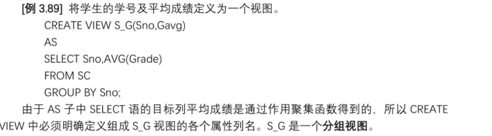

## 删除视图
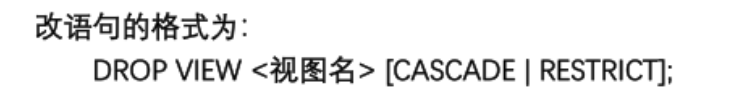

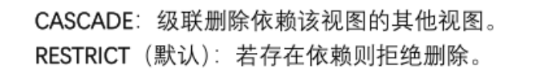

## 查询视图
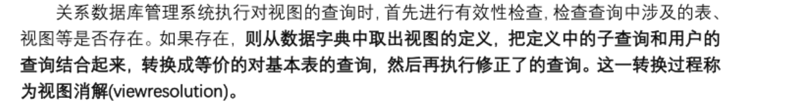

语法和查询表一样

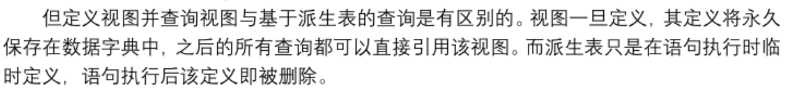

## 更新视图
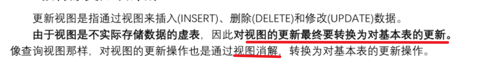

语法跟更新表一样

## 视图的作用：
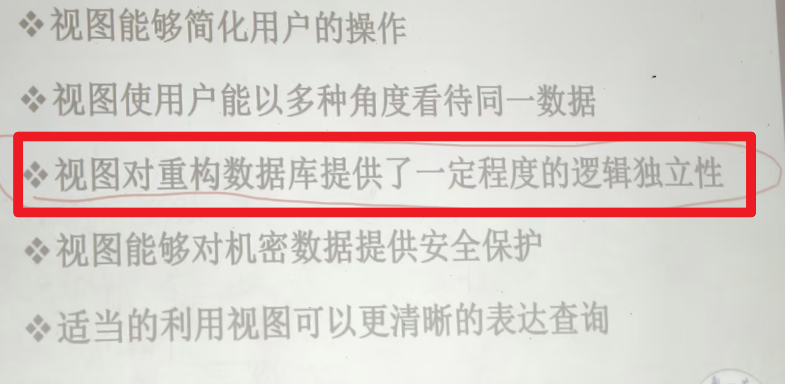

<!-- learning-journey:update-history:start -->
## 更新记录

| 日期 | 类型 | 说明 |
| --- | --- | --- |
| 2026-07-23 | 首次发布 | 从语雀整理 SQL 数据定义、查询、更新、空值与视图操作并发布 |
<!-- learning-journey:update-history:end -->
