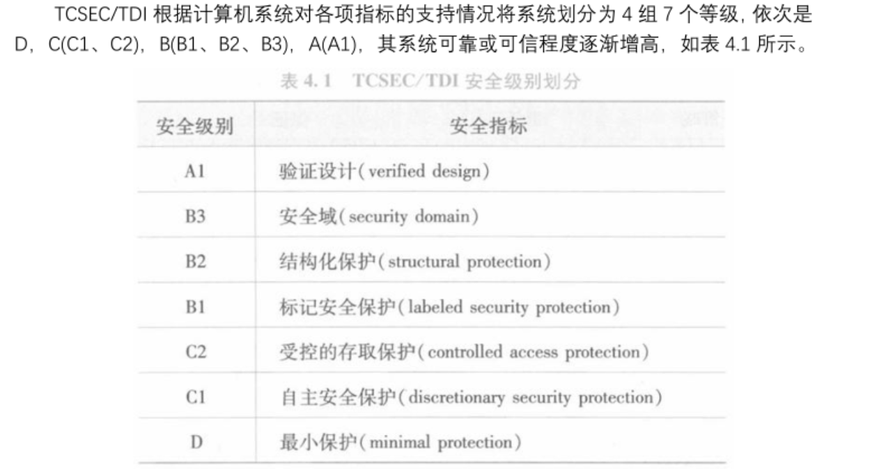
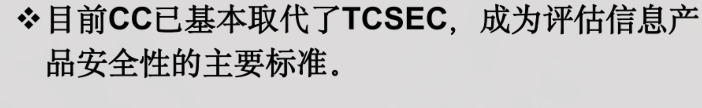
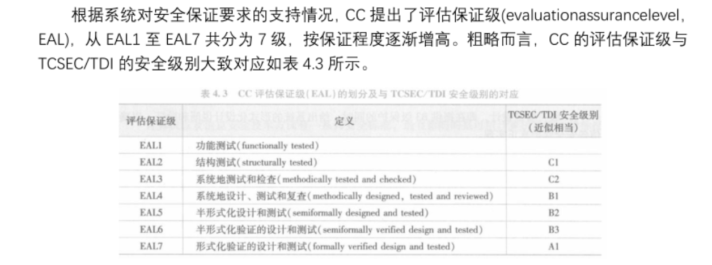

# 数据库安全性

## 数据库安全概述
## 数据库的不安全因素：
1. 非授权用户对数据库的恶意存取与破坏
2. 数据库中重要或敏感的信息泄露
3. 安全环境的脆弱性（数据库的安全性&计算机系统的安全性）

## 数据库安全标准：
### 可信计算机系统评估准则（TCSEC）



### CC通用准则




# 数据库安全性控制：
## 用户身份鉴别
+ 用户身份鉴别是数据库管理系统提供的最外层的安全保护措施
+ 用户标识 = 用户名（username） + 用户标识号（UID）
        * UID在系统整个生命周期内是唯一的

### 常见的用户识别方式
+ 静态口令鉴别：密码
+ 动态口令鉴别：短信验证码，动态令牌
+ 生物特征鉴别：指纹
+ 智能卡鉴别：实体卡

## 存取控制
+ 存取控制主要包括**定义用户权限**和**合法权限检查**两部分，二者共同组成了数据库管理系统的存取控制子系统
+ C2级支持自主存取控制，B1级支持强制存取控制

### 自主存取控制：SQL授予权限——`GRANT`语句：
+ 语法：`GRANT 权限 ON TABLE 表名 TO 用户 WITH GRANT OPTION`
+ `WITH GRANT OPTION`：只有加上该语句才可以使对象能把该权限也授予给他人，不加则不行
+ 不允许循环授权，即被授权的人返回来授权上面的人

```plsql
--1.把查询Student表的权限授予给用户U1
GRANT SELECT
ON TABLE Student
TO U1;

--2.把对Student表和Course表的全部操作权限授予给U2和U3
GRANT ALL PRIVILEGES
ON TABLE Student,Course
TO U2,U3;

--3.把对SC表的查询权限授予给全部用户：
GRANT SELECT
ON TABLE SC
TO PUBLIC;

--4.把查询Student表和修改学生学号的权限授予给U4
GRANT SELECT,UPDATE(Sno)
ON TABLE Student
TO U4;

--5.把SC表的INSERT权限授予给U5，且允许其继续授权给其他用户
GRANT INSERT
ON TABLE SC
TO U5
WITH GRANT OPTION;

```

### 自主存取控制：SQL收回权限——`REVOKE`语句：
+ 语法：`REVOKE 权限 ON TABLE 表 FROM 用户 CASCADE|RESTRICT`
+ `CASCADE`会把该用户授予给其他用户的权限一并收回

```plsql
--1.收回用户U5对SC表的INSERT权限，且收回其授予给他人的该权限
REVOKE INSERT
ON TABLE SC
FROM U5 CASCADE;

--2.收回所有用户对SC的查询权限：
REVOKE SELECT
ON TABLE SC
FROM PUBLIC;
```

### 自主存取控制：SQL创建用户
+ 创建用户语法：`CREATE USER <username> `

`WITH DBA|RESOURCE|CONNECT`

+ 默认值为`CONNECT`，该用户只能登录数据库
+ `RESOURCE`可以创建表、视图，不能创建模式、用户
+ `DBA`是超级用户，拥有全部权限
+ 只有系统的超级用户才能创建新用户

### 自主存取控制：SQL创建角色并授权
```plsql
--创建角色R1，授予其对Student表的全部权限，将角色授予给张三，李四
--收回授予给张三的R1角色
--使角色R1在原来权限的基础上减少DELETE权限
--加回DELETE权限

CREATE ROLE R1;
GRANT ALL PRIVILEGES
ON TABLE Student
TO R1;
GRANT R1
TO '张三','李四';
REVOKE R1
FROM '张三';
REVOKE DELETE
ON TABLE Student
FROM R1;
GRANT DELETE
ON TABLE Student
TO R1;
```

### 自主存取的缺点
仅仅通过数据的存取权限来进行安全控制，而数据本身无安全性标记

### 强制存取控制：
+ 适用于严格部门：军事部门等
+ 在强制存取控制中，数据库管理系统所管理的实体被分为**主体**和**客体**，数据库管理系统为每个实体规定一个**敏感度标记，**通过主体和客体敏感度标记的比较来确定权限
+ **主体**代表用户和活动进程，主体的敏感度标记叫做**许可证级别**
+ **客体**代表被操纵的对象，客体的敏感度标记叫做**密级**
+ **敏感度标记**：绝密（TS），机密（S），可信（C），公开（P）
+ 只有主体的许可证级别**<font style="color:#DF2A3F;">大于或等于</font>**客体的密级时，主体才能**读取**相应的客体
+ 只有主体的许可证级别**<font style="color:#DF2A3F;">小于或等于</font>**客体的密级时，主体才能**写**相应的客体（高级别的人不能写低级别的数据，否则有可能导致高级别的信息泄露给低级别的人）

# 视图机制
```plsql
--建立计算机系学生全部信息的视图
CREATE VIEW CS_Student
AS
SELECT *
FROM Student
WHERE Sdept = 'CS';
```

# 审计
+ 有审计功能，才到达C2标准
+ 审计功能把用户对数据库的所有操作自动记录下来放入审计日志中
+ 审计分为用户审计和系统级审计，用于审计任何用户都可设置，系统级审计只能由数据管理员设置

## 审计事件的类别：
1. 服务器事件
2. 系统权限
3. 语句事件
4. 模式对象事件

## 开启关闭审计功能语句
```plsql
--开启审计，监控对SC表的修改和更新：
AUDIT ALTER, UPDATE
ON SC

--关闭上述审计：
NO AUDIT ALTER, UPDATE
ON SC;
```

# 数据加密
+ 加密的基本思想：使用算法将明文转换为密文
+ 数据加密主要包括**存储加密**和**传输加密**
+ **存储加密**分为**透明**和**非透明**
+ 常用的**传输加密**：**链路加密**，**端到端加密**

<!-- learning-journey:update-history:start -->
## 更新记录

| 日期 | 类型 | 说明 |
| --- | --- | --- |
| 2026-07-23 | 首次发布 | 从语雀整理数据库身份鉴别、存取控制、审计与加密笔记并发布 |
<!-- learning-journey:update-history:end -->
