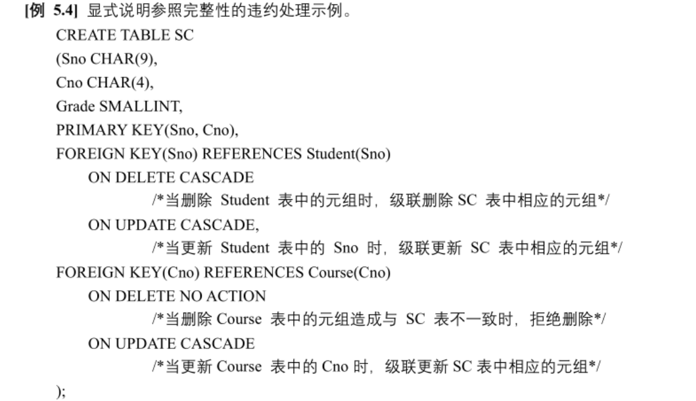
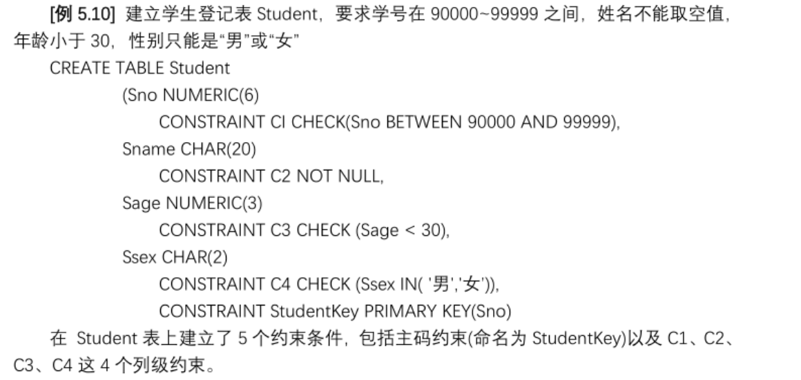
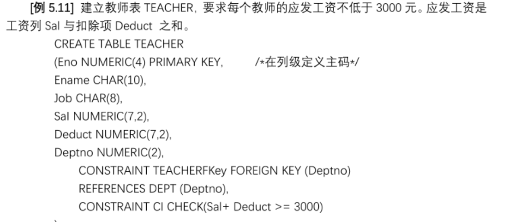
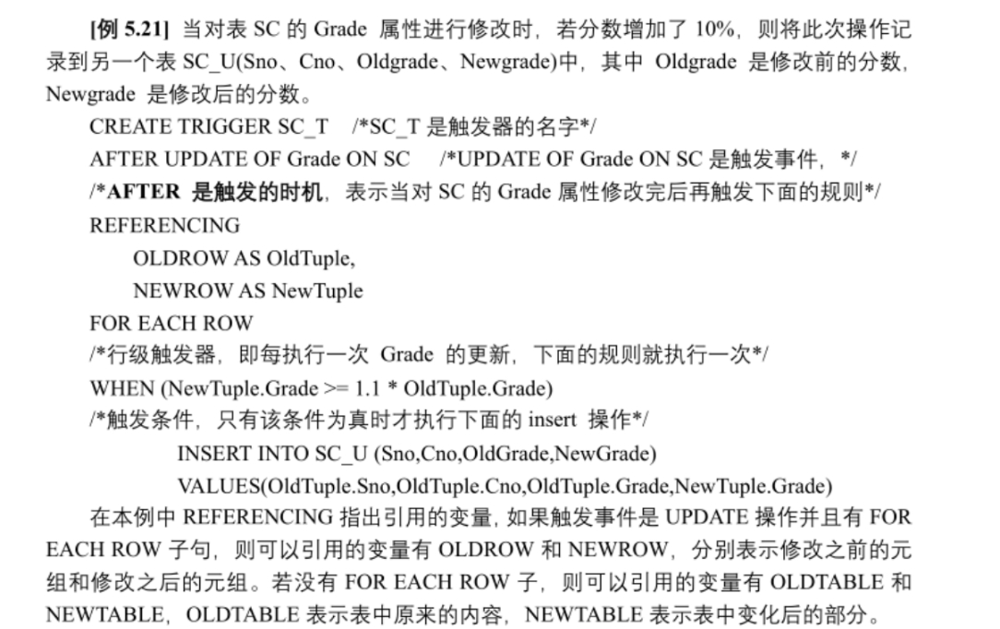
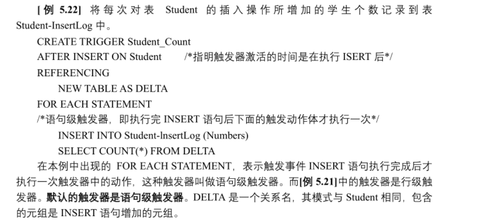

# 数据库完整性

数据库完整性指数据的**正确性（符合现实语义）**和**相容性（跨表逻辑一致）**。

# 实体完整性
## 定义实体完整性
+ 实现：主码`PRIMARY KEY`

```plsql
--创建Student表,将Sno定义为主码

--1.方式一：列级约束条件：
CREATE TABLE Student
(
  Sno CHAR(9) PRIMARY KEY,
  Sname CHAR(20),
  ……
);
--2.方式二：表级约束条件：
CREATE TABLE Student
(
  Sno CHAR(9),
  Sname CHAR(20),
  ……
  PRIMARY KEY(Sno)
);
```

+ 对多个属性作用的主码，只能用表级约束条件的方式定义

```plsql
--创建SC表，Sno，Cno定义为主码
CREATE TABLE SC
(
  Sno CHAR(9),
  Cno CHAR(9),
  ……
  PRIMARY KEY(Sno,Cno)
);
```

## 检查与违约处理
+ 主码值必须唯一
+ 主码值必须不为空
+ 违约处理：拒绝插入或修改

# 参照完整性
## 定义参照完整性
+ 实现：外码`FOREIGN KEY(外码属性) REFERENCES 表(主码属性)`

```plsql
--定义SC表中Sno与Cno的主码属性和外码属性：
CREATE TABLE SC
(
  Sno CHAR(9),
  Cno CHAR(9),
  ……
  PRIMARY KEY(Sno, Cno),
  FOREIGN KEY(Sno) REFERENCES Student(Sno),
  FOREIGN KEY(Cno) REFERENCES Course(Cno)
);
```

## 检查与违约处理：
+ 在参照表中插入元组或修改外码值可能破坏参照完整性
+ 在被参照表中删除元组或修改被参照主码值可能破坏参照完整性

### 自定义违约处理


+ 补充：`ON DELETE SET NULL`设置为空

# 用户定义的完整性
## 属性上的约束条件
+ `NOT NULL`不允许取空值
+ `UNIQUE`列值唯一
+ `CHECK ……`自定义检查条件表达式

```plsql
--创建一个SC表，Sno、Cno为主码，Grade约束在0～100之间
CREATE TABLE SC
(
  Sno CHAR(8),
  Cno CHAR(8),
  GRADE SMALLINT CHECK(GRADE >= 0 AND GRADE <= 100),
  PRIMARY KEY(Sno,Cno)
);
```

## 元组上的约束条件：
+ 元组级的限制可以实现不同属性之间的相互作用约束条件

```plsql
--创建Student表，当学生的性别为男时，名字不能以Ms.打头
CREATE TABLE Student
(
  Sno CHAR(8) PRIMARY KEY,
  Sname CHAR(20) NOT NULL,
  Ssex CHAR(2),
  ……
  CHECK(Ssex = '女' OR Sname NOT LIKE 'Ms.%')
);
```

# 完整性约束命名子句
## 定义完整性限制并命名
+ 在`**CREATE**`语句中用`**CONSTRAINT 约束名 约束条件**`来给具体的约束条件命名





## 修改完整性限制
```plsql
--1.去掉Student表中的限制C4

ALTER TABLE Student
DROP CONSTRAINT C4;

--2.修改年龄的约束条件为0～150
--提示：先删除再新加
ALTER TABLE Student
DROP CONSTRAINT C1;
ALTER TABLE Student
ADD CONSTRAINT C1 CHECK(Sage BETWEEN 0 AND 150);
```

# 断言
+ 作用：声明更具有一般性的约束
+ 创建断言后，任何涉及到的关系操作都会触发系统对断言的检查，任何令断言不为真的操作都会被拒绝执行

## 创建断言
`CREATE ASSERTION 断言名 CHECK 约束`

```plsql
--1.创建断言，限制数据库课程最多60人选修
CREATE ASSERTION ASSE_SC_DB_NUM
CHECK (60 >= (
  SELECT COUNT(*)
  FROM Course,SC
  WHERE SC.CNO = Course.CNO AND Course.CNAME = '数据库'
));

--2.限制每一门课程都最多60人选修
CREATE ASSERTION ASSE_SC_CNUM1
CHECK (60 >= ALL(
  SELECT COUNT(*)
  FROM SC
  GROUP BY Cno
));
```

## 删除断言
`DROP ASSERTION 断言名`

# 触发器
+ 触发器类似于约束，但比约束更灵活，更精细，更强大

## 定义触发器
+ 只有**创建表的用户**才可以在该表上创建触发器
+ 一个表上创建触发器的个数是一定的
+ 同一模式下，触发器名必须是**唯一**的，且**表名和触发器名**必须在**同一模式**下
+ 触发器只能定义在**基本表**上，不能定义在**视图**上
+ 若**触发失败**，引发触发的对应原始数据操作会被**回滚**，保持数据的**一致性**

`CREATE TRIGGER 触发器名`

`BEFORE|AFTER 触发事件`

`ON 表名`

`REFERENCING NEW|OLD ROW|TABLE AS 变量名`（把旧值/新值记录下来）

`FOR EACH ROW|STATEMENT`

`WHEN 触发条件 触发动作`

+ `BEFORE|AFTER`：触发时机，在数据变动（触发事件）执行前激活OR执行后激活，默认是`AFTER`
+ 触发事件如果是修改，要用`UPDATE OF 属性名`
+ `FOR EACH ROW|STATEMENT`：触发器类型
        * 行级触发器：每修改一行触发一次，可以使用`NEW|OLD ROW`引用变更前后元组行内的数据
        * 语句级触发器，整条SQL执行后触发一次，不能使用`NEW|OLD ROW`
+ `WHEN 触发条件 触发动作`：仅当条件为真时触发触发动作，若省略`WHEN`则激活触发器后立即执行动作





## 激活触发器
+ 同一个表上的多个触发器激活整体顺序：
        * **先执行**`**BEFORE**`**触发器**
        * **激活触发器的SQL语句**
        * **再执行**`**AFTER**`**触发器**
+ 同一个表多个相同**触发时机**的触发器激活原则：“**谁先创建谁先执行**”

## 删除触发器
`DROP TRIGGER 触发器名 ON 表名;`

<!-- learning-journey:update-history:start -->
## 更新记录

| 日期 | 类型 | 说明 |
| --- | --- | --- |
| 2026-07-23 | 首次发布 | 从语雀整理实体完整性、参照完整性、断言与触发器笔记并发布 |
<!-- learning-journey:update-history:end -->
