# 关系数据理论与范式

+ 章节重点：针对具体问题构造一个适合其的数据库模式
+ 数据依赖：关系内部**属性与属性**之间的一种约束关系，这种约束关系是通过**属性间值的相等与否**体现出来的数据间的相关联系
+ 数据依赖的类型：**函数依赖（FD）** & **多值依赖（MVD）**

# 规范化
+ 规范化的基本思想：逐步消除数据依赖中不合适的部分
+ “一事一地”的模式设计原则
+ 规范化的实质是概念的单一化

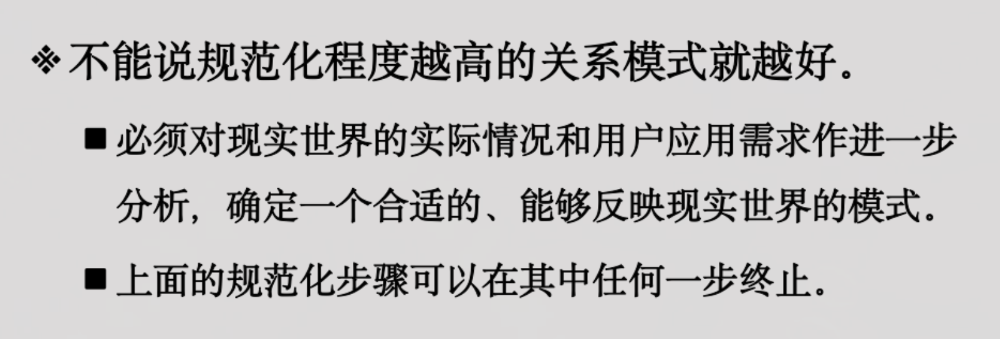

## 函数依赖：
+ 函数依赖是语义范畴的概念，只能根据**语义**来确定一个函数依赖
+ $X \longrightarrow Y$：Y 依赖于 X

### 平凡&非平凡函数依赖
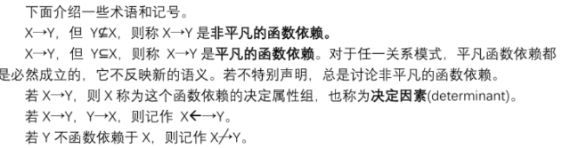

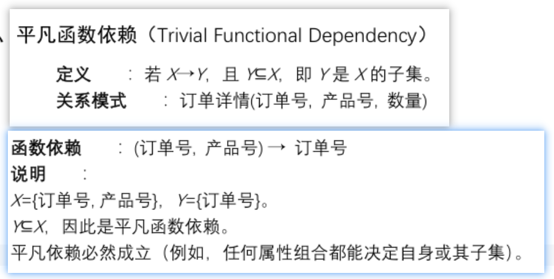

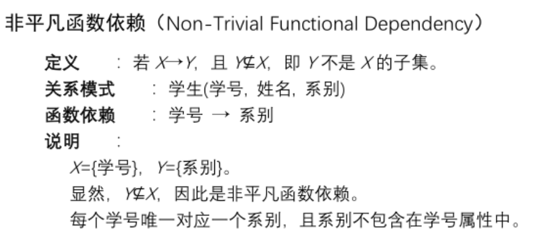

### 完全&部分函数依赖
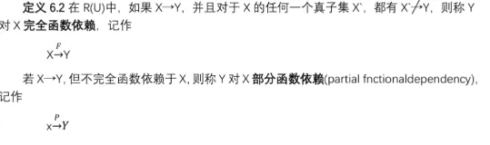

### 传递函数依赖
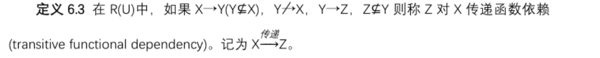

## 多值依赖
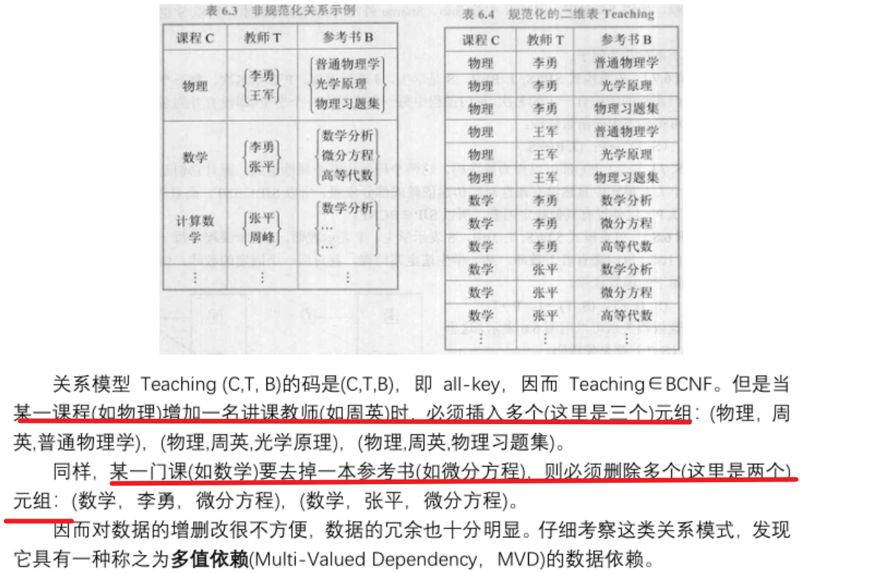

## 码/键/键码
### 候选码、超码
+ 若U**完全函数依赖**于K，则K为U的**候选码**
+ 若U**部分函数依赖**于K，则K为U的**超码**（只要K能唯一地决定U）
+ 候选码是**最小的超码**
+ 包含在任意一个候选码中的属性称为：**主属性**
+ 不包含在任意候选码中的属性称为：**非主属性/非码属性**
+ 所有属性都是主属性：**全码**

## 范式：
+ 关系数据库中的关系满足不同程度要求，称为不同**范式**

### 各种范式之间的关系：
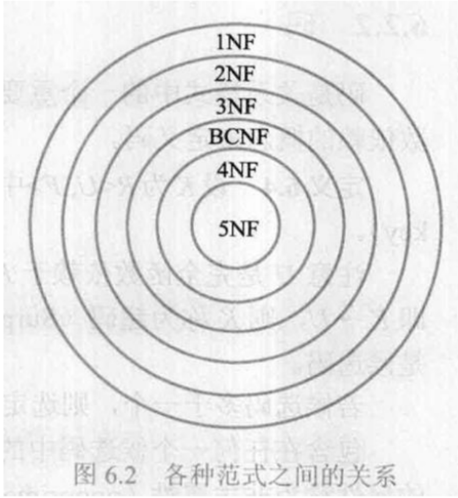

+ 低级范式的关系模式可由**模式分解**转换为高级范式，这个过程叫做**规范化**

### 1NF
+ 若关系的**每个属性都不能再分**，即不包含多个值，则满足1NF

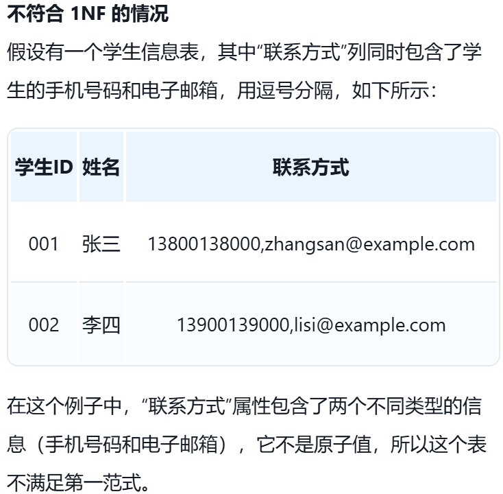

### 2NF
+ 在1NF的基础上，如果**每一个非主属性完全依赖于任何一个候选码**，则满足2NF
+ 不满足2NF的关系存在的问题：
        * 插入异常
        * 删除异常
        * 修改复杂

### 3NF
+ 在2NF的基础上，如果每**一个非主属性都不传递依赖于候选码**，则满足3NF
+ **2NF断部分，3NF断传递**

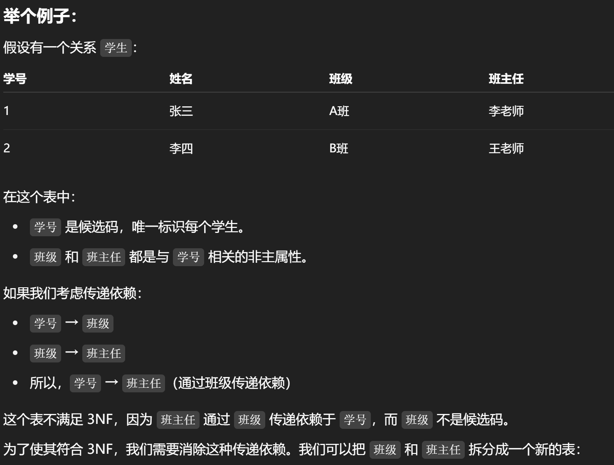

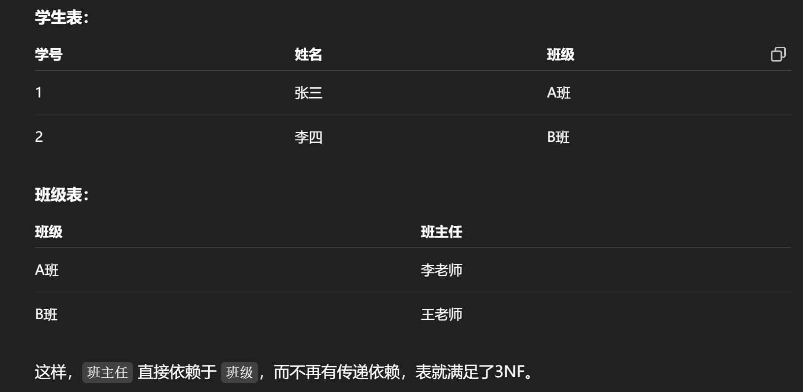

### BCNF（修正的第三范式）
+ 在3NF的基础上，依赖的左边都是超键（候选码是最小的超键）【直接用候选码记得了】

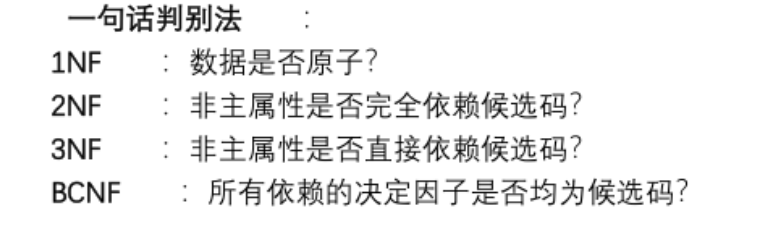

### 4NF
+ 在3NF的基础上，且不存在多值依赖的关系模式

<!-- learning-journey:update-history:start -->
## 更新记录

| 日期 | 类型 | 说明 |
| --- | --- | --- |
| 2026-07-23 | 首次发布 | 从语雀整理函数依赖、范式与规范化笔记并发布 |
<!-- learning-journey:update-history:end -->
