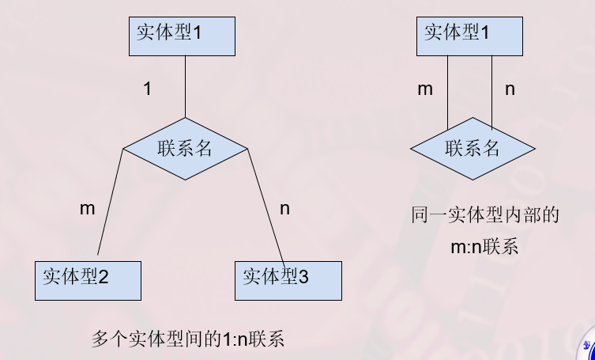
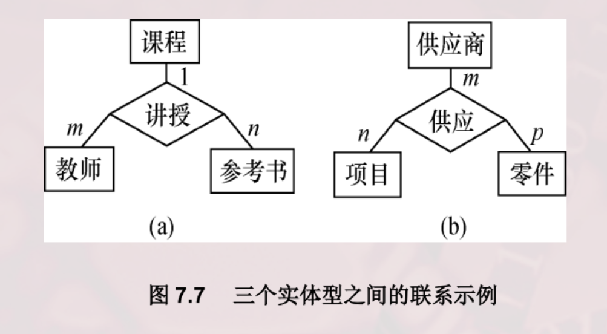
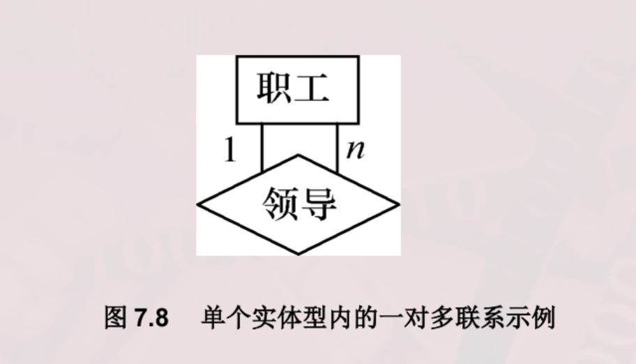
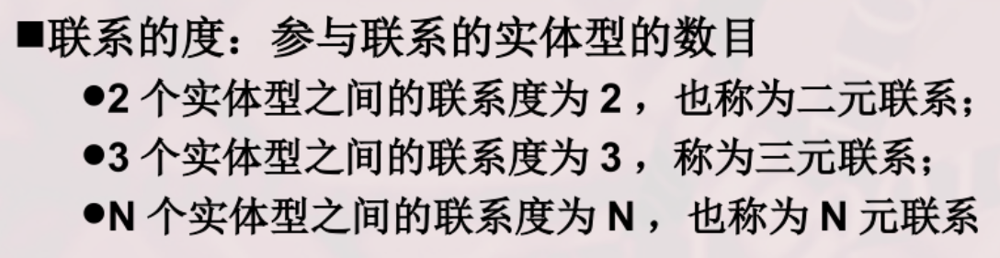

# E-R 图元素与语义

## 实体—联系方法

实体—联系方法（E-R 方法/E-R 模型）是概念模型的一种表示方法，使用 E-R 图描述现实世界的概念模型。

- 实体集：使用矩形表示，内部标注实体集名。
- 属性：使用椭圆形表示，内部标注属性名，并用直线与相应实体集连接。
- 联系：
  - 联系本身使用菱形表示，内部写明联系名，用直线与有关实体连接，并在直线旁标注联系类型（`1:1`、`1:n`、`m:n`）。
  - 联系也可以有属性，同样使用直线连接。

## 两个实体型之间的联系

- 一对一联系：对于实体集 A 中的每一个实体，实体集 B 中至多有一个实体与之有联系，反之亦然，则为 `1:1`。
  - 人与身份证。
- 一对多联系：
  - 班级与学生。
  - 部门与员工。
- 多对多联系：
  - 课程与学生。
  - 用户与 QQ 群。

## 多个实体型之间的联系

- 一对一：学生—学号—档案。
- 一对多：学校—班级—学生。
- 多对多：学生—课程—老师。

## 同一实体集内各实体间的联系

- 一对一：人类中的婚姻关系。
- 一对多：同事中的领导关系。
- 多对多：学生中的同学关系。

## 联系的度

<!-- learning-journey:update-history:start -->
## 更新记录

| 日期 | 类型 | 说明 |
| --- | --- | --- |
| 2026-07-23 | 首次发布 | 从语雀整理并发布到学习记录仓库 |
<!-- learning-journey:update-history:end -->
