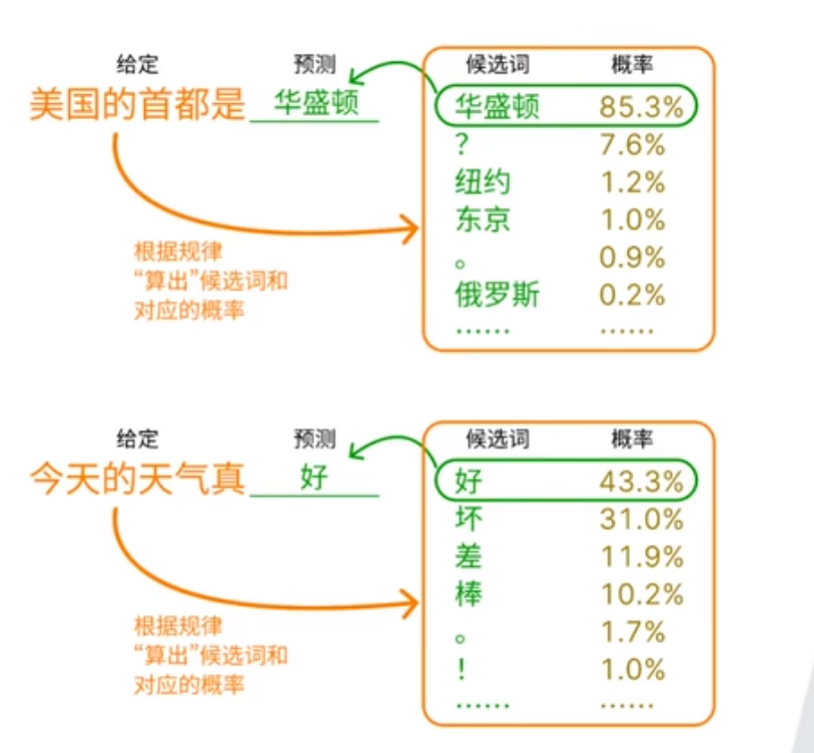
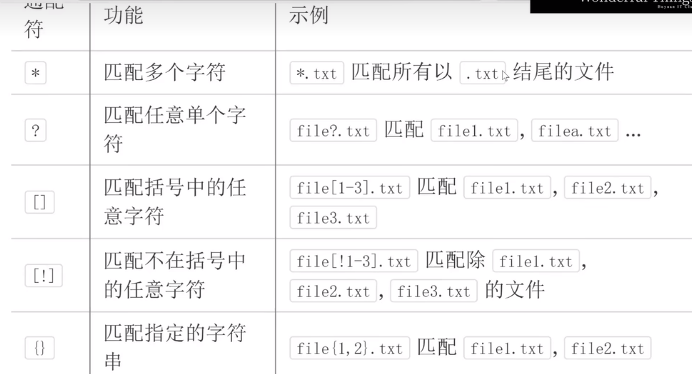

# 电子扫盲

## 硬件基础

### CPU（处理器）

#### 处理器架构

处理器架构（Processor Architecture）是指计算机处理器（CPU）的设计和组织方式，包括如何执行指令、如何与内存及其他硬件组件交互，以及支持哪些指令集。它决定了处理器的工作原理、性能特点和软件兼容性。

主要组成：

1. **指令集架构（ISA）**：定义处理器可以执行的基本操作，包括指令格式、指令类型和数据处理方式。常见的指令集架构包括：
   - **x86**：由 Intel 和 AMD 设计，常用于桌面计算机和服务器。
   - **ARM**：一种精简指令集架构，广泛用于移动设备、嵌入式系统和低功耗设备。
   - **RISC-V**：一种开源的精简指令集架构，正在被越来越多的硬件制造商采用。
2. **微架构**：处理器的内部结构，包括如何实现指令执行、调度任务和管理缓存等。同一架构可以有不同的微架构设计，例如 Intel 的 Skylake、Coffee Lake、Alder Lake 等。
3. **寄存器和缓存结构**：处理器通过寄存器存储临时数据，缓存（L1、L2、L3）用于减少访问内存的延迟。这些设计会直接影响处理器的效率和速度。

处理器架构的重要性：

- **兼容性**：不同处理器架构运行的软件和操作系统可能不同。例如，基于 x86 架构的处理器无法直接运行 ARM 架构的程序，反之亦然。
- **性能**：不同架构在性能、功耗和处理能力等方面有所不同。例如，ARM 架构处理器一般功耗较低，而 x86 架构处理器通常在计算性能上更强。
- **应用场景**：ARM 常用于智能手机、平板等低功耗设备，x86 常见于台式机、笔记本和服务器等高性能设备。

### GPU（图形处理器/显卡）

GPU 多用于图像计算，影响图像渲染、游戏性能等，是耗电大户。

### RAM（内存）

RAM 断电后数据丢失，但读写速度很快。

### 硬盘（磁盘）

硬盘断电后数据不会丢失，读写速度比内存慢，并且可以划分多个分区。

#### 磁盘分区的作用

##### 分类管理和降低部分数据丢失风险

系统分区损坏或重装系统时，其他分区的数据通常可以保留；但硬盘物理损坏、误格式化整块磁盘等情况仍可能影响全部分区。

##### 系统和数据管理

分区有助于分类管理系统和个人数据。机械硬盘可能受文件碎片影响，但分区本身不一定提高性能，固态硬盘也不依靠传统碎片整理提升速度。

##### 便于重装系统

- 系统分区和数据分区分开后，重装系统通常只需要格式化系统分区，不会影响其他分区内的数据。
- 分区存储也可以节省备份数据的时间。

##### 安装多个系统

可以在不同分区安装多个操作系统，使每个系统拥有独立分区。

## 软件基础

### 操作系统

#### Windows

使用广泛，兼容性强。

#### macOS

由苹果公司开发，界面简洁，常用于办公和创作；兼容性较差，软件选择较少。

#### Linux

开源、强大且灵活，适合开发和服务器使用；在用户界面和软件支持等方面可能需要较多配置操作。

### 驱动

- 驱动起到桥梁作用，使操作系统能够识别并正确使用硬件设备。
- 驱动程序通常由硬件制造商提供，安装在计算机系统中，使系统能够识别和配置硬件设备。

### 文件后缀（扩展名）

文件后缀帮助操作系统选择默认打开方式，可以人为修改；但修改后缀不会改变文件内部的真实格式。

#### 压缩文件（`.zip`、`.rar`、`.7z`）

用于打包多个文件，减少存储空间和传输时间。基本原理之一是字典换元。

#### PDF

兼容性很强的文档呈现格式，在不同设备和操作系统上可以保持文档格式一致。

#### 可执行文件（`.exe`）

可以直接点击运行的文件；创建快捷方式，相当于创建了一个可执行文件的替身。

## Windows 注册表

### 什么是注册表

- Windows 操作系统中的数据库，用于存储系统配置和应用程序设置。
- 通过修改注册表，可以改变部分 Windows 系统行为。
- 注册表的结构类似文件系统，由多个“键”（Key）和“值”（Value）组成。
- 在命令行中输入 `regedit` 可以打开注册表编辑器。

### 注册表的用途

- **系统配置**：Windows 操作系统和许多应用程序将配置信息存储在注册表中，例如用户设置、软件偏好和系统设置等。
- **硬件配置**：注册表保存驱动程序、设备等硬件配置信息。
- **启动项**：部分程序会将自启动信息添加到注册表中，以便在系统启动时自动运行。

## 虚拟内存

电脑使用磁盘空间来充当内存，能在一定程度上弥补内存过小的不足。

## 虚拟机

- 允许一台计算机上同时拥有并运行多个操作系统，并提供相互隔离的操作环境。
- 有助于深入学习不同操作系统的内部工作原理。
- 可以在虚拟机中配置不同的软件和服务，辅助理解系统配置和网络管理。
- 可以在虚拟机中对安全工具和技术进行实验，模拟攻击和防御，在不使原电脑遭到侵害的前提下学习网络安全内容，学习如何攻击、防御、保护计算机系统。

## 编程基础

### 编程语言的发展

#### 机器语言（二进制代码）

- 机器语言是计算机能够直接理解并执行的最底层语言代码，由二进制 0、1 组成，用于直接用指令操作计算机硬件，每条指令都是硬件具体架构的专属代码。
- 可读性为 0，编写困难且难以调试维护。

#### 汇编语言

- 对机器语言的抽象，使用符号（助记码）来代替机器码的二进制。
- 具有一定的可读性和可维护性，但仍是直接操作硬件，与硬件本身密切相关。

#### 高级语言（C、Java 等）

- 对机器语言的进一步抽象，使其接近人类自然语言的语法。
- 易于学习、编码、操作、调试和维护。
- 高级语言的代码通过编译器、解释器翻译成机器语言，而不与硬件直接交互。
- 支持复杂的数据结构和抽象。

### IDE

- 全称为 Integrated Development Environment（集成开发环境）。
- 为代码编辑、调试、版本控制、项目管理等功能提供全面的开发支持。
- 现代 IDE 一般支持各种插件，以实现提高开发效率等个性化扩展功能。

## 人工智能（AI）

- 全称为 Artificial Intelligence（人工智能）。
- 通过计算机模拟人类智能过程的技术，旨在使机器能够执行学习、推理、分析、创造、问题解决、感知和语言理解等通常需要人工完成的工作。

### 模型的训练过程

### AI 模型与预测

AI 模型通常会从训练数据中学习规律并进行预测。以语言模型为例，模型会计算候选词的概率，并据此生成输出。

### 神经网络和深度学习

- 人工神经网络是一种用于解决现实生活中更为复杂的数据关系的模型结构，参数量巨大，具有非常强大的拟合能力。
- 由于现在应用的神经网络层数多、深度深，因此基于神经网络的相关技术又被称为深度学习。

### 创建一个 AI 模型的过程

## 命令行

### GUI 与 CLI

- **GUI**：鼠标双击就会跳出窗口运行的软件。
- **CLI**：在终端里敲命令才能执行的软件。

### 命令行的特征

- 内置了很多小工具。
- 一个小工具只干一件事。
- 小工具采用文本进行输入输出，易于使用。
- 通过小工具之间的组合来解决复杂问题。

### 为什么要用命令行

- 命令行比 GUI 更加高效。
- 有些复杂的事情和工作 GUI 几乎完成不了（GUI 之间无法相互调用）。

### 使用命令行小工具操作

#### 文本编辑

- 小工具：**Vim** / **Emacs**。
- **Vim** 的特点：命令式编程；Unix“一切皆文件”的概念结合 Vim 强大的编辑能力可以完成很多操作。
  - 查看 Vim 字典：`vimtutor`。

#### 文件管理

- `ls`：列出当前目录下的所有文件和子目录的名称。
- `ls -l`：列出当前目录下的所有文件和子目录的详细信息。
- `touch`：创建文件。
- `rm`：删除文件。
- `mkdir`：创建文件夹。
- `rm -rf`：删除文件夹，实质是递归地删除该目录下的全部文件，属于危险操作。
- `mv`：重命名文件或把文件移动到其他目录下。
- `pwd`：打印出当前的目录路径。
- `cat`：显示文件内容，或连接多个文件并合并显示内容。
- `./`：当前目录。
- `../`：上一个目录。

#### 进程管理

- `htop`：监控和管理系统资源的工具，可以显示：
  - CPU 使用情况；
  - 内存使用情况；
  - 进程列表；
  - 系统负载和运行时间。
- `Ctrl+Z`：将当前正在运行的前台进程挂起并放入后台，相当于暂停该进程。
- `bg`：使该进程继续在后台运行。
- `fg`：使该进程恢复在前台运行。
- `jobs`：列出所有后台作业及其状态。

#### 输入输出

输入输出是小工具之间组合的核心。

- 管道 `|`：用于连接多个程序间的输入输出，将一个命令的标准输出作为另一个命令的标准输入。
  - 示例：`ls /bin | wc -l`。
  - 先列出 `/bin` 目录下的所有文件，再把 `ls` 的输出结果作为 `wc -l` 的输入，最后由 Word Count 计数工具统计文件数量。
- `xargs`：将标准输入转变为命令的参数。
  - 示例：`echo "a.c b.c c.c" | xargs rm`。
  - 相当于 `rm a.c b.c c.c`。

#### 通配符

#### 阅读命令行手册

使用 `man xx` 查看 `xx` 命令的用法。

## WSL

WSL 全称为 Windows Subsystem for Linux。

### 目的

让开发人员在不需要双重启动或者虚拟机的情况下，能够在 Windows 系统上直接体验并使用 Linux 环境。

### 本质

使 Windows 能够运行 Linux 二进制文件和工具。

### WSL 的两个版本

- **WSL 1**：通过系统调用翻译（System Call Translation）使 Linux 应用能在 Windows 的 NT 内核上运行。它通过在 Windows 内核上模拟 Linux 环境来实现对 Linux 程序的支持。
- **WSL 2**：使用完整的 Linux 内核，通过虚拟化技术运行在一个轻量级的虚拟机中，提供了比 WSL 1 更好的性能、兼容性和文件系统支持。

### 安装 WSL 后可以做什么

- 使用 Linux 的命令行工具。
- 访问 Linux 的文件系统并进行操作和管理。
- 运行 Linux 环境下的程序。
- WSL 2 与 Docker 兼容，可以直接在 Windows 上运行 Linux 容器，这对于容器化应用程序的开发、测试和部署尤为重要。

<!-- learning-journey:update-history:start -->
## 更新记录

| 日期 | 类型 | 说明 |
| --- | --- | --- |
| 2026-07-22 | 首次发布 | 合并整理硬件、软件与 Windows 注册表知识 |
| 2026-07-22 | 内容更新 | 补充虚拟内存、虚拟机与编程语言发展、IDE 基础知识 |
| 2026-07-22 | 内容更新 | 补充人工智能、命令行与 WSL 基础知识，并完善相关示意图 |
<!-- learning-journey:update-history:end -->
