# 计算机科学（Crash Course）

## 计算机早期历史
+ 计算设备的演变：
    - **算盘**【最早的计算设备】 ——>**步进计算机**【第一台能做“加减乘除”全部四种运算的机器】——>**差分机**——>**分析机**——>**打孔卡片制表机**【早期自动化计算设备】——>**晶体管和集成电路**【注重小型高效】
+ 世界上第一个通用、可编程、电子计算机——**电子数值积分计算机“ENIAC”**（Electronic Numerical Integrator and Calculator）
+ 控制开关的演变：
    - **机械继电器**——>**真空管**【标志着计算机由机电转向电子】——>**晶体管**
+ 近现代计算机硬件的发展：
    - **晶体管**——>**集成电路(IC)**【将晶体管、电阻等电子元件**封装**成**集成芯片**以实现功能，后期采用**光刻**技术制作更为精密的芯片】 & **印刷电路板（PCB）**【通过蚀刻金属线来把零件连接到一起】

## 晶体管进行计算的实现方式：
### 布尔逻辑
+ 变量的值：True & False
+ 基本操作：**NOT**、**AND**、**OR**、**XOR**（同True 则 False）
+ OR & XOR 的理解：<u>OR是相容选言判断、XOR是不相容选言判断</u>

### 逻辑门【体现抽象封装思想】
+ 一个晶体管（反向器）——**NOT门**
+ 两个晶体管串联——**AND门**
+ 两个晶体管并联——**OR门 **
+ **XOR门：**

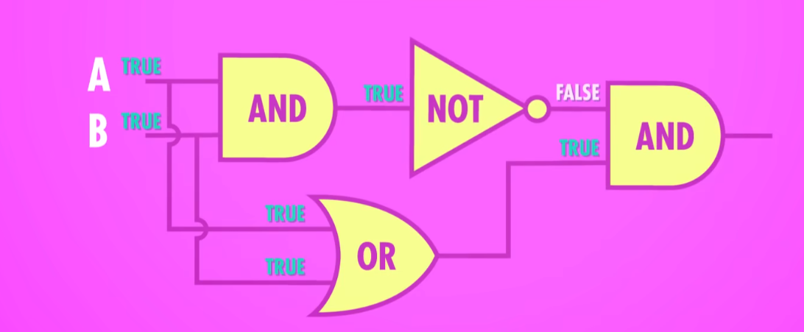

## 二进制——计算机存储和表示数字的方式
+ 二进制中一个1或0叫做一位（**bit**）
+ 8 bits = 1 byte（**字节**）
+ kilobyte（KB）、megabyte（MB）、gigabyte（GB）、terabyte（TB）
+ 32位电脑（32-bit）& 64位电脑：电脑以32 bits 或64 bits 为一块的方式处理数据
+ 计算机用第一位表示数字的正负：<u>1负0正</u>

### 二进制小数（浮点数）的表示：
+ 使用科学计数法来表示：

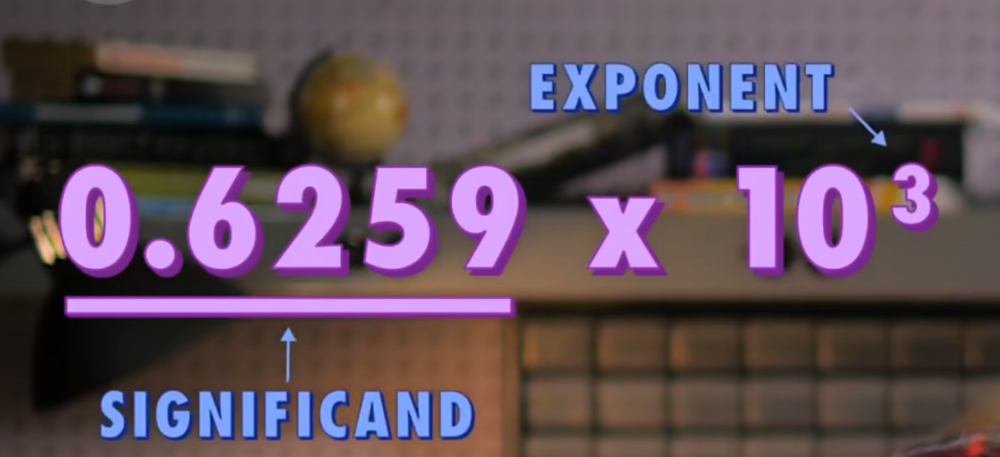

+ 第一位仍然是正负，后面八位是指数，剩下23位是有效位数

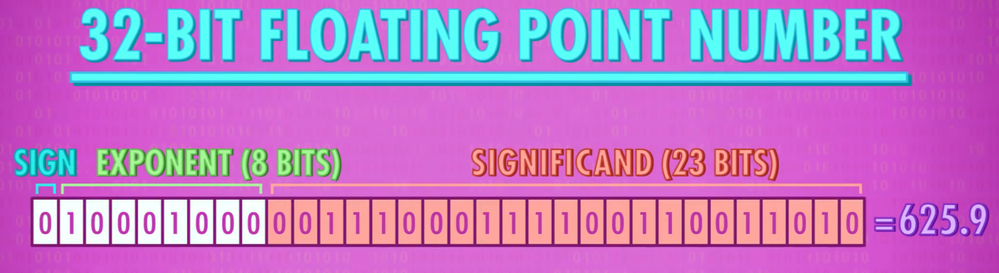

### 二进制字母、字符、符号等的表示：
+ **ASCII**（美国信息交换标准代码）（American Standard Code for Information Interchange）——8位
+ **Unicode** 是字符编码标准，可通过 UTF-8、UTF-16、UTF-32 等编码形式表示

## ALU——计算机进行运算的场所
+ ALU（Arithmetic and Logic Unit）——>算术逻辑单元

### ALU的组成：
#### 算术单元
+ 负责计算机里的所有数字操作
+ 新一层的**抽象**：用逻辑门实现运算操作的例子：

##### 半加器（处理一位加法运算）：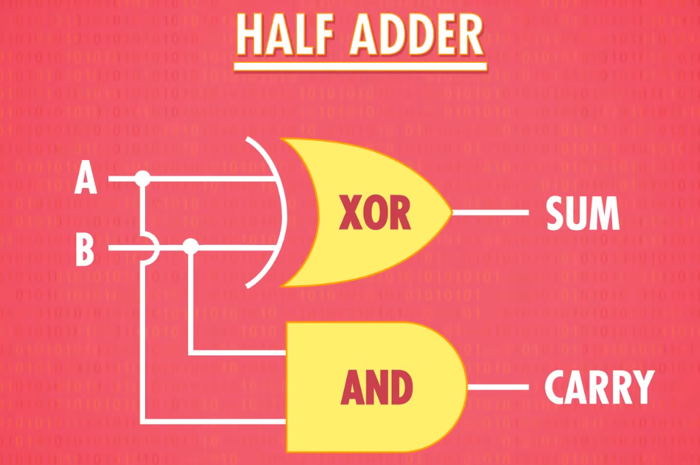
##### 全加器（ 构建多位加法器的基本单元  ）：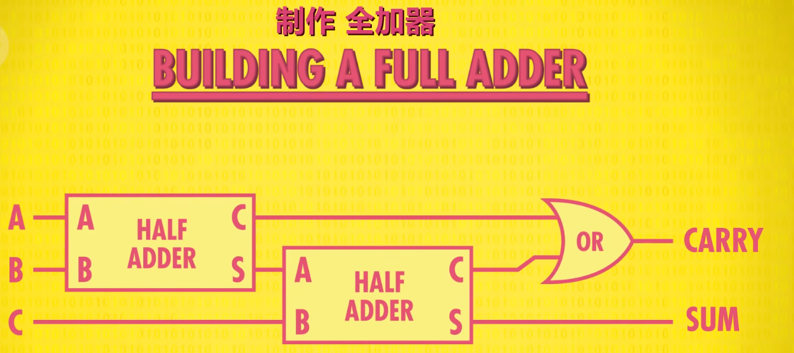
##### 八位加法运算器：
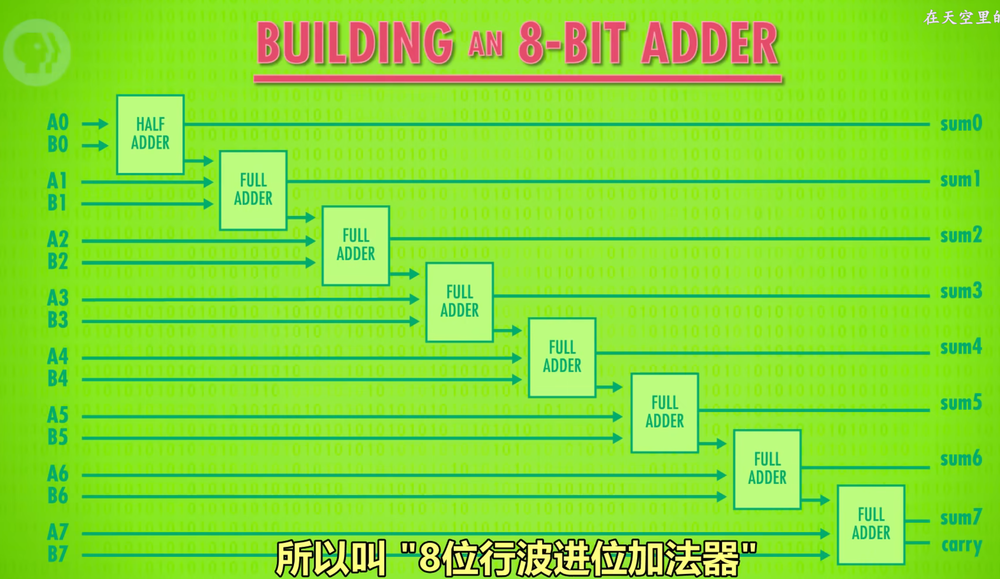

##### overflow（溢出）
+ 两个数字的和太大以至于超出了用来表示的位数
+ ALU溢出会导致不可预料的错误

#### 逻辑单元
+ 处理逻辑运算
    - 例如，在计算机程序中，当需要判断某个数是否为0，通常通过ALU的逻辑单元来完成。

#### 算术单元与逻辑单元合作的例子：
+ 比较A & B：
        * **算术单元**：计算 `A - B`并输出。
        * **逻辑单元**：通过输出结果是否为负数来判断 `A` 是否大于 `B`。

###  Flag（ALU的标志位）
+ ALU还会输出一些1位的**标志位（Flag）**来**表示特定状态**
+  每次ALU进行运算时，它不仅会输出结果，还会更新这些标志位
+ 标志位的作用是帮助后续的运算或者判断
+ 常见的Flags：
        * 零标志位
        * 溢出标志位
        * 负标志位
        * 进位标志位

> **提示**：例子——计算 `5 - 7`

结果不为0，**零标志位仍然为0**；

结果没有溢出，**溢出标志位仍然是0**；

结果是负数，**负标志位更新为1；**

结果没有进位，**进位标志位仍然是0**

##   计算机存储
### RAM（随机存取存储器）【内存】
+ Random Access Memory
+ 用于记录**当前**的工作数据
+ 只能在有电的情况下存储数据，**有电保存，断电丢失**
+ 优势：高速读写，随机访问
+ 特性：可以**随时**访问**任何**位置
+ 内存类型
        * **SRAM——静态随机存取存储器（Static）**
        * **DRAM——动态随机存取存储器**
        * **NVRAM（非易失性RAM）**

### Storage（存储器）
+ Storage一般指数据**非易失性**的存储器
+ 电源关闭数据**不丢失**
+ 常见存储器：
        * 硬盘（HDD&SSD）
        * U盘
        * SD卡
        * 光盘
        * 磁带

### 存储介质的发展演进：
        * **打孔纸带**_[/__<u>非易失性</u>__/]_
        * ——>**延迟线存储器**【用扬声器->水银->麦克风的循环来存储数据】_[/__<u>易失性</u>__/]_
        * ——>**磁芯存储器**【用电流方向控制磁芯磁化方向来存储二进制数据】_[/__<u>非易失性</u>__/]_
        * ——>**磁带**【通过改变磁带表面磁性物质的排列来存储和读取数据】_[/__<u>非易失性</u>__/]_
        * ——>**磁鼓存储器**【通过在旋转的金属鼓上改变磁性来存储和读取数据】_[/__<u>非易失性</u>__/]_
        * ——>**磁盘**&**光盘**
        * ——>**机械硬盘（Hard Disk Drive/HDD）**
        * ——>**固态硬盘（Solid State Drive/SSD）**

### 用逻辑门制作一个一位锁存器（Latch）
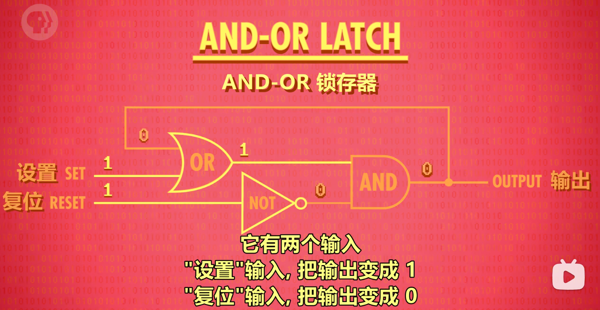

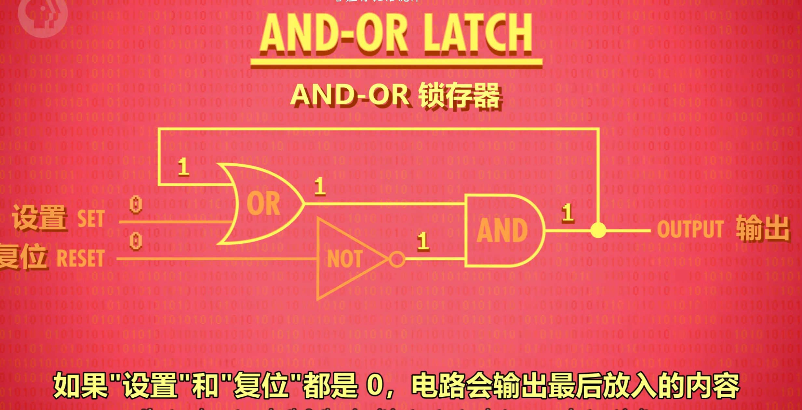

### 提升一层抽象——门锁（真正的锁存器）
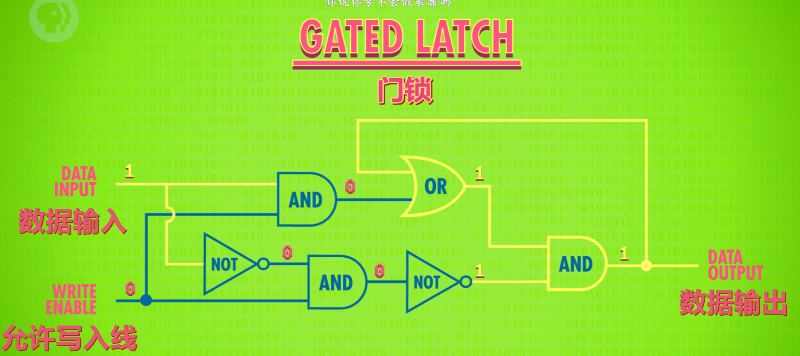

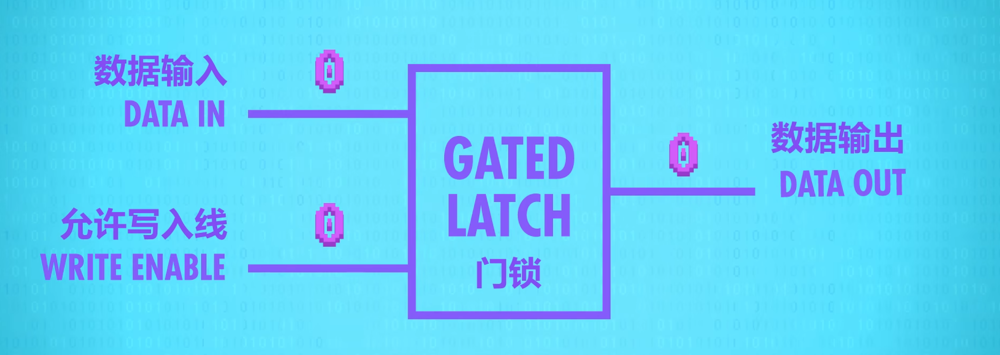

+ 允许写入线输入1，可以进行数据输入
+ 数据输入一位数据
+ 允许写入线输入0，把数据锁住
+ 不管数据输入再是什么，输出的仍然是锁住的数据
+ 实现了**存储数据**的操作

### register（寄存器）
+ 一组锁存器组成的存储结构单元叫做**寄存器**
+ 一个寄存器只能记录一个数字，记录数字的最大位数叫做“**位宽**”
+  用**矩阵**放置锁存器——>**内存地址**应运而生（由**列与行的二进制**组成），使用**Multiplexer（多路复用器）**来解码内存地址，锁定单个锁存器
+ **内存元件的本质都是锁存器矩阵层层嵌套，来存储大量信息**

### cache（缓存）
存储频繁访问的数据以供以后快速检索的存储位置

+ cache存储空间很小，但读写速度极快
+ 存放在cache中的数据可以被高速读取，拿来直接使用

## CPU(中央处理器)
### CPU的组成：
+ RAM内存：**大且相对较慢**的临时存储空间；RAM通常位于CPU之外，属于**主存**，不属于硬盘、U盘一类的外部存储
+ 数据寄存器： **超高速小容量**存储
+ Cache缓存：**更小更快**的存储区域， 用于存储经常使用的数据和指令，减少访问内存的延迟  （**属于内部存储**）
+ 指令寄存器： 存储 **当前正在被CPU执行的指令**
+ 指令地址寄存器
+ 控制单元： 生成控制信号，控制其他元件执行对应操作
+ 算术逻辑单元（ALU）：负责算术运算和逻辑运算
+ 时钟：控制操作节奏

### CPU的工作阶段
1. **取指令阶段**（Fetch Phase）
    1.  程序指令被加载到**RAM**中
    2. **指令地址寄存器**存储所要取指令的指令地址
    3. 将**指令地址寄存器**连到**RAM**，**RAM**取相应指令地址的指令
    4. **RAM**连到**指令寄存器**，把取到的指令复制到指令寄存器里
2. **解码阶段**（Decode Phase）
    1. 取到的指令前半部分是**操作码**，对应计算机硬件所要进行的操作，后半部分是**地址码**，对应要操作的内存地址或寄存器

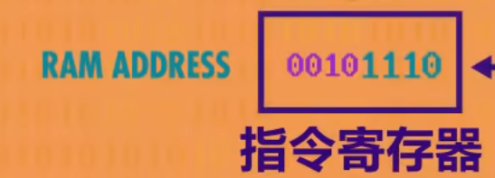

    2. 指令由**控制单元**（Control Unit）【也是由逻辑门组成】进行解码，控制单元会根据操作码生成相应的控制信号，并将这些信号送到 ALU 或内存等部件。
3. 执行阶段（Execute Phase）
    1. 打开**RAM**的**“允许读取线”**，把地址码传过去
    2. RAM取到对应地址码的值
    3. 对取到的值进行对应操作码的操作
+ CPU的**可编程性**：根据不同指令执行不同任务
+ **冯·诺依曼架构**：
    -  核心思想：将程序和数据存储在同一内存中， CPU通过从内存中获取指令并执行来完成计算任务

### ISA（指令集架构）
+ Instruction Set Architecture
+ ISA定义了不同CPU架构的计算机的指令集和操作规则，告诉CPU"做什么"和"怎样做"

### Bus（总线）
+ 连接 CPU 与其他计算机部件的通信通道
+ 用于在计算机内部硬件之间**通讯和传输数据 **
+ 包括
    - 数据总线：传输数据
    - 地址总线：传输存储地址
    - 控制总线：传输控制信号

### 时钟&时钟速度
+ 时钟以准确的时间间隔触发电信号，激活**控制单元**推进CPU内部操作
+ CPU“取指令——>解码——>执行”一个操作周期的速度叫做**时钟速度，**单位是**赫兹**（频率单位），表示 CPU 每秒钟能够完成多少个时钟周期。例如，3GHz 的时钟速度意味着每秒有 30 亿个时钟周期。

### 超频&降频
+ 超频：通过修改时钟速度，把计算机适量超频，从而加快CPU的速度，但超频过多有概率造成CPU过热，导致乱码错误
+ 降频：计算机独自持续运行一个性能要求低的程序时，可以主动给计算机降频以省电
+ 超频和降频的本质都是修改CPU的时钟速度，这叫做“**动态调频（Dynamic Frequency Scaling）**”

### 现代高级CPU设计：
+ 缓存
+ 指令流水线：“并行处理”
+ 多核处理器（Multi-core processors）

## GPU（图形处理单元）
+ （Graphics Processing Unit）
+ 专门用于**处理图像数据**和**大规模并行计算**设计的硬件设备
+ 与CPU相比，GPU拥有**大量核心**，因而具有强大的并行计算能力

## 操作系统（operating system/OS）
+ 操作系统的本质：有**操作硬件**、**管理软件**的特殊权限的**程序**
+ 操作系统是计算机开机第一个启动运行的程序，其他所有程序都由操作系统启动

### 早期操作系统的批处理（batch processing）思想：
+ 在没有现代操作系统的情况下，计算机的工作是手动管理的，由程序员手动提交打孔卡片、纸带等作为任务，计算机执行着一个个独立的任务
+ 早期操作系统将多个任务组织成**批次**进行处理，实现任务的**自动化**处理，提高效率

### 设备驱动程序（device driver）
+ 设备驱动程序是**操作系统**与**硬件（主要是外设）**之间的**软件媒介**，负责让操作系统能够**直接**与硬件交互
+ 驱动程序将硬件操作**抽象化**， 操作系统只需要调用驱动程序提供的**接口**来控制硬件设备，而不需要关心硬件的实现的具体细节
+ 设备驱动程序还会给操作系统**反馈硬件运行的错误**，提供解决方案
+ 驱动程序通常由**硬件制造商**提供，安装在计算机系统中，能够**自动识别和配置硬件设备  **

### 多任务处理（multitasking）
+ 操作系统的核心任务之一：**多任务处理**
+ 多任务处理允许多个程序**共享CPU资源**， 操作系统通过**调度算法**来合理分配CPU资源，实现任务的高效执行
+ 多任务处理的实质：
        * 单核CPU上： 操作系统通过**快速切换任务**，让多个任务能够在同一时段内轮流获得CPU的时间资源， 从而给人一种多个任务“看似同时运行”的效果，但实际上每次**只有一个**任务在CPU上执行
        * 多核CPU上：多个任务可以在不同的CPU上真正地同时运行，从而实现**并行处理**
        * 因此多任务处理在多核系统上更为高效

### 调度（scheduling）
+ 调度是操作系统实现多任务处理的具体方法
+ 通过**调度算法**，操作系统决定计算机资源在不同任务上的分配
+ 调度的基本类型：
        * **CPU调度**：决定哪些进程或线程使用CPU。
        * **I/O调度**：决定哪些进程或线程使用I/O设备（如硬盘、网络等）

### 虚拟内存（Virtual Memory）
+ 多任务处理的过程中，同一程序可能会被分配到**不连续的内存块**，难以追踪，因此操作系统采取**”虚拟内存“**的方式解决
+ 操作系统假定程序在内存中的存储位置总是从地址0开始，实际的物理内存地址则被操作系统**隐藏**了起来，在程序的不断运行中，操作系统会自动实时地完成**虚拟内存**和**物理内存**之间的**映射**；使得每个程序都能够认为自己有一个连续的内存空间，而不受实际物理内存的限制
+ 分配虚拟内存可以起到**”内存保护“（memory protection）**的作用，虚拟内存使得每个程序拥有**独立**的内存空间，程序之间**互不干扰**，对于<u>出错程序的内存脏化</u>和<u>病毒程序对内存的污染</u>都有保护作用
+ 虚拟内存可以将硬件的内存资源**扩展**成一个**虚拟**的内存空间，从而让程序认为自己分配到了足够的内存资源，以保证程序的基本运行
+ **形象化解释：**虚拟内存是操作系统为保证程序正常运行，而对程序做出的**“善意的谎言”**

### 动态内存分配（dynamic memory allocation）
+ 使程序的内存大小可以灵活增减的机制
+ <u>虚拟内存为动态内存分配提供了支持</u>

## 文件系统（File System）
### 文件系统的演变：
+ 早期计算机文件系统：**平面式文件系统（Flat File System）**
+ 现代计算机文件系统：**分层式文件系统**（文件夹层层嵌套）**（Hierarchical File System）**

### 元数据（meta data）
+ “关于数据的数据”
+ 元数据提供了对数据内容、格式、结构等的描述，也被称为**“文件头”（header）**
+ 例如，Word 或 PDF 文件的元数据包括：作者、标题、创建日期、修改日期、页数等

### 文件格式
+ 告诉计算机该文件是什么类型的文件
+ **所有格式的文件在底层都是一致的：一长串二进制数据**
+ 常见文件格式与存储实质：
    - TXT文本文件：
        * 存储的是字母汉字等文本数据
        * 实质是由**ASCII码**或**Unicode**对应转换来的二进制数据
    - WAV波形文件：
        * 存储的是音频数据
        * 实质：开头的元数据记录了该音频的码率、声道等配置，后面则存储了每秒上千次的**声波振幅**的二进制数据
    - BMP位图文件：
        * 存储的是图片数据
        * 实质：元数据记录了该图片的宽度、高度、颜色深度等配置，后面则存储了每个像素块内**三原色**的二进制数据（例：255 255 0）

### 文件在计算机中的存储：
#### 目录文件（directory file）
+ 记录其他文件的信息和位置的特殊文件
+ 文件的增删改会更新目录文件
+ **根目录文件（root directory）**记录了所有文件和目录文件，在最顶层

#### 现代文件系统对文件的存储方式：
1. 把存储空间**按块划分**，每一块用于存储**同个文件**的数据
2. 小文件直接存进某一块存储空间中，大文件会被**拆分**，存进多个块内
3. 由**目录文件**记录每个文件所在的存储空间块

#### 删除文件的实质：
+ 被删除的文件数据并没有被删除，而是在目录文件中被**抹掉了存在的记录**，于是对应的存储空间块在记录上变得空闲可用，之后**被新数据覆盖**时，被删除的文件数据才会真正地消失
+ ——**<u>回收站/文件恢复</u>**的原理👆

#### 文件碎片（fragmentation）：
+ 由于文件的增删改，不可避免地会使同一文件的拆分文件被顺序打乱地存储在相隔的存储空间中，由此产生**“文件碎片”**
+ 文件碎片会使文件访问的速度变慢

#### 碎片整理（defragmentation）：
+ 计算机将数据按顺序移动到正确的存储空间块中
+ 现代操作系统通常会自动管理碎片化问题

### 文件压缩（Compression）
#### 减少重复信息——游程编码（Run-Length Encoding）
+ 适用于**相同数据多**的文件
+ 用`**相同数据个数+数据**`的对子来存储数据
    - 例（用十进制来演示，实际是二进制）：
        * 原数据：    0  2  5  5  5  5  5  5  6  6  6
        * 压缩后：    1  0  1  2  6  5  3  6
+ 解压缩后数据跟压缩前一模一样，没有丢失任何数据，属于**“无损压缩”（lossless compression）**

#### 更紧凑的编码方式——字典编码（dictionary coders）
+ 把多个数据看作一个整体，用**形成字典**的方式进行将这个整体转换成更短的代码
+ 同样也是**无损压缩**

#### 有损压缩（lossy compression）
+ 有损压缩的压缩方式常被称为**：“感知编码”（Perceptual coding）**
+ 本质：<u>去掉人类看不出区别的数据</u>
+ 一些例子：
        * 直接删除音频数据中人类听不到的超声波
        * 人类对人声、低音等音频的敏感程度不一，有损压缩通过以不同精度进行编码使在人类听不出明显区别的前提下达成压缩效果
        * 视频只存帧与帧之间变化的部分像素

## 人机交互（HCI）
+ <u>Human-Computer Interaction</u>
+ 研究人类与计算机如何有效互动的一门学科

### 输入输出设备
#### 早期的输入输出设备：
+ 打孔纸带&打印机
+ ——>电传打字机
+ ——>键盘&屏幕

### 命令行界面（CLI）
+ <u>Command Line Interface</u>
+ 早期发展至今的一种人机交互模式
+ 用户输入特定的命令并按回车键来执行操作，系统给出反馈
+ 优点：工具集成、功能强大、精确高效
+ 缺点：命令语法较复杂，输入困难，输出可视化弱

### 图形用户界面（GUI）
+ <u>Graphical User Interface</u>
+  用户不需要记忆复杂的命令，图形界面通过可视化元素直接展示各种功能和操作选项
+ 文件夹、复制粘贴剪切、窗口、文件页面……都是GUI对于计算机资源、文件系统等的新一层抽象
+ 优点：操作简单，交互性强
+ 缺点：资源占用大、运行效率较低、操作空间较小、

## 编程
### 计算机编程的发展历程
+ **打孔纸卡**——>**插线板**——>**开关控制面板——>编程语言**

### 编程语言的发展：
#### 机器语言（二进制）
        * 先写出所写程序功能的**伪代码**：

> **伪代码（Pseudo-Code）**：对程序的高层次描述
>

        * 使用**操作码表**把伪代码整理并转成**二进制机器码**
        * 不同ISA架构的计算机所用的机器语言也是不同的

#### 汇编语言
        * 进行一步抽象，发明**“助记符”（mnemonics）**，即给每个二进制地操作码分配一个简单易记的名字
        * 由**汇编器（Assembler）**读取汇编语言并转换成对应的机器码供CPU读取
        * 汇编语言与机器指令是<u>一一对应</u>的，所以不同ISA架构的计算机使用的汇编语言也是不同的

#### 低级语言
        * 机器语言和汇编语言都是低级语言
        * 低级语言只提供最底层面的抽象
        * 低级语言是为当前ISA架构的计算机量身定做的，通用性差

#### 高级语言
        * 进一步抽象，使编程语言更接近人类**自然语言**的语法，易于编写阅读维护
        * 由**编译器（Compiler）或解释器（Interpretor）**把高级语言转换成低级语言（汇编语言或机器码）
            + 编译器将源代码一次转换成低级语言，生成exe可执行文件交给硬件进行运行
            + 解释器将源代码逐行读取，即时解释成低级语言，直接交给硬件运行
        * 高级语言是通用兼容跨平台的，只需要对应不同ISA架构的不同的编译器或解释器，即可在所有平台上完美运行
        * 但某些Third-party libraries（第三方库）会限制在特定操作系统或平台上才能运行

### 算法概述：
+ 算法：解决问题的具体方法
+ 算法的复杂度：算法的**输入大小变化和运行步骤变化**之间的关系，表示运行速度的量级

### 数据结构
+ 数据在内存中存储的方式
+ 常见的数据结构：
        * 数组（Array）/列表（list）/向量（vector）
        * 字符串（string）
        * 矩阵（Matrix）
        * 结构体（struct）
        * 指针（pointer）
        * 节点（node）
        * 链表（linked list）
        * 队列（queue）
        * 栈（stack）
        * 树（tree）
        * 二叉树（binary tree）
        * 图（graph）
+ 不同数据结构具有不同功能、适用于不同场景
+ **花时间考虑用什么数据结构是必要的**

##   阿兰·图灵
+ 计算机科学的奠基人之一
+ 提出**”图灵机“**概念
+ 奠定**计算理论**和**人工智能**的基础

### 图灵机
+ 产生原因：为了解决**“可判定性问题”**——<u>“是否存在一种算法，输入正式逻辑语句，能输出准确的是或否作为答案？”</u>
+ 由<u>纸带、读写头、状态机</u>组成
+ 是一种定义了**“可计算性”**的理论计算模型
+ 理论上可以解决任何可计算的问题
+ 因此得到了一个标准：**<u> 任何可以由图灵机计算出来（能根据图灵机的规则设计出相应的图灵机模式来解决）的问题，都可以被称为“可计算的“</u>**
+ 现代计算机可看作图灵机的理论到现实的实现

### 图灵完备
+ 是一种对于对象计算能力的**评价标准**，描述了一种计算模型（比如编程语言、计算机系统、机器等）是否具有和图灵机一样的计算能力
+ ”图灵完备“的基本条件：
        * 具备**条件判断**能力
        * 具备**循环、递归**能力
        * 具备存储数据并访问修改的**内存存储**能力

### 图灵测试
+ 是图灵于1950年提出的一种用于判断**机器是否具备“智能”**的方法
+ 评判者在不知道对话对象的情况下与一台机器和一位人类进行对话，如果评判者无法分辨出机器和人类，那么这台机器被认为通过了图灵测试，具备了某种程度的“人工智能“
+ 核心： 通过对话来评估机器是否能够模拟人类的思维和行为
+ 提出了”人工智能“的早期定义

## 计算机网络（Computer Networks）
### 局域网（LAN）
+ <u>Local Area Network</u>
+ 由近距离的计算机构成的小型网络

### 以太网（Ethernet）
+ 以太网是开发最成功、使用最广泛的LAN技术
+ 更快更稳定，使用网线进行有线连接
+ 基本形式：
        * 计算机之间由以**太网电缆（网线）**进行连接
        * 数据以**电信号**的形式在电缆中传输
        * 传输的数据前缀（元数据）为传输对象计算机的**MAC地址**
        * 其他计算机只有看到数据中有自己的MAC地址才进行数据的处理
+ 以太网的工作方式：**“CSMA/CD”**（collision detection）【具体见（九）】

### 广域网（WAN）
+ <u>Wide Area Network</u>
+ 广域网指覆盖地理范围较大的大型网络
+ 广域网将不同地区的局域网连接在一起

### 互联网（Internet）
+ 互联网是全球最大的广域网，通过各种协议和服务，使得全世界的设备可以进行通信
+ 互联网就是一个巨型的分布式网络，是传输数据的管道

### 万维网（WWW）
+ <u>The World Wide Web</u>
+ 万维网是互联网的一部分，是在互联网之上运行的**程序**
+ 万维网最基本的单位：**页面（page）**；页面之间通过**超链接（hyperlink）**进行跳转连接

> **补充**

### MAC地址
+ **媒体访问控制地址（Media Access Contro address）**
+ 为解决以太网中计算机指定对象传输数据问题设置的地址
+ 每台计算机的**网卡**自带**唯一的MAC地址**，用于以太网&WIFI
+ MAC地址是由硬件厂商在制造设备时**烧录**到**网卡**上的，**不可更改**，用来标识唯一设备

### 网卡/网络接口卡（NIC）
+ Network Interface Card
+ 网卡是计算机与网络之间的通信的窗口，负责数据传输、接收、基本的错误控制
+ 网卡发送数据包的前提：知道接收方的MAC地址
+ 网卡将数据包发送给路由器（默认网关），再由路由器传输给其他设备
+ 有线网卡：需要连接网线（RJ45）；无线网卡不需要，通过无线电信号联网

### 连接网络的全过程：
1. 网卡通过操作系统内置的DHCP（动态主机配置协议）客户端向网络中的DHCP服务器请求一个IP地址（实际是向网络中发送了一个广播包，广播给了网络中的所有设备【因为没联网不知道DHCP服务器的MAC地址，网卡传输信息必须以知道MAC地址为前提】）`“DHCP Discover”`
2. 接到请求的DHCP服务器会将可用的IP地址、路由器IP地址、DNS服务器IP地址等信息返回到网卡`“DHCP Offer”`
3. 设备收到信息后会选择一个IP地址，网卡又会广播给DHCP服务器告知选择的IP地址`“DHCP Request”`
4. DHCP服务器收到后会再次返回确认的网络配置`“DHCP Acknowledgement”`
5. 设备成功连接网络，通过默认网关（分配的路由器与其他网络进行通讯）
+ 注：
    - DHCP Discover消息是广播，DHCP服务器响应时是单播。
    - 设备可能会请求续租，而不是每次都发送Discover。

### CSMA（载波侦听多路访问）
+ <u>Carrier Sense Multiple Access</u>
+ 多台电脑共**享一个传输媒介（载体）**的网络传输方法
+ 以太网的载体是铜线电缆
+ WIFI的载体是传播无线电波的空气
+ CSMA方法的弊端：
    - 连入的计算机越多，多台计算机同时传输数据的可能性越大，造成**冲突（collision）**
    - 解决方式：
        * **指数回避（exponential backoff）**：
            + 计算机检测到网络冲突时，会等待$ 2^n + r(n=0,1,2\dots;r为随机) $秒，直到传输成功
        * 放置**交换机（switch）**，减少**冲突域（collision domain）**【大型计算机网络的构建方式】
            + 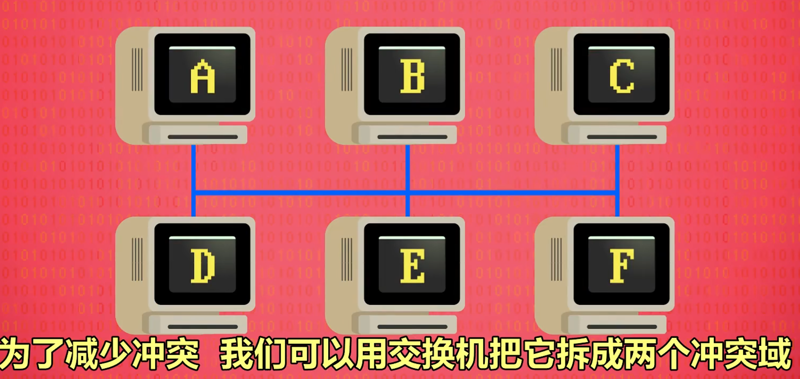
            + 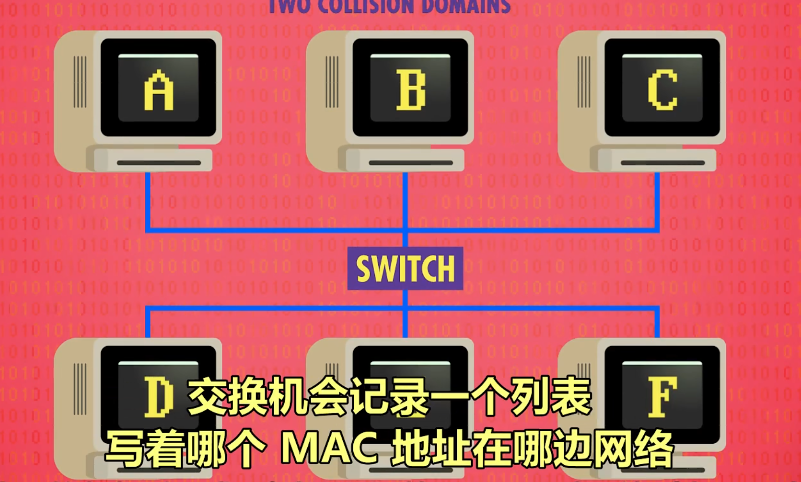

### 带宽（Bandwidth）
+ 计算机网络中**传播媒介（载体）传输数据的速度**
+  单位通常是**比特每秒（bps）**
+ **带宽≠实际数据传输速率**：带宽表示当前网络连接下数据传输的**最大速率**，实际传输收到网络状况等的多重影响

### 路由（routing）& 路由器（router）
+ **路由**是<u>原设备传输的数据在计算器网络中传输到目标设备的过程</u>
+ **路由器**：传输网络中的**中转站**
+ **路由器**有**路由表**，记录着各种目的地网络的存储信息，通过算法为数据选择最优传输路径

### 跳数（hop count）
+ 跳数是数据沿着路由跳转的次数（**经过路由器的数量**）
+ 传输时会更新跳数，可以由跳数异常检测出路由错误

### 数据包（packet）
+ 解决了大文件传输占用整条路线，造成网络堵塞的问题
+ 把大文件分成很多小的“数据包”
+ 数据包同时通过**多条线路**输送，前后到达目标设备
+ **TCP/IP **解决了数据包到达顺序不同的**乱序问题**
+ **当今互联网的运行方式：将数据拆分成多个小数据包，然后通过灵活的路由，用各种的标准协议实现数据的传输——【分组交换（Packet Switching）】**
+ 世界上第一个分组交换网络、当代互联网的祖先：**ARPANET**

### IP（网络协议）
+ <u>Internet Protocol</u>
+ IP是一个非常底层的**网络层协议**，是**无连接**的，不提供错误检测和纠正机制，它只负责将数据包从源设备路由到目标设备
+ IP规定了IP地址、数据包等内容，确保数据的有效传输，是互联网、局域网通信的基础
+ IP地址用于标识网络中的接口或设备；服务器只是可能使用IP地址的设备之一

### 常见的网络协议：
#### UDP（用户数据报协议）【传输层协议】
+ <u>User Datagram Protocol</u>
+ IP负责把数据包送给正确的计算机，UDP则负责把数据包送到正确的**程序**
+ UDP规定了每个想访问网络的程序，都要向操作系统申请一个**端口号（port）**，目标程序的port会写在数据包的**UDP元数据**中
+ UDP还会通过**“校验和”**（将全部数据加和存储）来判断数据传输后是否完整，但不提供修复和重发的机制，只是通知数据是否损坏，程序一般会选择将损坏数据直接丢弃
+ UDP常应用于能够容忍一定程度数据丢失的程序，如：视频通话等

#### TCP（传输控制协议）【传输层协议】
+ <u>Transmission Control Protocol</u>
+ 与UDP的相同点：TCP也有**端口号**和**校验和**
+ 与UDP的不同点：
        * TCP数据包**有序号**，可以对乱序到达的顺序进行**排序**
        * TCP要求接收方在收到一个数据包且校验和检查无误（数据没有损坏）的情况下，给发送方发一个**确认码（ACK）**来确认收到无误，发送方只有收到ACK后才会发送下一个数据包，ACK丢失会**重新发送**该数据包（TCP可以同时发送多个数据包，接收多个ACK【但ACK是必须按顺序发送的，比如同时发出6、7、8号数据包，只收到了8号ACK，月一定代表6、7号也被成功接收，而6、7号的ACK可能在传输途中丢失】，TCP通过对ACK反馈的成功率和时间等调整**同时发送数据包的个数**来解决网络拥堵问题）
        * TCP由于较为复杂，**传输速度更慢**，但保证了**数据完整传输**
+ TCP+IP的经典组合被称为：**TCP/IP**

#### HTTP（超文本传输协议）【应用层协议】
+ <u>Hypertext Transfer Protocol</u>
+ 向服务器发送对访问网页的**GET请求**
+ **状态码**：服务器返回的内容，代表请求处理的状态；**200**通常表示**请求成功**，**400～499**表示**客户端请求错误**
        * 例：**“404 Not Found”**
+ 每个 HTTP 请求都是**独立**的，服务器在处理请求时不会自动记住客户端以前做过什么，所以服务器无法记住用户信息和行为，可以通过**cookie**或**session**来解决

#### DHCP（动态主机配置协议）【应用层协议】
+ Dynamic Host Configuration Protocol
+ 用于设备连接网络时自动给设备分配IP地址和其他网络配置信息的协议
+ DHCP简化了设备的网络配置过程

#### ARP（地址解析协议）
+ Address Resolution Protocol
+ 作用：将IP地址转换为对应的MAC地址
+ 实现过程：
        * 设备在网络中发送ARP请求，将目标设备的IP地址广播出去
        * 目标设备收到请求后通过ARP响应返回自己的MAC地址
        * 得到MAC地址后，网卡就可以发送数据包给路由器，再由路由器发送给目标设备

### 域名系统（DNS）
+ <u>Domain Name System</u>
+ 将网站的**域名与IP地址**进行绑定，从而方便记忆
+ 域名通过**DNS**解析为**IP地址**，浏览器通过IP地址访问**服务器**
+ DNS使用**层级结构**进行域名管理：
        * **顶级域名（TLD）**：`.com`
        * **二级域名（SLD）**：`google.com`
        * **子域名**：`store.google.com`

### URL（统一资源定位器）
+ <u>Uniform Resource Locator</u>
+ 每个网页的唯一的地址
+ URL的结构： `**协议://域名/路径 **` ；
    - 如`http://www.example.com/index.html`

### 浏览器（Web Browser）
+ 网页浏览器可以和网页**服务器**沟通，获取网页内容并**渲染**显示到屏幕上

### “网络中立性”（Net Neutrality）争议
+ **网络中立性**指互联网服务提供商（ISP）应当对互联网上的所有数据和内容一视同仁，给予**相同的速度和优先级**，而不对任何网站、应用或数据类型进行优待、歧视或封锁节流
+ 网络中立性的争议涉及到是否允许互联网服务提供商对网络流量进行优先级管理和定制化服务；网络中立性虽然一定程度上保护了市场公平和用户权益，保障小企业创新发展，但也妨碍了ISP对其提供网络服务的改进完善和发展1

### 开放式系统互联通信参考模型（OSI）
+ <u>Open System Interconnection</u>
+ OSI这个概念性框架把网络通信划分为**七大层**，每一层处理各自的问题，从而实现网络通信，这也是一种**分层式抽象**
+ 分层：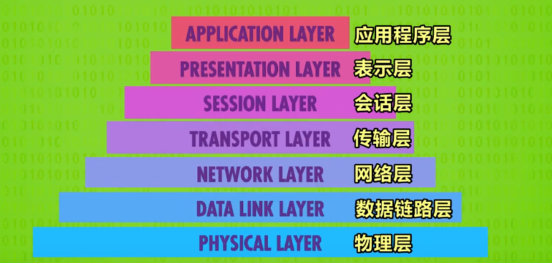

### 计算机访问一个网页的全过程：
1. 在浏览器中输入要访问**网站的域名**或**网页的URL地址**
2. **DNS**查找相应的**IP地址的服务器**并返回给浏览器
3. 浏览器使用**TCP协议**与目标服务器的IP地址建立**TCP连接**， 称为“**三次握手”**  【目的是为了确认双方的接收和发送能力是否没问题】（HTTP的默认端口为80）
4. 一旦成功建立连接，计算机会通过该连接向服务器发送**HTTP请求指令**：**“GET /网页”**，从而告知服务器浏览器想要获取网站的首页等资源
5. 服务器收到指令后会处理请求并返回**HTTP响应**，响应中包括**状态码**和对应的**网页内容**
6. **浏览器**将该网页**渲染**到屏幕上
7. 点击另一个超链接，重复4~6

## 计算机安全(Cybersecurity)
### 计算机安全“三目标”
+ 保护计算机系统和数据的保密性、完整性、可用性
    - 保密性：只有有权限的人才能读取计算机系统和数据
    - 完整性：只有有权限的人才能使用和修改系统和数据
    - 可用性：有权限的人应该随时可以访问系统和数据

### 威胁模型分析（threat model）
+ 防御攻击的首要要务是要明晰攻击者是谁
+ 为了实现“三目标”，从抽象层面想象潜在攻击者可能是谁的分析方式
+ 模型的建立是对攻击者进行大致描述：
    - 攻击目标可能是什么
    - 攻击能力如何
    - 攻击手段（通常被称为“攻击矢量”）可能是什么
    - 开发人员通过构建威胁模型，组织能够提前识别安全漏洞、制定防御策略

### 身份验证（Authentication）
+ 解决的是“谁可以访问”的问题

#### “What you know？”
+ 基于只有计算机和用户才知道的秘密信息，如用户名、密码
+ “暴力攻击（brute force attack）”：
        * 穷举法试遍密码可能组合的算法
        * 防御方式：多次错误后等待或锁定、大写+小写+标点式的密码

#### “What you have？”
+ 基于用户有的特定物品，如密钥

#### “What you are？”
+ 基于用户自身的特征，如指纹识别、面部识别
+ 是一种概率性（probabilistic）的身份验证

#### 双因素认证/多因素认证 （2FA/MFA）
+ 综合使用多种身份验证方式提高安全性

### 访问控制（Access Control）
+ 解决的是“访问什么”的问题

#### 权限（permission）
+ 指单个用户或用户组对某个资源（文件、目录、系统等）可以执行的操作，如读取（READ）、写入（WRITE）、执行（EXECUTE）等

#### 基于角色的访问控制（RBAC）
+ Role-Based Access Control
+ 用户基于其角色（如管理员、普通用户等）被授予不同的权限

#### 基于规则的访问控制（ABAC）
+ Attribute-Based Access Control
+ 根据用户属性、环境条件等动态地控制访问权限

#### 基于访问控制列表（ACL）的访问控制
+ Access Control List
+ 为特定对象（如文件或目录）指定具体的权限，列出哪些用户或用户组可以访问该对象，以及他们可以执行的操作

#### Bell-LaPadula访问控制模型：
+ “低权限不能向上读，高权限不能向下写”
+ 该访问控制模型专注于机密性保护

### 安全内核
+ 负责管理和保障计算机安全部分的操作系统核心组件（软件）
+ 通过“最小化代码数量”来减少潜在威胁
+ “独立安全检查和质量验证”（Independent Verification and Validation）手段可以验证代码的安全性——让一群安全行业内的软件开发者来审查代码

### 可信计算基础（TCB）
+ Trusted Computing Base
+ 计算机系统中保证安全性的软硬件的集合
+ 安全内核是TCB中负责执行核心安全任务的组件
+ TCB 是计算机系统中最核心的部分，所有的安全控制和策略都依赖于 TCB 的正确性
+ **独立安全检查**和**质量验证**都是确保TCB安全性和可信度的关键手段。独立安全检查帮助发现TCB中的潜在安全问题，而质量验证确保TCB的功能、性能和安全要求得到满足

### 隔离技术
+ 分隔计算环境中不同资源或进程的安全机制

#### 沙箱（Sandbox）
+ 通过为应用程序或代码创建一个受限的执行环境，来控制它们对系统资源的访问
+ 沙箱中的应用程序或进程只能在该环境中运行，无法影响到系统的其他部分
+ 例： 现代浏览器（如Chrome、Firefox）使用沙箱技术将每个标签页或插件隔离开，防止恶意网站或插件影响整个浏览器或操作系统

#### 虚拟机（Virtual Machine）
+ 每个虚拟机都能运行一个独立的操作系统，而且相互隔离

#### 容器（Container）
+ 共享操作系统的内核，提供轻量级程序隔离
+ 例：Docker便是通过容器来实现应用程序和其依赖环境的隔离

### 加密（Encryption）
+ 将明文通过加密算法和密钥转换成密文的防御手段
+ 解密：Decryption

### 密钥（key）
+ 密钥：“打开锁的钥匙”
+ 加密过程中需要使用的一个秘密参数，决定了加密和解密的结果。密钥是特定的，只有知道密钥的人才能解密密文
+  加密算法是加密规则，而密钥则是具体参数，两者共同配合才能加密解密

### 密钥交换（key exchange）
+ 指在加密通信中，安全地在通信双方之间共享密钥的过程
+ 是一种不发送密钥，但仍然让两台计算机在密钥上达成共识的算法【单向函数】（混在一起的颜色难以找到混进去了什么颜色）

### 对称密钥&非对称密钥（symmetric key）
+ 对称密钥：双方用一样的密钥加密和解密信息
+ 非对称密钥：用公钥（public key）加密信息，但只有私钥（private key）才能解密【也可以反过来用私钥加密，用公钥解密（用于签名，只有特定的人能加密）】

## 软件工程
### 对象（object）
+ 代码打包——>函数  ； 相关函数打包——>对象
+ 对象可以相互**嵌套**

### 面向对象编程 （Object Oriented Programming/OOP）
+ 把**函数打包成对象**进行编程的思想
+ 核心：通过**封装**来隐藏复杂度，选择性地公布功能
+ “面向对象编程的四大特性”——**封装、继承、多态和抽象  **
+ 面向对象编程语言可以指定函数的权限：`public` 或 `private`
        * `Private`的函数只有同一个对象下的其他函数【**内部函数**】才能进行调用
        * `Public`的函数**所有函数**都可进行调用
+ 擅长做团队协作的大型项目使用

### 文档（document）
+ 团队之间相互**理解代码**的基础
+ 通常是`**README.txt**`文件，告诉其他程序员，写代码前先看这个文件
+ 文档也可以全部写成**“注释”（comment）**，放在源代码里
+ 一个好的文档可以帮助开发者自己在很长一段时间后理解自己写的代码
+ 文档还可以提高**复用性**（code reuse），可以阅读代码用法并直接用写好的代码解决问题
+ **API文档**：多数团队注重**接口的文档化**，API文档用于描述程序的接口、输入输出、异常等，帮助开发者理解如何调用API

### 程序编程接口（API）
+ Application Programming interface
+ 本质上是一种**人为规定**，提供了让不同程序、对象、函数能够相互**调用**操作的**方法和规则**

### 集成开发环境（IDE）
+ Integrated Development Environments
+ 集成了许多功能的专业开发工具，如Visual Studio等

### 调试（Debug）
+ 查找和修复程序中已经存在的bug

### 源代码管理（Source Control）/版本控制（Version Control）
+ 把代码放到代码仓库（code repository）中
+ 修改代码时先从`code repository` 中 `check out`，然后在自己的电脑上编辑修改代码
+ 修改测试完成后，进行`commit`（提交）新代码
+ Source Control 可以**跟踪**所有代码变化以及修改代码的人，提供**“回滚”**操作
+ 如`Git`

### QA（质量保证测试）
+ Quality Assurance testing
+ QA的本质就是**找bug**
+ QA对于保证软件质量十分重要
+ **“beta”版软件：**
    - 软件接近完成，但测试仍不完全
    - 公司向公众发布beta版，公众相当于免费找bug的QA团队
+ **“alpha”版软件：**
    - 粗糙不完善，漏洞很多的软件版本
    - 经常用于公司内部测试

<!-- learning-journey:update-history:start -->
## 更新记录

| 日期 | 类型 | 说明 |
| --- | --- | --- |
| 2026-07-22 | 首次发布 | 从语雀整理并发布到学习记录仓库 |
<!-- learning-journey:update-history:end -->
