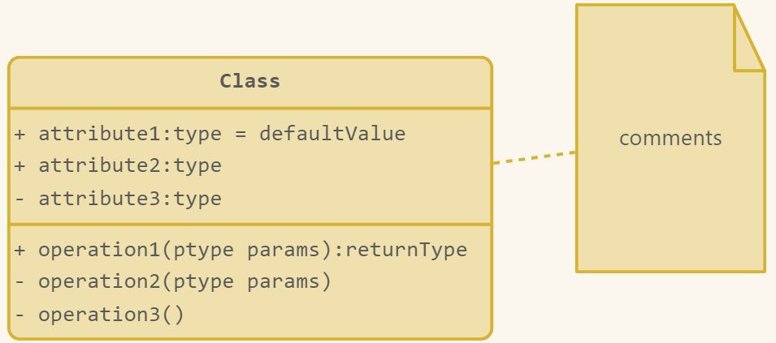
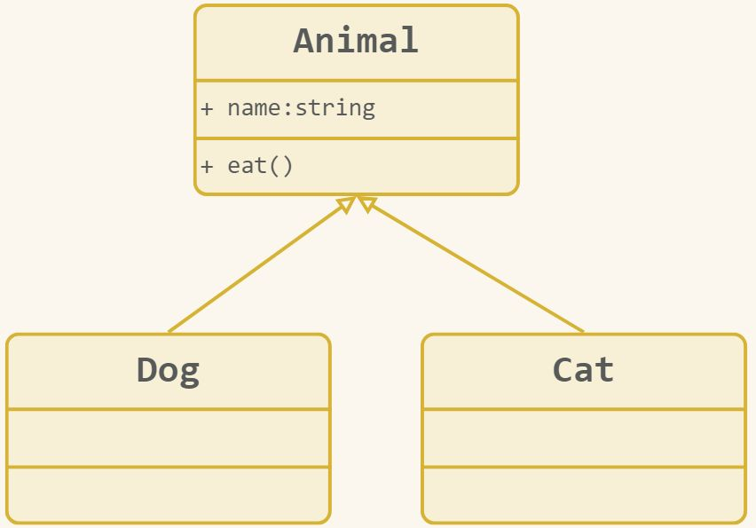

# UML 概述与类图

## UML 是什么

- UML 是 **Unified Modeling Language（统一建模语言）**。
- UML 是用于软件开发生命周期中系统设计环节的图形化语言。
- 它相当于“为工程画图纸”，程序员会根据设计图纸进行软件开发。
- UML 针对面向对象系统的产品。

## 软件生命周期

软件生命周期是一个软件从最初构想到最终退役的全过程：

> 需求分析 → 形成需求文档 → 系统设计 → 开发编码 → 测试 → 部署 → 维护 → 停用退役

UML 设计应用于软件开发的系统设计阶段。

## UML 类图

类图用于定义系统中的类，描述类的内部结构和类之间的关系。

### 类的内部结构

可见性：

- `+`：公有类型。
- `-`：私有类型。
- `#`：保护类型。
- `~`：包内类型（方法的专有可见性：同一个包内的对象才可以调用包内公有的方法）。

### 类之间的关系

#### 继承关系

<!-- learning-journey:update-history:start -->
## 更新记录

| 日期 | 类型 | 说明 |
| --- | --- | --- |
| 2026-07-23 | 首次发布 | 合并整理语雀中的《UML概述》和《UML类图》并发布 |
<!-- learning-journey:update-history:end -->
