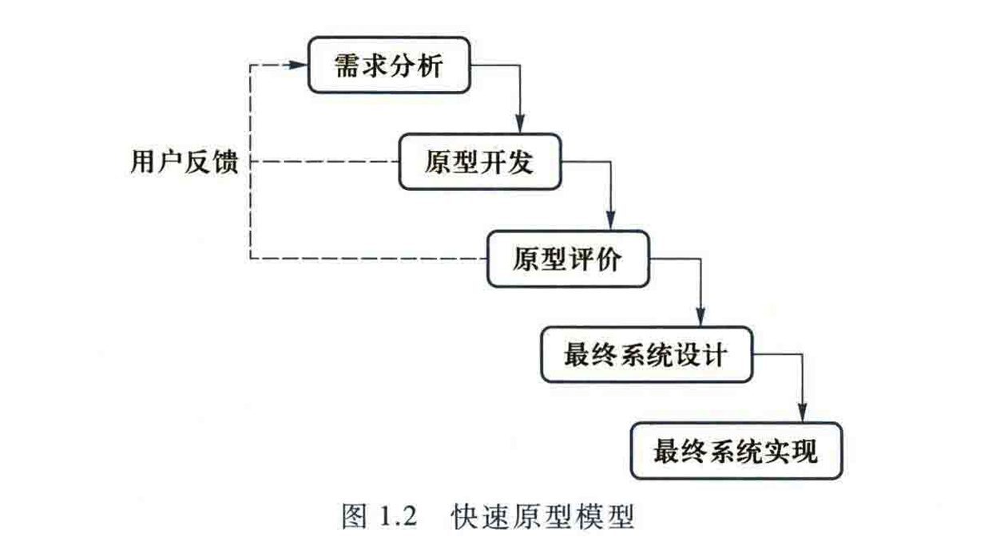
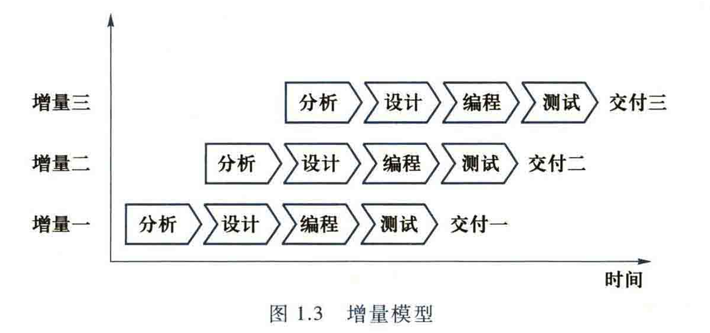
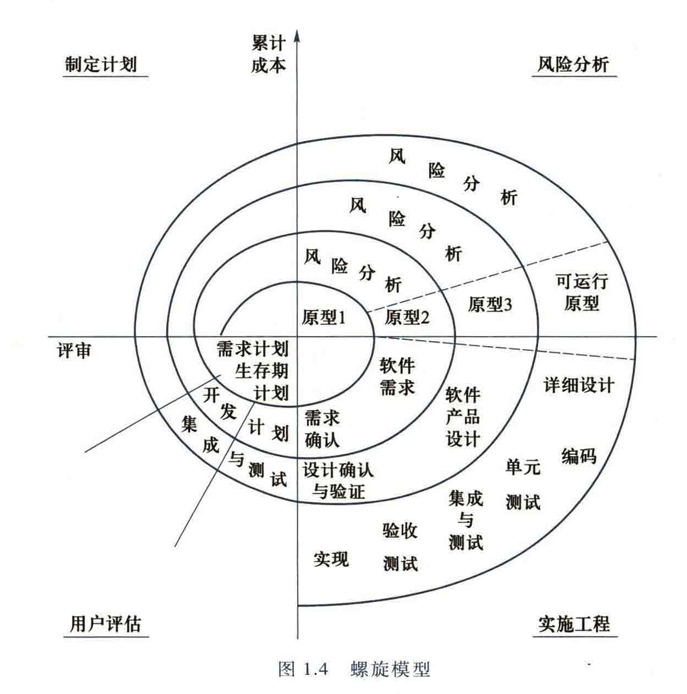
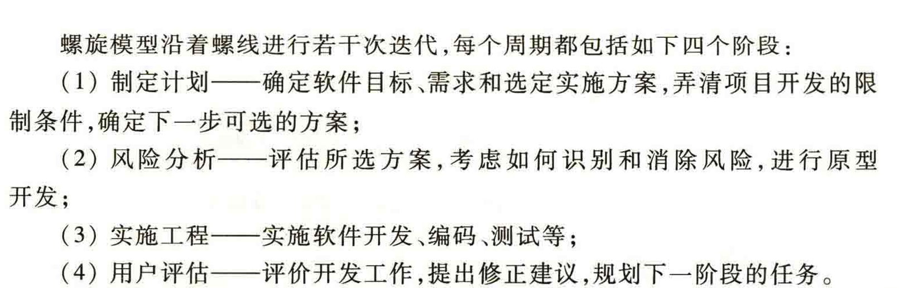
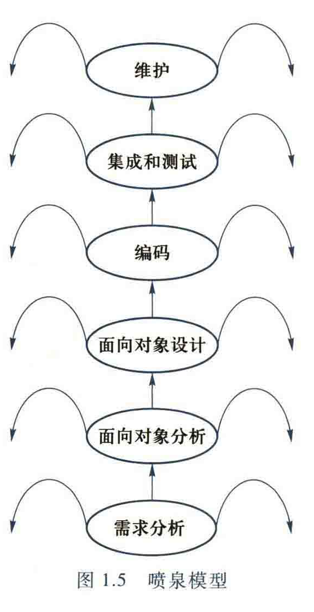
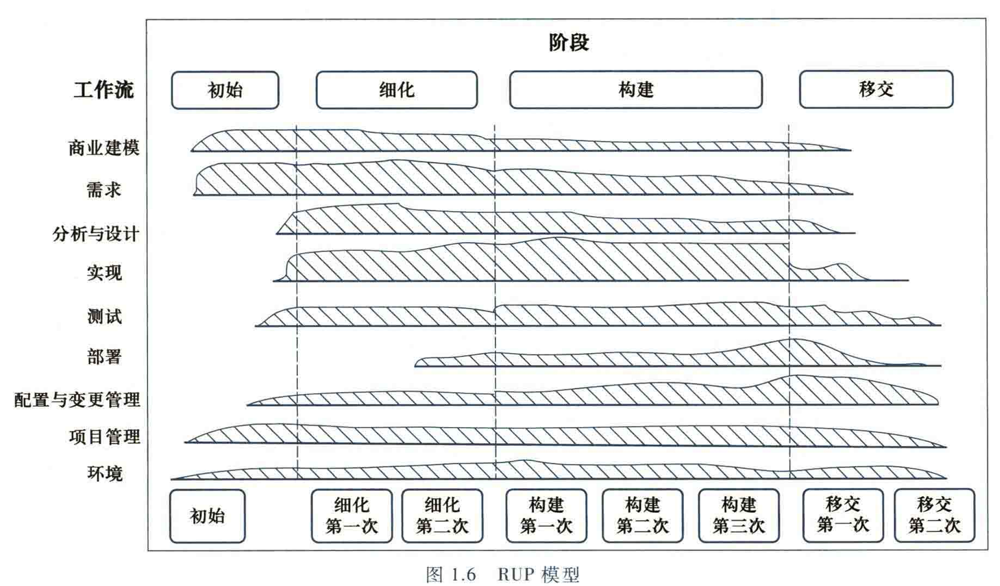

# 系统的本质定义：
+ 面向对象的系统由一系列**相互连接**、**相互交互**的对象构成
+ 对象通过**消息传递（方法调用）**发生交互，交互的目的在于**变更系统的状态**

:::warning
如何判断一个程序是不是结构化的？

**答：三大结构（顺序，分支，循环），单入单出**

:::

****

## 系统状态变更的形式
1. 创建或销毁对象
2. 修改对象的属性
3. 建立或销毁对象之间的连接关系

## 系统如何实现状态的变迁
+ 消息传递（方法调用）

# 软件系统
## 软件系统的分类：
+ 系统软件：控制和协调计算机及其外部设备、支持应用软件的软件
+ 应用软件：为实现某种特定用途而被开发的软件

## 软件系统发展趋势：
1. 程序设计与“软件作坊”阶段
2. 软件工程与面向对象技术阶段
3. AI应用与智能软件工程阶段

## 软件系统分析与设计相关人员
+ 主要参与人员：
        * 软件系统分析人员
        * 软件系统设计人员
+ 系统关联人员：
        * 系统所有者
        * 系统用户
        * 外部服务提供者
        * 项目经理

# 经典软件过程模型
## 瀑布模型

+ 后一个阶段的开始取决于前一个阶段的完成交付，各阶段之间无重叠
+ 问题定义——>系统分析与设计——>系统实现与运维

## 快速原型模型

+ 在开发真实系统前，先迅速建立一个可以运行的软件系统原型并交付用户试用，及时沟通需求，便于更改；用户测试后给出反馈和改进意见以修改、完善原型

## 增量模型

+ 将软件分解为多个独立的模块，每个模块作为一个增量产品都要独立地经过分析、设计、编程和测试等完整阶段
+ 实行分阶段交付，及时收集用户反馈
+ 首先构造系统的核心功能形成初级版本，逐步迭代增加功能、完善性能
+ 快速原型模型是一种特殊的增量模型

## 螺旋模型

+ 螺旋模型的核心意图：将系统建设的生命周期分解为多个周期，多次开发并完善系统原型，强调每个周期的风险分析
+ 螺旋模型是瀑布模型和快速原型模型的结合
+ 

## 喷泉模型

+ 喷泉模型以用户需求为动力、以对象为驱动，适用于采用面向对象方法的软件项目（局限性）
+ 各阶段开发活动没有明显的边界和次序，各阶段可重叠同步进行

## RUP模型——统一软件开发模型（rational unified process）

# 软件开发方法：
## 面向对象开发方法
:::color1
## UML——统一建模语言：

:::

## 模型驱动开发方法
## 敏捷开发方法——极限编程方法（XP）
# 软件项目管理
## 项目启动
+ 可行性分析、明确项目范围、目标，项目干系人分析

## 项目计划

## 项目执行与项目监控
## 项目关闭
# 华为系统工程方法

# 交互式需求获取
## 传统方法：
1. 问卷调查法/**访谈法**
2. 观察法
3. 分析法（针对现有系统和文档进行研究）

## 现代方法：
1. 原型法（$ Prototype $）
2. 联合应用程序开发法（$ JAD $）
3. 敏捷方法（故事卡片法）

<!-- learning-journey:update-history:start -->
## 更新记录

| 日期 | 类型 | 说明 |
| --- | --- | --- |
| 2026-07-28 | 首次发布 | 合并语雀《系统》与《需求获取》并发布到学习记录仓库 |
<!-- learning-journey:update-history:end -->
