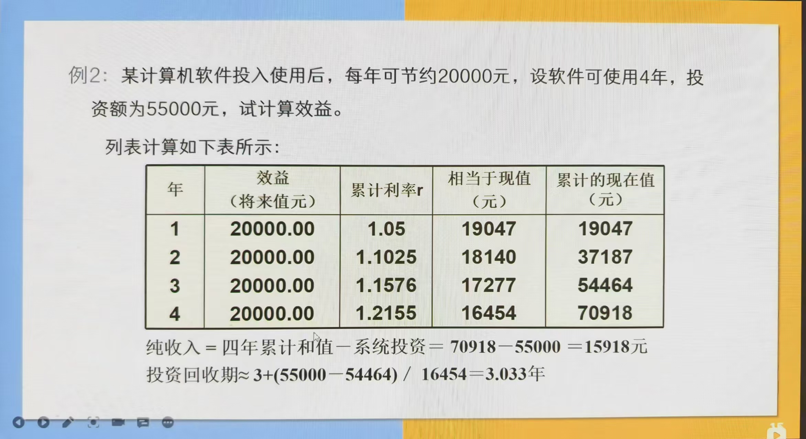

# 经济可行性分析

## 成本收益分析的三种方法

### 净现值（NPV）

$$
NPV = 贴现总收入 - 贴现总成本
$$

### 投资回报率

$$
投资回收率 = \frac{净现金收入}{净支出}
$$

### 收支平衡分析

1. 找到扭亏为盈的年份，求到这一年的净现值 $NPV_1$ 和这一年的净现值 $NPV$。
2. $BEA = \frac{该年份净现值 - 到年份的净现值}{该年份净现值}$。
3. 收支平衡点为：开始盈利年份 $- 1 + BEA$。

## 经济可行性分析的参数指标

### 货币的时间价值

设现在存入 $P$ 元，年利率为 $i$，则 $n$ 年后可以得到的钱数 $F$ 为：

$$
F = P(1+i)^n
$$

$F$ 即为 $P$ 元在 $n$ 年后的价值。反之，若 $n$ 年后能收入 $F$ 元，则这些钱折合成现在的价值为：

$$
P = \frac{F}{(1+i)^n}
$$

### 投资回收期

累计经济效益等于投资费用所需的时间，即回本时间。

### 纯收入

累计经济效益（折合为现在值）减去投资额。

<!-- learning-journey:update-history:start -->
## 更新记录

| 日期 | 类型 | 说明 |
| --- | --- | --- |
| 2026-07-28 | 首次发布 | 从语雀整理并发布到学习记录仓库 |
<!-- learning-journey:update-history:end -->
