# 需求描述与规约

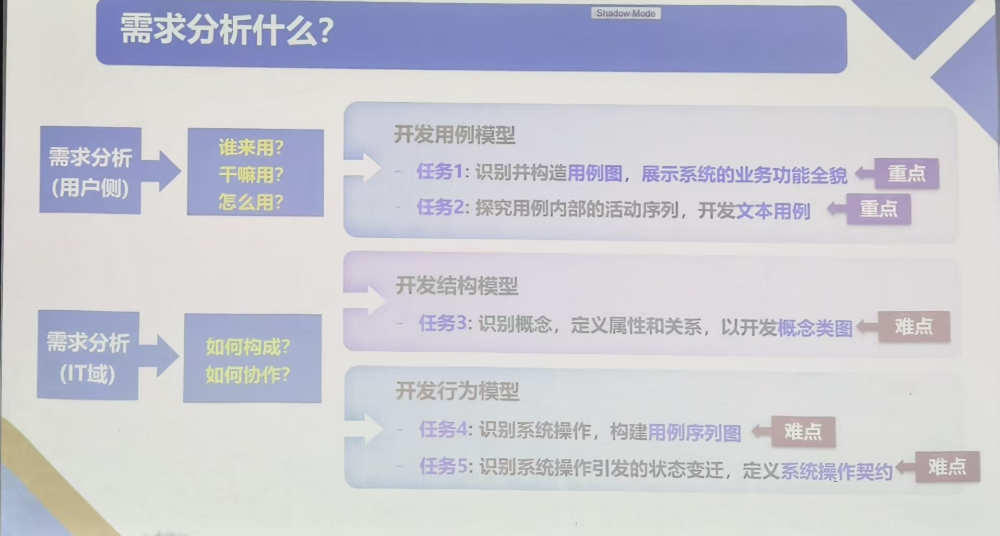

## 软件需求的定义

1. 用户侧视角：用户解决问题或实现目标所需的条件和能力——谁来用？干什么用？怎么用？
2. IT 侧视角：系统部件为满足规约所需的条件和能力——系统如何构成？部件之间如何协作？
3. 综合以上两种视角形成的文档。

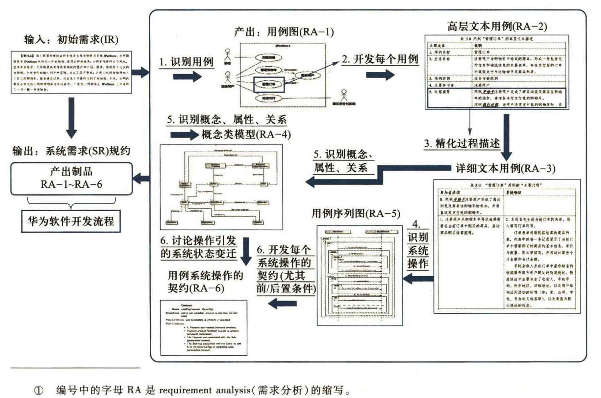

## 用例建模（Use Case Modeling）

### 用例的定义

> 用例模型属于需求分析的用户侧方面。

### 用例模型的组成

1. 用例图
2. 用例文本
3. 系统序列图
4. 系统操作与操作契约

### 用例模型的作用

- 通过**用例图**识别系统的**业务功能**全貌。
- 通过**文本用例**理解功能的**交互细节**。

### 用例的识别标准

- **完整序列**：有完整的“开始 → 过程发展 → 结束”过程，过程改变需要导致系统的状态变迁。
- **业务价值**：能产生有价值的业务结果，即“老板测试”。
- **场景周全**：涵盖业务执行成功和失败的场景。
- 特殊情形：当子业务级别的候选用例被多个用例使用时，即使不能通过“业务价值”测试，为避免内容重复，也可作为单独用例。

> 例：登录账户是用例，输入密码不是完整用例。

### 用例图（Use Case Diagram）

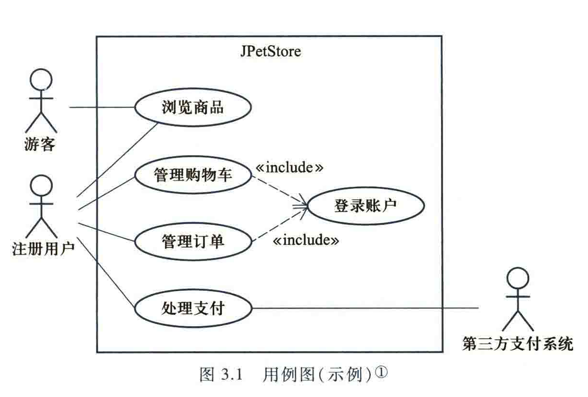

- 元素 1：参与者（火柴人）。
  - 图左边：主要参与者，其让系统工作。
  - 图右边：次要参与者，系统让其工作。
- 元素 2：系统边界（方框）。
- 元素 3：用例（椭圆或圆角矩形，名称尽量使用动宾短语）。
- 元素 4：权限使用关系（参与者与用例之间的直线）。
- 元素 5：包含关系（虚线、箭头和 `<<include>>`）。

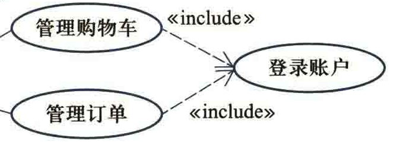

- 元素 6：扩展关系（虚线、箭头和 `<<extend>>`）。

- 元素 7：继承关系（直线和空心三角形），表示 “is-a” 关系。

### 文本用例的开发

文本用例深入每一个用例的内部，描述其中的动作序列，呈现具体业务过程。

#### 高层文本用例

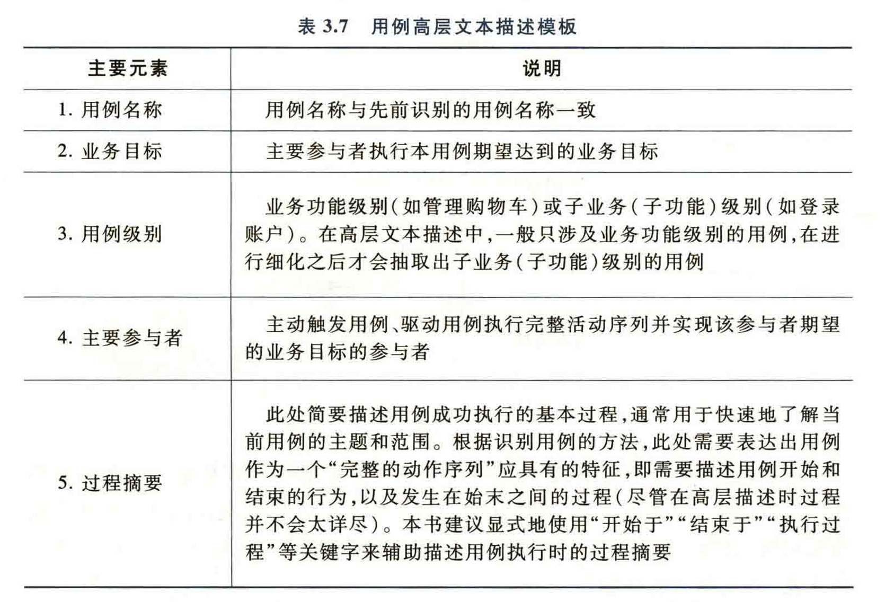

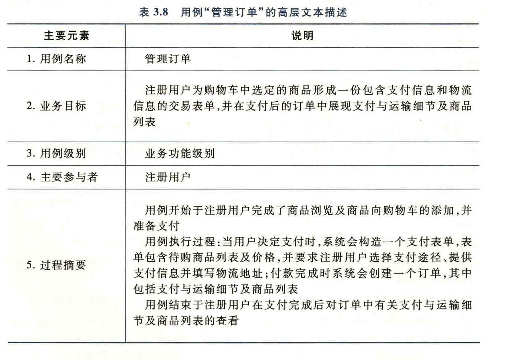

#### 详细文本用例

对于用例中关键且重要的业务，需要开发详细文本用例。

元素形式：

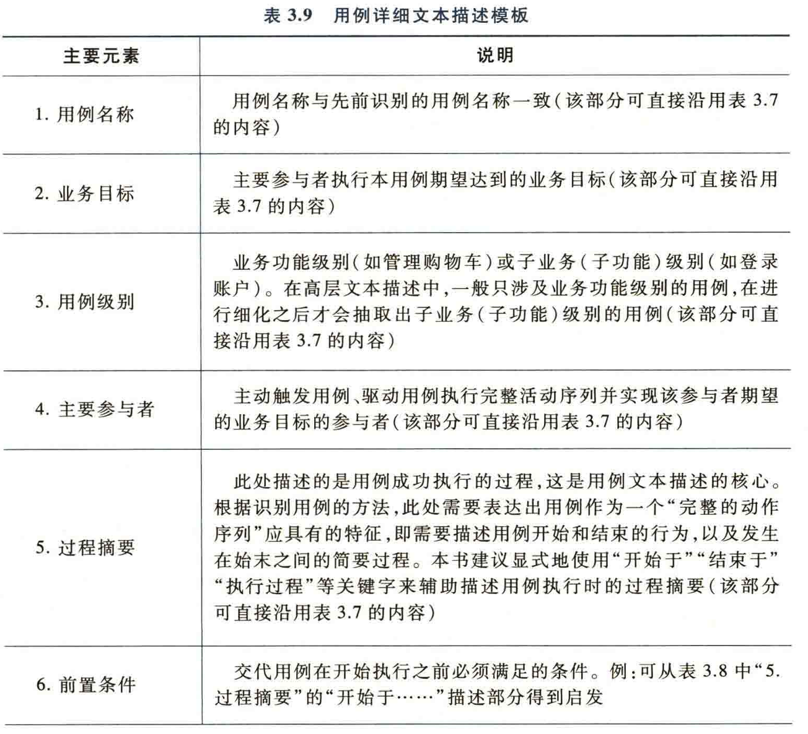

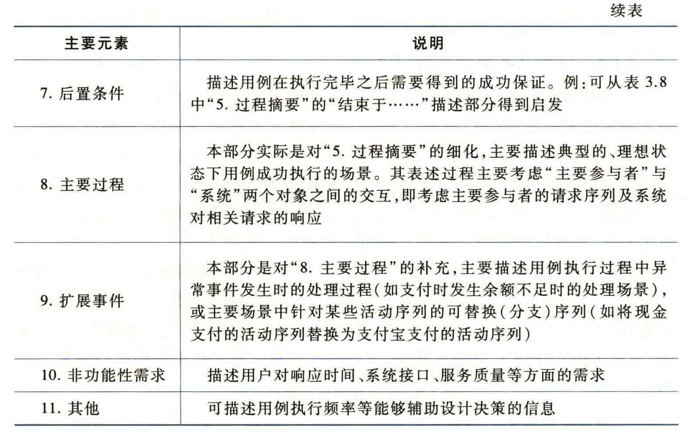

对话形式：

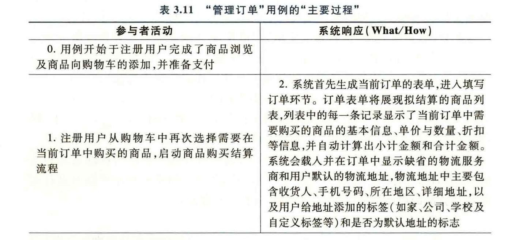

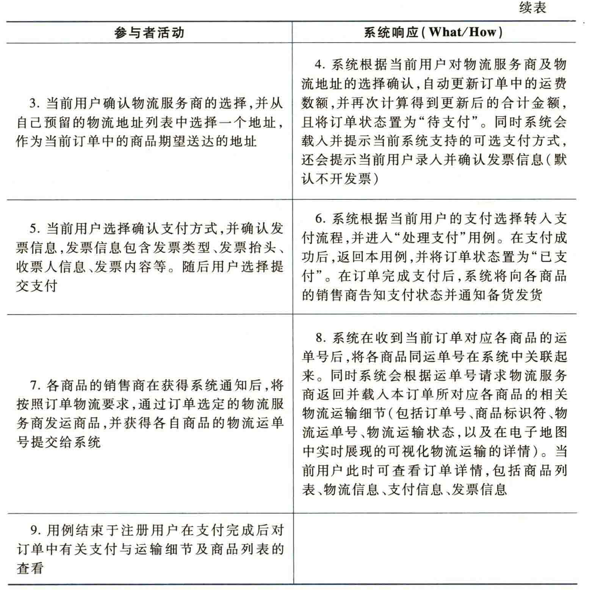

Alternative Courses：

1. XXXXX
3. XXXXX
7. XXXXXX

#### 文本用例中扩展事件的描述

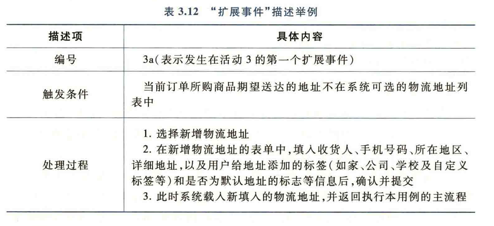

## 系统结构建模：概念模型

> Architecture（体系架构）包含系统的静态结构以及结构之上的行为。

### 概念类图的构建过程

大致思路：从文本用例中构建概念类图，名词对应属性，动词对应方法。

#### 类的挑选依据

只有能被系统管理和控制的实体类别才能作为一个类；如果系统管控不了，只能作为类的一个属性。

#### 属性的选取

- 属性代表系统可以管理和控制类的维度，多一个属性，就多一个维度。
- 属性的类型和取值范围使系统对类的管理和控制更加精细。

### 关系的度

构成关系的类的个数叫作度。

- 一元关系：只有一个类参与的关系，例如婚姻关系（人与人）。
- 二元关系。
- 三元关系。

### 关系的重数

- 用于刻画关系涉及的实例对象数量。
- 包括一对一、多对一、多对多。
- 多通常用 `*` 表示。

### 关系类型

#### 一般关系

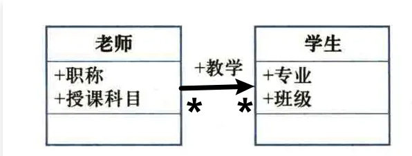

#### 泛化关系（继承）

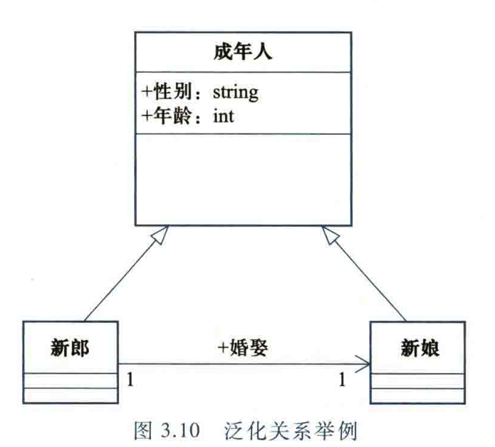

#### 聚合关系

- 一种一般性的“整体—部分”关系。
- 使用空心菱形表示。
- 聚合关系一般可使用普通关系（直线）替代。

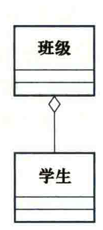

#### 组合关系

- 组合是一种强聚合关系。
- 整体消失时，部分一定消失；部分不能游离于整体之外，一个部分的实例总是依附于一个整体实例。

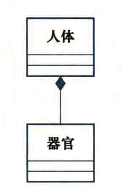

## 系统行为建模：序列图

> 对于具有详细文本用例的业务，需要构建序列图。

- 需求分析阶段只刻画用例序列图。
- 设计阶段应用设计模式，将操作序列转化为对象序列图。

### 用例序列图元素

1. **参与者（User）与对象（Object）**：用矩形方框表示。
   - 命名方式：`实例名 : 所属类`，例如 `张三 : 顾客`；也可以只写 `: 顾客`。
   - 对象位于顺序图顶部，表示交互开始时对象已经存在。
   - 对象不位于顶部，表示对象在交互过程中被创建。
2. **生命线（Lifeline）**：用竖直虚线表示。
   - 表示对象的生存期。
   - 所有参与者和对象都有一条生命线。
   - 对象之间的消息位于两条生命线之间。
   - 从上到下表示时间顺序。
3. **系统操作或消息（Message）**：
   - 表示方法调用，A 指向 B 表示 A 调用 B 的方法。
   - 消息的接收者就是方法的拥有者。
   - 实线箭头表示方法调用，虚线箭头表示返回值；返回值不是系统操作。
   - 实线箭头标注方法名，虚线箭头标注返回的参数名。

4. **激活期**：用长条矩形表示，矩形长度代表激活期的时间跨度。
5. **循环控制段（Fragment）**：

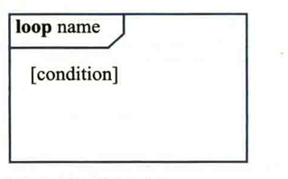

6. **选择控制段**：

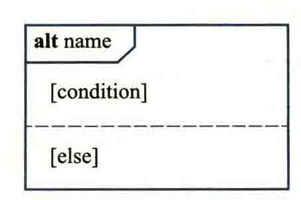

### 根据文本用例构造用例序列图

1. 逐句话判断是否有系统响应，以及参与者是否使用系统的方法完成某种操作。
   - 无使用、无响应：忽略。
   - 有使用、无响应：参与者向系统发出消息并调用方法。
   - 有使用、有响应：参与者向系统发出消息并调用方法，系统向使用者返回参数。
2. 判断文本用例语句是否包含循环或分支语句。

## 系统操作契约开发（RA-6）

> 针对用例序列图中的每一个系统操作开发契约。

### 系统及系统状态变迁的本质

- 系统的本质：由一组相互连接的对象构成，通过对象间交互产生自身行为，并完成系统用户请求的业务目标。
- 系统状态的本质：由系统中的对象集合、对象本身的状态（属性取值）及对象间的连接关系构成。
- 系统状态变迁由对象之间的消息传递（方法调用）触发，最终导致三种变化：
  - 创建或销毁对象。
  - 修改对象的属性值。
  - 创建或销毁对象间的连接关系。

### 系统操作

- 系统操作是作为黑盒构件的系统在公共接口中提供的操作（服务）。
- 系统操作代表系统的输入事件，意味着系统具有处理该事件的操作。

### 系统操作契约

- 系统操作契约定义系统操作执行前后导致的系统状态变化。
- 核心工作是构造霍尔三元组（Hoare Triple）中的前置条件和后置条件：

$$
\{Pre\text{-}Condition\}\ m()\ \{Post\text{-}Condition\}
$$

- `m()` 是系统操作。
- 前置条件：系统状态在操作执行之前必须满足的假设条件。
- 后置条件：系统状态在操作执行之后应呈现的结果。

系统操作契约通过定义前置条件和后置条件，对系统行为进行更详细、精确的描述和约束。

### 模板与案例

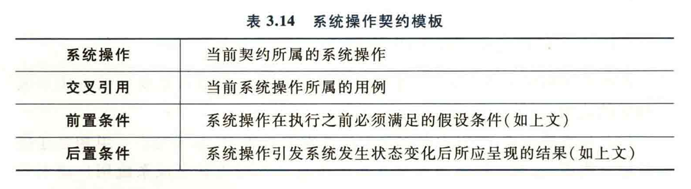

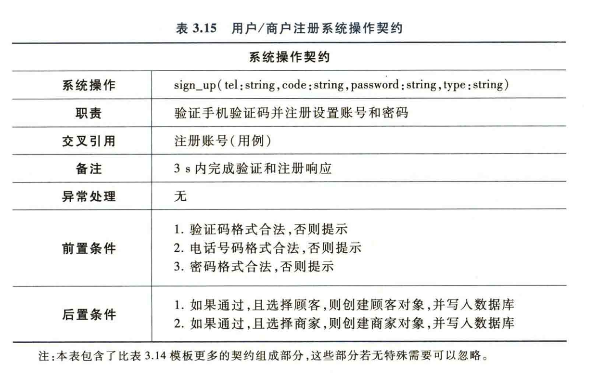

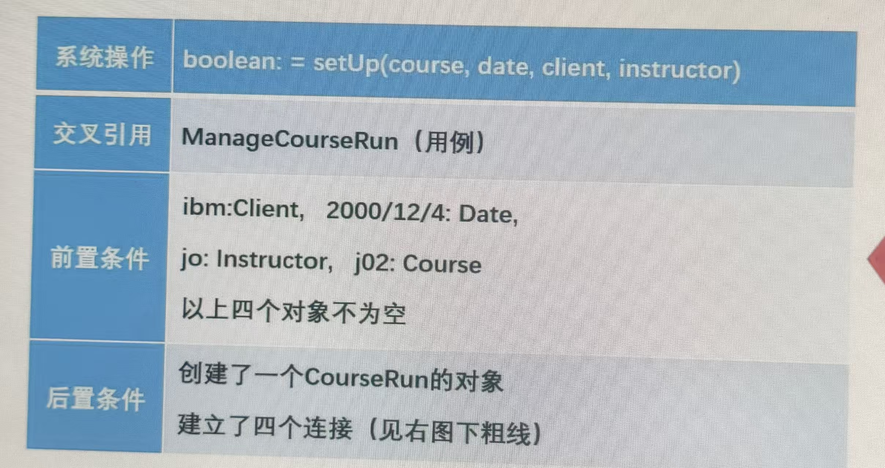

### 开发流程

先开发后置条件，再推导前置条件，其中后置条件的开发最重要。

## 关系数据建模

将类图转化为 E-R 图，再转化为关系模型：

1. 转化类。
2. 转化关系。

- 一对多关系：外键设置在“多”方。
- 多对多关系：使用关联表。

## 需求管理

开发并维护需求文档。

<!-- learning-journey:update-history:start -->
## 更新记录

| 日期 | 类型 | 说明 |
| --- | --- | --- |
| 2026-07-28 | 首次发布 | 从语雀整理并发布到学习记录仓库 |
<!-- learning-journey:update-history:end -->
