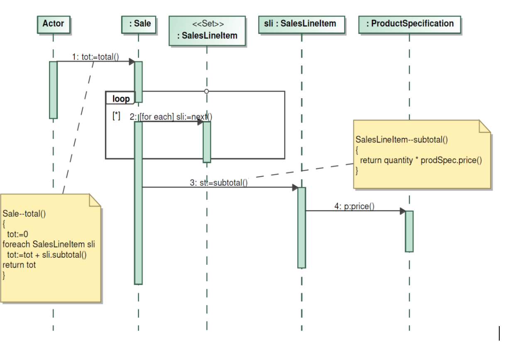
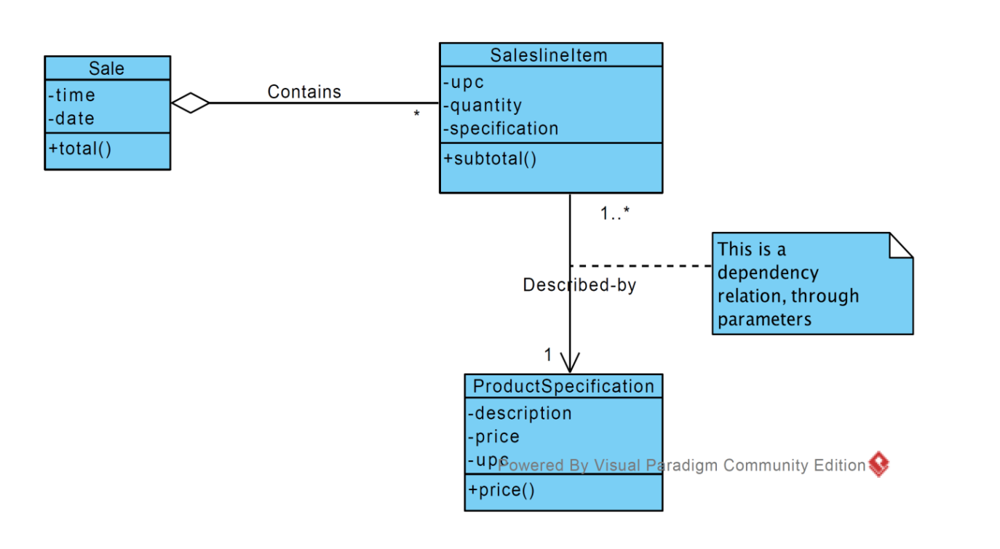
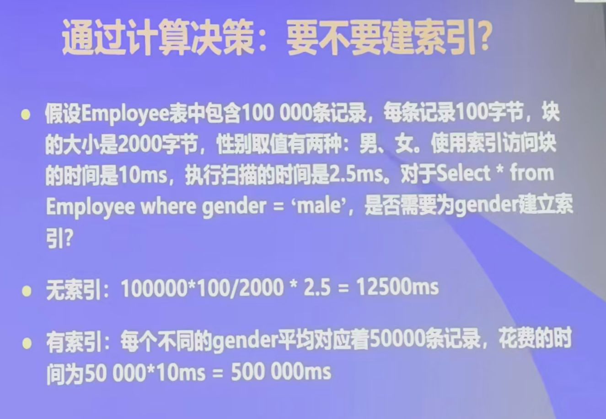
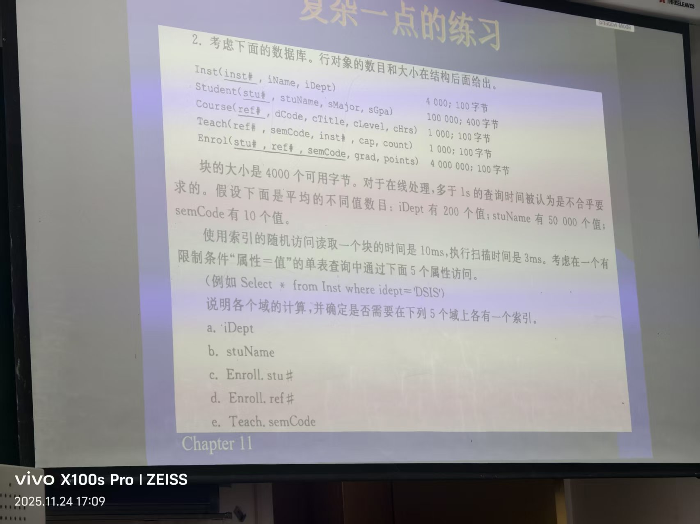

# 系统设计原则

从需求转化为设计时，需求建模阶段最重要的两类模型是：

- 概念类图 → 数据库设计中的 E-R 模型。
- 概念类图 + 系统操作契约的后置条件 + 设计模式 → 对象序列图。

## 基本设计思想

- 抽象原则。
- 模块化和独立性。
- 关注点分离。

## 对象职责分配原则（GRASP）

以系统操作契约的后置条件为基础，逐句分析后置条件。

- 职责在 UML 中被定义为“类的契约和义务”。
- 职责可参考概念类图来确定。

### 创建者（Creator）模式

- 当后置条件为创建或销毁对象时，应当应用创建者模式。
- 如果类 B 能调用类 A 的构造函数，即能够创建 A 的实例，那么 B 就是 A 的创建者。
- 以下情形满足创建者模式；若有多个类满足，按重要程度从上到下选择：
  1. B 组合了 A，A 是 B 的一部分，例如人与心脏。
  2. B 包含 A，B 是 A 的容器，例如书包与书。
  3. B 记录 A 的实例，即跟踪 A 的生命周期，例如派出所与身份证。
  4. B 频繁调用 A，例如画家与调色板。
  5. B 拥有初始化 A 所需的数据或参数，例如裁缝与定制西装。

### 专家（Expert）模式

- 当后置条件为修改对象属性时，应当应用专家模式。
- 让掌握信息最多的类承担相应职责。
- 例如：`Sale` 计算订单总额，因为它知道购买的商品列表；每一项小计由 `SaleLineItem` 计算，商品单价由商品自身提供。

### 低耦合与高内聚模式

当后置条件为建立或销毁对象间的连接关系时，应当应用低耦合和高内聚模式。

- 耦合度：类与类之间相互依赖的紧密程度，越低越好。
- 类之间增加关系或可见性都会提高耦合度，因此不要轻易增加连线。
- 内聚度：类内部各部分之间相互联系的紧密程度，越高越好。
- 不要随意给类增加新的功能，否则会降低内聚度。
- 高内聚、低耦合的目标，是让一个类独立完成一件事，只承担一个功能或职责。

### 控制器（Controller）模式

- 控制器：把与外部交互的接口放在一个类中，该类就是控制器。
- 核心问题是寻找应由谁第一个接触外部请求。

## 对象序列图

对象序列图针对一个用例中的一个系统操作及其一个后置条件进行设计。

对象序列图与用例序列图使用相同的图形元素，但会将原本作为“黑盒”的系统或用例，分解为具体承担相关职责的对象。

## 设计类图

根据对象序列图，补充原概念类图的方法部分，形成设计类图。

## 数据库设计

### 对象关系转换

将对象模型转换为关系模型。

### 是否建立物理数据库索引

#### 基本概念

- 块：辅助存储器中检索数据的单位。
- 盘区：一组连续的块。
- 扫描：从块到块读取文件的过程。
- 分块因子：一块中可以存入的行数。

#### 扫描时间

$$
一个表所需的块数 = \frac{表的行数}{分块因子}
$$

$$
分块因子 = \frac{块大小}{行对象的大小}
$$

$$
表的平均扫描时间 = 表所需的块数 \times 读取每块的时间
$$

#### 索引时间

$$
索引计算时间 = 20ms + n \times 10ms
$$

其中，`20ms` 表示进入两层 B+ 树的固定时间，`n` 表示满足查询条件的行对象数量。

当索引计算时间小于扫描时间时，应使用索引结构组织文件。

#### 案例

<!-- learning-journey:update-history:start -->
## 更新记录

| 日期 | 类型 | 说明 |
| --- | --- | --- |
| 2026-07-28 | 首次发布 | 从语雀整理并发布到学习记录仓库 |
<!-- learning-journey:update-history:end -->
