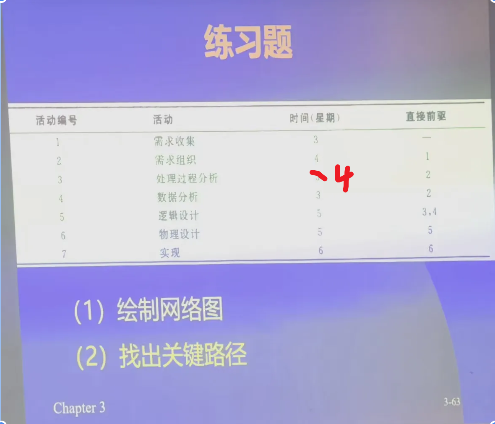

# 项目计划进度

> 可使用 Microsoft Project 绘图。

## 网络图

- 最早完成时间：从前往后推，取最大时间。
- 最迟完成时间：从后往前推，取最小时间。

## 甘特图

## 关键路径

- 完成项目所需的最短时间由关键路径决定。
- 关键路径由连通后产生最长总时间周期的活动序列表示。

### 确定关键路径

1. 根据网络图确认关键节点，即“一天都不能等待的点”：最迟完成时间等于最早完成时间。
2. 关键路径由关键节点连通而成，且路径前一个节点的时间加上线段活动时间，应等于后一个节点的时间。

### 富余时间

- 某个活动可以推迟、但不会延迟整个项目完成的时间。
- 富余时间 = 最迟时间 - 最早时间。

## 工作分解结构（WBS）

## 软件工具

<!-- learning-journey:update-history:start -->
## 更新记录

| 日期 | 类型 | 说明 |
| --- | --- | --- |
| 2026-07-28 | 首次发布 | 从语雀整理并发布到学习记录仓库 |
<!-- learning-journey:update-history:end -->
