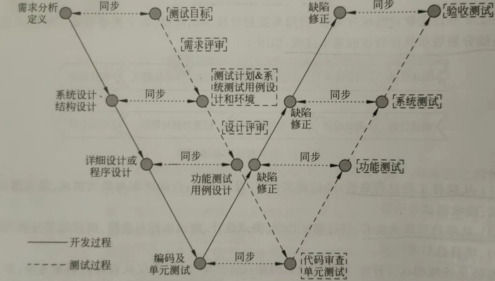

# 第一章：软件测试引论——基本概念与生命周期模型

## 为什么要进行软件测试？

可以从不同视角认识软件测试：

1. **软件质量视角**：软件总存在缺陷，通过测试发现缺陷、保障并评估软件质量。
2. **产品风险视角**：软件测试是不断揭示和评估潜在质量风险的活动，引导开发工作，将最终发布产品的风险降至最低。
3. **经济视角（核心）**：测试投入的成本可以预防缺陷造成的损失。
   - 缺陷发现越早，修正成本越低。
   - 测试投入的成本小于缺陷造成的损失时，测试才具有经济意义。

## 软件测试的定义

- 软件测试不等于调试，软件测试也不等于程序测试。
- **正向思维**：出发点是使自己确信产品能够正常工作，是评价一个程序或系统特性的过程；测试是为了验证软件是否正确地做了该做的事情。
- **反向思维**：测试是为了发现错误而执行程序的过程，一个好的测试用例能够发现至今尚未发现的错误，一次成功的测试能够发现至今尚未发现的错误。
- **IEEE 定义**：使用人工或自动手段运行或测定某个系统的过程，其目的在于检验它是否满足规定的需求，或弄清预期结果与实际结果之间的差别。

## 软件测试生命周期模型

### V 型模型

将测试阶段与开发阶段进行一对一的层级对应。

### W 型模型

开发生命周期与测试生命周期同步、并行开展。

## 测试与开发的关系——测试驱动开发（TDD）思想

测试在前、编码在后的开发方法。

先编写测试用例，然后执行并利用错误反馈信息有针对性地添加代码，反复进行这个过程，直到代码符合测试用例的要求并获得通过。

<!-- learning-journey:update-history:start -->
## 更新记录

| 日期 | 类型 | 说明 |
| --- | --- | --- |
| 2026-09-09 | 首次发布 | 从语雀整理并发布到学习记录仓库 |
<!-- learning-journey:update-history:end -->
