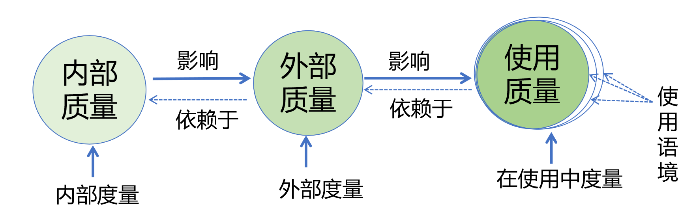
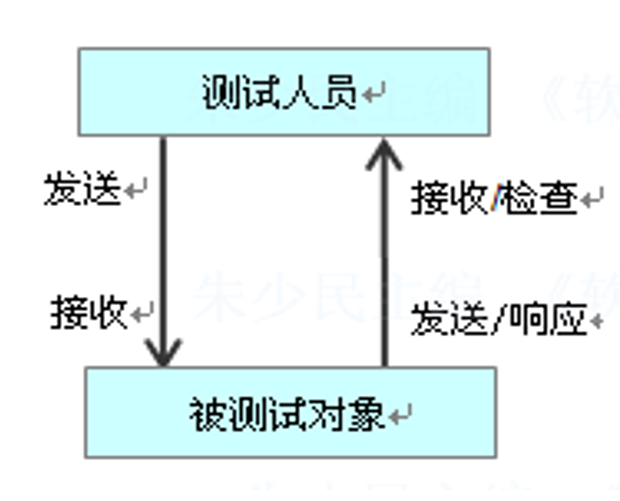
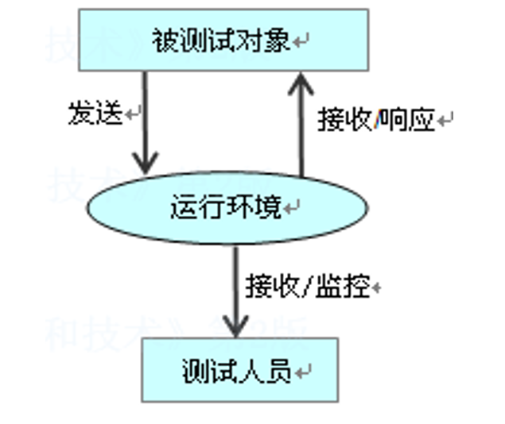
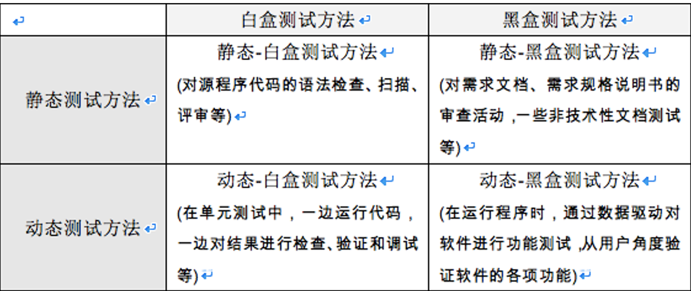
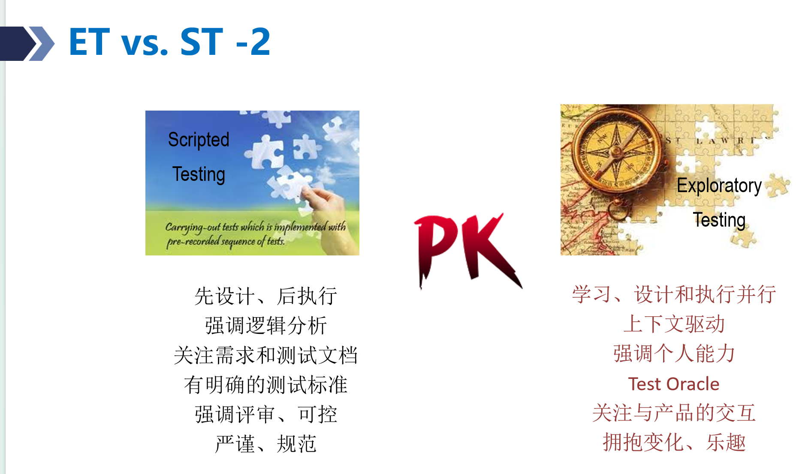
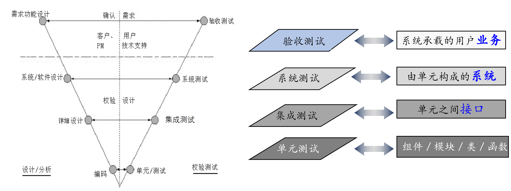

# 第二章：软件测试基本概念

## 软件质量与软件缺陷（Quality & Defects）

### 软件质量的定义

软件质量是软件产品满足规定需求和隐含需求能力的全部特性。

### 软件质量的三层结构

1. **内部质量**：软件开发者能看到的属性，影响开发过程，如代码规范性、模块耦合度、可维护性等。
2. **外部质量**：用户在运行测试中可以感受到的属性，如正确性、可靠性、运行效率等。
3. **使用质量**：产品在真实使用语境中表现出的质量，如界面友好、操作顺手、工作效率提高等。

### 产品质量模型

产品质量是产品在特定条件下满足明示和隐含需求的能力所体现的全部固有特性。

质量模型包含 8 个特性：

- **功能适应性（Functional Suitability）**：功能完备性、正确性、适合性。
- **性能效率（Performance Efficiency）**：时间特性（响应时间/吞吐量）、资源利用率、容量限制。
- **兼容性（Compatibility）**：共存性（共享环境不相互干扰）、互操作性。
- **易用性（Usability）**：辨识适合性、易学性、易操作性、用户差错保护、界面美观性、可访问性。
- **可靠性（Reliability）**：成熟性、可用性、容错性、易恢复性。
- **安全性（Security）**：保密性、完整性、抗抵赖性、可核查性、真实性。
- **可维护性（Maintainability）**：模块化、复用性、易分析性、易修改性、易测试性。
- **可移植性（Portability）**：适应性、易安装性、易替换性。

### 使用质量模型

使用质量模型包括 5 个属性：

- 有效性
- 生产率/效率
- 满意度
- 远离风险
- 语境覆盖

### 软件缺陷的定义

- 从产品内部看，软件缺陷是软件产品开发或维护过程中存在的错误、毛病等各种问题。
- 从产品外部看，软件缺陷是系统所需要实现的某种功能的失效或违背。

### 软件缺陷的 5 大判断准则

符合以下任意一项，即认为存在软件缺陷：

- 软件未实现需求规格说明书明确要求的功能。
- 软件出现了需求规格说明书指明不应该出现的错误。
- 软件实现了需求规格说明书未提到的功能，过度的额外功能可能引入风险。
- 软件未实现需求规格说明书虽未明确提及但应该实现的隐含功能。
- 软件难以理解、不易使用、运行缓慢等用户体验不佳的问题。

### 判断软件缺陷的机制：Test Oracle 测试预言机制

- **定义**：Test Oracle 是用来决定被测系统实际输出与预期输出是否一致的判断机制。
- **判断依据**：需求规格说明书、设计规范文档、启发式测试预言、基于模型的预言和一致性预言等。

## 软件测试的分类

- **按测试层次划分**：单元测试 → 集成测试 → 系统测试 → 验收测试。
- **按测试类型（测试目的）划分**：功能测试、性能测试、可靠性测试、安全性测试、兼容性测试、易用性测试、回归测试等。
- **按测试方法划分**：
  - 静态测试 vs. 动态测试
  - 黑盒测试 vs. 白盒测试
  - 手工测试 vs. 自动化测试
  - 主动测试 vs. 被动测试
  - 基于脚本的测试（ST）vs. 探索式测试

### 静态测试 vs. 动态测试

- **静态测试**：不运行程序代码，通过代码扫描（工具和人工）、评审与静态分析（文档等）发现错误。
  - 评审的主要形式：同行评审（Peer Review）、走查（Walkthrough）、审查（Inspection）。

> 管理评审、流程评审不属于静态测试，属于质量保证（QA）。

- **动态测试**：通过实际运行程序发现错误。

### 主动测试 vs. 被动测试

- **主动测试**：测试人员主动操作被测对象，通过主动构造输入数据、发送请求来驱动被测对象，并检验输出。
- **被动测试**：测试人员不干预系统运行，仅被动监控系统在实际生产或运行环境中的日志与数据流，进行事后分析。

### 黑盒测试 vs. 白盒测试

- **黑盒测试**：基于需求的测试、数据驱动测试。
  - 测试人员不了解也不关注软件的内部结构与实现算法，把软件视为不透明的黑盒。测试主要以需求规格说明书为依据，通过输入数据并检验输出结果，即采用数据驱动或事件驱动的方式，从用户角度验证软件各项功能是否符合预期。
  - 除了动态运行程序验证功能外，对需求文档进行审查也属于静态黑盒测试。
- **白盒测试**：结构化测试、逻辑驱动测试。
  - 测试人员清楚了解软件的源代码和内部结构，主要针对程序代码与控制路径开展测试。由于代码路径组合极其繁多，白盒测试通常无法穷尽。
  - 在动态白盒测试（如单元测试）中，一边运行代码，一边检查内部逻辑与执行结果。
  - 在静态白盒测试中，通过对源代码进行语法检查、扫描与评审来发现缺陷。

### 基于脚本的测试 vs. 探索性测试

- **基于脚本的测试**：先设计脚本，后执行脚本；按预先写好的用例顺序执行；由需求与测试文档驱动；强调逻辑分析；更加严谨规范。
- **探索性测试**：边学习、边设计、边测试、边思考，同步开展；由上下文驱动；强调个人能力；关注与产品的交互；更富变化、更有乐趣。

## V&V 理论

V&V 即 Verification & Validation，译为验证与确认：

- **Verification 验证**：“是否正确地构造了软件？”检测软件是否正确地实现了产品规格说明书所定义的系统功能和特性。
- **Validation 确认**：“是否构造了用户真正需要的软件？”即是否正在做正确的事，验证产品所实现的功能是否满足用户需求。

## 软件测试的四个工程层次

### 单元测试

- **定义**：单元测试针对程序系统中的最小单元——模块或组件进行测试，一般和编码同步进行。
- **测试对象**：程序系统中的最小可测试单元，如模块、组件、类、函数。
- **方法与主体**：主要采用白盒测试方法，从程序的内部结构出发设计测试用例，检查程序模块或组件已实现的功能与定义的功能是否一致，以及编码中是否存在错误；一般主要由编程人员完成。
- **辅助代码**：需编写驱动模块（Driver，模拟上层调用）与桩模块（Stub，模拟底层依赖）。

### 集成测试

- **定义**：集成测试是在单元测试的基础上进行集成并开展相应测试，包括一次性集成与渐增式集成。
- **测试对象**：单元之间的接口。
- **核心目的**：发现接口调用中的参数不匹配、数据丢失、状态不同步等问题。

### 系统测试

- **定义**：系统测试一般在集成测试后完成，分为系统功能测试和系统非功能性测试。
  - **系统功能测试**：基于产品功能说明书，针对产品所实现的功能，从用户角度进行功能验证，以确认每个功能是否都能正常使用。
  - **系统非功能性测试**：将软件放在整个计算机环境或模拟环境中，针对系统的非功能特性进行测试；具体包括覆盖测试、性能测试、安全测试、可靠性测试。
- **测试对象**：完成集成的完整系统。

### 验收测试

- **定义**：最终向未来用户表明系统能够像预定要求那样工作，验证软件的功能和性能是否如用户合理期待的那样。
- **测试对象**：面向业务与最终用户，验证系统是否满足使用要求。
- **典型类型**：
  - 安装测试：部署验证。
  - $`\alpha`$ 测试：用户或测试团队在开发者场地进行的内部受控验收测试。
  - $`\beta`$ 测试：软件预发布给外部真实用户，在实际环境中进行脱控测试。

## 软件测试工作的范畴与六阶段流程

### 测试分析

分析需求，明确测试范围、测试项分解和优先级划分。

### 测试策略制定

制定或选择更合适、更有效的测试方式、测试方法和技术。

决定手工还是自动化、静态还是动态、探索式还是基于脚本、团队测试还是众测外包、黑盒还是白盒、基于数据流还是基于控制流、完全组合还是组合优化，以及具体的测试过程与阶段安排。

### 测试计划

确定目标范围、资源配置、进度安排、风险评估与控制机制，输出《测试计划书》。

### 测试设计

测试设计解决“如何测”的问题，分为测试总体设计和测试详细设计：

- 测试总体设计主要指测试方案的设计和测试结构的设计。
- 测试详细设计主要指测试用例的设计。
- 测试结构设计指测试项如何分解以及测试模块之间的关系，可以看作测试用例的组织方式。

> **测试用例**：为特定测试目的而设计的测试条件、测试数据及相关操作构成的使用场景，是对典型场景的建模，可以被复用，也是知识积累的过程。

### 测试执行

- **手工执行**：基于详细设计的测试用例完成测试，也可以在没有测试用例的情况下进行探索式测试。
- **自动化执行**：采用测试工具完成，一般需要开发自动化测试脚本，然后由工具执行脚本。

### 测试结果和过程评估

- **测试结果评估**：对测试结果进行分析，如分析测试覆盖率，以了解测试是否充分；也可以基于缺陷的趋势分析和分布分析，了解缺陷是否已收敛，并基于缺陷评估当前被测版本的质量。
- **测试过程评估**：结合测试计划进行评审，相当于把计划的测试活动和实际执行的活动进行比较，了解测试计划执行的情况和效果。

<!-- learning-journey:update-history:start -->
## 更新记录

| 日期 | 类型 | 说明 |
| --- | --- | --- |
| 2026-09-15 | 首次发布 | 从语雀整理并发布到学习记录仓库 |
<!-- learning-journey:update-history:end -->
