# 第三章：软件测试流程与规范

## 测试左移与测试右移

传统软件测试通常处于软件生命周期的末端，即写完用例、等代码交付、执行测试、提 Bug、回归上线。

现代软件工程为了降低质量风险并应对快速变更，推动测试向生命周期的两端延伸——**向左延伸至需求与设计，向右延伸至生产运维**。

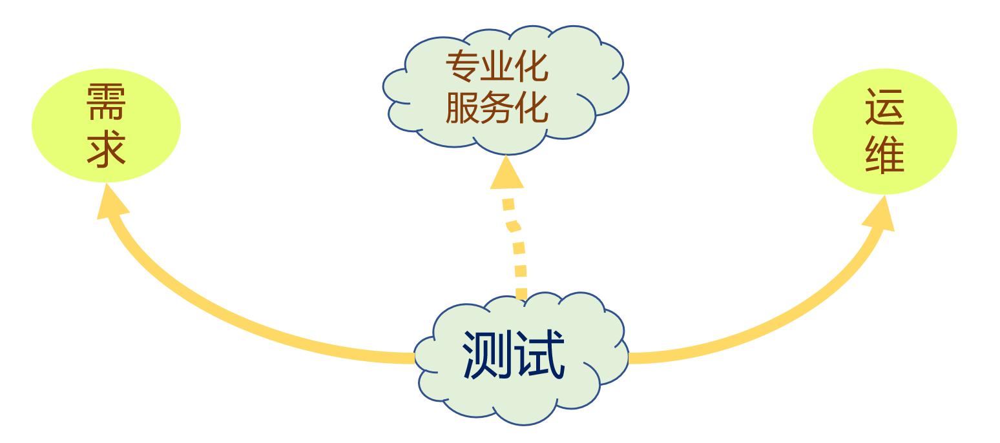

### 测试左移

- **思想**：将测试活动向测试“开始”之前（即软件开发生命周期的早期阶段）移动，主要活动包括产品需求文档（PRD）评审、研发架构 / 设计评审、静态代码规范检查、代码复杂度分析、单元测试等。
- **核心目的**：越早发现不合理的地方，后期修正缺陷的代价和出问题的概率就越低，促使团队更早地修复缺陷。

### 测试右移

- **思想**：将测试活动延伸至产品上线发布之后，主要活动包括灰度发布、线上实时监控、用户反馈分析、混沌工程（Chaos Engineering）、A/B 测试等。
- **核心目的**：监控线上性能和可用率，一旦线上出现问题及时响应，持续保障良好的用户体验。

## 传统的软件测试过程及模型

### 传统的软件测试过程

#### 软件工程角度

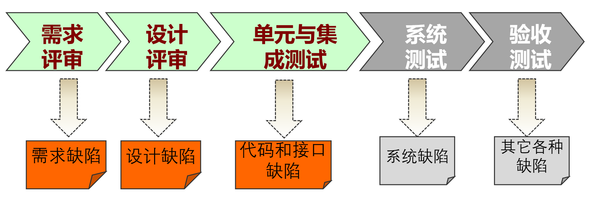

#### 项目管理角度

### V 模型

测试阶段与开发阶段进行一对一的层级对应。

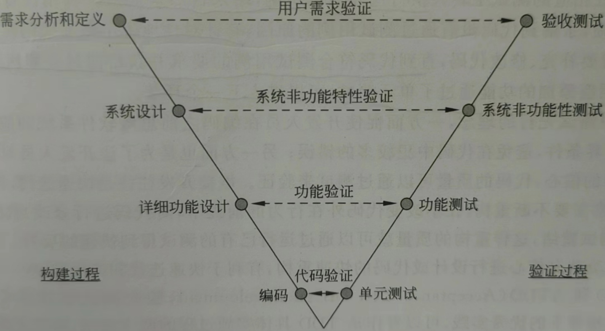

### W 型模型

开发生命周期与测试生命周期同步、并行开展。

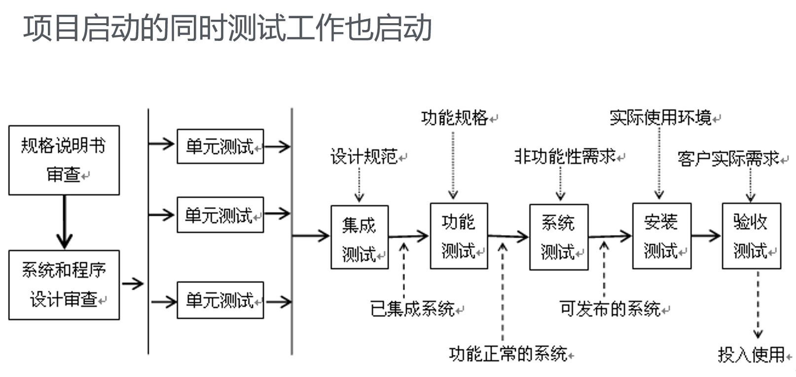

### TMap 生命周期模型

#### 定义

TMap（Test Management Approach，测试管理方法）是一种结构化的、基于风险策略的测试方法体系，目的是更早地发现缺陷，以最小的成本有效、彻底地完成测试任务，减少软件发布后的支持成本。

#### 生命周期各阶段组成

TMap 的生命周期由 **4 个核心阶段（PSEC——准备、说明、执行、完成）**、**1 个全局控制过程（P&C——计划和控制）**和 **1 个基础设施过程（Infra）**构成。

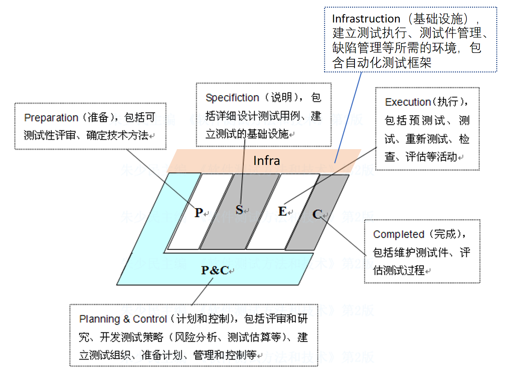

| 阶段 | 核心活动与关注焦点 |
| --- | --- |
| **计划与控制过程（P&C）** | 贯穿始终。进行风险分析、评估测试工作量（TPA 法）、制定测试策略、建立组织、管理趋势并向干系人报告。 |
| **安装与维护基础设施（Infra）** | 与 Preparation / Specification / Execution 并行，为测试准备测试环境、测试工具与工作场所（通常需跨部门协作）。 |
| **准备阶段（P）** | 进行**测试依据的可测试性评审**，在开发早期发现系统文档中的错误。 |
| **说明阶段（S）** | 详细设计测试用例、编写测试脚本、建立测试基础设施，与软件实现同步开展。 |
| **执行阶段（E）** | 开展**预测试（Pre-test）**，评估测试对象与测试基础设施是否具备开展全面测试的条件，随后执行测试脚本并提交缺陷报告。 |
| **完成阶段（C）** | 选择并保存有价值的**测试件（Testware）**，进行过程经验总结与复盘。 |

#### TMap 三大基石

- **组织融合（O，Organization）**：测试小组融入项目团队。
- **基础设施和工具（I，Infrastructure）**：提供稳定、可控且有代表性的测试环境。
- **可用的技术（T，Techniques）**：支持测试设计的各种具体技术与方法。

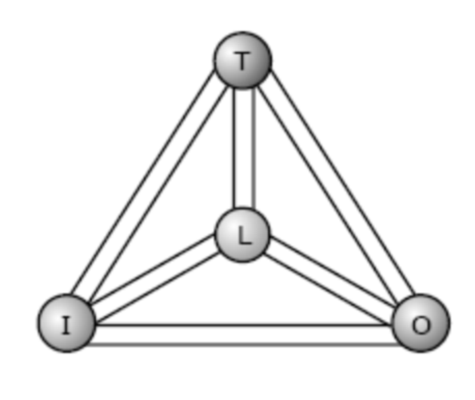

#### TMap 优点

- 结构化测试方法。
- 不必严格按照时序方式执行各个测试阶段。
- TMap 测试生命周期可与开发生命周期配合使用。

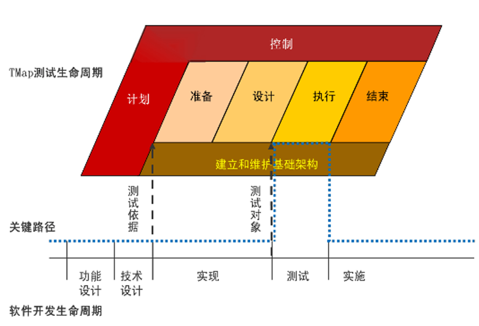

## 敏捷测试过程及模型

### 敏捷测试宣言

- 开发协作测试胜于测试分工和测试工具。
- 可运行的测试脚本胜于写在纸上的测试用例。
- 从客户角度来理解需求胜于从已定义的需求来判定测试结果。
- 基于上下文及时调整测试策略优于遵守测试计划。

### 敏捷测试原则

> 尽早持续测试、基于风险、计划设计执行力求简单、软件本身是主要研究对象、测试越快越好。

- 尽早和持续地开展测试。
- 基于风险的测试策略是必需的。
- 测试计划、设计和执行力求简单。
- 能及时完成对软件质量的全面评估。
- 软件本身是测试研究和分析最主要的对象。
- 在满足所要求的质量前提下，测试进行得越快越好。
- 对测试技术精益求精。
- 不断反思，持续优化测试流程与设计。

### 传统测试与敏捷测试对比

| 对比维度 | 传统软件测试 | 敏捷软件测试 |
| --- | --- | --- |
| **核心驱动** | 重流程、重规范、关注需求 / 测试文档。 | 以人为本、强调个人技能与面对面沟通。 |
| **团队与职责** | 独立测试团队、测试人员职责细化。 | **整个团队对质量和测试负责**（可无独立测试角色）。 |
| **阶段性** | 有明显的阶段划分（串行推进）。 | **无明显阶段**，强调持续测试与实时质量反馈。 |
| **核心技术手段** | 规范的测试用例设计、手工测试为主。 | **探索式测试（ET）**、**自动化测试（TA）**、TDD / ATDD。 |
| **变化态度** | 强调计划性，变更需严格控制。 | **拥抱变化**，基于上下文快速调整策略。 |

### Scrum 敏捷测试框架

Scrum 是一种敏捷协作开发框架，也是一种迭代和增量的产品开发框架，允许持续反馈，以处理需求的频繁变更。其要求将任务划分为在规定时间内完成的目标（称为冲刺），每个冲刺不超过 1 个月。

#### Scrum 小组

一个 Scrum 小组包含三种成员：`product owner`、`developers`、`scrum master`。

- `product owner`：专注于业务方面，代表利益相关方和客户的利益。
- `developers`：在产品的开发与支持中发挥作用。
- `scrum master`：指导和教育团队关于 Scrum 的知识。

#### Scrum 敏捷测试流程

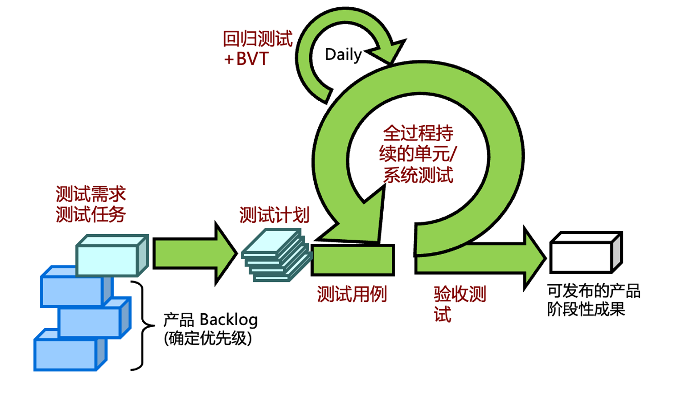

#### Scrum 特点

- 需求定义阶段：测试什么，工作量估计。
- 迭代任务划分和安排：明确每项任务结束的要求。
- 迭代实施阶段：完成上个阶段定义的任务，执行 **TDD（测试驱动开发）**、单元测试与 **BVT（Build Verification Test，构建验证测试）**。
- 敏捷的验收测试和传统的验收测试不同，侧重对功能特性是否真正完成进行验证。

### 基于会话的测试管理（SBTM）

> 敏捷测试中新功能测试以探索式测试（ET）为主，但 ET 容易因过于自由而缺乏管控。SBTM 是一种为探索式测试提供结构化流程管理的解决方案。

#### SBTM 核心概念

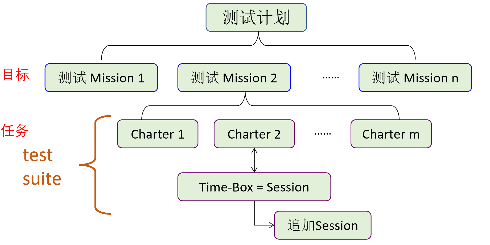

- **Session（会话）**：一段不受打扰的测试时间（通常为 90 分钟），是测试管理的最小单元。
- **Mission（任务）**：每个 Session 关联一个特定的、目标明确的测试任务。
- **Charter（测试章程）**：对每个 Session 如何执行进行简要描述的指导计划，包含测试主题、目标、优先级、环境、测试数据、操作策略及判断依据。

## 五大软件测试流派

- 分析学派：认为测试是逻辑性的，从计算机科学的角度看待测试，例如结构化测试和代码覆盖。
- 标准学派：将测试看作具有可重复标准、旨在衡量进度的一项工作，得到了 IEEE 的支持。
- 质量学派：测试是过程的质量控制以及度量项目风险的活动，强调过程规范性。
- 上下文驱动学派：强调人的能动性和启发式测试思维，例如探索性测试。
- 敏捷学派：强调自动化测试，使用测试来快速验证开发是完整的，例如 TDD。

## 测试过程改进及模型

### TMMi（测试成熟度模型集成）模型

#### 概念与组成

TMMi（Testing Maturity Model integration）吸收了 CMM / CMMi 的精华，将测试能力成熟度划分为 5 个级别，其由 5 个级别的一系列测试能力成熟度定义和一套评价模型组成。

#### TMMi 五级核心特征与目标

1. **Level 1 初始级（Initial）**：过程无序、混沌，依赖个人英雄；测试在编码后执行，与调试无区别；旨在证明软件能工作。
2. **Level 2 阶段定义级（Managed / Phase Definition）**：建立测试方针与策略；引入测试计划过程；采用基本测试技术与方法；测试与调试分离。
3. **Level 3 集成级（Defined / Integration）**：测试不再是编码后的一个阶段，而是贯穿整个软件生命周期；建立独立测试部门；建立技术培训计划。
4. **Level 4 管理与度量级（Management and Measurement）**：测试成为度量和质量控制过程；实施生命周期各阶段评审；开展可靠性、易用性等非功能测试；建立缺陷数据库。
5. **Level 5 优化级（Optimization）**：具备缺陷预防与质量控制能力；自动化程度高；利用统计数据持续优化测试过程。

### TPI（测试过程改进）模型

#### 概念与组成

TPI（Test Process Improvement）是基于连续性表示法的测试过程改进参考模型，是在软件控制、测试知识以及过往经验的基础上开发出来的。

其由 16 个关键域（Key Areas）、4 个级别（A～D，A 最低）和 13 个成熟度尺度构成测试成熟度矩阵。

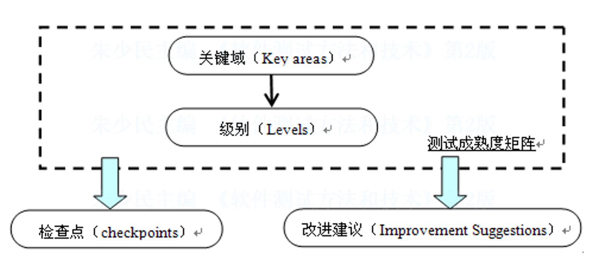

#### 核心概念

- **关键域**：测试过程的各个方面。

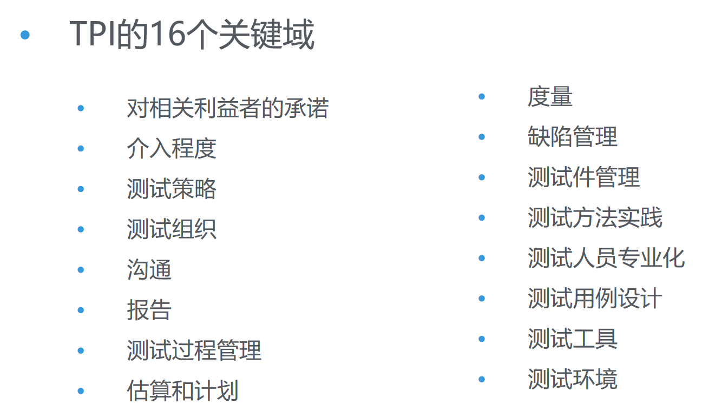

- **级别**：每个关键域所处的状态，即对关键域的评估结果，通过级别来体现。模型提供了 4 个级别，由 A 到 D，A 是最低级；根据测试过程，级别会有所上升，但是一些关键域只能达到 B 级。关键域的级别间有着依赖关系，例如若“报告”这个关键域没有达到 A 级，则“度量与分析”关键域无法到达 A 级。
- **TPI 成熟度矩阵**：TPI 模型给出了测试过程成熟度等级，共 13 个尺度。
  - 可控的（1～5 级）：提供质量可视性，按策略测试，记录缺陷。
  - 有效的（6～10 级）：测试受控且达到良好的效率。
  - 不断优化的（11～13 级）：持续流程改进，引入新框架。

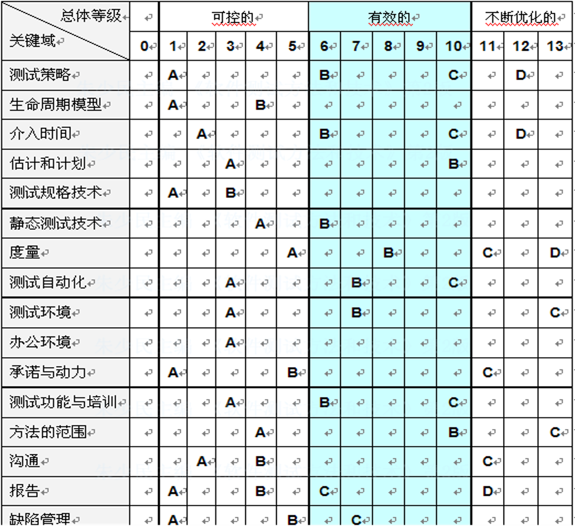

- **TPI 检查点**：为了能客观地决定各个关键域的级别，TPI 模型提供了一种度量工具——检查点。每个级别都有若干个检查点，测试过程只有在满足了这些检查点的要求之后，才意味着它达到了特定的级别。
- **TPI 建议**：建议会帮助我们解决问题，最终改进测试过程；建议不仅包含对如何达到下个级别的指导，而且还包括一些具体的操作技巧、注意事项等。

<!-- learning-journey:update-history:start -->
## 更新记录

| 日期 | 类型 | 说明 |
| --- | --- | --- |
| 2026-09-19 | 首次发布 | 从语雀整理并发布到学习记录仓库 |
<!-- learning-journey:update-history:end -->
