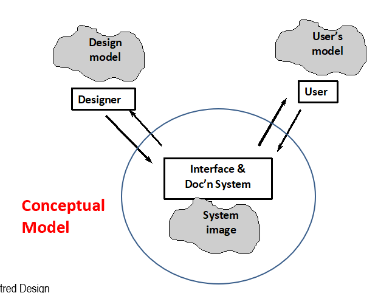
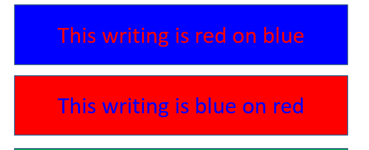
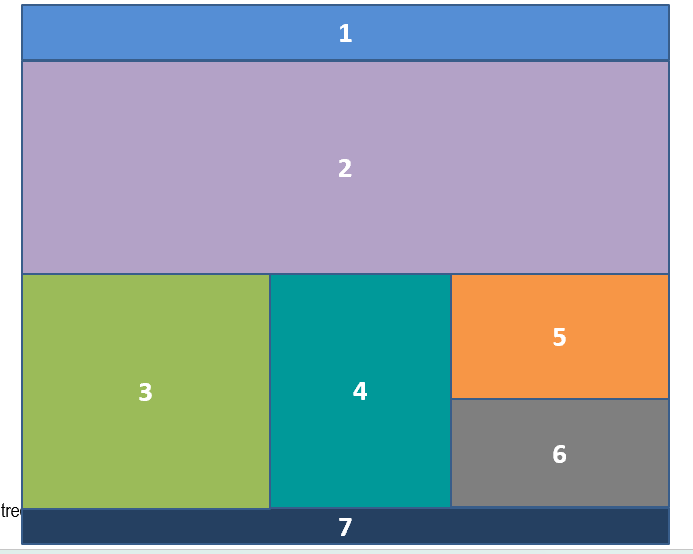

# 理解用户思维与认知

## Persona（用户画像）

> 核心：识别**主要用户**。

### 作用

根据客户的真实需求构想一个虚构人物，进而对用户及其需求进行精确描述。

### 优点

- 便于推断真实客户需要什么。
- 易于向其他开发者交流和传达。

### 缺点

- 需要通过用户测试进行验证。
- 较为主观。

## Human Interaction（用户交互）

用户与界面之间的交互是**双向**的。

交互分为两类：

1. **Interface Interaction（界面交互）**：用户与界面直接交互。
2. **Perception Interaction（感知交互）**：用户感知并理解界面上发生的事情。

## Perception（感知）

感知是我们理解数字世界的基础。

感知方式包括：

- Vision（视觉）
- Touch（触觉）
- Hearing（听觉）
- Vocalisation（发声）
- Smell（嗅觉）

视觉是最主要的感知方式。

### 设计启示

设计中的视觉元素需要具备足够的尺寸、对比度和色彩，使用户能够轻松处理和理解。

## Mental Models（心智模型）

### 定义

> Mental models are what people hold in their heads to describe a system.

心智模型是人们用来理解和解释系统内部工作原理、制定行动和进行预测的工具。例如，被问到家里有几扇窗户时，会在心里模拟走一遍并计数。

### 分类

- **Structural Model（结构性模型）**：描述设备和系统如何工作。
- **Functional Model（功能性模型）**：描述如何使用设备或系统。

### 特点

- 心智模型是不完整的（incomplete），根据主观认识形成。
- 心智模型是不稳定的（unstable），会逐渐退化。
- 心智模型是不科学的（unscientific），同时也是经济的（economical）。

### Conceptual Models（概念模型）

> A conceptual model is devised as a tool for understanding a physical system. The conceptual model sits between the designer and the user to describe how each understands the system, and the conceptual model must be agreed to before the system can be designed and built.

概念模型处在设计者和用户之间，是帮助双方理解系统如何运作的工具。在系统设计和构建前，双方必须就概念模型达成一致。

概念模型是共享的。相比依赖个人的心智模型，共同的理解更有利于处理问题。

它能够确保设计符合目标用户解读信息、与信息交互，以及使用系统进行沟通的方式。

> 设计启示：在系统正式设计和构建之前，需要通过与用户沟通，使双方的概念模型对齐。

## Colour Perception（颜色感知）

### 颜色区分能力

人眼对于红色和绿色的区分能力强，对蓝色的区分能力弱。

> 设计启示：不要将红色和蓝色并列放置。

### 色盲

约 8% 的男性和 1% 的女性有红绿色盲（Red/Green Colour Blindness）。

> 设计启示：设计界面时需要特别注意红色和绿色的使用，避免过度依赖这两种颜色区分信息。

## Cognition（认知）

> The term we use to describe the way in which we interpret and understand information we receive from the outside world via the five senses.

认知指我们通过感官从外界获取信息的方式。

### Long-term Memory（长期记忆）

- 长期记忆几乎是无限的，信息不会被遗忘，只是暂时无法回忆；频繁使用能够增强回忆效果。
- 回忆是一个两阶段过程：
  1. **Recognition（识别）**：提示会激活回忆过程。
  2. **Recall（回忆）**：回想起相关信息。

### Short-term Memory（短期记忆）

- 用于临时存储信息，易于访问，但总会被遗忘。
- 通过重复和组织短期记忆，可以将其转化为长期记忆。
- 大多数人能记住大约 $7\pm2$ 个信息单元。
- 可以通过 Chunking（分块技术）增强短期记忆。

### Chunking（分块技术）

将信息组织为有意义的“块”，能够显著提高短期记忆的容量并减少认知负荷。

> 设计启示：在页面设计中使用分块技术组织和呈现信息，可以减轻用户的认知负担。

<!-- learning-journey:update-history:start -->
## 更新记录

| 日期 | 类型 | 说明 |
| --- | --- | --- |
| 2026-07-27 | 首次发布 | 从语雀整理并发布到学习记录仓库 |
<!-- learning-journey:update-history:end -->
