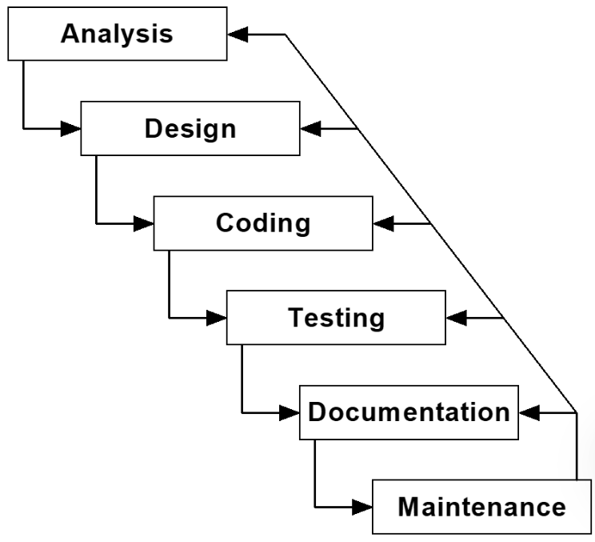
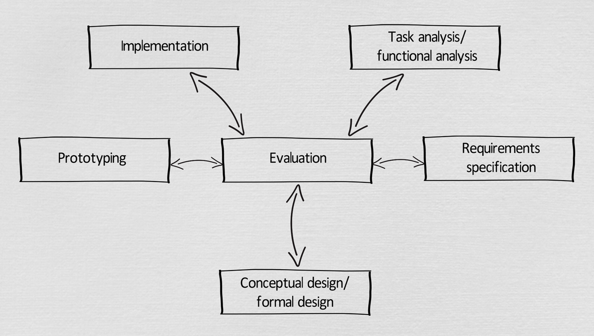

# 可用性与设计流程

## Usability（可用性）

> Usability is concerned with making systems easy to learn and easy to use. This can lead to improved performance in the workforce.

可用性关注让系统易于学习和使用，从而提高工作效率，有时也被称为“用户友好性”。

## Visibility 与 Affordance

> In truly intuitive systems, the visibility and affordance are innate.

在真正直观的系统中，可见性和可感知性是自然具备的。

对可用性影响最大的两个因素是 **visibility** 和 **affordance**，它们帮助用户理解并预测操作的结果。

### Visibility（可见性）

界面中的交互元素，也就是控件，需要清晰可见。

### Affordance（可操作性）

- 控件的外观必须能够体现或暗示其功能。
- 可供性并非固有属性，而取决于用户的背景和文化。

## Design Processes（设计流程）

### Waterfall Model（瀑布模型）

特点：

- 专注于技术。
- 通常反映开发者的观点。
- 流程严格按顺序进行，没有并行或迭代机会。
- 要求设计者第一次就做对。
- 是一种较差的设计流程模型。

### Star Model（星形模型）

星形模型与 UCD 原则一致：

1. **广泛参与**
   - 尽可能让用户参与。
   - 尽可能让其他相关方参与，例如平面设计师、软件工程师、工会、经理、最终用户和市场人员等。
2. **整合专业能力**
   - 汇集专业知识，使用研究人员、工具、顾问和专家等资源。
3. **迭代**
   - 将可用性评估结果不断反馈到其他阶段。

星形模型包括：

1. Task Analysis（任务分析）
2. Requirements Specification（需求规范）
3. Conceptual Design（概念设计）
4. Prototype（原型）
5. Implementation（实现）
6. Evaluation（评估）

### Requirements Specification：Use Case（用例）

> A use case is a sequence of actions that the system performs to offer some results of value to an actor.

用例是系统执行的一系列动作，旨在为某个参与者提供有价值的结果。

### Types of Prototype（原型类型）

- **Horizontal Prototype（水平原型）**：仅模拟用户界面，不包含实际功能。
- **Vertical Prototype（纵向原型）**：功能完整，但只覆盖拟建系统的一小部分。
- **Full Prototype（完整原型）**：功能完整，但性能较低。

<!-- learning-journey:update-history:start -->
## 更新记录

| 日期 | 类型 | 说明 |
| --- | --- | --- |
| 2026-07-27 | 首次发布 | 从语雀整理并发布到学习记录仓库，使用用户补充的白底瀑布模型图 |
<!-- learning-journey:update-history:end -->
