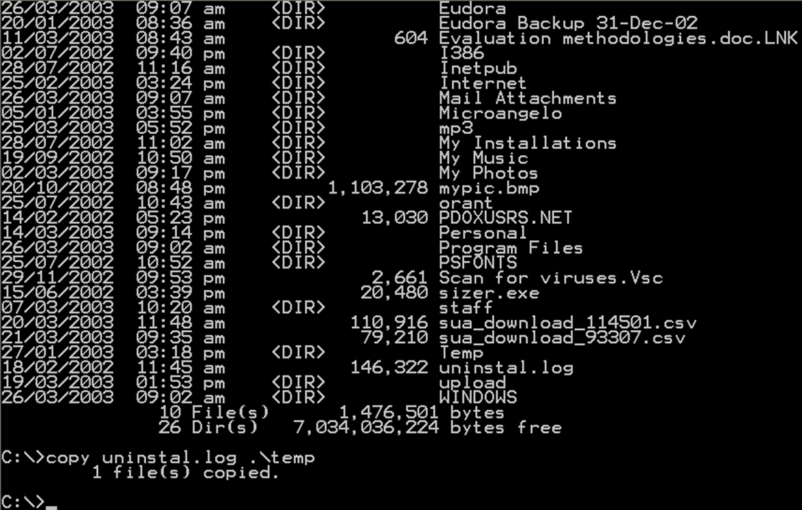
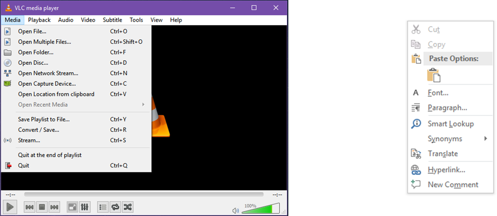
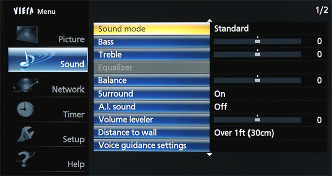
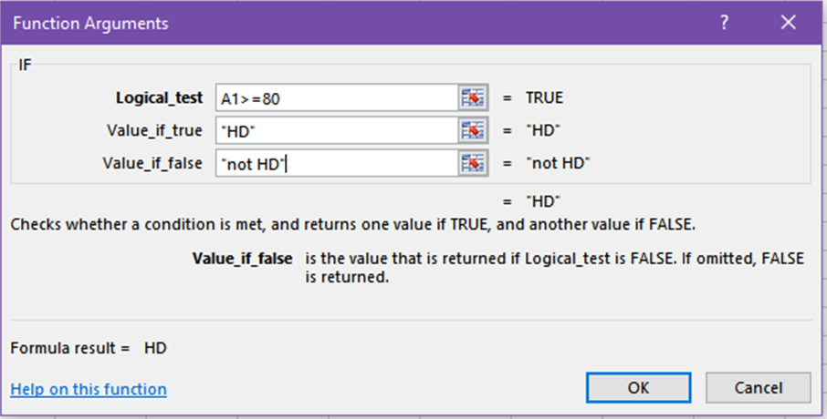
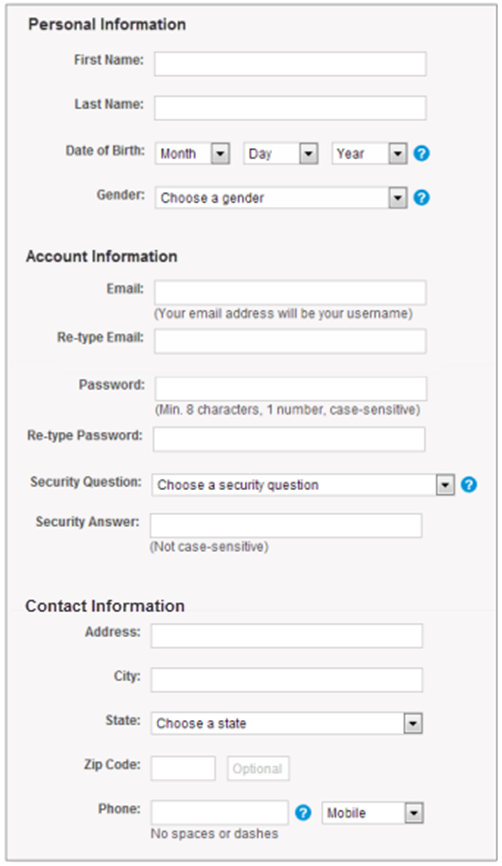
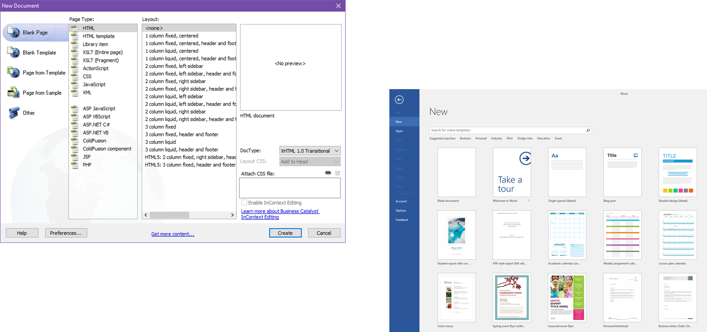

# 交互设计与可用性属性

交互设计应当让用户能够借助系统完成目标，并在使用过程中获得充分的信息反馈。

## 交互范式

### 1. Time-Sharing（分时）

计算机系统从批处理模式逐步转向交互式系统。

### 2. Video Display Units（视频显示单元）

视频显示单元推动了数据可视化，使计算机能够通过更贴近人类的表达方式呈现信息。

### 3. Programming Toolkits（编程工具包）

通过可复用的构件搭建复杂的交互式系统。

### 4. Personal Computing Paradigm（个人计算范式）

系统越容易使用，其能力就越容易被用户发挥出来。

### 5. Windowing Systems（窗口系统）

窗口系统通常由以下部分组成：

- Windows（窗口）
- Icons（图标）
- Menus（菜单）
- Pointers（指针）

窗口系统使用户能够同时处理多项任务。

### 6. Direct Manipulation Paradigm（直接操作范式）

以动作代替命令语言。例如，通过拖放而不是输入命令来移动文件。

### 7. Action versus Language（动作与语言）

用户主要学习界面的操作方式，而不必理解系统的内部实现。常见示例包括 3D 虚拟对象和凝视—触摸交互。

## 交互样式

### Command-Line Interface（命令行界面，CLI）

### Menus（菜单）

### Question/Answer（问答）

### Form Fill-ins（表单填写）

### GUI 与 NUI

- GUI：Graphical User Interface，图形用户界面
- NUI：Natural User Interface，自然用户界面

### Natural Language（自然语言）

## 可用性原则

- 提供良好的概念模型。
- 让重要信息和操作方式可见，帮助用户形成直观理解。
- 利用自然映射。
- 为用户操作提供反馈。

## 影响可用性的属性

### Learnability（可学习性）

用户学习使用系统或产品的难易程度与速度。

影响因素：

- Consistency（一致性）
- Familiarity（熟悉度）
- Predictability（可预测性）
- Generalisability（泛化性）

可以通过错误消息出现的频率、用户寻求帮助的次数等方式进行量化。

### Efficiency（效率）

用户度过初始学习阶段后，使用系统的便利程度和效率。

影响因素：

- Performance Time（执行时间）
- Completion（完成度）
- Retrieval Time（检索时间）

### Flexibility（灵活性）

用户与系统之间能够采用多种方式交换信息。

影响因素：

- Initiative（主动性）
- Multi-threading（多线程）
- Substitution（可替代选项）
- Customisation（自定义）
- Task Migration（任务迁移）

### Satisfaction（满意度）

用户在使用系统过程中获得的满意程度。

可能降低满意度的因素：

- 忽视可用性
- 误解用户
- 忽视情感
- 数据无效或不完整
- 缺乏信任

### Robustness（鲁棒性）

系统应尽量减少用户出错的机会，并在错误发生后帮助用户轻松恢复。

影响因素：

- Observability（可观测性）
- Responsiveness（响应性）
- Recoverability（可恢复性）
- Conformity（一致性）

### Memorability（易记性）

偶尔使用系统的用户或新手在重新使用系统时，不需要把所有内容从头学一遍。

影响因素：

- 超出用户的记忆负担
- 系统缺乏智能辅助
- 系统设计容易让人遗忘，与可学习性相关

<!-- learning-journey:update-history:start -->
## 更新记录

| 日期 | 类型 | 说明 |
| --- | --- | --- |
| 2026-07-27 | 首次发布 | 从语雀整理并发布到学习记录仓库 |
<!-- learning-journey:update-history:end -->
