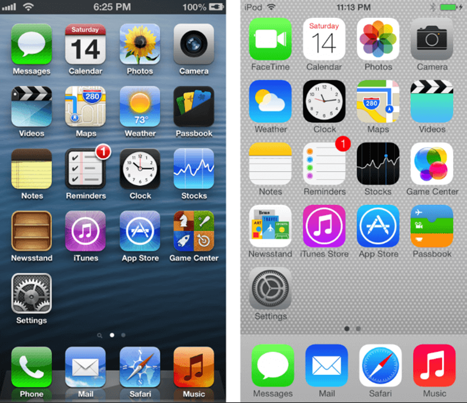
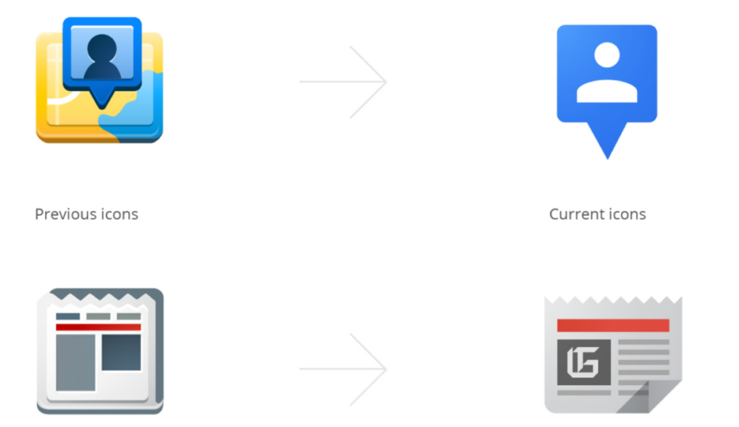

# 界面设计与无障碍设计

## 交互设计与界面设计

- **Interaction Design（交互设计）**：关注用户如何完成任务并得到所需结果。
- **Interface Design（界面设计）**：关注这些任务和结果如何通过界面传达给用户。

## 界面设计三大原则

### Harmony（和谐）

和谐是界面设计中最重要的原则之一。界面中的元素应当自然衔接，各个可感知元素共同构成令人愉悦、协调的整体。

和谐体现在：

- 元素的风格与尺寸，例如约为 1.618 的黄金比例
- 信息的排列顺序
- 向用户提供的反馈

### Balance（平衡）

平衡关注元素的排列方式，而非元素之间的视觉关系。对称是实现平衡最简单的方式之一，平衡通常也是一个布局问题。

平衡可以从三个方面考虑：

- 尺寸的平衡

  

- 方向的平衡

  

- 视觉重量的平衡

  

### Simplicity（简约）

简约并不等于平淡。它体现精致、清晰、优雅和节制，是平衡与和谐共同作用的结果，并通过持续迭代逐步实现。对于界面而言，简约也涉及交互模型。

例如，iOS 7 前后的界面从拟物风格转向扁平风格：

Google Material Design 则采用了基于卡片的设计：

## 实现设计原则的方法

### Refinement（精炼）

在设计迭代中，剔除所有不能为核心概念作出贡献的内容。

### Restraint（克制）

通过尽可能少的元素形成优雅的解决方案。

### Unity（统一）

统一指界面元素之间的视觉联系。一个统一的产品通常也具有平衡与和谐的特征。

实现方式包括：

- 让元素具有相同或协调的尺寸和形状。
- 将元素沿垂直或水平方向对齐。
- 排列元素，使相邻元素在视觉上形成连续关系。
- 运用重复。
- 合理安排留白。

### Modularity（模块化）

设计模块是具有相同或协调的尺寸、形状和比例的元素，可以借助设计网格实现模块化。

## Accessibility（无障碍设计）

无障碍设计面向所有人。用户的障碍可能是暂时或长期的，也可能具有不同程度和形式。

设计时需要考虑：

- Personas（用户画像）
- Colour Contrast（颜色对比度）
- Fonts, Typefaces and Spacing（字体与间距）
- Alt Text（替代文本）
- Screen Readers（屏幕阅读器）

## 无障碍测试

无障碍测试用于评估产品是否为具有不同能力的用户提供了适当的功能。

常见方式包括：

- 检查清单
- 案例研究
- W3C 指南
- 用户评估

<!-- learning-journey:update-history:start -->
## 更新记录

| 日期 | 类型 | 说明 |
| --- | --- | --- |
| 2026-07-27 | 首次发布 | 从语雀整理并发布到学习记录仓库 |
<!-- learning-journey:update-history:end -->
