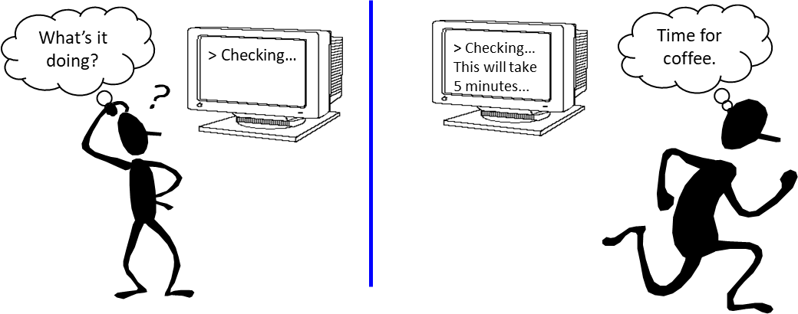
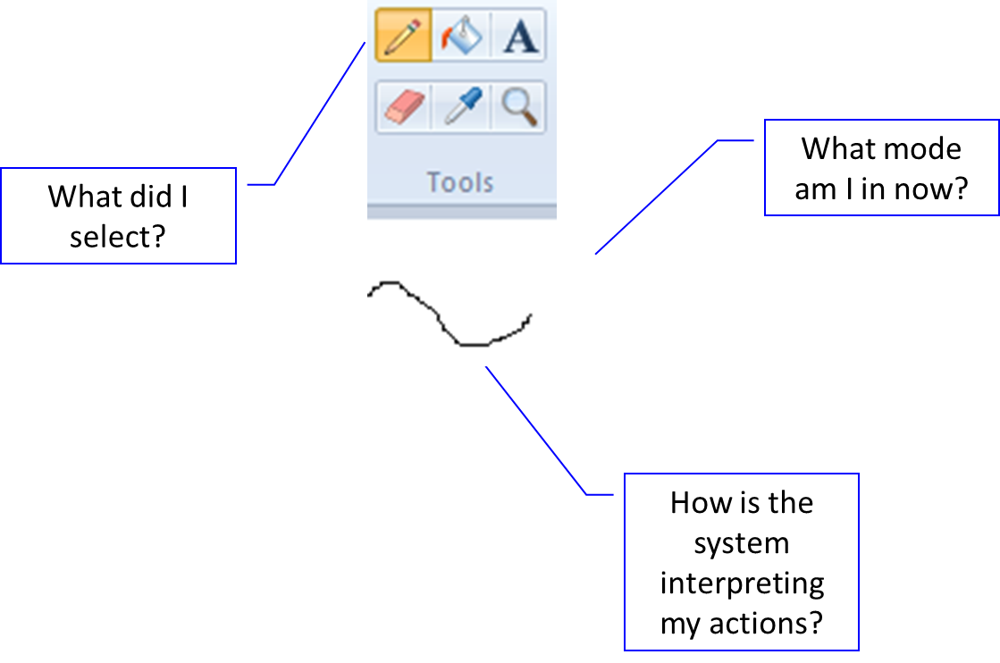
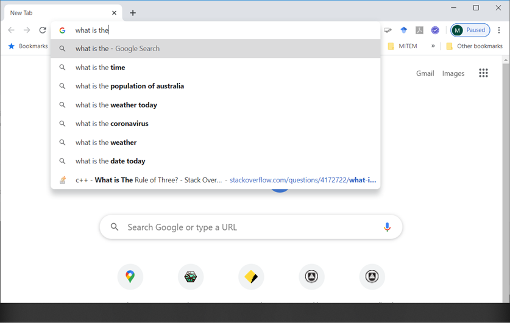

# 用户体验评估方法

评估是以用户为中心设计（UCD）的核心。设计方案需要从用户需求出发，并帮助用户实现预期目标；评估过程也应当遵守相应的伦理要求。

评估可以帮助设计师和设计团队持续改进方案，提高用户接受产品的可能性。

## 评估内容

- 产品的功能
- 界面对用户的影响
- 问题识别

## Naturalistic Evaluation（自然情境评估）

### Observing Users（观察用户）

- Direct Observation（直接观察）
- Indirect Observation（间接观察）
- Verbal Protocols（口述协议）

### Software Logging（软件日志）

- Automated Data Collection（自动收集数据）
- Logging Tools（日志工具）

### User Opinions（用户意见）

- Structured Interviews（结构化访谈）
- Flexible Interviews（灵活访谈）
- Questionnaires & Surveys（问卷调查）

### Interpretative Evaluation（解释性评估）

- Contextual Inquiry（情境调查）
- Cooperative Evaluation（合作评估）：将用户作为评估过程中的合作者

### Predictive Evaluation（预测性评估）

- Inspection Methods（检查方法）
- Usage Simulations（使用情境模拟）
- Keystroke Modelling（按键建模）

## Experimental Evaluation（实验评估）

### Subjects（实验对象）

- 与预期用户群体相匹配
- 课程笔记建议样本量至少为 10

### Hypothesis（假设）

实验中需要考虑自变量与因变量：

- **自变量**：界面风格、帮助层级、菜单设计、图标设计等。
- **因变量**：速度、生产率、错误数量、用户偏好等。

还需要选择相应的统计指标。

### Reliability Concerns（可靠性问题）

受试者之间存在个体差异，实验设计只能在一定程度上减小这种影响。

### Validity Concerns（有效性问题）

- 实验室环境与真实环境之间的差异
- 任务不具有典型性
- 测试用户不具有代表性
- 社会影响

## Heuristic Evaluation（启发式评估）

启发式评估是设计师或评估人员依据一组规则审查设计的过程。它投入的时间和精力相对较少，因此也被称为一种低成本的可用性工程方法。

### Nielsen 启发式原则（课程列出的八项）

1. 使用简单、自然的对话。
2. 使用用户熟悉的语言。
3. 尽量减少用户的记忆负担。

   

4. 保持一致性。

   

5. 提供反馈。

   

   

   

6. 提供明确标识的退出方式。

   

7. 提供快捷操作。

   

8. 以积极、有效的方式处理错误。

   

   

<!-- learning-journey:update-history:start -->
## 更新记录

| 日期 | 类型 | 说明 |
| --- | --- | --- |
| 2026-07-27 | 首次发布 | 从语雀整理并发布到学习记录仓库 |
<!-- learning-journey:update-history:end -->
